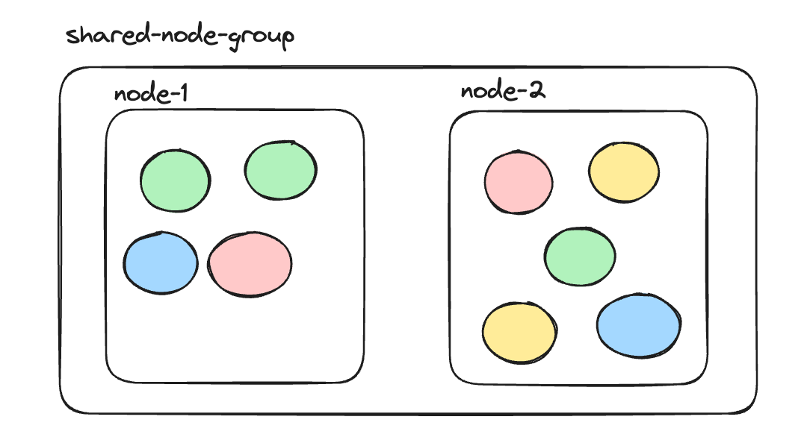
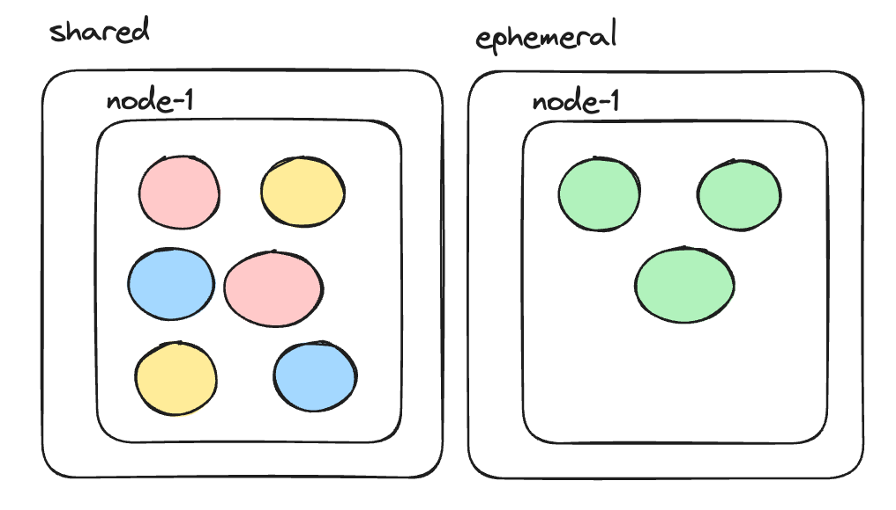
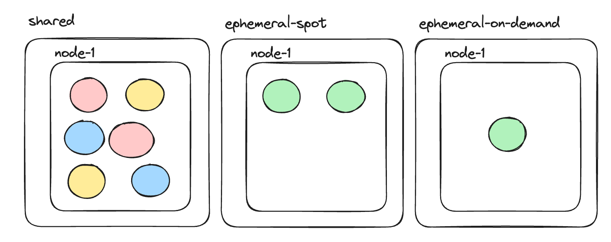
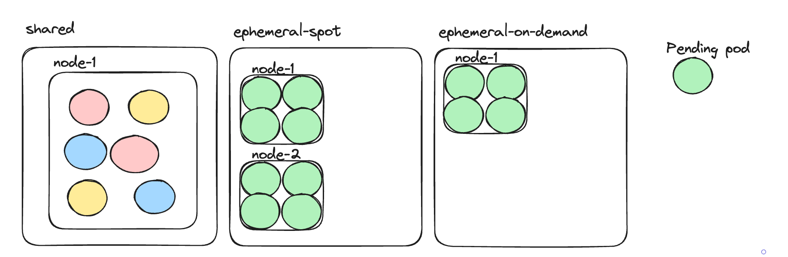
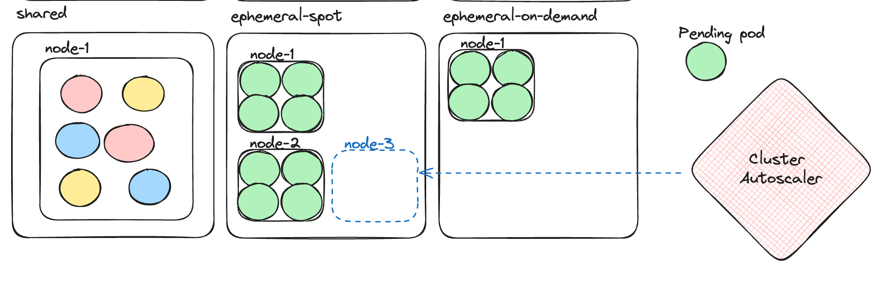

+++
title = 'Mastering Spot Instances on Kubernetes for Fun and Profit'
date = 2024-04-20T11:44:08-07:00
+++

Spot instances are da bomb 💣!! You just have to be careful they don't explode in your face 💥🤯
Let’s explore how to effectively use spot instances with Kubernetes...

<!--more-->

Here is the situation, you have a basic managed Kubernetes cluster with a single node pool
(GKE and AKS) or node group (EKS). All your pods are scheduled on nodes provisioned from the same
node group.

This is what it looks like:



## Dedication is Next to Godliness 🙏

One day, you decide that one of your ephemeral workloads (the green one) can benefit from its own
dedicated node group. Let's not get into the reasoning here. Node group planning is a big topic that
deserves its own blog post.

So, here is what we want. Create a new ephemeral node group, which will use spot nodes. All the
green pods will go to spot nodes. All other pods will go to regular nodes from the original shared
node group.



## The Naive Approach to Spot Nirvana 😇

Alright! let's make it happen!

Kubernetes in its infinite wisdom gave us node selectors, taints and tolerations. Here is how it's
going to go down. We will create a node group that has the following label and taint:

```
awsome-corp.com/ephemeral=true
```

Now, all nodes provisioned from this new node group will have this label and taint. At this point,
Kubernetes will never schedule any pod to these nodes because of the taint. This is what taints do -
they tell Kubernetes not to schedule pending pods on the node... unless... the pod has a toleration
for the taint. Cool. Let's add a toleration to our pods. Typically, pods are managed by a
deployment, a statefulset or a daemonset. So, we add the toleration to pod template's spec as in:

```
tolerations:
  - key: "awsome-corp.com/ephemeral"
    operator: "Exists"
    effect: "NoSchedule"
```

With this toleration our green pods can be scheduled to spot nodes from the ephemeral node group.
But, nothing stops Kubernetes from scheduling them to regular nodes. We want to clean separation.
This is where node selectors come. When specifying a node selector on a pod, Kubernetes will
schedule the pod only to nodes that have labels that match the node selector. Our ephemeral nodes
have the label (same as the taint):

```
awsome-corp.com/ephemeral=true
```

Let's add a matching node selector:

```
    spec:
      nodeSelector:
        awsome-corp.com/ephemeral: "true"
```

The combination of the node selector and toleration ensures that our green pods will be scheduled
only to spot nodes form the ephemeral node group.

Yay, mission accomplished! 🎉 Or is it?....

## The Naive Approach is Naive 🥺

Spot instances use the same resources as on-demand instances, but can be up to 90% cheaper 💰. This
is why everybody loves spot instances. The downside is that they can be taken away from under you at
any moment, and you won't be able to provision new nodes. When that happens all our green pods will
be evicted and just have to sit pending in the corner and wait for spot capacity to become available
again. This is what we call in technical terms: "No bueno" 👎.

## Adding On-demand Fallback 🤸🏼‍

OK. If spot nodes are not always available we'll just make the pods go to on-demand nodes. We still
want the isolation from all other workloads, so we'll create a new ephemeral on-demand node group
with the same taint and label. This is what it looks like:



Our green pods can go to nodes from either of the ephemeral node groups, but not to shared nodes.
Other pods can't pollute nodes from any of our ephemeral node groups due to the taint.

Victory at last 🏆! Or is it...?

## Playing favorites 😍

After running for a while you notice that your green pods more often than not go the on-demand pool.
You don't get to enjoy all these amazing cost savings of spot nodes, you just complicated your
configuration for no good reason.

What's going on? as far as Kubernetes is concerned the two node groups are identical. There is no
incentive to schedule pods to spot nodes more than on-demand nodes. Since spot nodes will often be
unavailable then on-demand nodes will dominate here. Let's be assertive here and tell Kubernetes
that we prefer spot nodes over on-demand nodes. We'll need to get a little fancy...

First thing first, we need to distinguish the two ephemeral node groups from each by adding a new
label and taint to the ephemeral spot node group: **awsome-corp.com/spot: "true"**

Both node groups will have the original **awsome-corp.com/ephemeral: "true"** label and taint.
However, the ephemeral-spot node group will also have the new label and taint.

The next step is to replace our simplistic node selector with a sophisticated node affinity. It's
abundantly clear just from the name that **node affinity** is way more aristocratic than the
plain **node selector**. It can do much more, and it's not scared of some verbose syntax. Here is
the
affinity stanza we want in our pod spec:

```
 spec:
   affinity:
     nodeAffinity:
       preferredDuringSchedulingIgnoredDuringExecution:
       - preference:
           matchExpressions:
           - key: awesome-corp.com/spot
             operator: In
             values:
             - "true"
         weight: 1
       requiredDuringSchedulingIgnoredDuringExecution:
         nodeSelectorTerms:
         - matchExpressions:
           - key: awesome-corp.com/ephemeral
             operator: In
             values:
             - "true"
```

The **requiredDuringSchedulingIgnoredDuringExecution** part works like our old friend the node
selector. The pod *requires* to be scheduled to a node that has
the **awesome-corp.com/ephemeral=true** label. As you recall this is true for both of our ephemeral
node groups. The **preferredDuringSchedulingIgnoredDuringExecution** says that it prefers if
possible
to be scheduled to a node that has the label **awesome-corp.com/spot=true**.

So, we're done. Right? 🤷‍ Not so fast...

## Bargaining with the Cluster Autoscaler 🤝🏼

We keep talking about these nodes as if they magically appear out of nowhere. I'll let you in on a
secret 🤫. They don't! The **Cluster Autoscaler** (AKA **CAS**) is a component that watches your
cluster and looking for two things:

1. Pending pods that can't be scheduled on existing nodes
2. Under-utilized nodes whose pods can be scheduled on other nodes

For case #1 the CAS will try to provision a new node. For case #2 it will try to evict all pods and
scale down the node.

Alright. That's cool 😎 and all, but how is it related to our ephemeral workload and its node groups?
Well, consider the case where a new ephemeral pod is pending and there is no room on any of the
existing nodes from both node groups. The CAS is smart enough to know that the pod can't be
scheduled on the shared node group (due to its required node affinity). But, it can go into any of
the ephemeral node groups. If the CAS provisions a new node from the ephemeral-on-demand then the
Kubernetes scheduler will happily place the pod there.

Here is an example where, all the nodes in both node groups are maxed out and there is an
ephemeral (green) pending pod. The cluster autoscaler now must choose a node group and provision a
new node for it



We want the CAS to prioritize provisioning new nodes for the ephemeral-spot node group and only if
spot capacity is unavailable then provision an expensive on-demand node.



The CAS can be configured through a mechanism called **exapnder**. There are multiple expanders. We
care about the priority expander, which lets us accomplish exactly the behavior we want. Using an
expander requires passing a command-line argument to the cluster autoscaler with the name of the
expander:

```
spec:
containers:
- command:
  - ./cluster-autoscaler
  - --expander=priority
  ...
 ```

The configuration itself is a config map called **cluster-autoscaler-priority-expander**:

```
apiVersion: v1
kind: ConfigMap
metadata:
  name: cluster-autoscaler-priority-expander
  namespace: cluster-autoscaler
data:
  priorities: |-
    100:
      - .*-ephemeral-spot-.*
    50:
      - .*-ephemeral-on-demand-.*
    1:
      - .*
```

The priorities map in the data section tells the CAS in which order to try and provision a new node.
The keys are the priorities (e.g. 100). The values are regular expressions that are matched against
node group names (e.g. `.*-ephemeral-spot-.*`). In the config map above 100 is the highest priority
so the CAS will attempt to provision a new node from the ephemeral-spot node group first. Note that
if a regular pod is pending the CAS knows it can't be placed on an ephemeral node, so it will
provision a node from the shared node group (the catch-all `.*` regex with priority 1).

Are we there yet 🚗? Almost, just one more thing...

## Mixed-instance Spot Nodes 🪩

We didn't really go into the specifics of defining node groups or node pools, which is specific to
the cloud provider. Kubernetes knows nodes. It knows nothing about node groups/pools 🤷‍.
On GKE and AKS a node pool has a single instance type. All the nodes in the node pool have the exact
same instance type. This is great for predictable outcomes, but not so great for spot instances. As
you recall, spot instances may not be available due ot demand. All the accounting is done per
instance type. One instance type may not be available, while another may be available. We want to
take advantage of this fact to increase the chance the CAS will be able to find some instance type
with spot capacity and provision it for us. That means that on GKE and AKS we will have to create
multiple spot node pools, one for each instance type and configure them with the same set of labels
and tolerations and make sure their names match the CAS priority regex 😰 . That's a lot of work and
this is not a one time price you pay. When the time comes to upgrade your cluster you will find that
upgrading node pools is one of the most annoying and brittle aspects.

## The EKS Special ☸️

EKS shines brightly ⭐ here with the concept of mixed-instance node group (via EC2 spot fleet). When
you define a node group you can specify a list of instance types and the CAS will go in order and
try to provision a node with any of the instance types. One caveat is that, all the instance types
should have similar compute and memory specifications because the CAS consider only the first
instance type for resource requests calculation.

EKS also has an interesting project called Karpenter 🔨, which is an alternative method of
autoscaling. It doesn't rely on AWS Autoscaling groups. Instead, it directly provisions
right-sized compute resources based on workload requirements. Interestingly, it uses the Node Pool
terminology. I have no personal experience with Karpenter (yet!), but I plan to check it out.

## Final Words 💎

Compute costs often dominate the cloud costs of organizations. Spot nodes are a major pillar of
managing costs. It is not trivial to utilize spot nodes reliably. The method we introduced here
combines multiple Kubernetes capabilities like node affinity, preferred scheduling, taints and
tolerations as well as configuring the cluster autoscaler with a priority expander. The outcome is
cost-efficient and robust. Enjoy and share the knowledge.

## Reference 📚

I discussed a lot of Kubernetes and cloud concepts here. If you want to dive deeper here are a bunch
of links to follow:

- https://kubernetes.io/docs/concepts/scheduling-eviction/assign-pod-node/
- https://kubernetes.io/docs/concepts/scheduling-eviction/taint-and-toleration/
- https://github.com/kubernetes/autoscaler/tree/master/cluster-autoscaler
- https://github.com/kubernetes/autoscaler/blob/master/cluster-autoscaler/expander/priority/readme.md
- https://docs.aws.amazon.com/AWSEC2/latest/UserGuide/spot-fleet.html
- https://karpenter.sh
