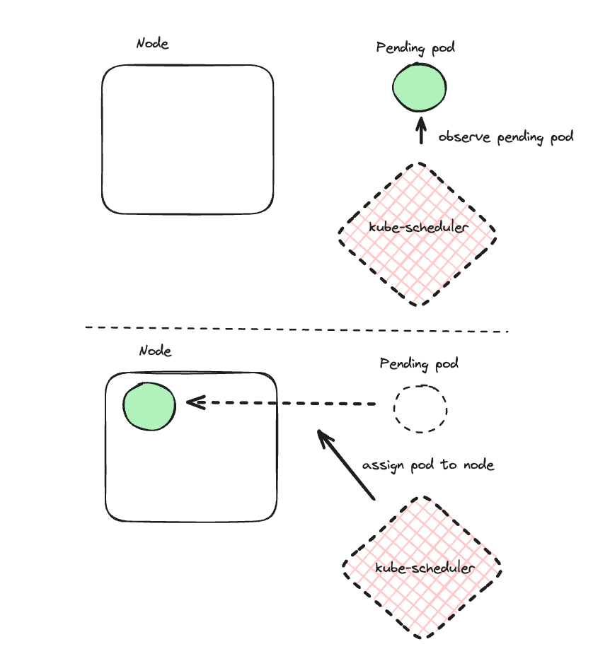
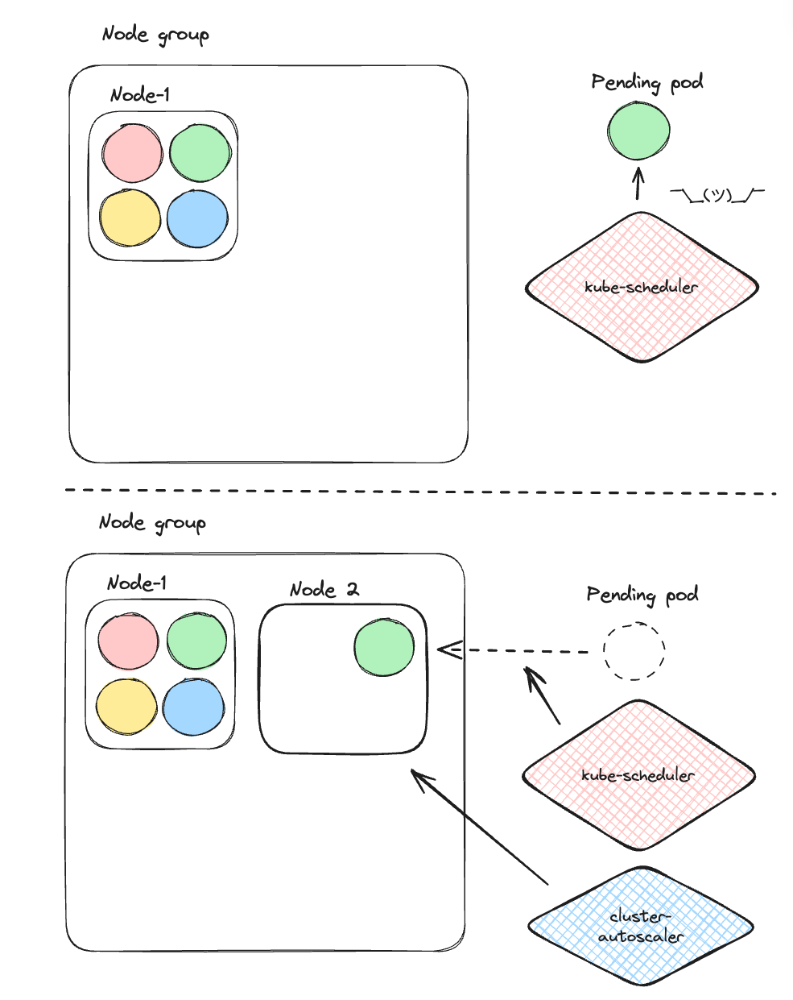
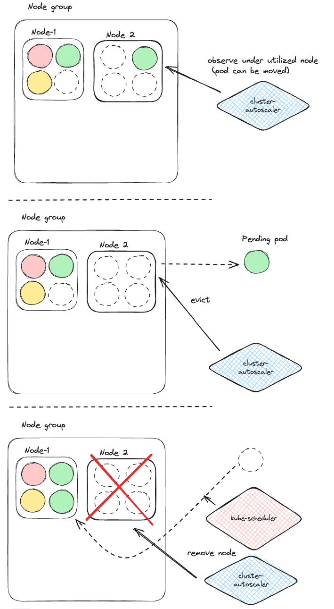
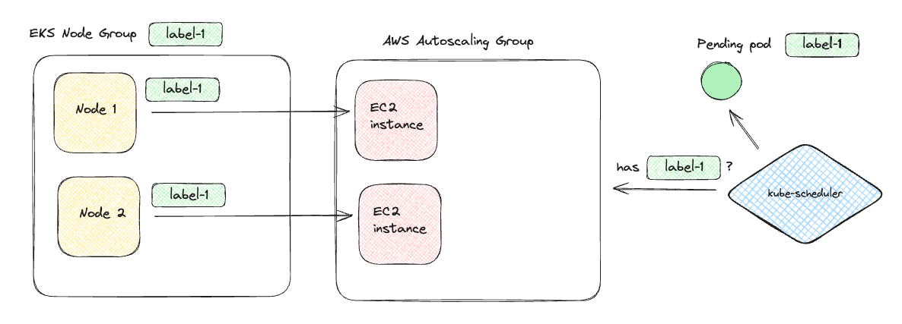

+++
title = 'Advanced Kubernetes Scheduling and Autoscaling'
date = 2024-05-16T17:45:11-07:00
+++

What do you know about the intricate web 🕷️ of interactions between advanced Kubernetes scheduling
techniques and the cluster autoscaler? Probably not enough... read on to get a taste of some gnarly
nuances and how to deal with them.

<!--more-->

Let's start with a short and brutal introductions to Kubernetes scheduling and the cluster
autoscaler.

## Brutal Introduction to Kubernetes Scheduling

If you're an old Kubernetes hand 🖐️ you may want to skip this section. So, Kubernetes is all about
placing pods onto nodes (AKA scheduling). When a new pod is created it starts its life as pending
meaning, it just sits there and waits for Kubernetes (or more precisely the kube-scheduler
component) to find a node for it.

Here is what it looks like in the super simple case, where there is a node available with sufficient
resources to accommodate the new pod:



Now, the scheduler can't just assign the node into any old node. There are a bunch of factors it takes
into account: resource requests (cpu, memory, ephemeral storage), node affinity and anti-affinity,
pod affinity and anti-affinity, taints, tolerations, etc.

Let's leave it at that for today. Alright, let's address the elephant in the room 🐘. What happens if
there is no node that matches all the various resource requests and affinity requirements of the
pending pod? Easy! the pod simply remains pending.

OK. That's definitely straight-forward, but not really useful. This pending pod was created to do
some work. It can't do its job until it's running on a node. This is where the cluster autoscaler
comes in.

## Brutal Introduction to the Cluster Autoscaler

Where do nodes come from? First, let me tell you it has nothing to do with the birds and the bees
🦜🐝. In self-hosted Kubernetes cluster it is up to the administrators to provision machines and add
them to the cluster. In a managed environment like EKS, GKE or AKS the cloud provider provide APIs
to provision nodes as well the concept of a node pool or a node group, which groups together similar
nodes and its size (the number of nodes in the group) can grow and shrink.

The cluster-autoscaler is a Kubernetes component that works with multiple managed Kubernetes
solutions. It watches for unschedulable pods and then figures out which node group can be scaled up
to provision a new node. Once the new node was provisioned the scheduler will simply assign the
pending pod to the node.

This is what it looks like:



The cluster-autoscaler has another job - scaling down under-utilized nodes. If a node has low
utilization (less than 50% cpu by default) and its pods can fit on other nodes than the
cluster-autoscaler will evict the pods and the now empty node will be removed from the node group to
save some $$$.

There is no direct interaction between the scheduler and cluster-autoscaler. They are blissfully
unaware of each other, but their indirect collaboration makes Kubernetes elastic in the cloud.

This is what it looks like:



## High-availability Deployments

You probably care about your workloads and don't want all your pods to suddenly disappear. The
best (and possibly the only) way to accomplish this is via redundancy. This means having a bunch of
pods for your workload. If one pod is having problems the other pods will handle the load until the
issue is resolved.

This sounds pretty simple. We can use Kubernetes deployments with N (e.g. 3) replicas and
immediately get
redundancy.

```
apiVersion: apps/v1
kind: Deployment
metadata:
  name: awesome-deployment
  namespace: awesome
  labels:
    app: awesome-workload
spec:
  replicas: 3
  selector:
    matchLabels:
      app: awesome-workload
  template:
    metadata:
      labels:
        app: awesome-workload
    spec:
      containers:
      - name: awesome-workload
        image: awesome-workload:1.2.3
```

If we want to get fancy and handle the case of elastic demand we can add a horizontal
pod autoscaler with N minimum replicas and maximum replicas depending on anticipated demand.

```
apiVersion: autoscaling/v2
kind: HorizontalPodAutoscaler
metadata:
  name: awesome-workload
  namespace: awesome
spec:
  maxReplicas: 6
  metrics:
  - resource:
      name: cpu
      target:
        averageUtilization: 80
        type: Utilization
    type: Resource
  - resource:
      name: memory
      target:
        averageUtilization: 80
        type: Utilization
    type: Resource
  minReplicas: 3
  scaleTargetRef:
    apiVersion: apps/v1
    kind: Deployment
    name: awesome-deployment
```

Problem solved! or is it?

Well, what if your 3 pods are all scheduled on a single node and that node is unhealthy? You just
lost your entire capacity.

OK. OK. Let's make our pods go to different nodes. THis where pod anti-affinity comes in. It will
prevent pods with the same labels from being scheduled on the same node. There are two flavours
here:
`required` and `preferred`. The `required` flavor is strict and will never allow two pods on the
same node. The `preferred` flavor is more relaxed and will schedule pods to different nodes if there
are suitable separate nodes for all pods. However, if there is no available node and a pending pod
can fit on a node with another pod it has preferred anti-affinity with it will be scheduled there.

Here is what the pod anti-affinity looks like. Just add it to the Deployment spec:

```
      affinity:
        podAntiAffinity:
          requiredDuringSchedulingIgnoredDuringExecution:
          - podAffinityTerm:
              labelSelector:
                matchLabels:
                  app: awesome-workload
              topologyKey: kubernetes.io/hostname
            weight: 100
```

Note the topology key that determines the affinity domain. In this case, hostname, which represents
a node. You could use other domains, but in practice for pod affinity and anti-affinity the
hostname (node-level) topology is always used.

Great. Now, we are done and have a highly available awesome deployment that can survive node
failures too!

Yes, but...

What if the entire availability zone is having problems? This is rare, but happens from time to
time.
The best practice is to have your deployment pods run in multiple availability zones, so even if one
zone is down the pods in the other availability zones can handle business until the issues are
resolved.

First, we need to make sure our node group is multi-zonal and can provision nodes in multiple
zones. But, that's not the end of it. The cluster autoscaler may provision multiple nodes in the
same zone. The Kubernetes developers in their wisdom introduced the concept of topology spread
constraints. They allow us to control how pods are spread across your cluster among failure-domains
such as regions or zones (most common). This ensures that the workload is evenly distributed, which
enhances high availability and resilience to zone failures.

Here is the topology spread constraints stanza that you can add to the pod template spec of a
deployment:

```
topologySpreadConstraints:
      - maxSkew: 1
        topologyKey: topology.kubernetes.io/zone
        whenUnsatisfiable: DoNotSchedule
        labelSelector:
          matchLabels:
            app: awesome-workload
```

Check out
the [docs](https://kubernetes.io/docs/concepts/scheduling-eviction/topology-spread-constraints/#topologyspreadconstraints-field)
for the meaning of each field (and a few additional optional fields).

Alright. This puts us in a pretty good spot with high-availability and the ability to withstand a
zonal outage without significant disruption 💪 . There is only one problem...

## Cluster Autoscaler Blues 🎷

The [Kubernetes autoscaler](https://github.com/kubernetes/autoscaler) is
a complex project. There are several projects such as the Cluster Autoscaler, the Vertical Pod
autoscaler and the Addon Resizer.

Here, we focus on
the [cluster-autoscaler](https://github.com/kubernetes/autoscaler/tree/master/cluster-autoscaler)
only. It integrates with a plethora of platforms that offer compute resources. It needs to operate
reliably with all them.

If it fails to scale up your pods will remain pending 😿 and if it fails to scale down after a huge
spike of activity you will keep paying 💸 for lots of empty nodes.

I recently ran into a couple of issues on EKS. Everything was fine when we used one shared node
group for all our workloads. Everyone was like one big happy family 👪 sharing all the nodes.

At some point, we added a couple of new node groups with special labels and taints. Then, we
assigned the corresponding tolerations and node affinity to some of our workloads. As long as there
were enough nodes in the node group the correct pods were scheduled there just fine. However, when
we needed a new node the cluster-autoscaler just sat there twiddling its virtual thumbs 👍👎 .

When the cluster autoscaler on AWS notices a pending pod it starts looking for candidate noe groups
to scale up, except it doesn't!!!!
It turns out that it is actually looking at ASG tags to scale up. In order for poor pending pod to
get a new node some ASG needs to have tags that match its node anti-affinity. You would expect that
EKS as part of its implementation on top of EC2 ASGs will take care of this little task and keep ASG tags
in sync with node group labels. Well, it doesn't.



There is a long time (5 years!) open
issue [\[EKS\] \[request\]: Nodegroup should support tagging ASGs](https://github.com/aws/containers-roadmap/issues/608)
that didn't get any response from the EKS team. The workaround here is to explicitly create ASG tags
corresponding your node group tags. This is annoying, but if you practice IaC (Infrastructure as
Code) it's a one time thing.

Both terraform and Pulumi have dedicated resources especially to handle this use case. See:

- https://registry.terraform.io/providers/hashicorp/aws/latest/docs/resources/autoscaling_group_tag
- https://www.pulumi.com/registry/packages/aws/api-docs/autoscaling/tag/

Unfortunately, there is a much nastier issue lurking in the shadows... 🥷🏿

The cluster-autoscaler under some conditions fails to find a node group to scale up for pending pods
with topology spread constraints. When that happens new pods just remain pending forever.
This is highly unsatisfactory. There is a
cluster-autoscaler [issue on Github](https://github.com/kubernetes/autoscaler/issues/4848) from 2022
that was closed due to inactivity. This is a major problem because the cluster-autoscaler is a
critical piece of the Kubernetes autoscaling story, and topology spread constraints are a best
practice for availability. The fact that no one is dedicating the time to resolve such a significant
issue is definitely a cause for concern. Time to roll our sleeves... 🧥

## Hacks and workarounds ↪️

Alright. The cluster-autoscaler refuses to work with topology-spread constrains. No problem. This is
Kubernetes. We can do anything! Let's explore some options to accomplish our goals, which are:

- Autoscale as needed (provision nodes when pods are pending, delete nodes that are empty)
- Spread the pods evenly across all AZs

### Hack #1 - Quick Fix - Custom update strategy 🔄

The basic idea is to delete an old pod before creating a new pod and the replace all the old pods
one by one, without requiring to provision a new node. You can do this with the following update
strategy of the Deployment:

```
spec
  strategy:
    type: RollingUpdate
    rollingUpdate:
      maxSurge: 0
      maxUnavailable: 1
```

The `maxSurge: 0` means it will not create a new pod beyond the current number of replicas.
The `maxUnavailable: 1` means that it is OK for the Deployment to have one less pod than the desired
number of replicas.

Pros:

- It works 🙂
- Fast and efficient (no need to provision new node before starting the deployment)

Cons:

- Losing one pod before creating the new pod to replace (looking at logs and events this takes only
  a few seconds for pods with no complex initialization)

### Hack #2 - Daemonset 👹🖥️

This one is terrible, but it came to mind, so I'll mention it here.

Daemonsets define a wrokload that is automatically scheduled on every new node. We can define a
daemonset for
our workload and provision minimum of 3 nodes for the node group (hoping it the 3 nodes end up on
different AZs).
One pod will go to each node.

Pros:

- Simple

Cons:

- No built-in mechanisms to provision even the initial nodes in each AZ 👎
- No autoscaling 👎

### Hack #3 - Multiple deployments 🚀➕🚀➕🚀

Create 3 deployments. One per AZ. Each deployment will have nodeAffinity for nodes in a
particular AZ and a minim number of replicas as appropriate. The nodes already have the following
label: `topology.kubernetes.io/zone`

For example, all nodes in **us-east1a** have this label:
`topology.kubernetes.io/zone=us-east-1a`

Pros:

- Zonal spread is guarantied
- Autoscaling should work out of the box per deployment

Cons:

- Need to manage 3 identical deployments except the nodeAffinity (not a big deal if you use IaC)
- The cluster-autoscaler might always scale up nodes in the same zone breaking the zonal spread
  property

### Hack #4 - Multiple Node Groups 🔵➕🔵➕🔵

In the previous solution we had one multi-az node group and 3 deployments. Now, we reverse things
and create 3 zonal node groups and one deployment. The trick is to make the cluster-autoscaler scale
up the different node group in a balanced way.

This is where
the **[--balance-similar-node groups](https://github.com/kubernetes/autoscaler/blob/master/cluster-autoscaler/FAQ.md#im-running-cluster-with-nodes-in-multiple-zones-for-ha-purposes-is-that-supported-by-cluster-autoscaler)
** flag comes in. It tells the cluster-autoscaler to look for node group with the same set of
labels (except the zone label) and scale them up in a balanced way. That’s it. Our pods
will be scheduled to an available node from one of the node groups. The cluster-autoscale will be
make sure our nodes are balanced across the zones.

### Hack #5 - Dynamic Node affinity 🟢

Use a mutating webhook that triggers when a pod from our deployment is created. It will
check the AZs of all existing pods and modify the node affinity of the created pod to
balance across zones. Specifically, it will look for the zone with the lowest number of replicas and
assign that zone to the new pod’s node affinity. If there are multiple zones with the lowest number
it will choose one of them.

Pros:

- Manage topology spread across zones without topology spread constraints
- Manage just one deployment and one multi-az node group

Cons:

- Introduce another puzzle piece
- may be too “magic”

### Hack #6 - Fargate ⚙️

[Fargate](https://docs.aws.amazon.com/eks/latest/userguide/fargate.html) removes the need to manage
node groups and nodes.

Pros:

- Don’t rely on cluster-autoscaler
- No need to manage node groups

Cons:

- Various limitations
- No first-hand experience with Fargate on EKS

### Hack #7 - Karpenter 🔨

[Karpenter](https://karpenter.sh/docs/) is supposedly a better cluster autoscaler. It understands
the same concepts of label, pod and node affinity/anti-affinity, topology
spread constraints and resources. It was developed and is maintained by the AWS team to overcome
deficiencies of the
official cluster-autoscaler.

Pros:

- Getting rid of the brittle cluster autoscaler
- Developed and maintained by AWS

Cons:

- AWS only (for now)
- No hands-on experience

## Pick your poison 🧪☠️

That's some list. Let's narrow it down to a short list and then select the winner. The first 3
solutions suck in one way or another. Forget about them. The short list is #4 - #7

**Solution #4** - multiple node groups and configuring the cluster
autoscaler to balance across these node groups - seems like a sweet spot between simplicity and
control.

**Solution #5** - the mutating webhook - could be a good option if you already utilize admission
controllers and feel comfortable adding yet another one. It comes with the burden of adding yet
another component and keeping it up and running as it is now a critical part of scheduling pods.

**Solution #6** - Fargate - may be the best big picture solution. In one fell swoop you remove a
major part of Kubernetes maintenance off your plate. I have no hands-on experience with Fargate on
EKS, so I can't say how well it works and how much control you have to give up as there are various
limitations (e.g. no GPUs). See a big list here:
https://docs.aws.amazon.com/eks/latest/userguide/fargate.html

**Solution #7** - Karpenter - is another potential winner. It sounds great. I like the design
choices and the fact that the AWS team actively maintains it. The main issue for multi-cloud folks
is that it doesn't support other cloud providers.

OK. Who won? After considering all the options we went with #4 multiple node groups. It is simple
enough and gets the job done with minimal effort. I plan to evaluate Fargate and Karpenter at some
point, and I'll make sure to keep you posted 📩!
