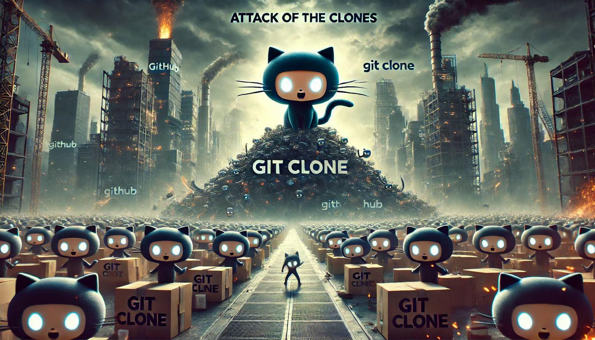

+++
title = 'Attack of the Clones'
date = 2024-06-20T07:45:11-07:00
+++

Imagine that nobody has to type `git clone` ever again! Can you even begin to comprehend what a
gigantic improvement in the quality of life of every developer it would be? This pipe dream has just
become a reality! Enter Cyclone🌀- a little Rust program I built to make the world 🌍 a better place.

**WARNING: This is a Kubernetes-free Post**

<!--more-->



I know, it sounds too good to be true, but trust me, it is possible. According to ChatGPT millions
of repositories are cloned every day on GitHub, and typing "git clone " takes 2-3 seconds on
average.

This means if somehow typing "git clone " could be avoided then we as an industry
could save millions of seconds every single day!

This is where Cyclone🌀 comes in. Cyclone🌀 watches your clipboard. Whenever it sees that the
clipboard contains a string with the prefix "git@" (which is common to all GitHub and Gitlab SSH
URIs) it prepends "git clone " to it and writes it back to the clipboard.

When you paste your clipboard contents to the console, the "git clone " will already be there, and
you never need to type it!

Namaste 🙏

# Usage

Cyclone🌀 is available here:

You can just build and run Cyclone yourself on any operating system:

```
$ cargo b -r
$ ./target/release/cyclone
```

## The macOS White-Glove Service

If you want the white-glove service on macOS you should run Cyclone🌀 automatically whenever you
start your computer, so it's always there ready to shave those seconds from your git clones...

First, install Cyclone🌀 (it will go to ~/.cargo/bin)

```
$ cargo install --path .
  Installing cyclone v0.1.0 (/Users/gigi.sayfan/git/cyclone)
    Updating crates.io index
    Finished release [optimized] target(s) in 1.53s
  Installing /Users/gigi.sayfan/.cargo/bin/cyclone
   Installed package `cyclone v0.1.0 (/Users/gigi.sayfan/git/cyclone)` (executable `cyclone`)
```

Then, use Launchd to launch it automatically on reboot by running the following commands:

```
$ cat local.cyclone.plist | sed s/{whoami}/$(whoami)/g > $TMPDIR/local.cyclone.plist
$ sudo cp $TMPDIR/cyclone.plist ~/Library/LaunchAgents
```

From now on, Cyclone🌀 will monitor your clipboard even if you reboot.

For the first time (if you don't want to reboot) you can launch it directly:

```
$ launchctl load ~/Library/LaunchAgents/local.cyclone.plist
```

To uninstall Cyclone🌀 run the following command:

```
$ launchctl unload ~/Library/LaunchAgents/local.cyclone.plist
$ rm ~/Library/LaunchAgenets/local.cyclone.plist
```

Enjoy! 🥳 
