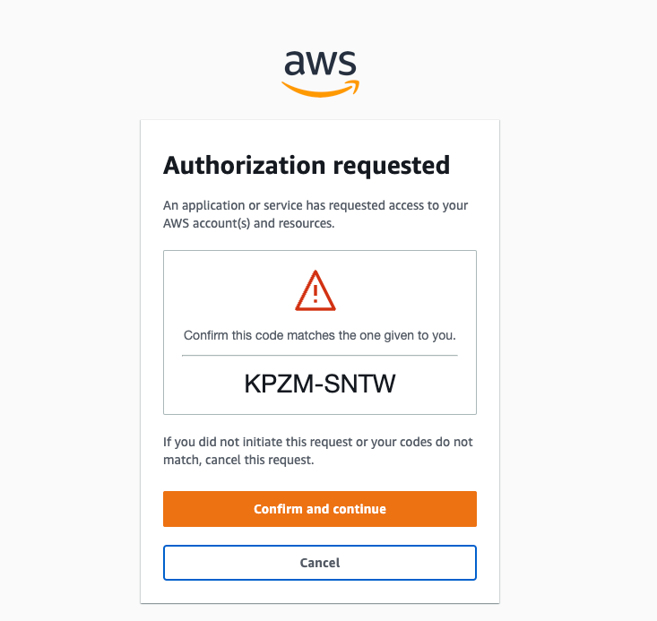
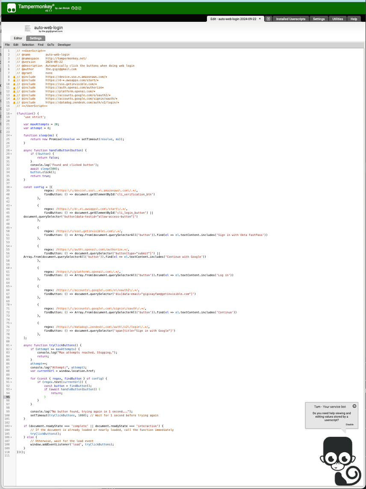

+++
title = 'Auto Web Login - Part I'
date = 2024-09-22T18:00:00-07:00
+++

Once upon a time there was a lazy man🚶‍. Let's call him Gigi (because that's his name) 😊. Gigi would
go to extreme lengths to avoid work. This is the story of how Gigi used browser automation 🤖 to
avoid clicking the mouse 🐭 a few times on a web page.

**"Laziness is the mother of invention."**
~ Anonymous

<!--more-->


# 👻 The Nightmare 👻

Here is the situation. You're working on your stuff, minding your own business in your cozy
terminal, maybe you're trying to run some aws CLI command or kubectl command. Suddenly, you are
rudely yanked ✊ into a blinding bright browser window 😱!



Now, you're required to click some buttons, possibly select an account, get redirected to other
pages, eventually close the browser tab, find your way back to your terminal and try to shake off
the trauma. Welcome to the big leagues 🏀, buddy, where every website and API is protected
by [SSO (Single sign On)](https://en.wikipedia.org/wiki/Single_sign-on).

This is a nightmare if there ever was one 💀!

Don't get me wrong - SSO is super-useful for organizations and I strongly recommend it as a best
practice. I just dislike the typical user experience.

# ✨ The Dream ✨

So, here is what I want to accomplish whenever one of these web login pages pops up:

- Automatically click all the buttons / select the correct accounts.
- Automatically close the browser tab opened for SSO purposes when the workflow is complete.
- Automatically switch back to my terminal when the ordeal is over.

# 🐒 Monkeys 🐒

Let's see how we can automatically click buttons in the browser when a web login page comes
up. The key technology here is [TamperMonkey](https://www.tampermonkey.net). TamperMonkey is a
browser extension that can be configured to run a user script whenever a certain page loads.

So, let's write a TamperMonkey user script that will click the buttons for us. Here is what it looks
like:



What's going on here? Let's break it down section by section

## 📝 Metadata 📝

The metadata section has a bunch of metadata (shocker!) about the script and the author (yours
truly). The most important part are the `@include` lines. The user script will run only on pages
whose URL matches the pattern in one of the @include lines. The patterns are just plain wildcards
and not full-fledged regular expressions.

```javascript
// ==UserScript==
// @name         auto-web-login
// @namespace    http://tampermonkey.net/
// @version      2024-09-22
// @description  Automatically click the buttons when doing web login
// @author       the.gigi@gmail.com
// @grant        none
// @include      https://device.sso.*.amazonaws.com/*
// @include      https://d-*.awsapps.com/start/*
// @include      https://sso.getinvisible.com/*
// @include      https://auth.openai.com/authorize*
// @include      https://platform.openai.com/*
// @include      https://accounts.google.com/o/oauth2/*
// @include      https://accounts.google.com/signin/oauth/*
// @include      https://datadog.zendesk.com/auth/v2/login/*
// ==/UserScript==
```

## 🧠 Main logic 🧠

The entire logic is wrapped in one big function that defines a few other functions and a config data
structure. It waits for the page to be loaded or interactive and then runs the tryClickButtons()
function that does all the heavy lifting.

```javascript
(function() {
'use strict';

    var maxAttempts = 20;
    var attempt = 0;

    function sleep(ms) ...

    async function handleButton(button) ...

    config = [...]

    async function tryClickButtons() ...

    if (document.readyState === 'complete' || document.readyState === 'interactive') {
        // If the document is already loaded or nearly loaded, call the function immediately
        tryClickButtons();
    } else {
        // Otherwise, wait for the load event
        window.addEventListener('load', tryClickButtons);
    }    
})();
```

## 🛠️ Helper Functions 🛠️

Let's look at the helper functions they are both pretty simple.

### 😴 The `sleep()` function 😴

The `sleep()` function is just a promise with a timeout, which is necessary if we want to block and
wait for a while in the async world.

```javascript
    function sleep(ms) {
        return new Promise(resolve => setTimeout(resolve, ms));
    }
```

### 👉 The `handleButton()` function 👉

The `handleButton()` function accepts a button element (could be any element, really) and if it's
not null it clicks it after half a second delay to let things settle (needed on some pages). It
utilizes our `sleep()` function.

```javascript
    async function handleButton(button) {
        if (!button) {
            return false;
        }
        console.log('Found and clicked button');
        await sleep(500);
        button.click();
        return true;
    }
```

## ⚙️ The Config ⚙️

The config is a list of objects, where each object has a regular expression and a findButton
function. The regex is equivalent to the pattern of one of the `@include` lines from the metadata
block
and the findButton() function is used to locate the button to click on this particular page.

```javascript
    const config = [{
                regex: /https:\/\/device\.sso\..*\.amazonaws\.com\/.*/,
                findButton: () => document.getElementById('cli_verification_btn')
            },

            {
                regex: /https:\/\/d-.*\.awsapps\.com\/start\/.*/,
                findButton: () => document.getElementById('cli_login_button') ||
    document.querySelector('button[data-testid="allow-access-button"]')
            },

            {
                regex: /https:\/\/sso\.getinvisible\.com\/.*/,
                findButton: () => Array.from(document.querySelectorAll('button')).find(el => el.textContent.includes('Sign in with Okta FastPass'))
            },

            {
                regex: /https:\/\/auth\.openai\.com\/authorize.*/,
                findButton: () => document.querySelector('button[type="submit"]') ||
    Array.from(document.querySelectorAll('button')).find(el => el.textContent.includes('Continue with Google'))
            },

            {
                regex: /https:\/\/platform\.openai\.com\/.*/,
                findButton: () => Array.from(document.querySelectorAll('button')).find(el => el.textContent.includes('Log in'))
            },

            {
                regex: /https:\/\/accounts\.google\.com\/o\/oauth2\/.*/,
                findButton: () => document.querySelector('div[data-email="gigisayfan@getinvisible.com"]')
            },

            {
                regex: /https:\/\/accounts\.google\.com\/signin\/oauth\/.*/,
                findButton: () => Array.from(document.querySelectorAll('button')).find(el => el.textContent.includes('Continue'))
            },

            {
                regex: /https:\/\/datadog\.zendesk\.com\/auth\/v2\/login\/.*/,
                findButton: () => document.querySelector('span[title="Sign in with Google"]')
            },
    ];
```

## 🔄 The `tryClickButtons()` function 🔄

Last, but not least the `tryClickButtons()` function is the engine of the script. As you recall it
is invoked when the page is loaded or interactive. It will run multiple times (up to maxAttempts)
with one-second delay between attempts. This is needed to be robust against pages that are loaded,
but their button is not rendered yet.

It fetches the current URL of the page (remember it will match one of the `@include` wild-card
patterns) and then it iterates over the config list of pairs. When it finds the pair with a regex
matching the current page URL it finds the button by calling (you guessed it) the `findButton()`
function of that page and then pass the button to the handleButton() function that will click it.

```javascript
    async function tryClickButtons() {
        if (attempt >= maxAttempts) {
            console.log("Max attempts reached. Stopping.");
            return;
        }
        attempt++;
        console.log("Attempt:", attempt);
        var currentUrl = window.location.href;

        for (const { regex, findButton } of config) {
            if (regex.test(currentUrl)) {
                const button = findButton();
                if (await handleButton(button)) {
                    return;
                }
            }
        }

        console.log("No button found, trying again in 1 second...");
        setTimeout(tryClickButtons, 1000); // Wait for 1 second before trying again
    }
```

# 🏁 The End (or is it?) 🏁

This TamperMonkey took some patience to build, mostly using the Chrome Developer Tools to look at
the DOM of pages that pop up for web logins and constructing the findButton() function for each one.
The problem with this script is that it is pretty brittle. If the @include wild-card pattern is not
exactly the equivalent of the regex in the config we can miss auto-clicking on some pages and/or run
this script needlessly on pages that don't participate in web login flows. In the next blog post in
the "Laziness is the mother of invention" series I'll talk about how I take laziness further and
generate the TamperMonkey script from a simpler specification.

In addition, we still want to close the browser tab when all is said and done and switch back to the
terminal.

If you're an impatient person the code for the complete project is here:
[auto-web-login](https://github.com/the-gigi/auto-web-login)

Until next time, Arrivederci 👋! 
