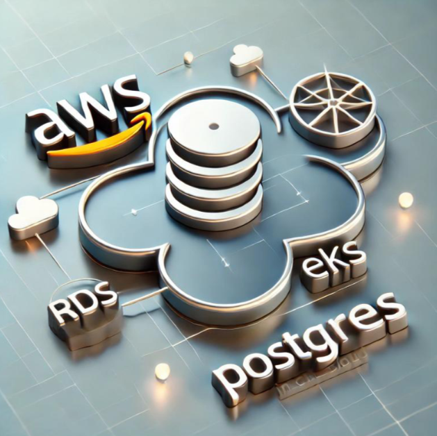

+++
title = 'Postgres on AWS RDS + EKS'
date = 2024-09-02T15:53:30-07:00
categories = ["Kubernetes", "Database"]
+++

You have an AWS EKS cluster ⎈ and your workloads use a managed Postgres DB 🌐 deployed on AWS RDS.
You need to access it from your laptop using your favorite DB visualization tool. What's the best
way to do it 🤷 ?

Keep reading to find out...

<!--more-->



# Prior Art 🎨

A few months ago I published a blog post on accessing a Postgres DB deployed directly on your k8s
cluster - [Postgres on K8S](https://the-gigi.github.io/gigi-zone/posts/2024/05/postgres-on-k8s/).

The major difficulty is that the Postgres DB is not directly accessible from the internet. The basic
idea is to launch a pod with psql Postgres client and then use `kubectl exec` to access this pod
from your laptop and gain access to the DB 💪.

This is cool 😎, but it's not going to cut it if we want to visually browse the DB using a tool like
DBeaver or the database tool in JetBrains IDEs.

# Getting visual 👁️

What we really need is a proxy running on the EKS cluster that will forward the Postgres traffic to
the RDS instance. Then, we can perform `kubectl port-forward` on the proxy and get direct connection
from our laptop to our Postgres DB.

Here is the plan 🧠:

- Fetch the endpoint of the RDS instance or proxy
- Deploy a postgres proxy pod on the EKS cluster
- Port-forward the proxy pod or the external name service to your laptop
- Fetch the username and password
- Connect to the DB using your favorite visual DB tool with the Postgres credentials

## Fetch the endpoint of the RDS instance or proxy

We will use the AWS CLI to fetch the endpoint of the RDS instance or RDS proxy and also `jq` for minor
formatting. If you are command-line challenged you are in the wrong place, buddy 🤷.

You need to have the AWS CLI installed and configured with the appropriate profile that has
permissions to access the RDS instance or proxy.

Here is the command to fetch the endpoint of an RDS instance:

```shell
ENDPOINT=$(aws rds describe-db-instances \
    --db-instance-identifier <db-instance-identifier> \
    --query 'DBInstances[0].Endpoint.Address' \
    --profile <aws-profile> | jq -r)
```

Here is the command to fetch the endpoint of an RDS proxy:

```shell
ENDPOINT=$(aws rds describe-db-proxy-endpoints \
    --db-proxy-endpoint-name <db-proxy-endpoint-name> \
    --query 'DBProxyEndpoints[0].Endpoint' \
    --profile <aws-profile> | jq -r)
```

## Deploy a postgres proxy pod on the EKS cluster

We will use
the [alpine/socat](https://github.com/alpine-docker/multi-arch-docker-images/tree/master/socat)
image to create a pod that will forward the Postgres traffic to the RDS instance or proxy. Here is
the command to create the pod (assuming the port is the standard 5432).

```shell
kubectl run postgres-proxy \
 -n default \
 --context <kube-context> \
 --image docker.io/alpine/socat \
 -- \
 tcp-listen:5432,fork,reuseaddr \
 tcp-connect:${ENDPOINT}:5432
```

I used the `default` namespace because it always exists. Later, we will discuss the choice of
namespace in the context of security.

## Port-forward the proxy pod to your laptop

Now, we can port-forward the proxy pod to our laptop. Here is the command to do it:

```shell
kubectl port-forward -n default --context <kube-context> postgres-proxy 5432:5432 &
```

This will run in the background, and you can now connect to the Postgres DB from your laptop
at http://localhost:5432

## Fetch the username and password

But, wait! We need the username and password to connect to the DB. It's up to you to decide where
you keep these precious credentials. You can store them in a Kubernetes secret in some namespace, or
maybe you keep the secrets in AWS secret manager 🙈.

Regardless, you need to fetch the username and password and use them to connect to the DB. Let's
discuss it in the context of security.

# Security 🛡️

OK. Connecting to a private RDS instance from your laptop is not the most secure thing to do. The
first rule of accessing your postgres DB directly is: **Don't do it!** 🚫

Alright, you are still here, so let's discuss how to do it with some semblance of securely awareness
at least. First, make sure you are in a somewhat secure environment. If you are in a coffee shop or
some other public place using public networks, you are already in trouble.

Next, let's consider how to minimize the risk. Here are a few ideas:

- Run the proxy pod in a dedicated namespace to isolate DB access from other workloads
- Use a dedicated Postgres user with limited permissions to access the DB.
- Use a dedicated Kubernetes user with limited permissions to access the proxy pod and fetch the
  credentials.
- If the credentials are stored in a Kubernetes secret, keep the secret in the same namespace as the
  proxy pod.
- Grant the Postgres user access only for the duration of your interactive session and revoke it
  immediately after.
- When you fetch the username and password, do it in a sub-shell and copy directly to the clipboard.

# Web-based Postgres Access 🕸️

If you have a lot of users that need to access your database you may want to consider a web-based DB
tool like [Apache Superset](https://superset.apache.org)
or [Metabase](https://github.com/metabase/metabase). These tools can be deployed on your EKS cluster
and provide a web-based interface to your Postgres DB.
