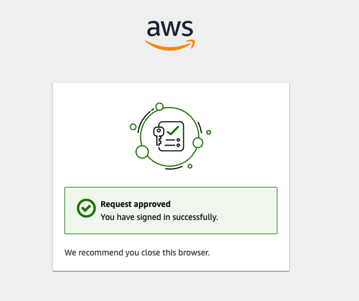

+++
title = 'Auto Web Login - Part III'
date = 2024-11-03T17:00:00-07:00
categories = ["DevOps"]
+++

Welcome to episode #3, where lazy man🚶‍ Gigi recruits AppleScript 🍎 to automatically close browser
tabs on his behalf.

If you're impatient the complete source code for the entire project is available here:

https://github.com/the-gigi/auto-web-login

**"Laziness is the mother of invention."**
~ Anonymous

<!--more-->


## 🔄 Recap 🔄

In [Auto Web Login - Part I](https://the-gigi.github.io/gigi-zone/posts/2024/09/auto-web-login-part-1/)
we learned how to use TamperMonkey 🐒 to automatically click buttons on a web page. But, the script
was pretty gnarly 🤢.

In [Auto Web Login - Part II](https://the-gigi.github.io/gigi-zone/posts/2024/10/auto-web-login-part-2/)
we let Python 🐍 generate the TamperMonkey script for us. This was a great improvement, but there is
one annoying loose end we need to take care of.

Let's add apples 🍎 to the mix.

## 🚪 Closing Tabs with AppleScript 🚪

When the SSO workflow is complete, it leaves behind a browser tab like so:



We need to close the browser tab and go back to our beloved terminal. "No problem," I hear you
say, "just add a couple of lines to our TamperMonkey script to close the tab.". Not so fast, amigo!
🤠

Modern browsers, in their infinite wisdom and justified paranoia, have disabled the ability to close
tabs via JavaScript. This is a good thing 👍. Imagine the havoc a malicious script could wreak! But,
it's a bit of a bummer for us. 😕

🍀 Luckily, we can use AppleScript 🍏 to close the tab for us. The full script 📜 is available here:
https://github.com/the-gigi/auto-web-login/blob/main/CloseTabs.applescript

Alright, let’s break down this AppleScript dive into what’s going on in each
section. If you unfamiliar with AppleScript and it looks weird, don't worry. It is weird! Here’s the
lowdown:

### ⚙️ Setting Up the URL and JavaScript Query Pairs ⚙️

We start by defining a list of URL and JavaScript query pairs. The URL is a regex pattern that
matches the URL of the tab we want to close. The JavaScript query is a snippet that will be executed
in the tab to determine if the tab should be closed.

```applescript
set urlQueryPairs to {{"https://d-[a-zA-Z0-9-]*.awsapps.com/start/.*", "Array.from(document.querySelectorAll('div')).find(el => el.textContent === 'Request approved');"}}
```

### ♾️ The Main Loop ♾️

The whole thing just runs forever:

```applescript
repeat
...
end repeat
```

Now, let's look what happens in the middle of the loop:

### 🔍 Checking the Active Tab 🔍

Gigi uses Chrome for work stuff, so the script checks the active tab of Chrome. We need to check if
the URL of the active tab matches one of the URL patterns we are interested in. First, let's get the
URL of the active tab:

```applescript
tell application "Google Chrome"
    try
        set currentTab to active tab of front window
        set currentURL to URL of currentTab
```

Next, we iterate over the URL and JavaScript query pairs we defined earlier. For each pair, we check
if the URL of the active tab matches the URL pattern. If it does, we execute the JavaScript query in
the tab. The syntax is a bit wonky, but you have been forewarned! We have here AppleScript
automating the browser and executing a Javascript query in the context of the active tab.

```applescript
      -- Check all pairs
      repeat with pair in urlQueryPairs
        set regexPattern to item 1 of pair
        set query to item 2 of pair
        -- Use shell script to perform regex matching
        set matched to do shell script "echo " & quoted form of currentURL & " | egrep -c " & quoted form of regexPattern
        if matched is not "0" then
        -- Construct the full JavaScript query correctly
          set fullQuery to "var el = " & query & "; el ? 'found' : 'not found';"
          set queryResult to execute currentTab javascript fullQuery
          if queryResult is "found" then
```          

### 🏠 Closing the tab and going home 🏠

If we found our tab, we close it and switch back to the terminal (by activating iTerm2). The script
then exits the inner loop and waits for the next iteration. The script sleeps for 1 second between
attempts to avoid bombarding the browser with non-stop checks.

```applescript
            delete currentTab
            -- switch back to the terminal
            tell application "iTerm2"
              activate
            end tell
            exit repeat -- Exit the inner repeat loop if a match is found and tab is closed
          end if
        end if
      end repeat      
    on error errMsg
    -- Do nothing if there is an error.
    end try
  end tell
  delay 1 -- Delays for 1 second before the next iteration
end repeat
```

## 🚀 Deploying the CloseTab Script 🚀

Alright. We got a script that closes the tab for us. Now, we need to make sure it runs whenever we
need it. We can use Launchd to make sure it starts whenever your computer starts and runs 🏃‍♂️ on
your behalf. But, before we do that let's compile our AppleScript:

```shell
$ osacompile -o CloseTabs.scpt CloseTabs.applescript
```

Alright. we got our compiled script, and we have a Launched
file - [auto_web_login_close_tabs.plist](https://github.com/the-gigi/auto-web-login/blob/main/auto_web_login_close_tabs.plist).
It is a simple XML file that tells Launchd to run our script. Here's the content of the file:

```xml
<?xml version="1.0" encoding="UTF-8"?>
<!DOCTYPE plist PUBLIC "-//Apple//DTD PLIST 1.0//EN"
        "http://www.apple.com/DTDs/PropertyList-1.0.dtd">
<plist version="1.0">
    <dict>
        <key>Label</key>
        <string>auto-web-login - close tabs</string>
        <key>ProgramArguments</key>
        <array>
            <string>/usr/bin/osascript</string>
            <string>/Users/gigi/git/auto-web-login/CloseTabs.scpt</string>
        </array>
        <key>RunAtLoad</key>
        <true/>
    </dict>
</plist>
```

All we need to bring this masterpiece to a glorious end is to drop the file
into `~/Library/LaunchAgents` and load it.

```
$ cp auto_web_login_close_tabs.plist ~/Library/LaunchAgents
$ launchctl load ~/Library/LaunchAgents/auto_web_login_close_tabs.plist
```

From now on, it will run whenever the computer and close the browser tabs for us.

## 📌 Take Home Points 📌

TamperMonkey can manipulate the DOM of a web page, but it can't close tabs. For that, we need to use
a different tool like AppleScript. But, to effectively close the correct tab, we still need to
execute Javascript dynamically on the active tab from within the AppleScript.

That was fun. We had monkeys 🐒 , snakes 🐍, and apples 🍎. We automated the entire SSO workflow. We
can now sit back and relax 🍹 while all our web login needs are taken care of by the automation  Or
can we? 🤔 I guess you'll hav to wait for the next episode to find out...

À bientôt, mes amis.🎈
