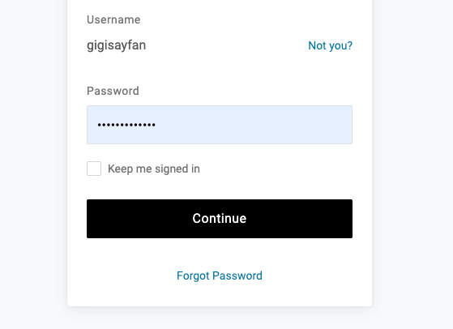
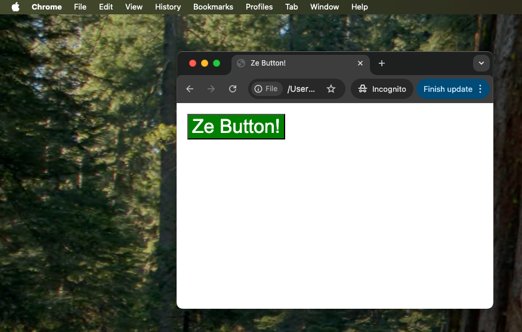

+++
title = 'Auto Web Login - Part IV'
date = 2024-11-09T17:00:00-07:00
+++

The **grand finale** is here, where lazy man🚶‍ Gigi defeats anti-Javascript
counter-measures in password-protected forms using the Rust programming language 🦀.

The complete source code for the entire project is available here:

https://github.com/the-gigi/auto-web-login

**"Laziness is the mother of invention."**
~ Anonymous

<!--more-->


## 🔄 Recap 🔄

In [Auto Web Login - Part I](https://the-gigi.github.io/gigi-zone/posts/2024/09/auto-web-login-part-1/)
we learned how to use TamperMonkey 🐒 to automatically click buttons on a web page. But, the script
was pretty gnarly 🤢.

In [Auto Web Login - Part II](https://the-gigi.github.io/gigi-zone/posts/2024/10/auto-web-login-part-2/)
we let Python 🐍 generate the TamperMonkey script for us. This was a great improvement, but there was
one annoying loose end we needed to take care of - browser tabs lingering around.

In [Auto Web Login - Part III](https://the-gigi.github.io/gigi-zone/posts/2024/11/auto-web-login-part-3/)
we used AppleScript 🍏 to close the browser tabs for us. But, it turns out that some buttons are not
accessible from JavaScript or Applescript.

Let's use Rust 🦀 to automate this part as well.

## 🔘 Clicking Stubborn Buttons 🔘

Some buttons are more stubborn than others. It turns out that forms with password fields can't be
clicked from Javascript (or Applescript). Even if the password is populated by auto-complete! The
browser's security apparatus requires user interaction. This comes up often when the SSO provider
itself (e.g. OneLogin or Okta) requires re-authorization.



Alright, browser automation fails us here. Let's take it to the next level (or the previous level)
and use OS automation to emulate an interactive user.

The idea is to use Javascript to locate the button on the page and then use OS-level automation to
move the mouse to the button and click it.

Python has a great library called [pyautogui](https://github.com/asweigart/pyautogui) that can move
the mouse, send keyboard events, and take screenshots. Unfortunately, I discovered that
when `pyautogui` runs on the Mac it creates a blinking rocket 🚀 icon in the dock . This is a
deal-breaker for me. I can't have a blinking rocket icon in the dock every time it runs. I tried
futilely to find a way to get rid of it.

Eventually, I took the only logical path 🧠, threw away
my [Python code](https://github.com/the-gigi/auto-web-login/blob/f0f00dce86d4dd9ae69e07b488956d9b3f992bfd/auto_click.py) (
well, it's still on GitHub) and decided to switch Rust 🦀. I mean, why not add another programming
language a project that already has Javascript, Python and Applescript? 🤷‍♂️

## 🦀 The `auto_click` Rust program 🦀

This ended up as its own little project. If you're not familiar with Rust you'll get acquainted
today :-)

Here is the directory structure:

```
❯ tree
.
├── Cargo.lock
├── Cargo.toml
├── config.yaml
└── src
    └── main.rs
```

The Cargo.toml file is the project file, which contains somme metadata and the dependencies

```toml
[package]
name = "auto-click"
version = "0.1.0"
edition = "2021"

# See more keys and their definitions at https://doc.rust-lang.org/cargo/reference/manifest.html

[dependencies]
dirs = "5.0.1"
enigo = "0.2.0"
serde = { version = "1.0", features = ["derive"] }
serde_yaml = "0.9.34"
```

The `config.yaml` file contains the URL and the button finding logic (in Javascript). This is very
similar to the
Python config file we used to generate the button finding logic in the TamperMonkey script.

```yaml
clicks:
  - url: "https://acke.onelogin.com/login2/"
    query:
      "Array.from(document.querySelectorAll('span')).some(span => span.textContent.includes('Change Authentication Factor')) ? null : document.querySelector('button[type=\"submit\"]')"
```

Note that the query is a Javascript expression that returns the button to click. We will see very
soon how it's used.

Finally, the `src/main.rs` file contains the Rust code that makes the magic happen. Let's lay out
the plan first and then see how the code does it.

## 📜 The Plan 📜

- Read the config file
- Loop forever
- For each URL in the config file:
    - Check if the URL is open in the browser
    - Wait for the page to load
    - Run the Javascript query to locate the button
    - Move the mouse to the button
    - Click the button

## 🦃🦆🐓 The Code Turducken 🦃🦆🐓

The `auto_click` program is a code turducken of multiple programming languages. The main Rust code
executes an Applescript that in turn runs Javascript queries in the browser.


Let's break it down piece by piece.

## 📦 The Imports 📦

It all starts with a lot of imports. Some of them are from
Rust's standard library, some are from the `enigo` library that allows us to move the mouse and
click buttons, and some are from the `serde` library that allows us to read the config file and some
are from the `enigo` library, which does the heavy lifting of moving the mouse around and clicking
buttons.

```rust
use enigo::{Enigo, Button, Mouse, Settings};
use std::process::Command;
use std::thread;
use std::time::Duration;
use serde::{Deserialize, Serialize};
use std::fs;
use std::error::Error;
use enigo::Coordinate::Abs;
use enigo::Direction::Click;
```

## 🛠️ The Configuration 🛠️

The `Config` struct is a Rust representation of the `config.yaml` file. It contains a list
of `ClickConfig` structs.

```rust
#[derive(Serialize, Deserialize, Debug)]
struct ClickConfig {
    url: String,
    query: String,
}

#[derive(Serialize, Deserialize, Debug)]
struct Config {
    clicks: Vec<ClickConfig>,
}
```

The `load_click_config` function reads the `config.yaml` file and parses it into a `Config` struct.

```rust
fn load_click_config() -> Result<Vec<ClickConfig>, Box<dyn Error>> {
    // Get the config filename
    let home_dir = dirs::home_dir().ok_or("Unable to find the home directory")?;
    let config_file = home_dir.join(".auto-click/config.yaml");

    // Read the entire file as a string
    let data = fs::read_to_string(config_file)?;

    // Parse the string as YAML
    let config: Config = serde_yaml::from_str(&data)?;
    Ok(config.clicks)
}
```

## 🍏 Running AppleScript from Rust 🍏

Rust can run AppleScript using the `Command` struct. The `osascript` function takes an AppleScript
as a string and runs it . Pretty simple.

```rust
fn osascript(script: &str) -> Result<String, Box<dyn std::error::Error>> {
    let output = Command::new("osascript")
        .arg("-e")
        .arg(script)
        .output()?;

    if output.status.success() {
        Ok(String::from_utf8(output.stdout)?)
    } else {
        Err(format!("Error executing AppleScript: {}", String::from_utf8(output.stderr)?).into())
    }
}
```

## 🎯 Locating Buttons on the Screen 🎯

Now, we're getting to the meat of the program. We need to locate the button on the screen in screen
coordinates. This is done by running a Javascript query in the browser and then performing some
coordinate system translations.

Let's create a simple page with a button on it and figure out how to locate it.

```html 
<!DOCTYPE html>
<html>
<head>
    <title>Ze Button!</title>
</head>
<body>
<button style="font-size: 32px; 
                 background-color: green; 
                 color: white; 
                 margin: 10px;">
    Ze Button!
</button>
</body>
</html>
```

Here is our button (note the 10px margin):



Let's see what can we find with the Browser DevTools:

```
b = document.querySelector('button')
<button style="font-size: 32px; background-color: green; color: white; margin: 10px;"> Ze Button! </button>

b.offsetLeft
18

b.offsetTop
18
```

The `offsetLeft` and `offsetTop` properties give us the position of the button relative to the
top-left corner of the viewport (the reason it's not 10 like our margin is that there are additional
elements like border width and default offsets). But it doesn't account for the offset of the
viewport from the top of the browser window (this part includes the tab bar, the URL bar and
possibly the bookmarks bar). We can calculate it using the following formula:

```javascript
> window.screenY + window.outerHeight - window.innerHeight
286
```

We also need to find the origin of the browser window itself in screen coordinates. Here is how to
do it with Applescript:

```shell
❯ echo '
tell application "System Events" to tell process "Google Chrome"
  return position of first window
end tell' | osascript

171, 184
```

We can also find it from within the browser using Javascript:

```javascript
> window.screenX
171
> window.screenY
184
```

Now we can calculate the absolute position of the button on the screen:

```
button left = browser window left + button left offset
button top  = browser window top + viewport top + button top offset
```

if we want to find the center of the button we need to add half the width and height of the button.

Here is the `get_chrome_origin()` to get the browser absolute origin (left, top) coordinates
position. There is some extra parsing and conversion of the final result into a Rust vector.

```rust
fn get_chrome_origin() -> Result<(i32, i32), Box<dyn std::error::Error>> {
    let script = r#"
        tell application "System Events" to tell process "Google Chrome"
            set thePos to position of first window
            return thePos
        end tell
    "#;
    let res = osascript(script)?;
    let coords: Vec<i32> = res.split(',')
        .map(|s| s.trim().parse().unwrap())
        .collect();
    Ok((coords[0], coords[1]))
}
```

Next, we need to calculate the absolute position of the button on the screen. Note, that we first
send the keystrokes ctrl+0 to the browser. This resets the zoom-level, which is important to avoid
the zoom distorting the pixel calculation.

```rust
fn get_absolute_viewport_top() -> Result<i32, Box<dyn std::error::Error>> {
    let script = r#"
        tell application "Google Chrome"
        activate
            tell application "System Events"
                keystroke "0" using {command down}
            end tell
            tell the active tab of window 1
                set js to "window.screenY + window.outerHeight - window.innerHeight"
                set viewportTop to execute javascript js
                return viewportTop
            end tell
        end tell
    "#;
    let res = osascript(script)?;
    res.trim().parse::<i32>().map_err(Into::into)
}
```

Finally, we can calculate the button center coordinates (in viewport cooridnates). This function
operates on a pair of URL and query to locate the button element on the page (if it exists).

```rust
fn find_element_center(partial_url: &str, query: &str) -> Result<(f64, f64), Box<dyn std::error::Error>> {
    let escaped_query = query.replace("\"", "\\\"");
    let full_query = format!(
        "var el = {}; if (el) {{ var rect = el.getBoundingClientRect(); var centerX = rect.left + rect.width / 2; var centerY = rect.top + rect.height / 2; centerX + ',' + centerY; }} else {{ 'not found'; }}",
        escaped_query
    );
    let escaped_url = partial_url.replace("\"", "\\\"");
    let script = format!(r#"
        tell application "Google Chrome"
            try
                set currentTab to the active tab of the front window
                set currentURL to the URL of currentTab

                if currentURL contains "{}" then
                    -- Construct and execute the JavaScript query to find the center of the element
                    set fullQuery to "{}"
                    set queryResult to execute currentTab javascript fullQuery
                    return queryResult
                else
                    return "URL does not contain the specified partial URL."
                end if
            on error errMsg
                return "An error occurred: " & errMsg
            end try
        end tell
    "#, escaped_url, full_query);

    let res = osascript(&script)?;
    if res.contains(",") {
        let parts: Vec<&str> = res.split(',').collect();
        let x = parts[0].trim().parse::<f64>()?;
        let y = parts[1].trim().parse::<f64>()?;
        Ok((x, y))
    } else {
        Err("Element not found or error occurred".into())
    }
}
```

## 🌀 The main loop 🌀

Let's see how everything fits together in the main loop. First, it loads the config. Then it enters
a loop that goes through each URL in the config. For each URL it checks if the URL it tries to find
the button center coordinates. If it finds the button it calculates the absolute position of the
button on the screen and moves the mouse to that position and clicks the button using enigo.
Finally, it sleeps for 3 seconds before repeating the process.

```rust
fn main() -> Result<(), Box<dyn std::error::Error>> {
    let mut enigo = Enigo::new(&Settings::default()).unwrap();
    let user_click_dict = load_click_config()?;
    loop {
        for click in &user_click_dict {
            if let Ok((dx, dy)) = find_element_center(&click.url, &click.query) {
                if let Ok((x, _y)) = get_chrome_origin() {
                    let viewport_top = get_absolute_viewport_top()?;
                    let abs_x = x as f64 + dx;
                    let abs_y = viewport_top as f64 + dy;

                    enigo.move_mouse(abs_x as i32, abs_y as i32, Abs).unwrap();
                    // Click twice - once to focus, once to click the button
                    enigo.button(Button::Left, Click).unwrap();
                    enigo.button(Button::Left, Click).unwrap();
                }
            }
        }
        thread::sleep(Duration::from_secs(3));
    }
}
```

## 🚀 Building and Running the program 🚀

We will use the same `launchd` mechanism we used to watch for tabs to close, to run the program on
startup. First, we need to build the program:

```shell
$ cargo build --release
```

Next, we need to copy the binary to `/usr/local/bin`:

```shell
cp target/release/auto-click /usr/local/bin
```

Then, we create a property list file that will run the program on startup. The file is
called `auto_web_login_simulate_user.plist` and it looks like so:

```xml
<?xml version="1.0" encoding="UTF-8"?>
<!DOCTYPE plist PUBLIC "-//Apple//DTD PLIST 1.0//EN"
        "http://www.apple.com/DTDs/PropertyList-1.0.dtd">
<plist version="1.0">
    <dict>
        <key>Label</key>
        <string>auto-web-login - simulate user</string>
        <key>ProgramArguments</key>
        <array>
            <string>/usr/local/bin/auto-click</string>
        </array>
        <key>RunAtLoad</key>
        <true/>
        <key>StandardOutPath</key>
        <string>/tmp/auto-web-login.out</string>
        <key>StandardErrorPath</key>
        <string>/tmp/auto-web-login.err</string>
    </dict>
</plist>
```

Finally, we need to make this run automatically on startup. These commands will copy the Launchd
file [auto_web_login_simulate_user.plist](auto_web_login_simulate_user.plist) to the right place.

```shell
$ cp auto_web_login_simulate_user.plist ~/Library/LaunchAgents
$ launchctl load ~/Library/LaunchAgents/auto_web_login_simulate_user.plist
```

## 🎉 Conclusion 🎉

We made it! We have a Rust program 🦀 that uses AppleScript 🍏 to run JavaScript 🖥 in the browser to
locate 🔘 buttons on the screen and then and click them ✅.

This is the final piece of the puzzle 🧩 that allows us to automatically log in 🔐 to websites that
require frequent re-authorization 🔄. I use it on a daily basis, and it was a lot of fun 🎊 to build.

Learning 📚 about the intricacies of web logins and mixing multiple 🛠️ technologies to accomplish the
task was a great experience.
