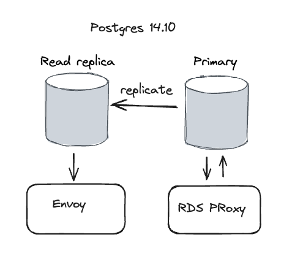

+++
title = 'Blue Green Upgrade Postgres on AWS RDS'
date = 2024-12-24T13:07:12-08:00
+++

Today we are going deep on upgrading Postgres on AWS RDS to a new major version. You may be shocked,
but there will be very few emojis in this post. Database upgrades are no joke, so let's
be serious for a change. 🫡

**A SQL query walks into a bar, sees two tables and asks, "Can I join you?" ~ Anonymous**

<!--more-->

## 🤷‍♂️ Why? 🤷‍♂️

So, databases are, like, really important. They keep your data and all that. The database powers
that be, like to release new versions from time to time. And, when they do, you better not fall
behind too much. This is especially true in the cloud where you might "void the warranty" if you
don't upgrade.

## ⏮️ Before ⏮️

The database is Postgres 14.10 configured with one primary and one read replica running on RDS in a
multi-AZ deployment. Both the primary and the read replica have private IP addresses only and are
not reachable directly outside the VPC. The primary DB is fronted
by [RDS proxy](https://aws.amazon.com/rds/proxy/). The read replica is fronted by
an [Envoy](https://www.envoyproxy.io) proxy.



## ⏭️ After ⏭️

The new database will be Postgres 16.3. The RDS proxy and the Envoy proxy will remain the same and
accessed through the same endpoints. All the data will be migrated to the new database.


## 🤔 What? 🤔

Here are the requirements for the upgrade:

- Don't lose data (duh!)
- Minimal downtime (no overnight or hours long maintenance window)
- OK to drop active connections
- Support for RDS Proxy

## 🔼 Just upgrade... 🔼

In theory, we can just upgrade our current primary and re-create the read replica. But, that will
take a long time (30-40 minutes for a relatively small database).

OK. Maybe AWS RDS can help us? What do you know? They have a feature
called [Blue/Green Deployment](https://docs.aws.amazon.com/AmazonRDS/latest/UserGuide/blue-green-deployments-overview.html)
which is exactly what we need. Alas, it doesn’t support RDS Proxy. Alright, let’s do it ourselves.
It turns out to be a rather elaborate process.

## 🟦🟩 The Blue-Green Upgrade 🟩🟦

Here is the high-level plan. We wll perform a blue-green upgrade, which means we will create a new
RDS instance with the new version, transfer all the data into, create a new read replica. The RDS
proxy will be updated to point to the new primary DB and the Envoy proxy will be updated to point to
the new read replica. If
anything goes wrong, we can quickly switch back to the old setup. If everything goes well, we can
delete the old setup.

Throughout the process let's refer to the current primary and read replica as the "blue" setup and
to the new primary and read replica as the "green" setup.

Let's break it down into detailed concrete steps:

### Backup the Blue primary DB

This is a no-brainer. We mess with the DB, back it up. We have automated daily backups, but it's
best to have a fresh backup. On AWS RDS, we can create a snapshot of the DB.


I will not include the backup snapshot in the detailed steps below, but remember that we have it, in
case things really go south, and we have to revert to the old setup.

### Prepare the Blue primary DB for logical replication

We will use logical replication to transfer the data from the Blue primary to the Green primary. We
need to enable logical replication on the Blue primary. This is a one-time operation since from now
on all upgrades will be done on DBS that are already configured for logical replication.

See [Setting up logical replication on Postgres RDS](https://docs.aws.amazon.com/AmazonRDS/latest/UserGuide/USER_MultiAZDBCluster_LogicalRepl.html#multi-az-db-clusters-logical-replication)

### Create a snapshot of the Blue primary DB and upgrade it to the new version

We will create a snapshot of the Blue primary DB and upgrade it offline to version 16.3. Note that
the blue system is still running and serving traffic. The snapshot will be out of date, but we will
catch up later. The reason we even bother with this initial snapshot is that it copies the DB
parameters and metadata.


### Restore the upgraded snapshot into the Green primary DB

The key here is to restore the snapshot into a new DB instance with the same parameter group as the
blue primary, the same subnet and security groups.

Here is how to do it with the aws CLI:

```shell
DB_INSTANCE_ID=primary-16.3
SNAPSHOT_ID=the-snapshot
PARAM_GROUP=the-param-group
SUBNET=the-subnet
SECuIRTY_GROUP_IDS=the-security-group

aws rds restore-db-instance-from-db-snapshot \
  --db-instance-identifier $DB_INSTANCE_IDE \
  --db-snapshot-identifier  $SNAPSHOT_ID
  --db-parameter-group-name $PARAM_GROUP \
  --db-subnet-group-name "$SUBNET_GROUP_NAME" \
  --vpc-security-group-ids "$SECURITY_GROUP_IDS"
```

We end up with this setup:


### Connecting to Postgres from Kubernetes

We need to connect to our DB instances (both blue and green as well as the read replicas). If you
are running on EKS (using the same subnet as the RDS instances) check out this blog post where I go
into detail on how to securely connect to your Postgres instances and establish an interactive PSQL
session:
https://the-gigi.github.io/gigi-zone/posts/2024/05/postgres-on-k8s/

Let's connect to the new green primary and check that it's configured correctly for logical
replication, which comes next. We will use the `db_connect()` function from the blog post above.

```shell
NAMESPACE=the-namespace
KUBE_CONTEXT=the-k8s-context
DB_INSTANCE_ID=primary-16.3
PGHOST=$(
    aws rds describe-db-instances \
        --db-instance-identifier "$DB_INSTANCE_ID" \
        --query "DBInstances[0].Endpoint.Address" \
        --output text
)
POD_NAME=pgctl-green
connect_db $PGHOST $NAMESPACE $KUBE_CONTEXT $POD_NAME```
```

This should land us in a PSQL session connected to the green primary. Let's view the relevant
parameters:

```shell
the-database=> 
show rds.logical_replication;
show wal_level;
show max_wal_senders;
show max_replication_slots;
show max_connections;
 
 rds.logical_replication
-------------------------
 on
(1 row)

 wal_level
-----------
 logical
(1 row)

 max_wal_senders
-----------------
 100
(1 row)
 max_replication_slots
-----------------------
 100
(1 row)

 max_connections
-----------------
 500
(1 row)
```

### Setup logical replication from Blue to Green

Logical replication is a feature of Postgres that allows you to replicate data from one DB to
another. It has some limitations (e.g. tables must have a primary key and no DDL replication), but
it's perfect for our use case. As you recall, the DDL is identical since we restored from a snapshot
of the Blue instance.

Here is how to set up logical replication:

1. Create a replication user on the Blue primary
2. Create a replication slot on the Blue primary
3. Create a publication on the Blue primary
4. Create a subscription on the Green primary in disabled mode.
5. Advance the subscription
6. Check that the replication is working
7. Catch up the data

The process is quite elaborate and involves a lot of SQL commands. I will spare you, but here is a
good reference:
https://www.percona.com/blog/postgresql-logical-replication-using-an-rds-snapshot/

At this point the Blue and Green primaries are in sync. Whenever data is written to the Blue
primary it is replicated to the Green primary.


### Create a new read replica

The next step is to create a new read replica for the Green primary. This is a simple operation you
can do from the AWS console, aws CLI or tools like Pulumi and Terraform.

See https://docs.aws.amazon.com/AmazonRDS/latest/UserGuide/USER_ReadRepl.Create.html.

At the end of the process, we will have the same data synchronized across Blue and Green primaries
and the Blue and Green read replicas. New transactions on the Blue primary will be quickly
replicated ot its Blue read replica nad the Green primary and its Green read replica.


### Switch the Blue primary to read-only

Up to this point the Blue primary and its read replica were serving read and write transactions with
no disruption. Now we will switch the Blue primary to read-only mode. This will prevent new
transactions from being written to the Blue primary. The Blue primary and read replica will continue
to serve read transactions.

Note that we can't safely just point the RDS proxy to the Green primary because if some transactions
are not replicated yet, we will have data inconsistency.

The goal is obviously to remain in read-ony mode for as short a time as possible. There are two
parts to this:

1. Switch our Postgres DB to read-only mode
2. Severe the connections between the RDS proxy and the Blue primary

Here is how to switch to read-only mode from PSQL after you connect to the Blue primary)

```shell
the-database=> SHOW default_transaction_read_only;
 default_transaction_read_only
-------------------------------
 off
(1 row)

the-database=> ALTER DATABASE the-database SET default_transaction_read_only = on;
ALTER DATABASE
```

To verify you need to disconnect and re-connect to the Blue primary (remember existing connections
including the PSQL connection are not impacted and can continue to write to the DB).

```
the-database=> SHOW default_transaction_read_only;
 default_transaction_read_only
-------------------------------
 on
(1 row)
```

Now, let's observe all the existing connections. We only care about connections of type "client
backend". Postgres and RDS have several connections which don't need to be disturbed.

```shell
the-database=> SELECT pid, usename, application_name FROM pg_stat_activity
        WHERE backend_type = 'client backend'
                
  pid  |    usename    |    application_name
-------+---------------+------------------------
   714 | rdsproxyadmin |
   715 | rdsproxyadmin |
   716 | rdsproxyadmin |
   717 | rdsproxyadmin |
   718 | some-user     | PostgreSQL JDBC Driver
   719 | some-user     | PostgreSQL JDBC Driver        
```

The following incantation will severe all these connections:

```shell
the-database=> DO $$
DECLARE
    process RECORD;
BEGIN
    FOR process IN
        SELECT pid
        FROM pg_stat_activity
        WHERE backend_type = 'client backend'
    LOOP
        PERFORM pg_terminate_backend(process.pid);
    END LOOP;
END $$;
```

The RDS proxy will immediately reconnect, but these new connections will be read-only connections.
Note that the pids are different now.

```shell
invisible=> SELECT
    pid,
    usename AS user_name,
    application_name
FROM pg_stat_activity
WHERE backend_type = 'client backend'
  AND pid <> pg_backend_pid();
  pid  |   user_name   | application_name
-------+---------------+-----------------
 23038 | rdsproxyadmin |                 
 23041 | rdsproxyadmin |                 
 23042 | rdsproxyadmin |                 
 23045 | rdsproxyadmin |                 
(4 rows)
```


Note that if you need to abort the process and switch the Blue primary back to read-write you must
connect to the postgres DB and not the current DB because it is in read-only mode and will not let
you alter its state back to read-write :-).

### Wait for the Green primary to catch up

The Blue primary is in read-only mode now. We need to wait for the Green primary to catch up before
we switch over. This should be very quick as logical replication is ongoing already, so just a few
struggling transactions may need to be replicated.

You can connect to the green replica and check the subscription state:

```shell
the-database=> SELECT
subname AS subscription_name,
received_lsn,
latest_end_lsn,
pg_size_pretty(pg_wal_lsn_diff(latest_end_lsn, received_lsn)) AS lag_bytes
FROM pg_stat_subscription;
subscription_name | received_lsn | latest_end_lsn | lag_bytes
------------------------+--------------+----------------+-----------
blue_green_upgrade_sub | 6EB/FC0036B0 | 6EB/FC0036B0 | 0 bytes
(1 row)
```

Once the `lag_bytes` is 0, we are ready to switch over.

### Switch the RDS proxy to the Green primary

This is conceptually simple. But, unfortunately the RDS proxy machinery is a little cumbersome here.
The RDS proxy has a concept called a target group. There is a default target group associated with
every RDS proxy. To switch over from Blue to green we need to deregister the Blue primary from the
default target group and register the Green primary.

This process is not immediate and can 20-30 seconds. During this time the RDS proxy will not be able
to serve any requests.

Here is how to do it with the aws CLI:

```shell
PROXY_NAME=the-proxy
PREV_DB_INSTANCE_ID=primary-14.10
DB_INSTANCE_ID=primary-16.3

aws rds deregister-db-proxy-targets \
  --db-proxy-name $PROXY_NAME \
  --target-group-name default \
  --db-instance-identifier $PREV_DB_INSTANCE_ID

aws rds register-db-proxy-targets \
  --db-proxy-name $PROXY_NAME \
  --target-group-name default \
  --db-instance-identifier $DB_INSTANCE_ID \

while true; do
    state=$(aws rds describe-db-proxy-targets \
        --db-proxy-name $PROXY_NAME \
        --target-group-name default \
        --query "Targets[0].TargetHealth.State" \
        --output text)
    echo "Current state: $state"
    if [ "$state" = "AVAILABLE" ]; then
        echo "Target is ready"
        break
    fi
    sleep 10
done

Current state: UNAVAILABLE
Current state: AVAILABLE
Target is ready
```


### Verify the switchover was successful

This is a good time to connect to the Green primary via the RDS proxy endpoint and very everything
looks fine (e.g. query some tables, create a temp table and insert some data). If anything is wrong
you can quickly switch back to the Blue primary by re-registering the Green primary and registering
the Blue primary. Don't forget to switch the Blue primary back to read-write mode.

### Switch the Envoy proxy to the Green read replica

At this point the Green primary is serving all the write traffic. The Blue primary is inaccessible (
still in read-only mode). However, the Envoy proxy is still pointing to the Blue read replica, which
will remain in sync with the stale Blue primary. Let's switch the Envoy proxy to the Green read
replica.

Note that it is necessary only if you need to provide read-only access to the DB from outside the
VPC.

Envoy is a high-performance proxy initially developed by Lyft. It is an excellent choice for
positioning in front of your RDS read replicas, as it supports TCP-level forwarding, which is
necessary for handling the Postgres protocol.

The Envoy proxy itself is running in a Kubernetes deployment behind a LoadBalancer service, so it
can be accessed outside the VPC.


In order to switch the Envoy proxy to the Green read replica, we need to update the Envoy ConfigMap.
We can use [kubectl](https://kubernetes.io/docs/reference/kubectl/)
and [yq](https://github.com/mikefarah/yq) to extract the current read replica endpoint from the
ConfigMap, update it
with the new endpoint and apply the updated ConfigMap.

```shell
CONFIG_MAP_NAME=postgres-proxy
kubectl get cm $CONFIG_MAP_NAME -o yaml | \
  yq '.data["envoy.yaml"]' | \
  yq '.static_resources.clusters[0].load_assignment' | \
  yq '.endpoints[0].lb_endpoints[0].endpoint.address.socket_address.address'
```

Once you update the config map, the Envoy proxy will start routing traffic to the Green read
replica. This is the final step in the upgrade process.


### Cleanup

Alright. The upgrade is done. The Green primary is serving all the write traffic. The Green read
replica is serving read traffic. The Blue primary and read replica are can be
deleted. First, we can stop the logical replication from the Blue primary to the Green primary. This
is done by disabling and then dropping the subscription on the Green primary.

```shell
the-database=> ALTER SUBSCRIPTION blue_green_upgrade_sub DISABLE;
ALTER SUBSCRIPTION
the-database=> ALTER SUBSCRIPTION blue_green_upgrade_sub SET (slot_name = NONE);
ALTER SUBSCRIPTION
the-database=> DROP SUBSCRIPTION blue_green_upgrade_sub;
DROP SUBSCRIPTION
```

## 0️⃣ Zero-Downtime Upgrade 0️⃣

One of the benefits of this process is that no application changes are required. There will be a
short
period of time during the switchover where the DB is accessible in read-only mode and existing
connections are dropped. Applications should be able to handle this gracefully.

If you require really zero downtime upgrade then we need to go one step further and design
a data access layer that can be configured with the old and new DBs and read and write to both
during the upgrade process. This requires careful planning and testing as well coordination with all
applications.

## 🏁 Conclusion 🏁

Performing a blue-green upgrade of Postgres on AWS RDS is a complex process. If you have multiple
DBs on the same DB instance then some of the steps will be more involved. But, the process is well
worth it. You can upgrade your DB with minimal downtime and rollback quickly if something goes
wrong. The key is to have a good plan and to test the process in a staging environment before doing
it in production. It is best to automate as much as possible and validate the results at each step.
Then, if anything goes wrong revert to the blue setup and asses what went wrong.

Good luck with your upgrade! 🍀
