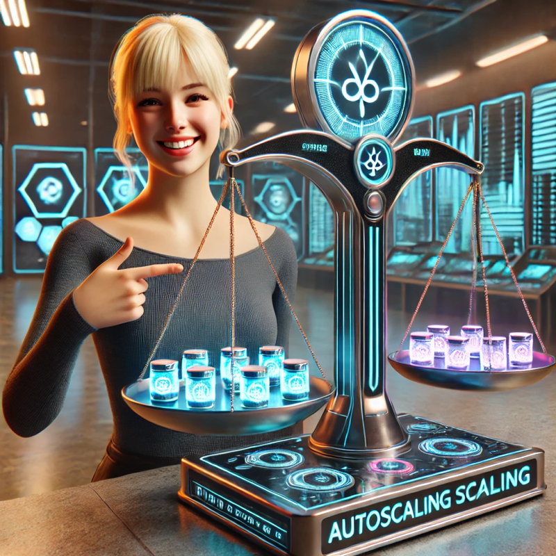

+++
title = 'About Horizontal Pod Autoscaling'
date = 2025-01-26T13:07:12-08:00
categories = ["Kubernetes", "DevOps"]
+++

Horizontal pod autoscaling is one of the best features of Kubernetes ☸️. In this short blog post
I'll take quick a look at the horizontal pod autoscaler (HPA) and point out some gotchas.

**“The best measure of a man’s honesty isn’t his income tax return. It’s the zero adjust on his
bathroom scale” ~ Arthur C. Clarke**

<!--more-->



The HPA (Horizontal Pod Autoscaler) is a built-in Kubernetes controller watching you deployments
when an HPA resource is provisioned. If your deployment needs more pods to handle the load it will
scale it up (increase the number of replicas). When the load goes down it will scale it back down.
That's it.

# 💥 The Horizontal Pod Autoscaler in Action 💥

First, you need to make sure you have a metrics provider available and if not install one.

## Ensure the metrics server is available

Let's see if the Kubernetes metrics server is already installed

```
k get deploy metrics-server -n kube-system

NAME             READY   UP-TO-DATE   AVAILABLE   AGE
metrics-server   1/1     1            1           2m40s
```

If it's not installed, install it!

```
❯ k apply -f https://github.com/kubernetes-sigs/metrics-server/releases/latest/download/components.yaml

serviceaccount/metrics-server created
clusterrole.rbac.authorization.k8s.io/system:aggregated-metrics-reader created
clusterrole.rbac.authorization.k8s.io/system:metrics-server created
rolebinding.rbac.authorization.k8s.io/metrics-server-auth-reader created
clusterrolebinding.rbac.authorization.k8s.io/metrics-server:system:auth-delegator created
clusterrolebinding.rbac.authorization.k8s.io/system:metrics-server created
service/metrics-server created
deployment.apps/metrics-server created
apiservice.apiregistration.k8s.io/v1beta1.metrics.k8s.io created
```

If you're running on a [KinD](https://kind.sigs.k8s.io) cluster you need to patch the deployment

```
kubectl patch deployment metrics-server -n kube-system --type='json' -p='[
  {"op": "add", "path": "/spec/template/spec/containers/0/args/-", "value": "--kubelet-insecure-tls"}
]'
```

# ⚖️ Autoscaling based on CPU or memory ⚖️

Let's create a Deployment where we can control the CPU and memory usage.

```
echo '
apiVersion: apps/v1
kind: Deployment
metadata:
  name: the-app
  namespace: default
spec:
  replicas: 1
  selector:
    matchLabels:
      app: the-app
  template:
    metadata:
      labels:
        app: the-app
    spec:
      containers:
      - name: the-app
        image: vish/stress        
        command: ["/stress"]
        args: ["--cpus", "1", "--mem-total", "256Mi", "--mem-alloc-size", "32Mi"]
        resources:
          requests:
            memory: "256Mi"
            cpu: "500m"
          limits:
            memory: "8Gi"
            cpu: "2000m"
        volumeMounts:            
          - name: tmp-volume 
            mountPath: /tmp                        
      volumes:
         - name: tmp-volume
           emptyDir: {}' | k apply -f -
```

Let's check how much CPU and memory the pod uses

```
❯ k top po
NAME                       CPU(cores)   MEMORY(bytes)
the-app-5bfc8894d7-5vsjl   1028m        303Mi
```

Note that the `vish/stress` allocates memory periodically until it reaches 256Mi (--mem-total), so
the memory
consumption will grow. I've made sure that the memory limit (512Mi) is greater, so it will never
exceed the limit and get OOMKilled.

Now let's create an HPA for the deployment

```
echo '
apiVersion: autoscaling/v2
kind: HorizontalPodAutoscaler
metadata:
  name: the-app
spec:
  scaleTargetRef:
    apiVersion: apps/v1
    kind: Deployment
    name: the-app  # Name of the target deployment
  minReplicas: 1
  maxReplicas: 10
  metrics:
  - type: Resource
    resource:
      name: memory
      target:
        type: Utilization
        averageUtilization: 90  # Scale up when memory usage exceeds 90% of requests
' | k apply -f -        
```

When the memory of the original pod exceeds 90% of the requested memory the HPA will scale up the
number of replicas. The new pod will start allocating memory until it reaches 90% of the requests
and then the HPA will scale up again. This will continue until the max number of replicas is
reached.

Here is the progression

```
❯ kubectl get po
NAME                      READY   STATUS    RESTARTS   AGE
the-app-8db9d476b-cdnwh   1/1     Running   0          3s
```

```
❯ kubectl get po
NAME                      READY   STATUS    RESTARTS   AGE
the-app-8db9d476b-hbkhf   1/1     Running   0          16s

❯ kubectl get po
NAME                      READY   STATUS              RESTARTS   AGE
the-app-8db9d476b-5bkhl   0/1     ContainerCreating   0          9s
the-app-8db9d476b-ggwqc   1/1     Running             0          9s
the-app-8db9d476b-hbkhf   1/1     Running             0          30s
the-app-8db9d476b-mpn89   1/1     Running             0          9s

❯ kubectl get po
NAME                      READY   STATUS              RESTARTS   AGE
the-app-8db9d476b-5bkhl   1/1     Running             0          30s
the-app-8db9d476b-ggwqc   1/1     Running             0          30s
the-app-8db9d476b-gj7gd   1/1     Running             0          15s
the-app-8db9d476b-hbkhf   1/1     Running             0          51s
the-app-8db9d476b-hpcst   1/1     Running             0          15s
the-app-8db9d476b-kqx7r   0/1     ContainerCreating   0          0s
the-app-8db9d476b-mbg8s   0/1     ContainerCreating   0          0s
the-app-8db9d476b-mpn89   1/1     Running             0          30s
the-app-8db9d476b-pct9s   1/1     Running             0          15s
the-app-8db9d476b-wvvvx   1/1     Running             0          15s

❯ kubectl get po
NAME                      READY   STATUS    RESTARTS   AGE
the-app-8db9d476b-5bkhl   1/1     Running   0          36s
the-app-8db9d476b-ggwqc   1/1     Running   0          36s
the-app-8db9d476b-gj7gd   1/1     Running   0          21s
the-app-8db9d476b-hbkhf   1/1     Running   0          57s
the-app-8db9d476b-hpcst   1/1     Running   0          21s
the-app-8db9d476b-kqx7r   1/1     Running   0          6s
the-app-8db9d476b-mbg8s   1/1     Running   0          6s
the-app-8db9d476b-mpn89   1/1     Running   0          36s
the-app-8db9d476b-pct9s   1/1     Running   0          21s
the-app-8db9d476b-wvvvx   1/1     Running   0          21s
```

# 📊 Scaling based on custom metrics 📊

Sometimes scaling based on CPU or memory is not enough. For example, our pod may be spending most of
its time waiting for API calls, which are rate limited by IP address. In this case, the CPU and
memory usage of the pod will be low, but the pod will not get a lot of work done. It may better to
design the system with a queue that multiple pods can pull from. The queue can be monitored and the
number of pods can be scaled based on the queue depth.

[Keda](https://keda.sh) is a popular tool for scaling based on custom metrics. If your use case
calls for custom metrics check it out.

# 📉 Scale to Zero, Anyone? 📉

What if you have a workload that is not used all the time? You can scale it to zero! Unfortunately,
the HPA is not much help here. It can't help you scale down to Zero, and it can't help you to scale
back up
when the load comes back. You need to use a different tool like [Knative](https://knative.dev) for
that.

Let's see what happens if we try to configure our HPA with Zero mix replicas or Zero max replicas.

```
❯ kubectl patch hpa the-app -p '{"spec":{"minReplicas": 0, "maxReplicas": 0}}'
The HorizontalPodAutoscaler "the-app" is invalid: 
* spec.minReplicas: Invalid value: 0: must be greater than or equal to 1
* spec.maxReplicas: Invalid value: 0: must be greater than 0
* spec.metrics: Forbidden: must specify at least one Object or External metric to support scaling to zero replicas
```

It fails and to keep things interesting the error messages for minReplicas and maxReplicas are
equivalent, but different :-)

greater than 0 is the same (for integers) as greater than or equal to 1.

# 🏃‍♂️ Dry Run 🏃‍♂️

If you provision multiple related resources like Deployment and HPA you should consider using the
`--dry-run` flag for kubectl apply. This will allow you to see what resources will be created
without actually creating them and if they are valid.

Otherwise, you might end up with a subset of the resources you planned to create and have to clean
up
the mess.

Until Kubernetes 1.18 the flag was simply --dry-run and it ran on the client-side. Starting with
1.18 you can do dry run on the client or on the server. Let's try both with an invalid manifest:

```
❯ echo '
apiVersion: v1
kind: Namespace
metadata:
  name: Invalid-Name-With-Uppercase
  labels:
    "invalid label": "spaces are not allowed"
' | kubectl apply --dry-run=client -f -
namespace/Invalid-Name-With-Uppercase created (dry run)
```

The client-side dry run accepted this invalid manifest. Let's try the server-side dry run:

```
❯ echo '
apiVersion: v1
kind: Namespace
metadata:
  name: Invalid-Name-With-Uppercase
  labels:
    "invalid label": "spaces are not allowed"
' | kubectl apply --dry-run=server -f -

The Namespace "Invalid-Name-With-Uppercase" is invalid:
* metadata.name: Invalid value: "Invalid-Name-With-Uppercase": a lowercase RFC 1123 label must consist of lower case alphanumeric characters or '-', and must start and end with an alphanumeric character (e.g. 'my-name',  or '123-abc', regex used for validation is '[a-z0-9]([-a-z0-9]*[a-z0-9])?')
* metadata.labels: Invalid value: "invalid label": name part must consist of alphanumeric characters, '-', '_' or '.', and must start and end with an alphanumeric character (e.g. 'MyName',  or 'my.name',  or '123-abc', regex used for validation is '([A-Za-z0-9][-A-Za-z0-9_.]*)?[A-Za-z0-9]')
* metadata.labels: Invalid value: "spaces are not allowed": a valid label must be an empty string or consist of alphanumeric characters, '-', '_' or '.', and must start and end with an alphanumeric character (e.g. 'MyValue',  or 'my_value',  or '12345', regex used for validation is '(([A-Za-z0-9][-A-Za-z0-9_.]*)?[A-Za-z0-9])?')
```

That's more like it! The server-side dry run caught the invalid manifest.

That's all for today. Stay safe and happy scaling!

Żegnajcie, moi przyjaciele! 🇵🇱👋
