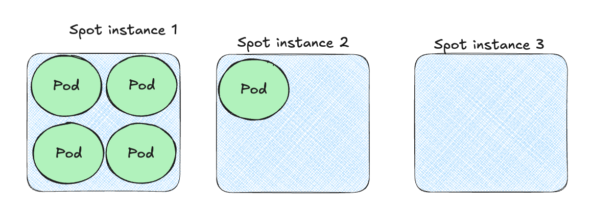

+++
title = 'The Art and Science of Kubernetes Bin Packing'
date = 2025-01-05T13:07:12-08:00
+++

☸️ Kubernetes is a powerful platform for running containerized workloads. It will happily scale your
infrastructure to meet the demands of your applications. Unfortunately, this can get expensive (
especially in the cloud). The goal is to utilize the resources you provision efficiently. In this
post, we'll explore the ins and outs of Kubernetes bin packing 📦, which is one important piece of
the puzzle. We will also show how bin packing interacts without other aspects of optimizing resource
usage.

**“Letting go is even more important than adding.” ~ Marie Kondo**

<!--more-->


Bin packing is the practice of effectively scheduling pods into nodes, so we don't waste unnecessary
resources such as CPU, memory and to a lesser degree local storage. Let's start with nodes.

# 💻 What's in a node? 💻

A node in Kubernetes represents a physical or virtual machine that can host workloads. Each node has
a fixed amount of resources. A cluster typically has multiple nodes that are organized in node pools
where the nodes of each node pool are identical. In the cloud, a Kubernetes cluster will have
a cluster autoscaler component that provisions additional nodes as needed.


## Resource capacity and allocatable resources

Let's check out the instance type of some AWS EKS node

```
❯ kubectl get nodes -o yaml | yq '.items[0].metadata.labels["node.kubernetes.io/instance-type"]'
c7i-flex.2xlarge
```

This node has a capacity of 8 cores, 16 GIB of memory and 20 GiB of local storage.

```
❯ kubectl get nodes -o yaml | yq '.items[0].status.capacity'
cpu: "8"
ephemeral-storage: 20959212Ki
hugepages-1Gi: "0"
hugepages-2Mi: "0"
memory: 16080312Ki
pods: "58"
```

This is what you pay for. But, how much of this capacity is available for your workloads? Let's
check

```
❯ kubectl get nodes -o yaml | yq '.items[0].status.allocatable'
cpu: 7910m
ephemeral-storage: "18242267924"
hugepages-1Gi: "0"
hugepages-2Mi: "0"
memory: 15063480Ki
pods: "58"
```

That's not too bad, actually. We 7.91 cores, 14.36 GiB of memory and 17.397 GiB available for
workloads. The rest is used by the node itself and system components. (OS, kernel, kubelet,
container runtime, etc.)

It's interesting that the ephemeral storage is reported as a string with no unit in the allocatable
section unlike cpu and memory.

The pods field represents the maximum number of pods that can be scheduled on the node. This will
relevant we discuss pod density later.

## System pods

We're not done yet. Kubernetes and the cloud provider run system pods on each node as well some
cluster-wide workloads. These take their share from the allocatable resources:

```
❯ kubectl get deploy -n kube-system
NAME             READY   UP-TO-DATE   AVAILABLE   AGE
coredns          2/2     2            2           289d
metrics-server   1/1     1            1           289d

❯ kubectl get ds -n kube-system
NAME         DESIRED   CURRENT   READY   UP-TO-DATE   AVAILABLE   NODE SELECTOR   AGE
aws-node     2         2         2       2            2           <none>          289d
kube-proxy   2         2         2       2            2           <none>          289d
```

The daemonset pods like `aws-node` (for EKS clusters only) and `kube-proxy` will be scheduled on
each node.
The cluster-wide workloads like coredns (the internal DNS server of Kubernetes) might be scheduled
on
a node you designated for your workloads.

So, it's important to take these system pods into account when calculating the actual available
resources for your workloads.


## Node Shape

The shape of the node is the ratio of CPU to memory. It's important that the node's shape is as
close as possible to average shape of the workload. For example, our node above has a 1:2
shape with 8 cores and 16 GiB of memory (let's ignore for illustration purposes the fact that the
available resources are lower). Suppose all our pods require 2 cores and 2 GiB of memory. We can fit
4 pods on the node, which will use all 8 cores, but only 8 out of 16 GiB memory. We are wasting 8
GiB of memory in terms of bin packing.


This may or may not be a problem because pods are allowed to use more resources than they
requested (when limits > requests). But, from a pure bin packing perspective, it's not optimal.

## But, what about...

I know, I know. The amazing world of Kubernetes has many wonders such as managed node technologies:

- [AWS EKS Automode](https://docs.aws.amazon.com/eks/latest/userguide/automode.html)
- [GKE Autopilot](https://cloud.google.com/kubernetes-engine/docs/concepts/autopilot-overview)
- [Azure AKS Virtual Nodes](https://learn.microsoft.com/en-us/azure/aks/virtual-nodes)
- [Azure AKS Automatic](https://learn.microsoft.com/en-us/azure/aks/learn/quick-kubernetes-automatic-deploy)

These technologies are great and if you use them then you don't have to worry about bin packing, but
they come with various limitations and trade-offs. There are many reasons why you may want full
control over node management. I will mention many of these scenarios later in the post.

Alright, now that we got that out of the way let's move on to the fun stuff.

# ⚙️ Packing pods into nodes ⚙️

This is where the rubber meet the road. How do we pack pods into nodes efficiently? Let's understand
the basics and then cover the gotchas.

## Requests and Limits

Pods in Kubernetes have two resource specifications: requests and limits. These are applied at the
container level. They can be applied to
CPU, memory and ephemeral storage.

```
apiVersion: v1
kind: Pod
metadata:
  name: some-pod
spec:
  containers:
  - name: some-container
    image: some-image:latest
    resources:
      requests:
        cpu: "500m"  # 500 milli CPU (0.5 CPU core)
        memory: "512Mi"  # 512 MiB of memory
        ephemeral-storage: "1Gi"  # 1 GiB of ephemeral storage
      limits:
        cpu: "2"  # 2 CPU cores
        memory: "1Gi"  # 1 GiB of memory
        ephemeral-storage: "2Gi"  # 2 GiB of ephemeral storage
```

For our discussions on bin packing only requests are relevant. I'll cover limits in a future post.

The requests should actually be called "demands" because they represent the minimum amount of
resources the container requires before it can be scheduled on a node. The scheduler will only place
a pod on a node if the node has enough available resources to satisfy the sum of the requests of all
containers across all resources.

Note that a container doesn't have to specify requests for all or any resource. If it doesn't, the
scheduler will assume a request of 0 for that resource.

For each workload the sum of all requests across all resources should be determined by the workload
owners. Once they figured it out, they can use this information to determine which nodes can host
their workload.

Kubernetes 1.32 introduced support (in Alpha) for pod-level resource specification:
https://kubernetes.io/docs/concepts/configuration/manage-resources-containers/#pod-level-resource-specification

When just considering requests the only requirement is that a node has an instance type with enough
available resources to satisfy the requests. If current nodes don't have enough room a new node will
be provisioned by the cluster autoscaler.


## Affinity and anti-affinity

Kubernetes provides a powerful mechanism to control how pods are scheduled on nodes. You can specify
affinity and anti-affinity rules to control where pods are scheduled. For example, you can specify
that a pod should be scheduled on a node that has a specific label or that a pod should not be
scheduled on a node that has a specific label. There are also similar pod affinity and anti-affinity
selectors.

Here is an example for node affinity with two flavors: required and preferred:

```
apiVersion: v1
kind: Pod
metadata:
  name: some-pod
spec:
  containers:
  - name: some-container
    image: some-image:latest
    resources:
      requests:
        cpu: "500m"  # 500 milli CPU (0.5 CPU core)
        memory: "512Mi"  # 512 MiB of memory
        ephemeral-storage: "1Gi"  # 1 GiB of ephemeral storage
      limits:
        cpu: "2"  # 2 CPU cores
        memory: "1Gi"  # 1 GiB of memory
        ephemeral-storage: "2Gi"  # 2 GiB of ephemeral storage
  affinity:
    nodeAffinity:
      requiredDuringSchedulingIgnoredDuringExecution:
        nodeSelectorTerms:
        - matchExpressions:
          - key: "disktype"
            operator: In
            values:
            - ssd
          - key: "zone"
            operator: In
            values:
            - us-west1-a
            - us-west1-b
      preferredDuringSchedulingIgnoredDuringExecution:
        - weight: 1
          preference:
            matchExpressions:
            - key: "cpu-architecture"
              operator: In
              values:
              - amd64
```

In practice, what it means is that a pod can't be arbitrarily placed on any node. Even, if a node
has enough resources to satisfy the pod's requests,
it may not be scheduled there because of affinity or anti-affinity rules.

It is important to make sure that affinity and anti-affinity rules reduce our bin packing due to
poor planning. For example, the pod above can only be scheduled into nodes in zones us-west-1-a or
us-west-1-b. If we currently have a node with enough available resources in us-west-1-c, it can't be
used. A new node will have to be provisioned in one of the allowed zones.


## Pod shape

Another important factor in bin packing is the shape of the pod. This is a similar concept to the
shape of the node, but applied to total the pod's requests. If the pod's shape is close to the node'
s shape, we can pack more pods into the node.

Let's consider some scenarios. For simplicity, let's assume we have a single node pool with nodes of
4 CPU and 16 GiB of memory. Let's assume we have 12 pods that require 1 CPU and 1 GiB of memory.

The node shape is 1:4. The pod shape is 1:1. We can pack 4 pods into the node. We are wasting 12 GiB
of memory per node. We will need 3 nodes to pack all 12 pods. We will fully utilize the CPU, but we
will waste 36 GiB of memory.


But, if we have 12 other pods that require 1 CPU and 5 GiB of memory (shape is 1:5), we can pack 2
pods of each type into a node and fully utilize all its resources.


This is great, but note that it works only if we have the same number of 1:1 and 1:5 pods. If we
have 100 1:1 pods and 10 1:5 pods, we will still waste a lot of memory because we can match only 10
1:1 pods with 1:5 pods and 90 1:1 pods will be left to fend for themselves.

Affinity and anti-affinity rules divides our pods and nodes into isolated groups where the same
considerations must be applied within each group where pods are allowed to be scheduled to specific
nodes.

## Gotchas

Let's consider some gotchas that can adversely affect bin packing.

### Pod density

Nodes have a maximum number of pods that can be scheduled on them. This is often related to
networking concerns as each pod requires an IP address and the node might have a limited number of
IP addresses it can provide. For example, on EKS the m7i-flex.2xlarge instance type can support at
most 58 pods. It has 8 cores and 32 GiB of memory. If you have a lot of small pods that require for
example 50 mCPU and 200 MiB of memory, then you have enough resources for 160 pods (well, less
because not all of it will be available, but you get the idea). However, you can only schedule 58
pods, which means you can't use more than 58 * 50 mCPU = 2.9 CPU cores and 58 * 200 MiB = 11.6 GiB
of memory. The rest will be wasted.

### Pod anti-affinity

We discussed affinity and anti-affinity rules earlier. But, pod anti-affinity rules are used to
spread pods across nodes. This means that even if a node has for multiple pods of the same type,
only one pod will be scheduled on it. Any additional pod must be scheduled on a different node. If
you don't have enough other pods to make up the difference, you will have a lot of wasted resources.

Here is a pod anti-affinity rule that spreads pods across nodes:

```
apiVersion: v1
kind: Pod
metadata:
  name: some-pod
  labels:
    app: some-app  # Add the app: some-app label
spec:
  containers:
  - name: some-container
    image: some-image:latest
    resources:
      requests:
        cpu: "500m"
        memory: "512Mi"
        ephemeral-storage: "1Gi"
      limits:
        cpu: "2"
        memory: "1Gi"
        ephemeral-storage: "2Gi"
  affinity:
    podAntiAffinity:
      requiredDuringSchedulingIgnoredDuringExecution:
        - labelSelector:
            matchExpressions:
              - key: "app"
                operator: In
                values:
                  - "some-app"  # Ensure anti-affinity with other pods having the same label
          topologyKey: "kubernetes.io/hostname"
```          


### Failing or not ready pods

One practical issue is that pods can fail or not be ready for various reasons. This can lead to
false high bin packing. The pod is scheduled on a node, so its requested resources are not
available. But, these resources are not put to use, so they are wasted.


# 🤝 Interaction with other features 🤝

Is 100% bin packing the ultimate goal? Not necessarily. There are other considerations that may take
precedence. Let's explore some of them.

## Workload resource utilization

Congratulations! You have achieved 100% bin packing 🥳! But, all it means is that your pods' requests
match the node's capacity. It doesn't mean that your pods are actually using the resources. If your
pods are not using the resources, you are still wasting them. You should monitor your pods' resource
usage and adjust their requests accordingly. You can use the Vertical Pod Autoscaler to
automatically
adjust the requests based on the actual usage. Unfortunately, the actual usage of many workloads is
volatile, which means 100% resource utilization is often impossible.


## Optimizing startup time

Congratulations! You have achieved 100% bin packing and even 100% resource utilization (as unlikely
as it may be) 🥳! But, now whenever the load increase and the horizontal autoscaler provisions a new
pod this pod will stay pending until a new node is provisioned. This can take several minutes. For
many workloads this is unacceptable. If you have some low-priority workloads you can use the Pod
Priority and Preemption feature to prioritize workloads and ensure that critical workloads are
scheduled first. But, if you want to be sure you may need to provision some extra nodes jsut to be
ready to handle demand spikes.

## Cloud Cost Optimizations

In the cloud there are various ways to optimize costs. They can have an impact on bin packing.

### Spot instances

Spot instances are a great way to save money. But, they can be terminated at any time. In addition,
since everybody loves saving money, the spot market can be quite volatile. This means that you may
not be able to get the spot instances you need when you need them. The solution may be to keep a
larger pool of spot instances than you actually need. This way if some of them are terminated or you
have a demand spike you will have enough resources. This will reduce bin packing efficiency, but
will still be cheaper than using the precise number on-demand instances.



### Reserved instances

You get big discounts for reserved instances that you pay for ahead of time of years to come.
Discounts are in the range of 40%-60% depending on how many years you commit to. That
means that this portion of your resources will be fixed and if you don't need all of it than your
bin packing ratio is going to drop. Since, you naturally anticipate growth it makes sense to reserve
more resources than you need right now in the hopes that you'll be able to use them in the near
future with more users and traffic.

[](images/reserved-instances.png)

## High-availability, reliability and redundancy

For large scale systems high-availability and reliability is a must. Business continuity in the face
of disasters is more often than not a major requirement. There is exactly one way to handle this -
**Redundancy**. When any part of your system fails you need to be able to fail over to an
alternative. This can happen at the pod level, at node level, at the data center level (availability
zone), at the region level and at the cloud provider level. Kubernetes with the help of the cloud
provider and the cluster autoscaler got you covered as far as containers, pods and nodes. But,
beyond that you need to have extra resources available and the robust disaster recovery plan.

If you keep hot (pre-provisioned) spare nodes ready to take over the load in case of an availability
zone failure or regional failure then these nodes will be underutilized most of the time. But, when
the disaster strikes they will be ready to take over the load. This is a trade-off between bin
packing efficiency and high-availability.


Note that autoscaling your capacity from scratch in the fail-over availability zone or region when
disaster strikes, is risky. Failures at this level often impact multiple users that have
their own disaster recovery plans. Now, you all compete for the same resources. You might not even
have the quota to provision the capacity you need. Also, keeping active-active redundant capacity is
great for quickly getting back online after a switchover (no need to wait for capacity to ramp up).

You may choose to run your workloads normally across multiple failure domains and if one failure
domain is down the other should just pick up the slack. These considerations and follow up what-if
analysis is beyond the scope here.

## Node Pool Architecture

Node pools are not a Kubernetes concept. They are a concept of the cloud provider. But, they
determine what type of nodes you can use in your cluster. One of the most important decisions you
will make when designing your Kubernetes cluster is how to organize your nodes into node pools. Your
choice will impact bin packing in profound ways. This topic deserves its own entire blog post.

I'll just mention here that by utilizing multiple node pools with different instance types and node
shapes you have a lot of control over bin packing in addition to many other benefits. But, it also
comes with the burden of managing multiple node pools.

# 🏁 Conclusion 🏁

Kubernetes and cloud providers make it easy to throw hardware (AKA money 💵) at problems. To manage
your costs you should carefully analyze your infra usage. Bin packing is an important metric that
can show you where you live money on the table. But, the story is not that simple. There are many
situations where 100% bin packing is not ideal (high-availability, quick autoscaling, disaster
recovery). In addition, 100% bin packing is just half the battle as your workloads might not use all
the resources they requested.  

