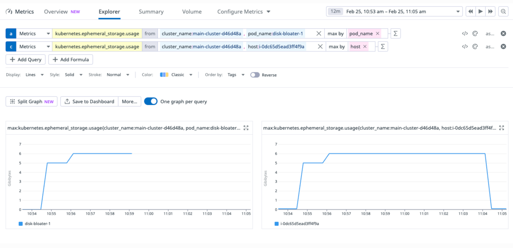
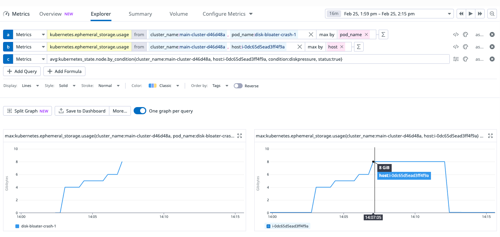

+++
title = 'When Ephemeral Storage in Kubernetes isn`t so Ephemeral'
date = 2025-02-26T08:07:12-08:00
categories = ["Kubernetes", "DevOps"]
+++

Ephemeral storage 📦 is a fancy way of saying temporary storage. In Kubernetes ☸️️, it means storage that is associated
with a pod that disappears when the pod goes away. This is almost true 🤔 as we shall find out soon. We will see
what happens when pods and nodes run out of ephemeral storage ❌ and how to troubleshoot it 🔍.

**“I like the ephemeral thing about theatre, every performance is like a ghost - it's there and then
it's gone” ~ Maggie Smith**

<!--more-->


# 📚 Story Time 📚

At work, we run some workloads that keep web page snapshots in ephemeral storage and eventually
write them to S3. Based on past usage we determined that 5 GiB of ephemeral storage per pod is enough. So, we allowed 7
GiB of ephemeral storage to add a little buffer. We also made sure to use resource constraints (CPU and memory) that
ensure at most 2 pods can fit on a node. We provisioned a 20 GiB disk for this node, so even with images and logs we
should have plenty of space. Guess what? We were wrong ❌! Twice! ✌️

First, our disk usage changed over time, and now we sometimes need more than 7 GiB per pod. Second, it turns out that a
20 GiB disk is not enough for 2 pods that require 7 GiB of ephemeral storage (under certain conditions).

We have a warning alert that triggers when a pod uses 5 GiB of ephemeral storage (still far below its 7 GiB limit). One
day, the alert fired and we also got a kubelet warning event that the pod was evicted because node was under disk
pressure. The evicted pod was using a lot of disk  (6.3 GiB), but still within its limits,

```shell
❯ kubectl describe po browser-148559050 | rg Events: -A 10
Events:
  Type     Reason  Age    From     Message
  ----     ------  ----   ----     -------
  Warning  Evicted 48m    kubelet  The node was low on resource: ephemeral-storage. Threshold quantity: 2146223340, available: 2072712Ki. Container browser-148559050 was using 6632676Ki, request is 1536Mi, has larger consumption of ephemeral-storage.
```

Note that this is just a warning and not an error because from the kubelet point of view it just did its job. The
kubelet doesn't care about your pods. It cares about the node. If a node is low on disk space, it evicts one or more
pods.

# 🐠 Diving in 🐠

Let's look at the node events. There was definitely disk pressure on the node. The kubelet responded by trying to
reclaim some ephemeral storage (see the `EvictionThresholdMet` warning). First, it tried to reclaim node-level resources
like images, but it failed because there wasn't enough disk space eligible to be freed (See the
`FreeDiskSpaceFailed` warning). So, the kubelet was forced to evict pods as we were painfully 🤕 made aware of.

```shell
❯ kd no ip-10-0-38-189.ec2.internal | rg Events: -A 10
Events:
  Type     Reason                 Age                 From     Message
  ----     ------                 ----                ----     -------
  Warning  FreeDiskSpaceFailed    48m                 kubelet  Failed to garbage collect required amount of images. Attempted to free 1953556889 bytes, but only found 289724226 bytes eligible to free.
  Warning  EvictionThresholdMet   47m                 kubelet  Attempting to reclaim ephemeral-storage
  Normal   NodeHasDiskPressure    47m                 kubelet  Node ip-10-0-38-189.ec2.internal status is now: NodeHasDiskPressure
  Normal   NodeHasNoDiskPressure  42m (x3 over 118m)  kubelet  Node ip-10-0-38-189.ec2.internal status is now: NodeHasNoDiskPressure
```

Check out https://kubernetes.io/docs/concepts/scheduling-eviction/node-pressure-eviction to learn more about this
process.

OK, so why was the node under disk pressure in the first place? We have 20 GiB disk, two pods that are limited to
14 GiB between them. The natural next step is to connect to the node and explore its disk usage. Unfortunately,
the node was gone at this point.

That raised the theory that something was wrong with the node itself and as a result AWS replaced it. But, we didn't
have any direct evidence that this is the case. So, we tried to reproduce the situation. Enter Disk Bloater!

# 🛢️ Disk Bloater 🛢️

Disk Bloater is a little tool that lets you gradually use more and more disk space to stress the ephemeral storage
limits of containers and create disk pressure on a node. It works by periodically creating files with arbitrary data.
You configure it with an initial file size (you may want to start with a big bang 💥 and allocate a massive file), a
subsequent file size and interval. The Disk Bloater first allocates the initial file, then creates additional files at
the specified interval..

It is packaged as a Docker container that you can deploy to the cluster. It has a detailed README file that demonstrates
how to use it, as well as how make sure problematic nodes stay alive for further investigation.

Check out the code here: https://github.com/the-gigi/disk-bloater

# 🕵️‍♂️ Finding the Root Cause 🕵️‍♂️

Let's use Disk Bloater to gain some insights. The disk-bloater-1 pod with 7 GiB allocated 6 GiB and then was deleted at
10:59 (see left chart below), but the disk space it allocated was reclaimed by its node only 5 minutes later at 11:04 (
see right chart below)



We conducted a similar experiment where the `disk-bloater-crash-1` pod was configured to allocate more than its 7 GiB
limit. The pod allocated 8 GiB and then marked for eviction (note that the allocation itself succeeded). But, again the
disk space was reclaimed by the node only 5 minutes later.



Here are the pod events

```
Events:
  Type     Reason     Age   From               Message
  ----     ------     ----  ----               -------
  Normal   Scheduled  19m   default-scheduler  Successfully assigned staging/disk-bloater-crash-1 to ip-10-0-51-228.ec2.internal
  Normal   Pulling    19m   kubelet            Pulling image "g1g1/disk-bloater:latest"
  Normal   Pulled     19m   kubelet            Successfully pulled image "g1g1/disk-bloater:latest" in 178ms (178ms including waiting). Image size: 44325797 bytes.
  Normal   Created    19m   kubelet            Created container disk-bloater
  Normal   Started    19m   kubelet            Started container disk-bloater
  Warning  Evicted    14m   kubelet            Pod ephemeral local storage usage exceeds the total limit of containers 7144Mi.
  Normal   Killing    14m   kubelet            Stopping container disk-bloater
```

Now, if a new pod is scheduled to the node after eviction there is a 5 minutes period where the disk space of all 3 pods
is considered used, which can saturate our 20 GiB disk (that is used for images and logs too).

Beyond the 5 minutes delay, the failure to reclaim disk space for unused images is a long-standing open bug.
See https://github.com/kubernetes/kubernetes/issues/71869

# 🛠️ The Fix 🛠️

The fix was simple - bump the disk size and the ephemeral storage requests and limits. The cost is about $2 per month /
node. We already have an alert when the ephemeral storage by a pod crosses a certain threshold, so we're ready to
adjust the disk size again if needed.

# 🏡 Take home points 🏡

- A container can exceed its ephemeral storage limit. But, it will be evicted shortly after.
- On AWS EKS there is a 5 minutes delay when reclaiming ephemeral storage of deleted or evicted pods.
- Sometimes you need to build tools to troubleshoot hard to reproduce scenarios.
- It's a good form to understand why something fails before applying heavy-handed measures blindly (e.g double the disk).
- Ephemeral storage on Kubernetes and in the cloud has some gotchas.

Until next time... 🤗

