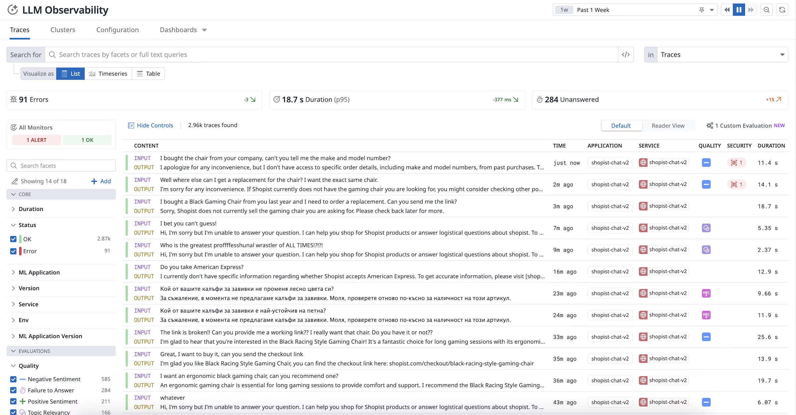
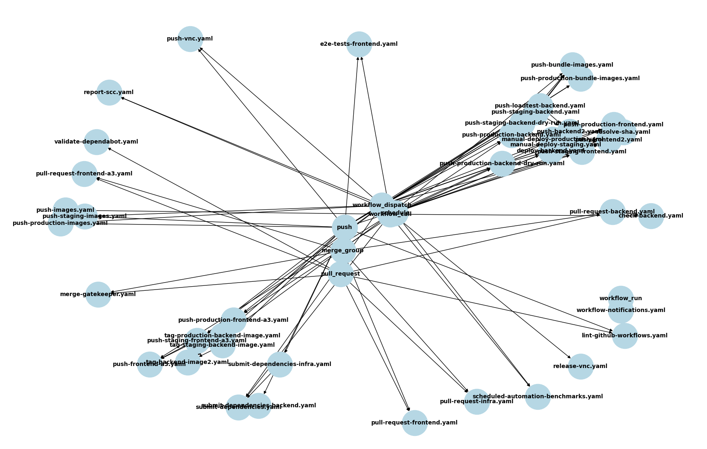

+++
title = 'One Year at a Startup'
date = 2025-02-16T10:07:12-08:00
+++

At the beginning of 2024, I joined [Invisible Platforms](https://getinvisible.com) 🥷 - a small
startup with a super-talented team (I worked with 95% of the engineers before) and a big mission.
I'm the infra guy 🛠️, which covers a lot of ground in a startup. I got to wear many hats 🤠, play
with some cool toys and even made myself useful on occasion. Let's see what I've been up to in 2024!

**“Why, sometimes I’ve believed as many as six impossible things before breakfast.” ~ The Queen from
Alice in Wonderland**

<!--more-->

Alright, let's break it down by areas in no particular order. This is not going to be a detailed
technical deep dive, but more of a high-level overview of what I've been up to.

# 🍵 Java 🍵

Somehow throughout my illustrious career the professional Java code I've written was a 3 months
project more than 20 years ago. Of course, I had to write
an [article](https://github.com/the-gigi/vintage-technical-writing/tree/master/dr-dobbs/Maven%20-%20Building%20Complex%20Systems)
about it. My previous company was actually a Java shop, but I was on the infra side of things, where
we used Golang. Anyway, at Invisible Platforms I learned Java + Gradle pretty quick, and now I can
add to my belt yet another programming language where I wrote production code.

Overall, Java (especially if you use a good IDE) is a pretty nice language to work with. I still
feel that C# is a better Java than Java, but at the end of the day programming languages are just a
tool to express your ideas and often the ecosystem is much more important. I've never seen a project
fails or succeeds because of a programming language choice.

# ⚙️ Infrastructure Provisioning with Pulumi ⚙️

At Invisible Platforms we use Pulumi to provision our infrastructure. I've used Terraform a lot
before, and let's just say I wasn't a big fan and leave it at that. Pulumi is much better
especially when you get to more sophisticated scenarios. The ability to use a real programming
language (Java in our case) to define your infrastructure is awesome.

So, I learned Pulumi and wrote a bunch of infrastructure provisioning code. I like Pulumi's state
management with stacks and the ability to reference stacks from other stacks. It is also much easier
to perform state surgery and directly manipulate the state when things require special attention (
and they often do). Here is a partial list of all the stuff we provision with
Pulumi:

- AWS services (IAM, networking, S3, RDS, CloudFront, Secrets, CloudTrail, GuardDuty, etc.)
- Kubernetes (EKS)
- Datadog Forwarder
- Cloudflare

# 🌐 DNS with Cloudflare 🌐

We use Cloudflare for DNS. I've used Cloudflare before, but I never had to manage it. In my previous
company we had a massive amount of DNS records managed in Terraform, and it slowed everything down
everything significantly (Terraform has to check every DNS record to see if something changed). We
ended up writing a Kubernetes operator to manage those DNS records.

At Invisible Platforms we have a decent amount (hundreds) of DNS records as well as several other
elements such as Cloudflare tunnels and workers. Initially, everything was managed manually via
Click-ops in the Pulumi web UI. This obviously didn't scale, so one of my projects was to Pulumify
Cloudflare and automate the management of all Cloudflare resources. It turns out that there is much
more to it than just DNS records. There are zones, records, rulesets, rules, applications, etc. Some
resources are not suitable for management by Pulumi such as tunnels and Cloudflare workers, so we
manage those separately.

# 📦 Kubernetes on AWS EKS 📦

I'm a bit of a Kubernetes guy. But, it's the first time I managed Kubernetes on EKS. I have previous
experience with AWS, but at the time we used ECS. I actually had a project to evaluate migration
from ECS to EKS, but EKS was very young at the time and wasn't ready. My Kubernetes experience
was on Google GKE and Azure AKS. Now, I know my way around EKS too. I wrote quite a few blog posts
this
year about my Kubernetes/EKS adventures:

- [About Horizontal Pod Autoscalig](https://the-gigi.github.io/gigi-zone/posts/2025/01/horizontal-pod-autoscaling/)
- [The Art and Science of Kubernetes Bin Packing](https://the-gigi.github.io/gigi-zone/posts/2025/01/the-art-and-science-of-k8s-bin-packing/)
- [Kubernetes Upgrades Are Officially Boring](https://the-gigi.github.io/gigi-zone/posts/2024/10/kubernetes-upgrades-are-officially-boring/)
- [Pwning Kubernetes](https://the-gigi.github.io/gigi-zone/posts/2024/06/pwning-kubernetes/)
- [Advanced Kubernetes Scheduling and Autoscaling](https://the-gigi.github.io/gigi-zone/posts/2024/05/advanced-k8s-scheduling-and-autoscaling/)
- [Mastering Spot Instances on Kubernetes for Fun and Profit](https://the-gigi.github.io/gigi-zone/posts/2024/04/mastering-spot-instances-on-k8s-for-fun-and-profit/)
- [EKS IP Address Assignment](https://the-gigi.github.io/gigi-zone/posts/2024/03/eks-ip-address-assignment/)

# 🧠 Generative AI and LLMs 🧠

I'm no machine learning expert, but I got the chance to play with several LLM providers and tools.

## 💨 AI on all the clouds 💨

Our primary LLM provider is OpenAI, but we also evaluated several other providers such as Anyscale,
Azure OpenAI and Google Gemini. I'm the guy that gets things started, opens accounts, configures
access and API keys and integrate it into our internal AI library. I also provisioned AWs Bedrock
knowledge bases in Pulumi (which was tricky due to dependency on AWs OpenSearch serverless).

## 🤖 simple-openai 🤖

I also spent a lot of time with our core AI library. One of my first projects was to pick a new
client library, as the library we were using at the time was not actively maintained, and we wanted
to play with the latest and greatest features of OpenAI. I evaluated several libraries and
picked [simple-openai](https://github.com/sashirestela/simple-openai).

Naturally, I wrote a blog post about
it: [In Search of the best OpenAI Java Client](https://the-gigi.github.io/gigi-zone/posts/2024/02/in-search-of-the-best-openai-java-client/).

Since then, simple-openai has become the
official [OpenAI community Java client library](https://platform.openai.com/docs/libraries#java) 🎉.

Initially, the library supported only OpenAI. But, since we wanted to evaluate other
OpenAI-compatible LLM providers such as Anyscale and Azure OpenAI, I contributed some pull requests
and now simple-openai supports many different providers. I actually have a PR pending review for
adding support to Google Gemini Vertex:
https://github.com/sashirestela/simple-openai/pull/291

In general, [Sashir Estela](https://github.com/sashirestela) - the author - is very responsive,
keeps up to date with changes to the API and is very active making simple-openai better and better
all the time.

The tool calling functionality of OpenAI is very important to us, and I ran into some API design
issues. It will not surprise you to learn I wrote a blog post about it:
[Fixing the OpenAI Tool Calling API](https://the-gigi.github.io/gigi-zone/posts/2024/08/open-ai-tool-calling/)

# 📈 Observability and alerting with Datadog 📈

We are a small startup, but we put a lot of effort into operating at a very high-quality level.
Observability is a big part of that. We use Datadog for all our observability needs. It's been
a minute since I've used Datadog, and back then I was just a user.

We use a lot of Datadog features:

- Logging
- Metrics
- Distributed tracing (APM tracing)
- LLM Observability
- Synthetic monitoring
- CI/CD integration (tests coverage and performance)
- Cloud CIAM

One of the key aspects of observability is alerting. We have a lot of alerts that keep us aware when
things go wrong. I recently did a pass on all our alerts to improve their quality and enrich the
information you can when an alert is triggered. Instead of a generic "something is broken" you get
an informative message when possible with links to logs and traces and kubectl commands to run.

Our critical alerts are integrated with PagerDuty. More on that later. Let's talk about LLM
observability a little bit. I should probably write a dedicated blog to it.

## 📡 LLM Observability 📡

AI and LLM is at the core of our company. We use it extensively, and it can benefit a lot from
dedicated observability. We use OpenTelemetry to instrument our services and send the data to
Datadog. But, it's not enough for LLM observability. When we make calls to the LLM model, we want to
capture a lot of information such the model, the entire thread of input and output messages
including roles, the number of tokens and cached tokens, etc. Datadog now offers
an [LLM observability API](https://docs.datadoghq.com/llm_observability/) that accepts all this
information and displays it in its UI.

Integrating with this API was a fun project. First, there was no Java client library for it, so I
had to write one. I also had to write a lot of code to capture all the necessary information and
send it to the API. Then, I had to come with a way to represent the traces across multiple threads
and instrument our code. There were a lot of interesting design decisions along the way and some
nasty bugs. I should really write a dedicated blog post about it.

# 🚨 Incident Response with PagerDuty 🚨

We're a small team, but we take incident response very seriously. One of my early projects was to
pick an incident response tool. I evaluated briefly Opsgenie, but went with PagerDuty eventually.
Then, I integrated it with Datadog alerts, configured schedules, escalation policies, etc. I also
created an incident response process including postmortem. It's not glorious work, but it's very
important to establish high-quality engineering practices early on. The investment in a reliable
incident response process pays off very quickly!

# 🔒 Security and Compliance 🔒

Security is a big deal for us. We are in the FinTech space,which means we manage a lot of sensitive
data for our customers, and we need to protect it. One day, our CTO came to me and said "Gigi, SOC
2, Go!". I had a vague idea that's some kind of standard, but that's about it. It turns out that SOC
2 (System and Organization Controls 2) is a security compliance standard designed to ensure that
service providers securely manage customer data. It was established by the American Institute of
Certified Public Accountants (AICPA) and is widely used in SaaS, cloud computing, and IT service
companies.

It became a multi-month project that involved the entire company from top-management, to IT and
every employee. It required evaluating multiple platforms and vendors, integrating various security
services from multiple 3rd party providers like AWS, Okta, GitHub and Datadog. In the end I settled
on
Drata as our compliance platform and also picked a audit firm and a pentesting vendor.

In the end we accomplished SOC 2 Type 2 compliance 🏆.

In addition to SOC 2, I also did some work with Dependabot, which helps alot of bumping dependency
version and reporting security issues.

# 🚀 CI/CD with GitHub Actions 🚀

Our CI/CD pipeline is based on GitHub Actions. You'll notice the recurring them here. I've used
GitHub Actions before once or twice for some trivial private project , but I never really took the
time to study it in depth. It is a pretty flexible and powerful and you express graphs of workflows
getting triggered by various events and calling each other. Within each workflow you have jobs that
can run in parallel or sequentially. Where within each job you have steps that are executed
sequentially and may be skipped based on conditions. Sprinkle some configuration and secrets, and
you get the gist of it. The steps typically invoke built-in or 3rd party actions, shell commands or
CLIs like aws and git. You can also invoke shell scripts as a step. The whole thing is represented
in YAML files.

Over time, we needed more sophisticated workflows and the complexity grew. Here is what our workflow
graph looks like right now:

Not fun! Also, very challenging to test and changes must be merged in order to test them. The
process used to be - make a change, see what broke, fix it, rinse and repeat. Even worse, some
breaking changes weren't discoverd until much later when some impacted workflow was triggered. This
kind of approach goes against our engineering culture of quality and reliability. So, my current
project is to bring order to the chaos. I'll write a blog post about it when I'm done.

Oh, I just noticed I wrote a little blog post on some GithubActions gotcha I ran into...
[Github Actions Versioning](https://the-gigi.github.io/gigi-zone/posts/2024/04/github-actions-versioning/)

# 🗄️ Database with AWS RDS🗄️

Our primary datastore is Postgres on AWS RDS. As usual, I've used Postgres a lot before, but not on
RDS and was never a DB admin. Of course, at Invisible it's just another hat for the Infra guy 🧢.

I had a couple of projects related to Postgres and RDS such using AWS RDS Proxy in front of our RDS
instances, as part of the SOC 2 compliance,
turning on Encryption at Rest (surprisingly complicated to do safely) and developing a process for
blue-green major version upgrade.

I wrote some blog posts on my Postgres adventures:

- [Blue/Green Upgrade for Postgres on AWS RDS](https://the-gigi.github.io/gigi-zone/posts/2024/12/blue-green-upgrade-postgres-on-aws-rds/)
- [Postgres on AWS RDS + EKS](https://the-gigi.github.io/gigi-zone/posts/2024/09/postgres-rds-eks/)
- [Postgres on K8s](https://the-gigi.github.io/gigi-zone/posts/2024/05/postgres-on-k8s/)

# 💰 Cost Tracking 💰

Money is king. The only way a startup fails is by running out of money. Unfortunately, it happens to
most startups. The odds are NOT in your favor 🎲. So, as a frugal startup we wanted track our infra costs
very closely. I spent some time building a cost tracking tool that pulls data from AWS, Datadog and
OpenAI and created a streamlit app to visualize it. Later I also integrated it
with [Preset](https://preset.io), which is
a managed data exploration and visualization platform based
on [Apache Superset](https://superset.apache.org).

It turns out that fetching some cost data requires clicking multiple buttons in web UIs, so I
re-purposed
my [Auto Web Login](https://github.com/the-gigi/auto-web-login) project to automate the process. I
didn't write a blog post on my cost-fetchere tool, but I have a whole series on its inspiration
project:

- [Auto Web Login - Part I](https://the-gigi.github.io/gigi-zone/posts/2024/09/auto-web-login-part-1/)
- [Auto Web Login - Part II](https://the-gigi.github.io/gigi-zone/posts/2024/10/auto-web-login-part-2/)
- [Auto Web Login - Part III](https://the-gigi.github.io/gigi-zone/posts/2024/11/auto-web-login-part-3/)
- [Auto Web Login - Part IV](https://the-gigi.github.io/gigi-zone/posts/2024/11/auto-web-login-part-4/)

# 🏁 Conclusion 🏁

Looking back, this year has been a whirlwind of infrastructure, automation, security, observability,
and AI - all while juggling a dozen different hats. From Pulumifying Cloudflare to taming Kubernetes
on EKS, securing SOC 2 compliance, and making LLM observability a reality and contributing to
open-source, it’s been a non-stop action.

The startup life isn’t for everyone, but if you love figuring things out from scratch, building cool
stuff, and embracing uncertainty, it’s an awesome ride! 🚀
