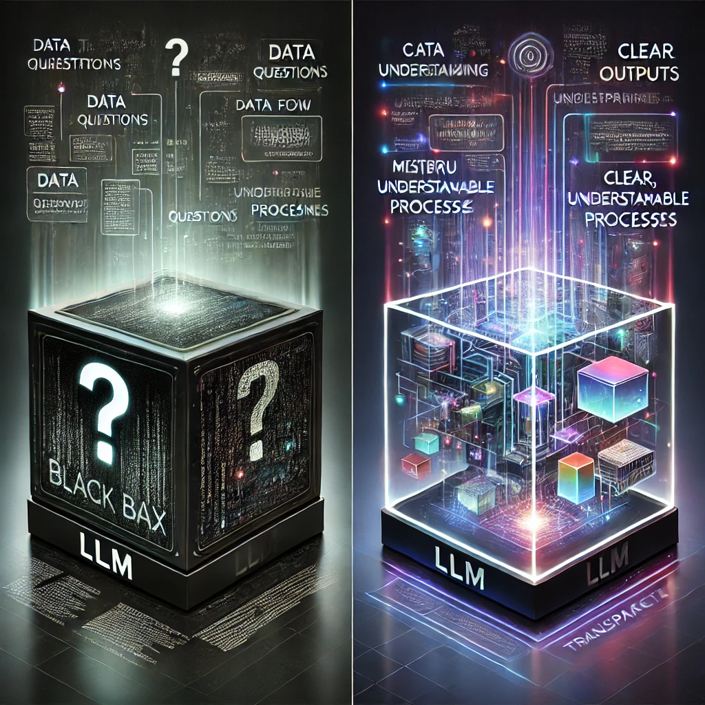
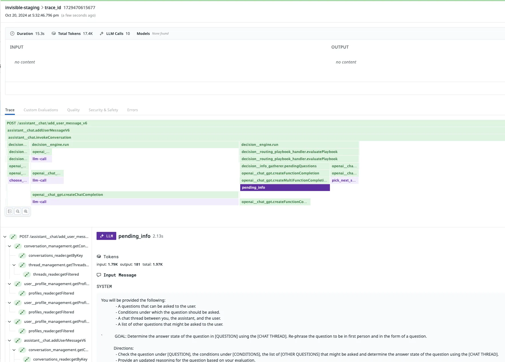
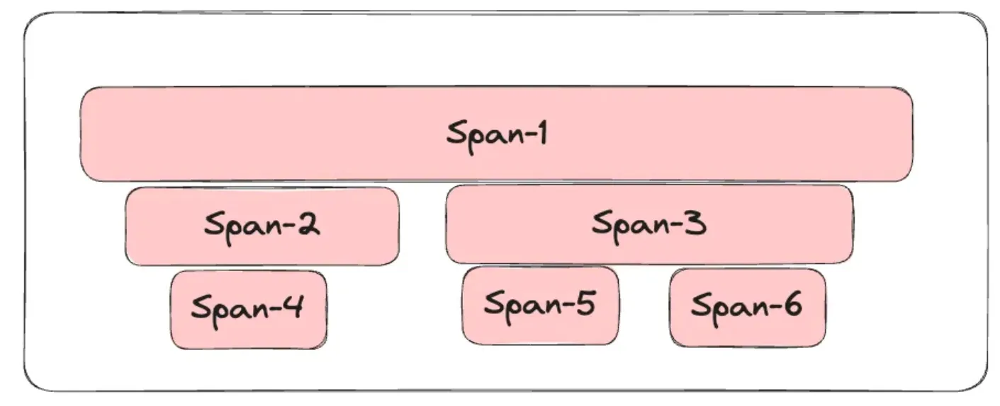
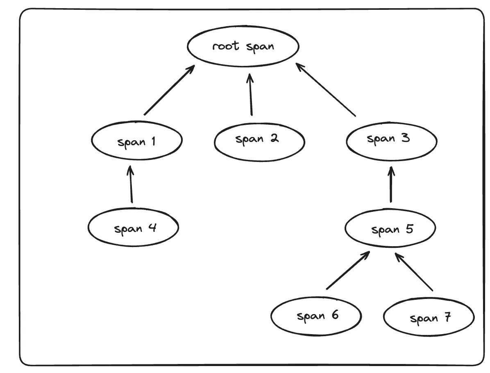
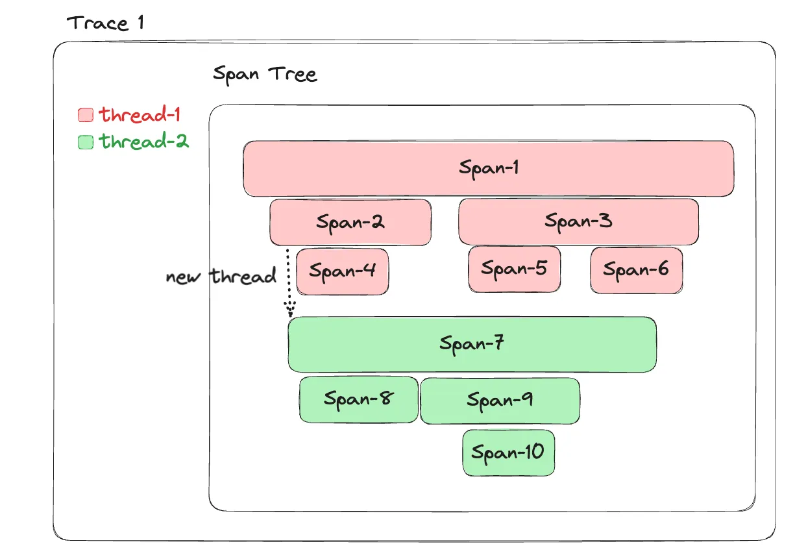
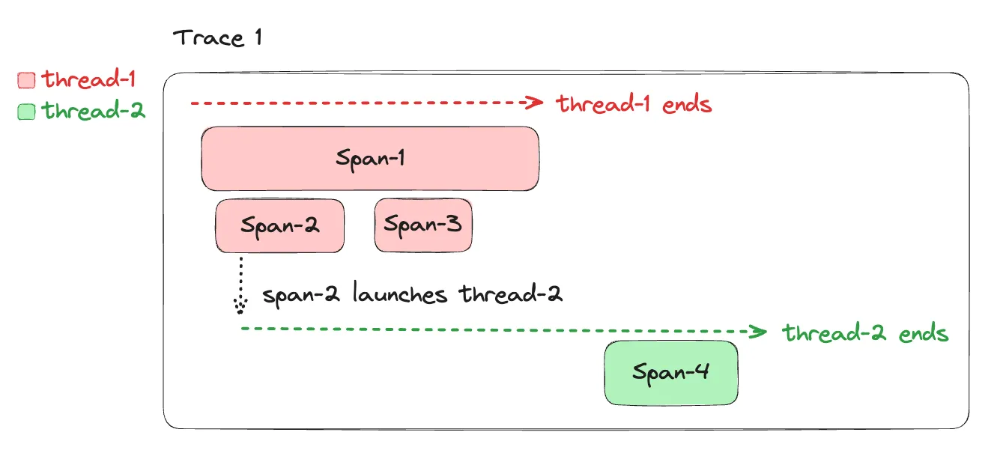
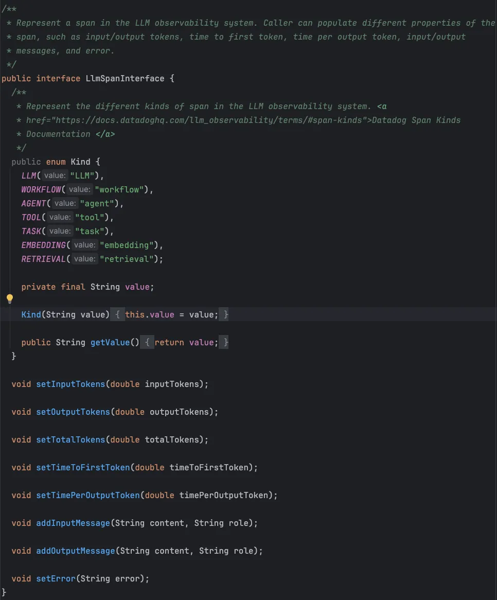
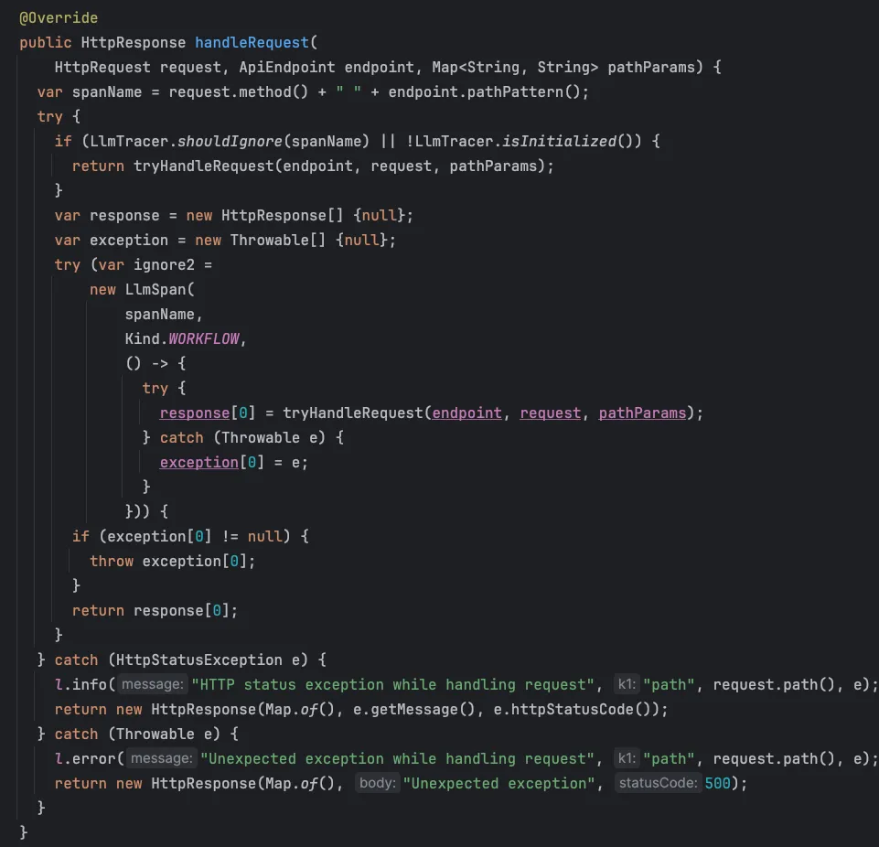
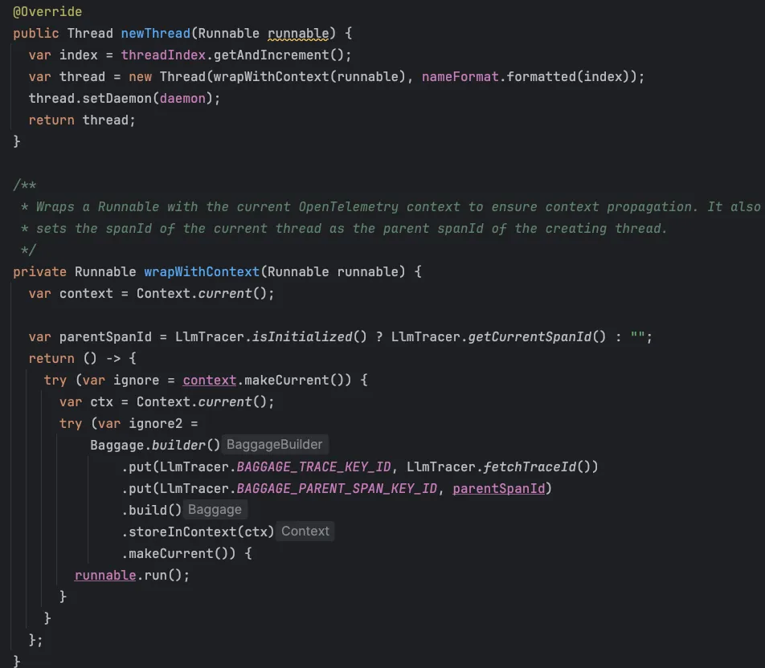

+++
title = 'From Black Box to Glass Box: LLM Observability in Action 🚀'
date = 2025-03-23T08:11:17-08:00
+++

Observability 🔭 is table stakes for any serious system. But, when you throw GenAI and LLMs into the mix it is no longer
just nice to have. That’s the game at [Invisible](https://getinvisible.com), where we’re wrangling LLMs in our
multi-agent web automation platform on the daily. Let’s pop the hood and see how we made the leap from **black box** 🤷
to **glass box**🔎 with LLM Observability. Designing, building and integrating LLM observability into our stack was one
of my favorite projects at Invisible.

**“Without data, you’re just another person with an opinion.” ~ W. Edwards Deming**

<!--more-->



## 🧠 LLMs @ Invisible 🧠

At the core of our platform is
a [multi-agent system for web automation](https://getinvisible.com/articles/human-inspired-agent-design-in-web-automation)
that leans hard on LLMs. Debugging these agents and troubleshooting LLMs is not for the faint of heart ❤️. Sure, we’ve
got logs, metrics, and distributed traces ✅. But when your AI starts hallucinating 🫠 or goes rogue... that stuff just
isn’t enough.

## 🕸️ Distributed Tracing 101 (And Why It Falls Short) 🕸️

Distributed tracing is awesome... *for microservices*. You get request paths, spans, timings, and can figure out why
your API call took 3 seconds instead of 30ms. Tools like OpenTelemetry, Jaeger, and Zipkin make this easy (we use
OpenTelemetry).

Agent-based GenAI systems require a whole other level of tracing. They’re non-deterministic, context-sensitive, and
their outputs depend on all kinds of weird prompt engineering voodoo 🪄. Traditional traces can tell you *where* an LLM
call happened, but not *why* the model answered the way it did, or whether it made something up 👻.

## 🐕 Datadog LLM Observability to the Rescue 🐕

This is where [Datadog LLM Observability](https://www.datadoghq.com/product/llm-observability/) comes in. It’s
purpose-built to crack open the LLM black box. You can track:

- 📝 Prompts + completions
- 🕰️ Latency + token usage
- 📈 Quality metrics (toxicity, relevance, hallucination rates)

It also plays nice with **Datadog APM + Logs**, so you can connect your LLM’s behavior to your infra health, user
actions, and backend systems. Now you can *see* when your LLM starts to misbehave or when response times go sideways 💸.
You can drill all the way down to individual prompt-response cycles.

Here is the end result. You can see the entire trace with multiple spans, where the LLM calls are purple and contain a
lot of LLM-specific info.



## 🏗️ Building LLM Observability @ Invisible 🏗️

Let's start with some concepts and take it from there.

### 🏷️ Terminology and concepts

#### 📍 Instrumentation Points

Instrumentation Points points are locations in the code that we want to show up in distributed traces as well as LLM
traces. Obvious locations are entry points into the system such as EST API endpoints, but there are also many internal
important junctions in the code that we want to keep track of. For LLM observability traces we want to instrument any
LLM call as well.

#### 🔋 Workloads

In the Invisible Java codebase a **workload** is a pair of a Java interface named **XXXWorkload** extending the
**Workload** interface and a Java class named XXX that implements the **XXXWorkload** interface. The methods of a
workload are treated as instrumentation points. There is an elaborate machinery (via Guice injection) to intercept
every method call of workload classes and automatically start an OpenTelemetry span that ends when the method exits.
This is great for a few reasons:

1. Engineers don't have to remember to start and end every span in every workload method
2. All workload methods will always be traced (automated instrumentation)
3. The code is not cluttered with OpenTelemetry boilerplate code
4. It's easy to tweak the granularity of traceability. Just make a class a Workload class and you got full traceability.

We will piggyback on this for LLM observability.

#### 🔹 LLM Span

An LLM span is similar to a standard OpenTelemetry span in the sense that it has a start time and a duration. But, it
addition it carries a lot of additional LLM-specific information such as the span kind (LLM call, Agent, Workflow,
Task), input and output messages, input tokens, output tokens and time to first token. Each trace point of LLM
observability will be represented by an LLM span.

Here is an example:

```json
{
  "parent_id": "6666666",
  "trace_id": "12345",
  "span_id": "777777",
  "name": "health_coach_agent",
  "meta": {
    "kind": "agent",
    "input": {
      "value": "What is the weather like today and do i wear a jacket?"
    },
    "output": {
      "value": "It's very hot and sunny, there is no need for a jacket"
    }
  },
  "start_ns": 1713889389104152000,
  "duration": 10000000000
}
```

#### 🌲 Span Tree

A span tree represents the hierarchical structure of multiple LLM spans, potentially spanning across several threads.
A multi-threaded span tree is composed of multiple span sub-trees that belong to a single thread. A single
threaded sub-tree has the pleasant property where each parent span (including the root span of this sub-tree) fully
contains its child spans in chronological order, and no two sibling spans overlap in time. Below is an example of such a
single-threaded
sub-tree.



However, span tree nodes don’t actually have a list of children. Each node only has a parent link. There is no way to
traverse the tree from the root to the leaves, or more generally from any node to its children. Fortunately, there is
never a need to traverse the tree, otherwise we would be in trouble 🙂



The reason parent links are enough is straightforward: it’s the structure required by the Datadog LLM observability API.

When you've collected some LLM observability data (more on that later) you send a list of spans to Datadog where each
span has a trace id, a span id and a parent id (as well as additional fields unrelated to the span hierarchy).

See https://docs.datadoghq.com/llm_observability/setup/api/?tab=model#span

#### 🧵 LLM Trace

An LLM trace is a span tree with a specific trace id and a set of current nodes. Each thread has its own current node.
When the trace is created it contains only the root span, which is of course the current node. When a new span is
started in an existing trace, its parent link will point to the current node of its thread and then the new node will
become the current node of this thread.



#### 🧬 Parent-child relationships across threads

When a new thread is created from a parent thread with a live thread, the span of current node of the parent thread is
stored as the future parent span of the first span in the new thread that may be created later asynchronously after the
parent span was completed.

In the diagram below, **span-2** in **thread-1🟥** creates **thread-2🟩** and carries on with its business. Eventually,
**span-2** completes and even **span-1** - the root span of the trace - completes and the entire original **thread-1🟥**
completes. Later, a new span **span-4** is created in **thread-2🟩**. Its parent is **span-2** of **thread-1🟥** (both
of them no longer among the living). That’s fine. The LLM tracer keeps the trace alive and remembers the original parent
span (**span-2** in this case) and sets it to be the parent of **span-4**.



Alright, let's move on to the design of the Async LLM tracer system

### 🧩 Async LLM Tracer Components

The LLM observability solution is composed of multiple components and also required some non-trivial refactoring of the
core of the Invisible backend.

#### 🔌 The LLM Span Interface

This interface allows application/platform code to populate an LLM span after an LLM call with information like token
counts, input/output messages and error.



#### 🕵️‍♂️ The LLM Observability Client

As you recall, we need to eventually send all the LLM observability data to Datadog. Unfortunately, Datadog provides
only Python and NodeJS SDKs. So, I implemented a Java client that can talk to the Datadog LLM observability REST API and
send it traces. It is implemented by using [Retrofit's](https://square.github.io/retrofit/) auto-wrapping of REST APIs.

It is only used by the LLM tracer.

#### 🔍 The LLM Tracer

The LLM tracer is the big dog 🐕‍🦺 . It has multiple responsibilities. It tracks all active traces in the system and
provides
utilities to generate trace IDs, retrieve the current trace ID, and access both the parent thread’s span ID and the
active span for the current thread—leveraging OpenTelemetry context baggage.

It also runs a scheduled task every X minutes to export traces that are considered complete and stable. This accounts
for async behavior, where new spans might be added long after the root thread’s span tree appears finished. More on that
later.

### 🔹 The LLMSpan class

The **LLMSpan** class is responsible for the entire lifecycle of a single span from start to finish. It implements the
[try-with-resource](https://docs.oracle.com/javase/tutorial/essential/exceptions/tryResourceClose.html) pattern, but due
to complicated issues of OpenTelemetry scope nesting, it completes the entire life cycle in the constructor.

It takes a Runnable code block as input, starts a new LLM span, sets up a new OpenTelemetry context and stores all the
necessary LLM tracing book keeping data in the baggage, where it will be available for the code block running in the
scope of this OpenTelemetry context. Then, when the code block finished running it ends the span and when the
constructor finishes the previous OpenTelemetry context becomes active again.

### 📐 Async LLM Tracer Design

Let's take a deepr look into some aspect of the design and integration with the existing OpenTelemetry machinery.

#### 👶 Where Do ~~Babies~~Traces Come From?

LLM Traces are born when a span is started for the first time in a thread that wasn’t spawned from a context that
already has a trace (otherwise the new span is just added to the existing trace). This can happen in two places in the
code:

1. HTTP request handling
2. Independent Workload method interception

This task is pretty gnarly, but it is centralized and sets up granular LLM traceability for the entire system. Here is
the relevant code in the `MethodDelegateRequestHandler`class, which is called to handle any HTTP request.

It creates a new **LLMSpan** instance and passes it the code block that calls **tryHandleRequest()**. The response and
exception (if any) are captured and stored in the response and exception arrays (must be effectively final). Then, after
the LLMSpan constructor returns in the try-with-resource main block it simply returns the captured response or throws
the caught exception.



### 📡 Propagating Trace IDs Across Async Calls

Within the same thread the LLM trace id is always available thanks to the OpenTelemetry context and its baggage. But,
the context doesn’t automatically propagate to new threads. The LLM tracer design requires that spawning new threads
will always go through our internal **executors** package. I extended this package as part of the LLM observability
project to propagate the active span of the spawning thread as discussed earlier. Here is the code:



OK. You can relax 😌. No more code. I promise.

### 🛰️ Sending traces to Datadog

Eventually, we need to send the traces to Datadog. Due to nuances of the Datadog LLM observability REST API we must send
complete traces to Datadog and can’t send children spans as they complete.

This means that for async traces we can’t wait forever and we need to decide at some point that the trace is complete.
The LLM tracer runs a task every minute and scans all the traces. If a trace was dormant (complete and no span ended
for X minutes) then it is sent to Datadog using the LlmObservabilityClient and the trace is removed from the managed
trace list. If a span is added later to the same trace it will start a new trace and will not be united with the
original trace on Datadog 🤷‍♂️.

## 🏁 Final words 🏁

That was a super fun project 🎉. I had to balance several intricate concerns and come up with solutions that integrate
seamlessly into our existing architecture. I learned a lot and our engineers put it to good use every day. I also ran
into a very pernicious bug 🪲, which makes a great war story, but I'll save it for another day.

Kwaheri marafiki zangu! 🇰🇪


