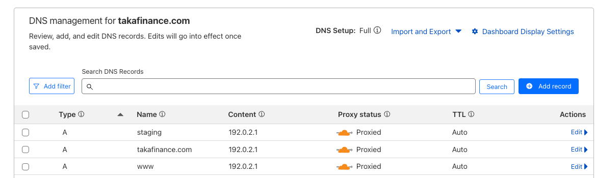

+++
title = 'DNS, Cloudflare Workers and Framer!'
date = 2025-03-15T08:07:12-08:00
+++

Everything on the internet starts with [DNS](https://en.wikipedia.org/wiki/Domain_Name_System) 🌐, so it's kinda
important ⭐. Cloudflare is one of top DNS providers and it offers the unique capability of intercepting any HTTP(S)
request right after DNS resolution and mess around with it 🚀. Let's see how this works and how we have used it
effectively at [Invisible](https://getinvisible.com) to handle elegantly a thorny issue with a 3rd party provider.

**“It’s not DNS. There’s no way it’s DNS. It was DNS” ~ Every network engineer, ever**

<!--more-->


## 🖼️ Bring your own domain to Framer 🖼️

We use [Framer](https://www.framer.com) to design, build and deploy landing pages and static pages for our products (
e.g. takafinance.com). It's great for non-engineers to design and create rich web sites. Our setup is to manage the
static parts in Framer, where our designers can iterate and evolve the design without support from engineers and then
the dynamic part is a React/typescript web application. Note that Framer is not just a design tool, it hosts the
websites you design.

This works great for clear division of responsibilities between designers and engineers, but there is this sticky part
of accessing the Framer sites from your browser. Framer provides for each project (website) an auto-generated URL
like https://weird-name-123456.framer.app. There is also an option for a free custom sub-domain like
`<your domain>.framer.website`.

We obviously want our users to access our websites and products though our own domain names. Now, Framer allows
connecting your own 3rd party domain. The configuration is pretty elaborate (
see https://www.framer.com/help/articles/how-to-connect-a-custom-domain/) and we had to handle multiple auxiliary issues
like redirecting from HTTP to HTTPS and from the root domain to www. It took awhile to figure it out, but eventually we
got it under control. We had a well-documented process to configure Cloudflare and Framer with our own domains.

## 🚫 Framer and Clickjacking 🚫

Then we discovered that Framer is susceptible to [clickjacking](https://en.wikipedia.org/wiki/Clickjacking) attacks.
Clickjacking is a malicious technique to lure users to click on things they're not supposed to. I won't get into too
much detail here. The important thing is that you protect against Clickjacking by adding some HTTP headers to every HTTP
response.
Easy peasy 🫛, right?. Well, guess what? Framer doesn't do it and doesn't want to do it. Their answer? On static pages it
can't do much harm and if you care so much just use a reverse proxy.

There is an old [community thread](https://www.framer.community/c/requests/custom-http-headers) with no response from
Framer - kind of ironic.Isn't it?

Well, that was unacceptable to us. But, we didn't want to drop Framer, so we had to come with a solution. Enter
Cloudflare workers!

## 👷 Cloudflare Workers 👷

[Cloudflare Workers](https://workers.cloudflare.com) are a general-purpose serverless platform that runs lightweight
code at Cloudflare’s edge network, enabling developers to deploy applications, APIs, and custom logic closer to users
for low-latency performance and scalability without managing infrastructure.

For our purpose, they can intercept any HTTP(S) request immediately after DNS resolution, allowing you to modify
requests, route or redirect them, and alter responses before they are sent back to the client.

Cloudflare is unique in this respect that other CDN providers that offer similar functionality, but only for requests to
CDN contents.

## 🦜 Killing Two Birds with one Cloudflare Worker 🦜

I hope I don't get in trouble for using the
expression ["Killing two birds..."](https://youtu.be/NBGOryiqZZI?si=-eNX-7auZ3TG9hG8&t=115) :-)

Anyway, I built a Cloudflare worker called "framer-gateway-worker". It performs two functions:

1. Routes from our URLs directly to Framer URLs (users never see the Framer URLs)
2. Add the proper HTTP headers for Clickjack protection before returning the responses from Framer to the users.

Let's see how it works. The Cloudflare worker code is a simple Javascript program that listens for the "fetch" event and
calls the `handleRequest()` function.

```
addEventListener('fetch', event => {
  event.respondWith(handleRequest(event.request))
})
```

It also has a map for redirecting from our domain names to the porper Framer URLs

```
const hostnameMap = new Map([
  ['getinvisible.com', 'broader-memory-661481.framer.app'],
  ['www.getinvisible.com', 'broader-memory-661481.framer.app'],
  ['staging.takafinance.com', 'rejuvenated-pentagon-519952.framer.app'],
  ['takafinance.com', 'takafinance.framer.website'],
  ['www.takafinance.com', 'takafinance.framer.website']
])
```

The handleRequest() first modifies the request target URL by replacing the original hostname with the Framer URL from
our hostname map,

```
async function handleRequest(request) {
  const url = new URL(request.url)
  if (hostnameMap.has(url.hostname)) {
    url.hostname = hostnameMap.get(url.hostname)
  }

  const newRequest = new Request(url.toString(), request)
  const response = await fetch(newRequest)
```  

Once the response is received, it replaces mentions of `framer.website` with `.com`, so to users it appears they
received reponse from our domains. For example, `takafinance.framer.website` will become `takafinance,com`.

```
let html = await response.text();

html = html.replace(/\.framer\.website/g, ".com");
```

Then, it adds the Clickjack protection headers and returns the modified response

```
const modifiedResponse = new Response(html, response)
modifiedResponse.headers.set('Content-Security-Policy', "frame-ancestors 'none';")
modifiedResponse.headers.set('X-Frame-Options', 'DENY')
return modifiedResponse
}
```

Now, we don't want to run this for EVERY request. The idea is to limit it to pages with specific domain names that will
require either the routing or the clickjack protection. We can configure this using Cloudflare routes in the
wrangler.toml file:

```
name = "framer-gateway-worker"
main = "index.js"
compatibility_date = "2022-11-30"
account_id = "<redacted>"

workers_dev = false

# wrangler.toml (wrangler v3.79.0^)
[observability]
enabled = true
head_sampling_rate = 1

[env.production]
name = "framer-gateway-worker"
routes = [
  { pattern = "getinvisible.com/*", zone_name = "getinvisible.com" },
  { pattern = "www.getinvisible.com/*", zone_name = "getinvisible.com" },
  { pattern = "takafinance.com/*", zone_name = "takafinance.com" },
  { pattern = "www.takafinance.com/*", zone_name = "takafinance.com" },
  { pattern = "staging.takafinance.com/*", zone_name = "takafinance.com" }
]
```

Note that we still have to create A records proxied to Cloudflare (AKA Orange cloud) in order for Cloudflare to try to
resolve DNS requests for these domains and then because the routes exist it delegates the heavy lifting the Cloudflare
worker.

The value of the A records doesn't matter because the worker takes care of it, but we must choose some value even if it
is ignored. The best practice for placeholder IP addresses is to use an I) addresses from one of the documentation
blocks. See https://www.rfc-editor.org/rfc/rfc5737.

I chose 192.0.1, which is very common.



## 🏡 Take home points 🏡

- Framer is cool, but its custom DNS game is weak
- Cloudflare workers can sidestep Framer's limitations
- I barely scratched the surface regarding Cloudflare workers

<div style="display:inline-block; border: 2px solid #ccc; padding: 10px; border-radius: 8px;">
  💡 Cloudflare workers are the eBPF of the Internet.💡
</div>

Buon fine settimana, miei amici! 🇮🇹
