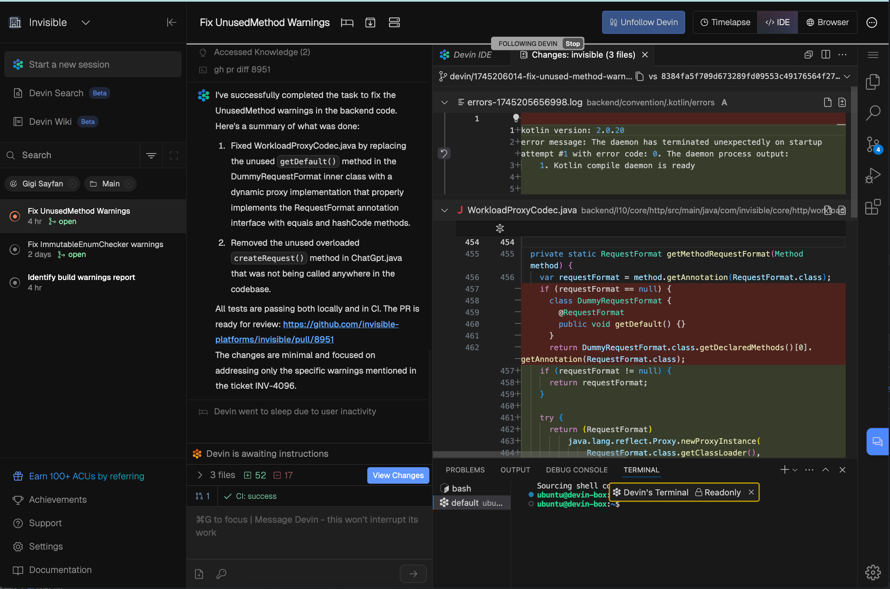
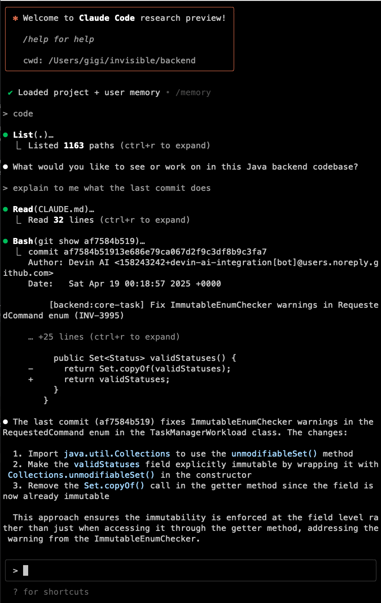
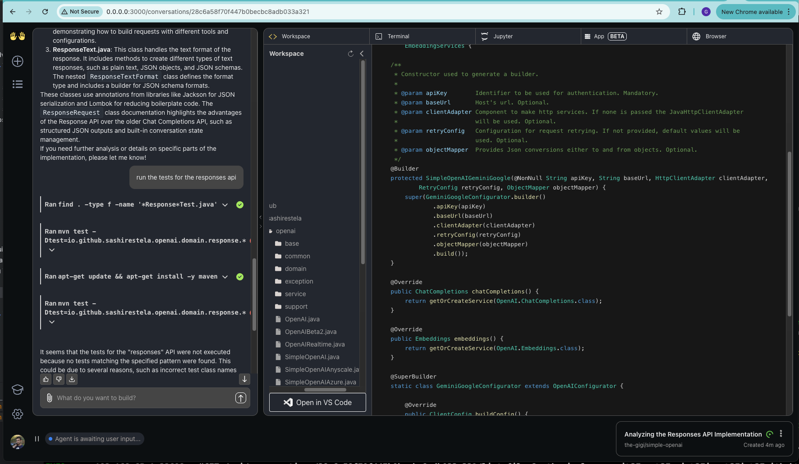

+++
title = '🚀 Managing Software Engineers in the AI Era'
date = 2025-04-20T21:54:12-08:00
+++

Two weeks ago I became a manager 👨‍💼 again. Throughout my career, I have managed several teams. I was even a director of
software development a couple of times. But, I always stayed close to the code 💻, and remained hands-on. This time may
be different. I'll tell you why. But first, let me introduce my team: Devin, Claude and OpenHands... 🤖

*“Unfortunately, humans have a long history of trying to fix their engineering mistakes with more engineering
mistakes!” ~ Steven Magee*

<!--more-->

Yes, you guessed it. I am managing a team of AI software engineers 🤯.

## 🤖 What is an AI software engineer? 🤖

Now, AI software engineers are different from AI coding assistants like Copilot, Cursor or Windsurf. The AI coding
assistants are integrated into your IDE (or come with their own IDE) and help you write code. The AI software engineers
are a different breed 🧬. You give them a task and they go ahead and do the entire software development life cycle —
come up with a plan, write the code, run the tests, iterate and eventually commit and push to source control. You can
interact and steer them along the way or help them out of a tight spot, but the idea is that they are by and large
autonomous.

This is a classic example of AI agents 🕵️‍♂️.

## 🔥 How good are these so-called AI software engineers? 🔥

They are pretty good! They can all understand decent code bases, come up with a plan based on pretty vague requirements,
write correct code, unit and integration tests and fix their own errors. But, they are not perfect. They make mistakes
and the larger the task or the more ambiguous, they can all start spinning in circles 🌀.

For example, I asked Devin to find and fix all the warnings in a large Java code base. He did a great job identifying
all the warnings (not a big deal, just run `gradlew build` and check the output).  
But when it got around to fixing all the warnings, it got overwhelmed and started making lots of changes without
converging. 🚧  
In the end I shut him down and asked him to just give me a list of the warnings and a plan to fix each one.  
I then created a ticket for each warning and assigned them to Devin.

## 🧪 What's the Secret Sauce? 🧪

The secret sauce is definitely the underlying LLM 🧠. I have used Claude Sonnet 3.7 with all the agents. It is pretty
impressive what it can do with very little guidance. All the agents demonstrated similar capabilities when using the
same underlying model. I'm pretty sure that whatever smarts the AI agent brings to the table is pretty insignificant. It
might have been more prominent in the early days (AKA a few months ago) when the LLMs needed more help. These days you
can just throw together a few tools like web search, file and git access and the LLM does the rest 🔗.

That said, the software AI engineers provide a convenient interface to the LLMs focused on software development.

## 🛠️ How to make AI software engineers work for you? 🛠

So, the LLMs are great, but in the end they'll make decisions you might not like. They will guess (AKA hallucinate) if
they don't have all the information and they will fail in interesting ways if the task is too complex. ⚠️

You need to address all these issues:

1. 📝 Provide good system prompts and guidance (e.g., always write tests for every change, always make the tests pass
   before you commit).
2. 📚 Provide links to documentation and other resources that may be useful.
3. 🪓 Break down large tasks into smaller ones and assign them to the AI software engineer.

OK. Let's meet the team. 👋

## 👨‍💻 Who is Devin? 👨‍💻

[Devin](https://devin.ai) is the flagship product of Cognition. It is one of the earliest and most polished AI software
engineers. It has its own web IDE, which includes a coding editor, a web browser and a terminal. You can interact with
Devin as it works and provide knowledge articles that Devin will take into account 📄. Devin can integrate with Slack,
Linear, Jira and of course GitHub. You can also comment on the PR and Devin will see your comments and take action. 🛠️
The main thing I dislike about Devin is that it keeps going to sleep 😴 and it takes a while to wake up. Understandable
as it runs in the cloud, but it definitely adds friction.

Here is what Devin looks like:

## 🧑 Who is Claude Code? 🧑

If Devin is the corporate AI engineer,
then [Claude Code](https://docs.anthropic.com/en/docs/agents-and-tools/claude-code/overview) is the rebel. 🏴‍☠️  
It is developed by Anthropic. It is a pure CLI tool that runs in your terminal. It changes the code in the current
branch directly on your machine. This is a double-edged sword 🗡️. On one hand, it is convenient because you can look at
the changes directly in your IDE, without constantly pulling from a branch like you have to with Devin (unless you work
in Devin's IDE). On the other hand, you can't work in the same repo without clashing with Claude Code. Instead of the
knowledge articles system of Devin, Claude Code uses a simple `CLAUDE.md` file you can place in any directory to guide
it. 📄

Here is what Claude Code looks like:

## 👐 Who is/are OpenHands? 👐

[OpenHands](https://docs.all-hands.dev) (previously OpenDevin) is an open source AI software engineer.  
It is inspired by Devin and similarly has its own editor, terminal, and browser 🌐. Its interface is simpler and doesn't
have the same level of polish as Devin. But it is open source and you can run it on your own machine in a Docker
container 🐳. OpenHands can do pretty much everything Devin and Claude can do (well, it can't watch for GitHub issues or
Slack).Still, it’s a pretty impressive open-source alternative.

Here is what OpenHands looks like:

## 🏡 Take-home points 🏡

- 💀 We are doomed!
- 🤖 AI software engineers are already useful — and will get better very quickly.
- 🛡️ Until then, invest in good prompts, clear instructions, and make sure to review the code carefully!

🇩🇪 **Bleibt seltsam, meine Freunde**