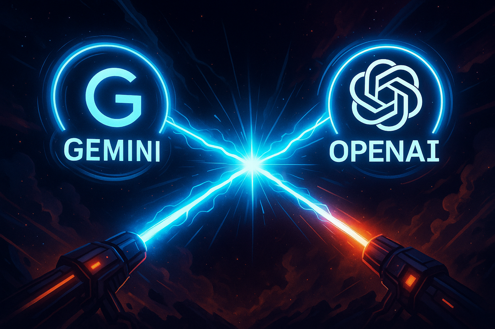
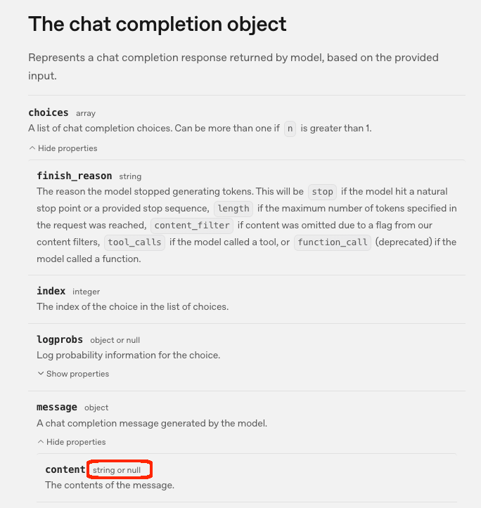
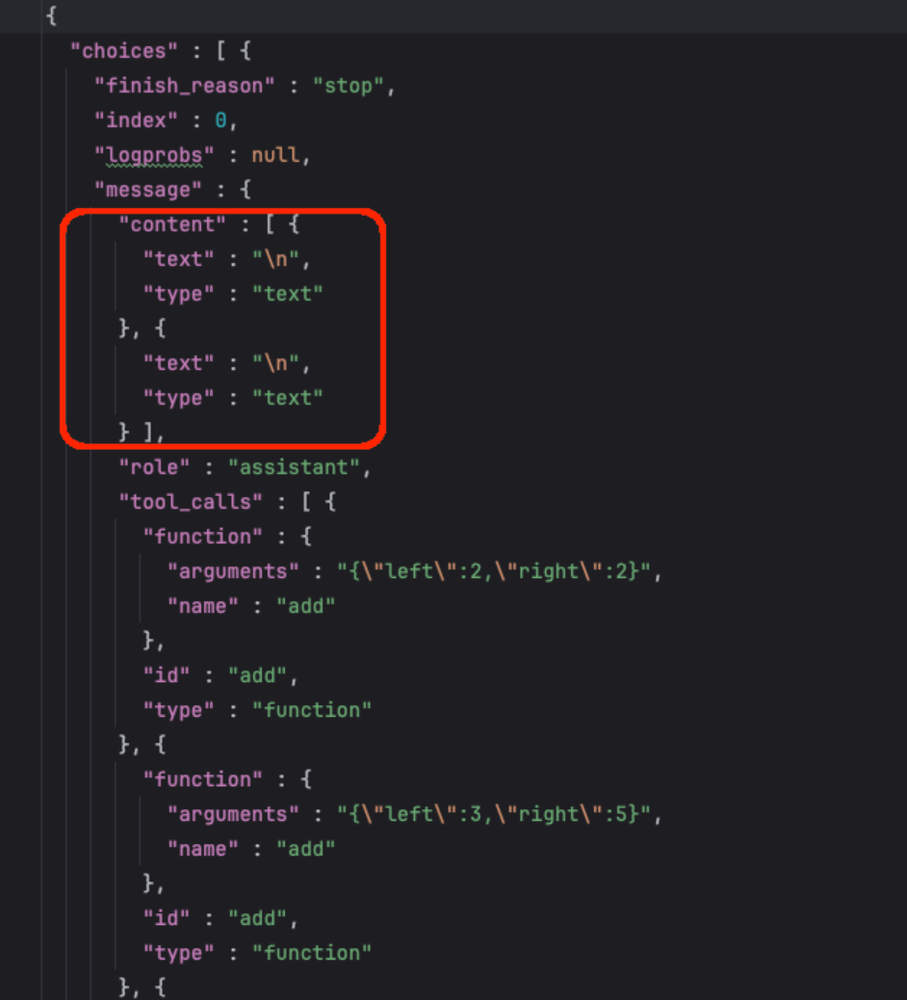
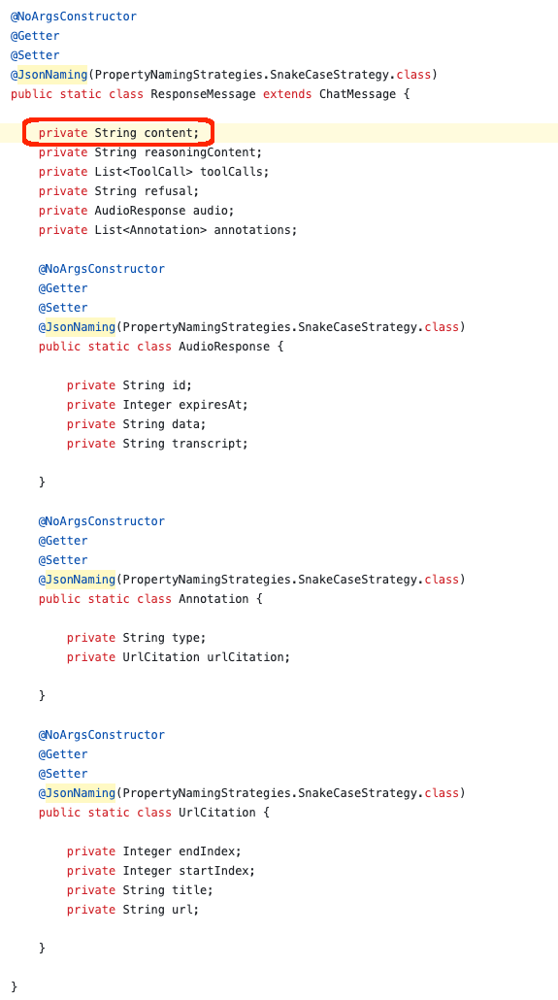

+++
title = 'Fixing the Gemini OpenAI Compatibility Layer'
date = 2025-07-23T21:54:12-08:00
categories = ["LLM", "AI", "Java"]
+++

In this story of mystery and intrigue 🕵️‍♂️ (well, not really 😅), we’ll explore the world of LLMs 🤖 and how I extended
the awesome [simple-openai](https://github.com/sashirestela/simple-openai) library to support the [Gemini
](https://ai.google.dev/gemini) LLM provider from Google via its OpenAI API compatibility layer ✨. This is a tale of
code 💻, collaboration 🤝, and the quest for robust interoperability 🔧 in the ever-evolving landscape of AI.

**“The good thing about standards is that there are so many to choose from” ~ Andrew S. Tanenabaum**

<!--more-->



At [Invisible Platforms](https://www.getinvisisble.com) we use all the top-level LLM models. This is a very dynamic list
and the leaders keep changing. We are a Java shop (Yes! Java can do AI. thanks for asking), and we
use [simple-openai](https://github.com/sashirestela/simple-openai) as our Java client library to interact with the
OpenAI API. It is a great library that was initially designed to support OpenAI proper, but overtime
was [extended to support other LLM providers](https://github.com/sashirestela/simple-openai/pull/47) as long as they
offer an OpenAI-compatible API.

# 🛰️ The Gemini OpenAI Compatibility Layer 🛰️

Gemini has its own LLM API. Actually there are two Gemini APIs - the Gemini Developer API and the Gemini Vertex AI API.
No,
scratch that. There are three Gemini APIs - the Gemini Developer API, the Gemini Vertex AI API, and the Gemini
OpenAI-compatible API.

OK. Let's sort things out. The Gemini Developer API is designed for quick integration, prototyping and small apps, It
has restrictive [rate limits](https://ai.google.dev/gemini-api/docs/rate-limits) and it is accessible via an API key.
The Gemini Vertex AI API is designed for Enterprise apps, MLOps, highly scalable setups. It
has [higher quotas](https://cloud.google.com/vertex-ai/generative-ai/docs/quotas) and
is accessible via a service account.

Both APIs have their own OpenAI compatibility layer with a different base URL and different ways to authenticate. So, I
guess there are really Four Gemini APIs:

- [Gemini Developer API](https://ai.google.dev/gemini-api/docs)
- [Gemini Vertex AI API](https://cloud.google.com/vertex-ai/generative-ai/docs/model-reference/inferenceg)
- [Gemini Developer OpenAI compatible API](https://ai.google.dev/gemini-api/docs/openai)
- [Gemini Vertex AI OpenAI compatibility API](https://cloud.google.com/vertex-ai/generative-ai/docs/start/openai)

Since, we're a no-nonsense serious company, we went for the Gemini Vertex AI OpenAI compatibility API. The reason we
didn't want to use the native Gemini API is that we already use a lot LLM providers with an OpenAI-compatible APIs via
simple-openai and adding a whole other LLM client library for one provider would unnecessarily complicate our code.
Spoiler alert, we violated this principle for Anthropic and built a custom client library for it. But, that is a story
for another day.

So, let's see how to add a new LLM provider (Gemini vertex to be specific) to simple-openai.

# 🧬 Meet the OpenAIProvider 🧬

The simple-openai library has a very nice architecture that allows you to add new LLM providers by extending the
`OpenAIProvider`  abstract class. This class defines the basic operations that all OpenAI-compatible providers must
implement. it also provides some default implementations. I will not get into all that jazz here. If you're curious
check out this explanation of the provider system:
https://deepwiki.com/sashirestela/simple-openai/3.1-provider-system

I'll just show a couple of methods that relevant to our story. The constructor of the `OpenAIProvider` class, which
accepts an `OpenAIConfigurator` instance and calls the `buildClient()` method to create a `CleverClient`

```java
    protected OpenAIProvider(@NonNull OpenAIConfigurator configurator) {
        var clientConfig = configurator.buildConfig();
        this.cleverClient = buildClient(clientConfig);
        this.realtime = buildRealtime(clientConfig);
    }
```

The `buildClient()` is a private method method that returns a CleverClient instance configured with two important
methods: `requestInterceptor` and `responseInterceptor`.

```java
    private CleverClient buildClient(ClientConfig clientConfig) {
        final String END_OF_STREAM = "[DONE]";
        return CleverClient.builder()
            .clientAdapter(Optional.ofNullable(clientConfig.getClientAdapter())
                // Lazy evaluation to not fail on devices without support for HttpClient
                .orElseGet(() -> new JavaHttpClientAdapter(Optional.ofNullable(clientConfig.getHttpClient())
                    .orElse(HttpClient.newHttpClient()))))
            .baseUrl(clientConfig.getBaseUrl())
            .headers(clientConfig.getHeaders())
            .bodyInspector(bodyInspector())
            .requestInterceptor(clientConfig.getRequestInterceptor())
            .responseInterceptor(clientConfig.getResponseInterceptor())
            .retryConfig(Optional.ofNullable(clientConfig.getRetryConfig()).orElse(RetryConfig.defaultValues()))
            .endOfStream(END_OF_STREAM)
            .objectMapper(Optional.ofNullable(clientConfig.getObjectMapper()).orElse(new ObjectMapper()))
            .build();
    }
```

Now, the ClientConfig comes an instance of the `OpenAIConfigurator` abstract class.

```java
@SuperBuilder
@AllArgsConstructor
public abstract class OpenAIConfigurator {

    protected String apiKey;
    protected String baseUrl;
    protected HttpClientAdapter clientAdapter;
    protected RetryConfig retryConfig;
    protected ObjectMapper objectMapper;
    /**
     * @deprecated CleverClient has deprecated this field in favor of clientAdapter.
     */
    @Deprecated(since = "3.16.0", forRemoval = true)
    protected HttpClient httpClient;

    public abstract ClientConfig buildConfig();

}
```

To make a long story short, if we want to write a new LLM provider, that intercepts HTTP requests and responses when
they're being sent and received to/from the LLM then said provider must implement the `OpenAIConfigurator` with custom
requestInterceptor and responseInterceptor methods. Guess what? This is exactly what we need to do for the Gemini Vertex
AI provider. Here is why...

# 🎭 Gemini Vertex surprises 🎭

The Gemini Vertex OpenAI compatible API had two surprises in store for us that required us some uncoventional
workarounds.

## Surprise #1: Ephemeral Auth Token

As you recall the Gemini Vertex API authentication is not your run-of-the-mill API key. It requires sending an ephemeral
auth token that must be refreshed every hour. This goes against the grain of the simple-openai, which expects a stable
API key provided once. If we just get a token and pass it to our SimpleOpenAI instance then it will expire after an
hour. This no good. Users can work around it by creating a new SimpleOpenAI instance with a new token every hour, but
that puts a lot of un-necessary burden on the users.

## Surprise #2: Bug in the OpenAI Compatibility Layer

The OpenAI API defines precisely the expected type of the message content field of
the [Chat completion object](https://platform.openai.com/docs/api-reference/chat/object) (the response from the LLM).
This field must be either a string or null.



Well, guess what? The Gemini Vertex OpenAI compatibility layer has other ideas and sometimes returns an array of objects
instead of just a string or null.



Now, this is a major problem because simple-openai deserializes the response into
a [ResponseMessage](https://github.com/sashirestela/simple-openai/blob/main/src/main/java/io/github/sashirestela/openai/domain/chat/ChatMessage.java#L212)
Java object that uses a nullable string, so the library relly expects the `content` field to be a string or null.



So, we can't just ignore it. We need to fix it.

To summarize we have two problems that will require low-level tinkering at the HTTP request and response level.

# 🔐 Custom Auth via the Request Interceptor 🔐

OK. Let's start with the first problem. At the end of the day, simple-openai needs to send an HTTP request to the Gemini
OpenAI-compatible endpoint that includes the following header:

```java
"Authorization: Bearer <Gemini API token>"
```

We have two tasks:

1. Get a Gemini Vertex AI API token and refresh it every hour.
2. Inject the refreshed token into the HTTP request headers.

## Getting the Gemini Vertex AI API Token

OK. First, you need a GCP account with the Vertex AI API enabled. You can do this via the GCP console or the gcloud CLI.
This is not a hands on tutorial, so I won't go into the details of how to do this. You need a GCP service account
credentials file.

Check out the [GCP documentation](https://cloud.google.com/iam/docs/service-account-creds) for more details.

Anyway, I built a Java class
called [GeminiAccessToken](https://github.com/sashirestela/simple-openai/blob/main/src/main/java/io/github/sashirestela/openai/support/GeminiAccessToken.java).

It uses the Google Cloud Java SDK to read a service account credentials file and create return a fresh token every time
whenever you call the get() method. Here are the necessary imports:

```java
package io.github.sashirestela.openai.support;

**import com.google.auth.oauth2.GoogleCredentials;**
**import com.google.auth.oauth2.ServiceAccountCredentials;**
import lombok.Getter;

import java.io.FileInputStream;
import java.io.IOException;
import java.util.Collections;

import static io.github.sashirestela.cleverclient.util.CommonUtil.isNullOrEmpty;
```

The class itself is pretty simple. It has a provate getter for the GoogleCredentials object and a get() method that
returns the current access token as a string.

Here is the class definition and the provate fields:

```java
public class GeminiAccessToken {

    private static final String GOOGLE_SERVICE_ACCOUNT_SCOPE = "https://www.googleapis.com/auth/cloud-platform";
    @Getter
    private final GoogleCredentials credentials;
```    

The constructors accepts the GCP service account credentials file path and reads the credentials from it. If the file
path is empty or the file cannot be read, it throws an exception because that's user/input error. The try-catch of
IOException error is not supposed to happen, it's there to avoid dealing checked exceptions. Eventually the credentials
are stored for later.

```java
    public GeminiAccessToken(String credentialsFilePath) {
        GoogleCredentials creds;
        if (isNullOrEmpty(credentialsFilePath)) {
            throw new IllegalArgumentException("Credentials file path is empty");
        }
        try {
            creds = ServiceAccountCredentials.fromStream(
                    new FileInputStream(credentialsFilePath))
                    .createScoped(
                            Collections.singletonList(GOOGLE_SERVICE_ACCOUNT_SCOPE));
        } catch (IOException e) {
            creds = null;
        }
        credentials = creds;
    }

    // Constructor takes credentials instead of reading from a file
    GeminiAccessToken(GoogleCredentials credentials) {
        this.credentials = credentials;
    }
```

The `get()` method checks if the credentials are null and returns an empty string if they are. If the credentials are
not null, it attempts to refresh the credentials if they are expired. If the refresh fails or the access token is null
it just returns an empty string. But, if everything is fine, it returns the access token value as a string.

```java
    public String get() {
        if (credentials == null) {
            return "";
        }
        try {
            credentials.refreshIfExpired();
        } catch (IOException e) {
            return "";
        }

        if (credentials.getAccessToken() == null) {
            return "";
        }
        return credentials.getAccessToken().getTokenValue();
    }

}
```

Note that we don't create a new token on every request to get(). The credentials.refreshIfExpired() method is smart
enough to check if the token is expired and refresh it only if necessary. This avoids unnecessary API calls.

Alright, we have a way to fetch a fresh Gemini Vertex AI API token. Now we need to inject it into the HTTP request
headers.

## Injecting the Token into the Request Headers

So, [simple-openai]() uses [cleverclient]() to send HTTP requests to the LLM. The machinery for intercepting requests
and responses is implemented at that level. Let's walk it step bt step.

The OpenAIProvider class in simple-openai creates a CleverClient instance via
the [buildClient()](https://github.com/sashirestela/simple-openai/blob/main/src/main/java/io/github/sashirestela/openai/base/OpenAIProvider.java#L44)
method. It accepts a ClientConfig object that contains interceptors for the request and response.

```java
    private CleverClient buildClient(ClientConfig clientConfig) {
        final String END_OF_STREAM = "[DONE]";
        return CleverClient.builder()
                .clientAdapter(Optional.ofNullable(clientConfig.getClientAdapter())
                        // Lazy evaluation to not fail on devices without support for HttpClient
                        .orElseGet(() -> new JavaHttpClientAdapter(Optional.ofNullable(clientConfig.getHttpClient())
                                .orElse(HttpClient.newHttpClient()))))
                .baseUrl(clientConfig.getBaseUrl())
                .headers(clientConfig.getHeaders())
                .bodyInspector(bodyInspector())
                .requestInterceptor(clientConfig.getRequestInterceptor())
                .responseInterceptor(clientConfig.getResponseInterceptor())
                .retryConfig(Optional.ofNullable(clientConfig.getRetryConfig()).orElse(RetryConfig.defaultValues()))
                .endOfStream(END_OF_STREAM)
                .objectMapper(Optional.ofNullable(clientConfig.getObjectMapper()).orElse(new ObjectMapper()))
                .build();
    }
```

CleverClient has an HttpClientAdapter class with
an [interceptRequest()](https://github.com/sashirestela/cleverclient/blob/main/src/main/java/io/github/sashirestela/cleverclient/client/HttpClientAdapter.java#L66)
method that applies the `requestInterceptor` method if it's not null. The `requestInterceptor` method takes the
original HTTP request and may modify it. It returns a new RequestData object that contains potentially new URL, body and
headers.

```java
    private RequestData interceptRequest(RequestData originalRequest) {
        if (requestInterceptor != null) {
            var httpRequestData = originalRequest.getHttpRequestData();
            httpRequestData = this.requestInterceptor.apply(httpRequestData);
            return originalRequest
                    .withUrl(httpRequestData.getUrl())
                    .withBody(httpRequestData.getBody())
                    .withHeaders(CommonUtil.mapToListOfString(httpRequestData.getHeaders()));
        } else {
            return originalRequest;
        }
    }
```

That's great. It means all we need to configure a proper request interceptor that will inject the Gemini Vertex AI API
token as an Authorization header.

This is all done in
the [SimpleOpenAIGeminiVertex](https://githu

b.com/sashirestela/simple-openai/blob/main

/src/main/java/io/github/sashirestela/openai/SimpleOpenAIGeminiVertex.java)
class that extends the `OpenAIProvider` class and has a
nested [GeminiVertexConfigurator](https://github.com/sashirestela/simple-openai/blob/main/src/main/java/io/github/sashirestela/openai/SimpleOpenAIGeminiVertex.java#L60)
class that extends the `OpenAIConfigurator` we mentioned earlier.

Yes, this is a bit convoluted, but it is required to support multiple OpenAI providers that can be configured in
sophisticated ways.

Alright, let's see what the `GeminiVertexConfigurator` looks like. Everything starts with a humongous list of imports
that reflect the strongly-typed nature of the model simple-openai uses to represent the OpenAI API and the Cleverclient
machinery:

```java
package io.github.sashirestela.openai;

import com.fasterxml.jackson.databind.ObjectMapper;
import com.fasterxml.jackson.databind.node.ObjectNode;
import io.github.sashirestela.cleverclient.client.HttpClientAdapter;
import io.github.sashirestela.cleverclient.http.HttpRequestData;
import io.github.sashirestela.cleverclient.http.HttpResponseData;
import io.github.sashirestela.cleverclient.retry.RetryConfig;
import io.github.sashirestela.openai.base.ClientConfig;
import io.github.sashirestela.openai.base.OpenAIConfigurator;
import io.github.sashirestela.openai.base.OpenAIProvider;
import io.github.sashirestela.openai.exception.SimpleOpenAIException;
import io.github.sashirestela.openai.service.ChatCompletionServices;
import io.github.sashirestela.openai.support.Constant;
import lombok.Builder;
import lombok.NonNull;
import lombok.experimental.SuperBuilder;

import java.util.HashMap;
import java.util.Map;
import java.util.function.Supplier;
import java.util.function.UnaryOperator;
```

The class itself extends the OpenAIProvider base class and implements the `ChatCompletionServices` interface, which
ensures it can send chat completion requests.

```java
/**
 * The Gemini Vertex implementation which implements a subset of the standard services.
 */
public class SimpleOpenAIGeminiVertex extends OpenAIProvider implements
        ChatCompletionServices {
```        

The constructor takes several parameters. But, we only care for the purpose of our discussion about the `apiKeyProvider`
and `clientAdapter`.

```java
    /**
     * Constructor used to generate a builder.
     *
     * @param baseUrl        The base URL of the Gemini Vertex API. Mandatory.
     * @param apiKeyProvider Provides the API key to be used for authentication. Mandatory.
     * @param clientAdapter  Component to make http services. If none is passed the
     *                       JavaHttpClientAdapter will be used. Optional.
     * @param retryConfig    Configuration for request retrying. If not provided, default values will be
     *                       used. Optional.
     * @param objectMapper   Provides JSON conversions either to and from objects. Optional.
     */
    @Builder
    public SimpleOpenAIGeminiVertex(@NonNull String baseUrl, @NonNull Supplier<String> apiKeyProvider,
            HttpClientAdapter clientAdapter, RetryConfig retryConfig,
            ObjectMapper objectMapper) {
        super(GeminiVertexConfigurator.builder()
                .apiKeyProvider(apiKeyProvider)
                .baseUrl(baseUrl)
                .clientAdapter(clientAdapter)
                .retryConfig(retryConfig)
                .objectMapper(objectMapper)
                .build());
    }

```

The actual implementation of the OpenAI chat completion API is shrouded in deep magic too :-) I'll leave it to you to
explore it further if you're curious.

```java
    @Override
    public OpenAI.ChatCompletions chatCompletions() {
        return getOrCreateService(OpenAI.ChatCompletions.class);
    }
```    

Alright, here is the most interesting part of the code. The `GeminiVertexConfigurator` class extends the
`OpenAIConfigurator` and it `buildConfig()` overrides the base class implementation. Note that it calls initializes the
requestInterceptor() with a call to its own private getRequestInterceptor() method.

```java
    @SuperBuilder
    static class GeminiVertexConfigurator extends OpenAIConfigurator {

        private final Supplier<String> apiKeyProvider;

        @Override
        public ClientConfig buildConfig() {
            return ClientConfig.builder()
                    .baseUrl(baseUrl)
                    .headers(Map.of())
                    .requestInterceptor(makeRequestInterceptor())
                    .responseInterceptor(makeResponseInterceptor())
                    .objectMapper(objectMapper)
                    .build();
        }
```

Let's examine it closely. The first part with the URL is unrelated. It is another adjustment to remove the version
part that simple-openai automatically adds to the URL, but doesn't match the Gemini API endpoint URL.

The next part is the important one. It creates a new map of headers and adds the `Authorization` header with the value
of `this.apiKeyProvider.get()` method. The API key provider is a `Supplier<String>` that is actually an instance of the
GeminiAccessToken we saw earlier.

```java
        private UnaryOperator<HttpRequestData> makeRequestInterceptor() {
            final String VERSION_REGEX = "/v\\d+(\\.\\d+)?/";
            return request -> {
                var newUrl = request.getUrl().replaceFirst(VERSION_REGEX, "/");
                request.setUrl(newUrl);
                var headers = new HashMap<>(request.getHeaders());
                headers.put(
                        Constant.AUTHORIZATION_HEADER,
                        Constant.BEARER_AUTHORIZATION + this.apiKeyProvider.get());
                request.setHeaders(headers);
                return request;
            };
        }        
```

Now, let's see how the response interceptor is implemented to take care of surprise #2.

# 🧽 Post processing the Response Payload via the Response Interceptor 🧽

As we saw earlier, the Gemini Vertex OpenAI compatibility layer sometimes returns an array of objects in the `content`
field of the message object. We need to fix that by replacing the array with a null value. This is done in the response
interceptor. Pretty much everything we discussed regarding the request interceptor applies here too. The
GeminiVertexConfigurator class has a private method called `makeResponseInterceptor()` that returns takes cre of
business. The code uses a dynamic ObjectMapperis and drills down until it finds the content node. If it is an array it
replaces it with a null value.

```java
        private UnaryOperator<HttpResponseData> makeResponseInterceptor() {
            return response -> {
                var body = response.getBody();
                if (body == null) {
                    return response;
                }

                try {
                    ObjectMapper mapper = new ObjectMapper();
                    var rootNode = mapper.readTree(body);
                    var choicesNode = rootNode.path("choices");

                    if (choicesNode.isArray() && !choicesNode.isEmpty()) {
                        var messageNode = choicesNode.get(0).path("message");
                        var contentNode = messageNode.path("content");

                        if (contentNode.isArray()) {
                            ((ObjectNode) messageNode).putNull("content");
                        }
                    }

                    String modifiedBody = mapper.writeValueAsString(rootNode);
                    response.setBody(modifiedBody);
                } catch (Exception e) {
                    throw new SimpleOpenAIException("Failed to modify response", null, e);
                }

                return response;
            };
        }

    }
```

And, that's all she wrote! We have a new LLM provider that works with the Gemini Vertex AI OpenAI compatibility layer.

# 🏠 Take home points 🏠

- 🧪 OpenAI-compatible doesn’t mean spec-compliant—always validate responses
- 🛠️ Interceptors are powerful tools for patching provider quirks without breaking abstraction
- 🔁 Ephemeral tokens require architectural support—not just config tweaks
- 🐛 Compatibility layers often leak—be ready to adapt at the HTTP level
- 🧼 Build extensions that isolate provider-specific hacks to preserve core library integrity

🇳🇱 Tot de volgende keer, mijn vrienden
