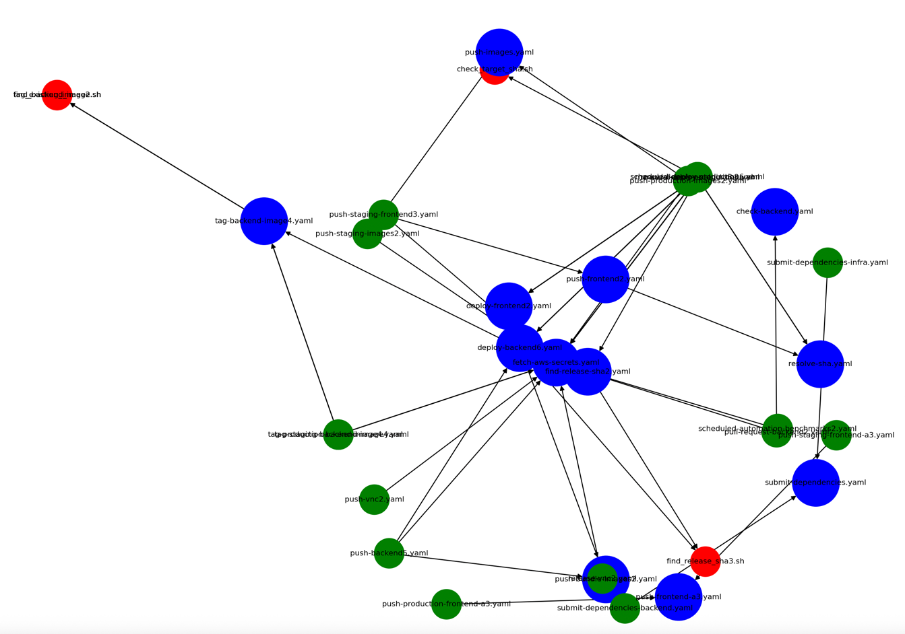

+++
title = 'Github Actions Software Development Lifecycle'
date = 2025-07-06T21:54:12-08:00
categories = ["DevOps", "GitHub Actions", "CI/CD"]
+++

[Github Actions](https://github.com/features/actions) are pretty cool 😎 as far as CI/CD pipelines go. But evolving and
testing non-trivial workflows can go
south real fast ⚠️. The core issue is that for any other code, the CI/CD system (if designed and implemented correctly)
keeps you honest ✅, runs your tests 🧪, and only accepts successful PRs 🚦.

But when you need to make changes to your CI/CD workflows, the situation is different 😬. I learned it the hard way, so
you don’t have to 💡. Let me share with you our current software development lifecycle for Github Actions workflows 🔁.
The same principles can be applied to any CI/CD system 🛠️.

**“Quis custodiet ipsos custodes?” ~ Juvenal**

<!--more-->


# 🤔 What's Github Actions anyway? 🤔

GitHub Actions is a powerful CI/CD platform built directly into GitHub that allows you to automate software workflows
based on events in your repository. It lets you define jobs using YAML files that specify when and how to build, test,
or deploy your code. These workflows are triggered by events like pushes, pull requests, or scheduled timers, and they
run in isolated containers or VMs provided by GitHub-hosted runners or self-hosted environments.

While it’s often used for simple tasks like running unit tests or linting code, GitHub Actions scales to handle highly
complex systems. You can compose workflows from other reusable workflows, manage dependencies, coordinate multi-service
deployments, and integrate with external systems like Docker, AWS, GCP, or Slack. With the ability to run custom shell
scripts, share workflows across repos, and control execution environments, it has become a full-blown automation
framework, not just a basic CI tool.

Because of this power and flexibility, maintaining a non-trivial GitHub Actions setup can quickly become a software
engineering problem of its own. When your CI/CD system spans dozens of workflows with conditional logic, secrets
management, and complex coordination between jobs, it needs a software development lifecycle (SDLC) of its own,
including testing, versioning, and rollback capabilities.

# ‍🤷‍♂️ Do you really need an SDLC for a CI/CD system? 🤷‍♂️

Umm... yes! Probably anyone that has a non-trivial CI/CD system needs a proper process. Our CI/CD system is responsible
for detecting changes (duh!), running different checks, unit tests, integration tests, smoke tests, building container
images, tagging images, coordinated deployments of frontend and backend services, manual deploys and much more. It is a
complex system that involves multiple top-level workflows invoking multiple reusable workflows, each with its own set of
jobs and steps. These workflows sometimes invokes yet lower-level reusable workflows and some of the steps involves
launching non-trivial shell scripts.

Here is a diagram of our current CI/CD system. The blue circles 🔵 are top-level workflows, the green circles 🟢 are
reusable workflows, and the red circles 🔴 are shell scripts.



The "Manual Deploy to Staging" workflow is an example of a hierarchical workflow. It is a graph of workflows and shell
scripts calling each other. It starts with a top-level workflow that can be run manually (with the `workflow_dispatch`
event) or automatically on a push to the main branch. It contains multiple jobs:

- resolve-sha
- fetch-secrets
- deploy-backend
- deploy-frontend

Each one of these workflows is a reusable workflow that is also used by other top-level workflows and may itself invoke
nested reusable workflows or shell scripts. Each one is also expects multiple inputs and secrets.

Here is the complete graph of this workflow:

```
📂 manual-deploy-staging8.yaml
├── deploy-backend6.yaml
│   ├── find_release_sha3.sh
│   ├── push-bundle-images2.yaml
│   └── tag-backend-image4.yaml
│       ├── find_backend_image.sh
│       └── tag_existing_image2.sh
├── deploy-frontend2.yaml
├── fetch-aws-secrets.yaml
└── resolve-sha.yaml
```

Let's take a closer look at this workflow and its first-level reusable workflows. If YAML and shell scare you (they
should 😱), feel free to skip this.

# 🔍 Deep dive into the "Manual Deploy to Staging" workflow 🔍

Alright, you're still here, brave soul 😅.Let's look at the code of "Manual Deploy to Staging" workflow (if you can call
it code) and later at the reusable workflows it uses. It is a top-level workflow that can be triggered manually.

Last warning... ⚠️ I'm serious! there is a massive amount of YAML and shell commands ahead! You are totally within your
rights to skip this at any point and scroll down to the cool stuff later. The main point is just to impart on you what a
misery
it is to maintain a non-trivial CI/CD system without a proper SDLC.

```yaml
name: Manual Deploy to Staging
on:
  workflow_dispatch:
    inputs:
      sha:
        description: SHA
        required: false
        default: HEAD
concurrency:
  group: deploy-to-staging
  cancel-in-progress: false
jobs:
  resolve-sha:
    uses: ./.github/workflows/resolve-sha.yaml
    with:
      sha: ${{ inputs.sha }}
  fetch-secrets:
    uses: ./.github/workflows/fetch-aws-secrets.yaml
    with:
      secret-id: <REDACTED>
      aws-region: us-east-1
    secrets:
      secrets-manager-access-key-id: ${{ secrets.DEVELOPMENT_SECRETS_MANAGER_USER_ACCESS_KEY_ID }}
      secrets-manager-access-key-secret: ${{ secrets.DEVELOPMENT_SECRETS_MANAGER_USER_SECRET_ACCESS_KEY }}
  deploy-backend:
    needs: [resolve-sha, fetch-secrets]
    uses: ./.github/workflows/deploy-backend7.yaml
    with:
      sha: ${{ needs.resolve-sha.outputs.resolved-sha }}
      aws-region: us-east-1
      eks-cluster-name: <REDACTED>
      aws-account-id: <REDACTED>
      environment: staging
      fetch-depth: 1
      ecr-repositories: "ecr-repo-1,ecr-repo-2"
      dry-run: false
      additional-tags: "manual"
      suffix: "manual"
    secrets:
      ecr-aws-access-key-id: ${{ needs.fetch-secrets.outputs.ecr-access-key-id }}
      ecr-aws-secret-access-key: ${{ needs.fetch-secrets.outputs.ecr-access-key-secret }}
      eks-aws-access-key-id: ${{ needs.fetch-secrets.outputs.eks-access-key-id }}
      eks-aws-secret-access-key: ${{ needs.fetch-secrets.outputs.eks-access-key-secret }}
  deploy-frontend:
    needs: [resolve-sha, fetch-secrets]
    uses: ./.github/workflows/deploy-frontend4.yaml
    with:
      sha: ${{ needs.resolve-sha.outputs.resolved-sha }}
      aws-region: us-east-1
      deploy-env: 'staging'
      env-dns-suffix: -staging
      repos: '["app-1", "app-2", "app-3", "app-4"]'
      repo-settings: '{"app-1":{"nx-project-name":"app", "framework": "vite"}, "app-2":{"framework": "vite", "datadog-service-name": "app-2-web"}, "app-3":{"framework": "vite", "datadog-service-name": "app-3-web"}, "octopus": {"framework": "vite", "datadog-service-name": "octopus-web"}}'
      aws-sourcemaps: true
      datadog-sourcemaps: true
      dry-run: false
    secrets:
      s3-aws-access-key-id: ${{ needs.fetch-secrets.outputs.s3-access-key-id }}
      s3-aws-secret-access-key: ${{ needs.fetch-secrets.outputs.s3-access-key-secret }}
      development-datadog-api-key: ${{ secrets.DEVELOPMENT_DATADOG_API_KEY }}
      development-datadog-app-key: ${{ secrets.DEVELOPMENT_DATADOG_SOURCE_MAP_UPLOAD_APP_KEY }}
```

Yep, it is a lot of moving parts. And this is just one top-level workflow. There are many more that do different things.
Let's checkout the reusable workflows it's calling.

The `resolve-sha.yaml` workflow is responsible for resolving the Git SHA to its full form. It checks out the repository
and uses `git rev-parse` to get the full SHA. This is useful because sometimes you want to deploy a specific commit or
tag, and you need to ensure you have the full SHA. That's a LOT of YAML and shuffling environment variables around for a
very simple task, which can be summed up as: if a SHA is provided, resolve it to its full form, otherwise use `HEAD`.
But, it turns out resolving shas is not that simple. Sometimes we want to resolve deploy an older commit. The way Github
Actions works is that you have to check out the repo in order to be able to perform git operations. By default, it
checks the head only. So, this workflow makes sure to checkout the last 100 commits.

```yaml
name: Resolve Git SHA
on:
  workflow_call:
    inputs:
      sha:
        required: false
        type: string
    outputs:
      resolved-sha:
        description: The full SHA
        value: ${{ jobs.resolve-sha.outputs.resolved-sha }}
jobs:
  resolve-sha:
    runs-on: ubuntu-latest
    outputs:
      resolved-sha: ${{ steps.set-resolved-sha.outputs.resolved-sha }}
    steps:
      - name: Checkout repository
        uses: actions/checkout@v4.2.2
        with:
            fetch-depth: 100
      - name: Resolve Git SHA
        id: set-resolved-sha
        run: |
          # Default to HEAD if no SHA is provided
          SHA="${{ inputs.sha }}"
          if [ -z "$SHA" ]; then
            SHA="HEAD"
          fi
          # Resolve the SHA to its full form
          RESOLVED_SHA=$(git rev-parse "$SHA")
          echo "resolved-sha=$RESOLVED_SHA" >> "$GITHUB_OUTPUT"
```

The next reusable workflow is `fetch-secrets.yaml`. It is responsible for fetching secrets dynamically from AWS Secrets
Manager. It has just one job to fetch a bunch of secrets from AWS secret manager. The idea is that we don't have to
configure Github with individual secrets, but only with the credentials necessary to acess AWS secret manager, which is
the source of truth of all relevant secrets and then specific workflows can access the secrets they need. Again, note
how a seemingly simple task of fetching secrets requires an inordinate amount of YAML and shell commands.

```yaml
name: Fetch AWS Secrets

on:
  workflow_call:
    inputs:
      secret-id:
        description: 'The name of the AWS Secrets Manager secret'
        required: true
        type: string
      aws-region:
        description: AWS region
        required: true
        type: string
    secrets:
      secrets-manager-access-key-id:
        required: true
      secrets-manager-access-key-secret:
        required: true
    outputs:
      s3-access-key-id:
        description: "The S3 Access Key ID"
        value: ${{ jobs.fetch-secrets.outputs.s3-access-key-id }}
      s3-access-key-secret:
        description: "The S3 Access Key Secret"
        value: ${{ jobs.fetch-secrets.outputs.s3-access-key-secret }}
      ecr-access-key-id:
        description: "The ECR Access Key ID"
        value: ${{ jobs.fetch-secrets.outputs.ecr-access-key-id }}
      ecr-access-key-secret:
        description: "The ECR Access Key Secret"
        value: ${{ jobs.fetch-secrets.outputs.ecr-access-key-secret }}
      eks-access-key-id:
        description: "The EKS Access Key ID"
        value: ${{ jobs.fetch-secrets.outputs.eks-access-key-id }}
      eks-access-key-secret:
        description: "The EKS Access Key Secret"
        value: ${{ jobs.fetch-secrets.outputs.eks-access-key-secret }}
      snapshots-access-key-id:
        description: "The Snapshots Access Key ID"
        value: ${{ jobs.fetch-secrets.outputs.snapshots-access-key-id }}
      snapshots-access-key-secret:
        description: "The Snapshots Access Key Secret"
        value: ${{ jobs.fetch-secrets.outputs.snapshots-access-key-secret }}
      bedrock-access-key-id:
        description: "The Bedrock Access Key ID"
        value: ${{ jobs.fetch-secrets.outputs.bedrock-access-key-id }}
      bedrock-access-key-secret:
        description: "The Bedrock Access Key Secret"
        value: ${{ jobs.fetch-secrets.outputs.bedrock-access-key-secret }}
jobs:
  fetch-secrets:
    runs-on: ubuntu-latest
    outputs:
      s3-access-key-id: ${{ steps.extract-values.outputs.s3-access-key-id }}
      s3-access-key-secret: ${{ steps.extract-values.outputs.s3-access-key-secret }}
      ecr-access-key-id: ${{ steps.extract-values.outputs.ecr-access-key-id }}
      ecr-access-key-secret: ${{ steps.extract-values.outputs.ecr-access-key-secret }}
      eks-access-key-id: ${{ steps.extract-values.outputs.eks-access-key-id }}
      eks-access-key-secret: ${{ steps.extract-values.outputs.eks-access-key-secret }}
      snapshots-access-key-id: ${{ steps.extract-values.outputs.snapshots-access-key-id }}
      snapshots-access-key-secret: ${{ steps.extract-values.outputs.snapshots-access-key-secret }}
      bedrock-access-key-id: ${{ steps.extract-values.outputs.bedrock-access-key-id }}
      bedrock-access-key-secret: ${{ steps.extract-values.outputs.bedrock-access-key-secret }}

    steps:
      - name: Configure AWS credentials
        uses: aws-actions/configure-aws-credentials@v4.2.1
        with:
          aws-access-key-id: ${{ secrets.secrets-manager-access-key-id }}
          aws-secret-access-key: ${{ secrets.secrets-manager-access-key-secret }}
          aws-region: ${{ inputs.aws-region }}

      - name: Fetch Secret from AWS Secrets Manager
        id: fetch-secret
        run: |
          SECRET_VALUE=$(aws secretsmanager get-secret-value \
            --secret-id "${{ inputs.secret-id }}" \
            --query SecretString \
            --output text)
          echo "SECRET_VALUE=$SECRET_VALUE" >> "$GITHUB_ENV"

      - name: Extract Requested Keys
        id: extract-values
        run: |
          KEYS="ecrAccessKeyId,ecrAccessKeySecret,eksAccessKeyId,eksAccessKeySecret,s3AccessKeyId,s3AccessKeySecret,snapshotsAccessKeyId,snapshotsAccessKeySecret,bedrockAccessKeyId,bedrockAccessKeySecret"

          # Convert comma-separated keys to an array
          IFS=',' read -ra KEY_ARRAY <<< "$KEYS"

          for KEY in "${KEY_ARRAY[@]}"; do
            VALUE=$(echo "$SECRET_VALUE" | jq -r --arg key "$KEY" '.[$key]')

            # Convert camelCase or PascalCase to kebab-case
            OUTPUT_NAME=$(echo "$KEY" | \
              sed 's/\([^A-Z]\)\([A-Z]\)/\1-\2/g' | \
              sed 's/\([A-Z]\)/\L\1/g')

            echo "$OUTPUT_NAME=$VALUE" >> "$GITHUB_OUTPUT"
          done
```

The `deploy-backend7.yaml` reusable workflow is one of the most complicated workflows. It is responsible for deploying a
backend service, which involves the following jobs:

- `build-images`: This job builds the Docker images for the backend services and pushes them to ECR.
- `check-images`: This job checks if the images for the backend services are available in ECR. If not, it tags them.
- `tag-backend-image`: This job tags the backend images with the provided suffix if they are missing.
- `deploy-backend`: This job deploys the backend services to EKS using the images built in the previous jobs.
- `deploy-frontend`: This job deploys the frontend services to S3 and CloudFront.

It takes a large number of inputs and some of the jobs are themselves reusable workflows like `push-bundle-images2.yaml`
and `tag-backend-image5.yaml`. The `check-images` job has a bunch of shell commands and one of the steps invokes a
separate shell script - `./.github/workflows/scripts/find_release_sha3.sh`. Note that the dry-run input, which when true
is used to test workflow without actually performing any actions.

```yaml
name: Deploy Backend 7

on:
  workflow_call:
    inputs:
      sha:
        description: SHA
        required: true
        type: string
      aws-region:
        description: AWS region
        required: true
        type: string
      eks-cluster-name:
        description: AWS EKS cluster name
        required: true
        type: string
      aws-account-id:
        description: AWS account id
        required: true
        type: string
      environment:
        description: Environment
        required: true
        type: string
      fetch-depth:
        description: Number of commits to fetch when checking out
        required: false
        type: number
        default: 1
      ecr-repositories:
        description: Comma-separated list of ECR repositories
        required: true
        type: string
      dry-run:
        description: Dry run
        required: true
        type: boolean
      additional-tags:
        description: Comma separated list of additional tags
        required: true
        type: string
      suffix:
        description: Suffix to add to tag (e.g., build, test-success)
        required: false
        type: string
        default: ""
    secrets:
      eks-aws-access-key-id:
        required: true
      eks-aws-secret-access-key:
        required: true
      ecr-aws-access-key-id:
        required: true
      ecr-aws-secret-access-key:
        required: true
jobs:
  build-images:
    uses: ./.github/workflows/push-bundle-images2.yaml
    with:
      sha: ${{ inputs.sha }}
      aws-region: ${{ inputs.aws-region }}
      aws-account-id: ${{ inputs.aws-account-id }}
      environment: ${{ inputs.environment }}
      additional-tags: ${{ inputs.additional-tags }}
      backends: '["invisible", "browser"]'
      dry-run: ${{ inputs.dry-run }}
    secrets:
        ecr-aws-access-key-id: ${{ secrets.ecr-aws-access-key-id }}
        ecr-aws-secret-access-key: ${{ secrets.ecr-aws-secret-access-key }}
  check-images:
    needs: build-images
    runs-on: ci-runner
    outputs:
      any_missing: ${{ steps.check.outputs.any_missing }}
    steps:
      - name: Checkout repository
        uses: actions/checkout@v4.2.2
        with:
          fetch-depth: 10
      - name: Configure AWS credentials
        uses: aws-actions/configure-aws-credentials@v4.2.1
        with:
          aws-access-key-id: ${{ secrets.eks-aws-access-key-id }}
          aws-secret-access-key: ${{ secrets.eks-aws-secret-access-key }}
          aws-region: ${{ inputs.aws-region }}
      - name: Check images for target repositories
        id: check
        run: |
          ANY_MISSING=false
          IFS=',' read -ra REPOSITORIES <<< "${{ inputs.ecr-repositories}}"          
          for REPOSITORY in "${REPOSITORIES[@]}"; do
            echo "Checking image for repository: $REPOSITORY"
            if ! REPOSITORY_NAME="$REPOSITORY" SUBDIRECTORY="backend" ./.github/workflows/scripts/find_release_sha3.sh 0; then
              ANY_MISSING=true
              break  # Optional: bail out immediately on first failure
            fi
          done
          echo "any_missing=$ANY_MISSING" >> "$GITHUB_OUTPUT"
  tag-backend-image:
    needs: check-images
    if: needs.check-images.outputs.any_missing == 'true'
    uses: ./.github/workflows/tag-backend-image5.yaml
    with:
      ecr-repositories: '["repo-1","repo-1"]'
      dry-run: ${{ inputs.dry-run }}
      suffix: ${{ inputs.suffix }}
    secrets:
      ecr-aws-access-key-id: ${{ secrets.ecr-aws-access-key-id }}
      ecr-aws-secret-access-key: ${{ secrets.ecr-aws-secret-access-key }}

  deploy-backend:
    needs: [check-images, tag-backend-image]
    runs-on: ci-runner
    timeout-minutes: 30
    steps:
      - name: Set BROWSER_RELEASE_TAG Environment Variable
        run: echo "BROWSER_RELEASE_TAG=${{ inputs.sha }}" >> "$GITHUB_ENV"

      - name: Set DOCKER_TAG Environment Variable
        run: echo "DOCKER_TAG=${{ inputs.sha }}" >> "$GITHUB_ENV"

      - name: Show GitHub context
        env:
          GITHUB_CONTEXT: ${{ toJson(github) }}
        run: echo "$GITHUB_CONTEXT"

      - name: Configure AWS credentials
        uses: aws-actions/configure-aws-credentials@v4.2.1
        with:
          aws-access-key-id: ${{ secrets.eks-aws-access-key-id }}
          aws-secret-access-key: ${{ secrets.eks-aws-secret-access-key }}
          aws-region: ${{ inputs.aws-region }}

      - name: Create kubeconfig for EKS
        run: aws eks update-kubeconfig --region "${{ inputs.aws-region }}" --name "${{ inputs.eks-cluster-name }}"

      - name: Checkout
        uses: actions/checkout@v4.2.2

      - name: Set up JDK 21
        uses: actions/setup-java@v4.7.1
        with:
          java-version: 21
          distribution: 'temurin'
          cache: gradle

      - name: Deploy Kubernetes resources
        if: ${{ !inputs.dry-run }}
        working-directory: backend
        run: ./gradlew the-bundle:the-deployer:deploy
        env:
          REGISTRY_URL: ${{ inputs.aws-account-id }}.dkr.ecr.${{ inputs.aws-region }}.amazonaws.com
          ENVIRONMENT: ${{ inputs.environment }}

      - name: Show command (dry-run)
        if: inputs.dry-run
        run: echo "[DRY-RUN] ./gradlew the-bundle:the-deployer:deploy"
```

Ok. That was a lot of YAML and there is no need to go through the rest of the reusable workflows and the shell scripts.
The point is that it's a lot to take in, modify safely and review. So, how do we make sure that we can evolve this
system safely? That's where the process comes in.

## 🔁 The process

The process we use to evolve our GitHub Actions workflows is based on the principle of cloning existing workflows and
shell scripts 🧬 (with a versioned filename), modifying the cloned versions (never the original) ✍️, and incrementally
updating other workflows—again by cloning—to call the modified ones 🔁. The modified workflows can be tested in isolation
🧪. This approach extends all the way up to top-level workflows. If a new top-level workflow that invokes a modified
reusable workflow turns out to be broken ❌, we simply revert to the original and troubleshoot the issue 🔍.

Until a new top-level workflow is introduced, all the modified reusable workflows remain inert—they don’t affect the
CI/CD system at all 🚫 since nothing triggers them.

When we do switch to a new top-level workflow, we disable the old one in the GitHub Actions dashboard ⚙️. This is
crucial because most of our top-level workflows are not idempotent ❗️—we don’t want both old and new to be triggered
accidentally. This holds true even for manual workflows triggered by engineers 👨‍💻, where running the wrong version
could have side effects.

As you might expect, when modifying a deeply nested reusable workflow 🪆, you’ll need to clone all of its ancestors, test
each layer thoroughly, and ensure everything works end-to-end ✅. Once confirmed, the obsolete versions can be safely
removed 🧹.

> Let’s walk through a real-world example to illustrate how this works.

## 🚀 The process in action

Suppose we want to modify the `push-bundle-images2.yaml` reusable workflow 🛠️. To do that safely, we must find all its
ancestors 🧭. This can be tedious, but I built a tool — `github-workflow-analyzer` — to automate the process. It scans
all workflows, generates a CSV with metadata 📄, and visualizes the workflow graph 🖼️. In fact, the diagrams in this
article were created using this tool.

It captures the following fields for every workflow:

- `workflow`
- `url`
- `triggers`
- `calls`
- `called_by` (direct callers only)

For our purposes, we’re particularly interested in the `called_by` column for `push-bundle-images2.yaml`. Two workflows
directly call it:

- `push-backend5.yaml`
- `deploy-backend6.yaml`

The `deploy-backend6.yaml` workflow belongs to the `manual-deploy-staging` subgraph 🕸️. The `push-backend5.yaml`
workflow is independent.

To proceed, we clone `push-bundle-images2.yaml` → `push-bundle-images3.yaml` ✂️. Then we clone and update the two
callers:

- `push-backend5.yaml` ➡️ `push-backend6.yaml`
- `deploy-backend6.yaml` ➡️ `deploy-backend7.yaml`

Next, we need to handle the workflows that call those. Focusing on `deploy-backend6.yaml`, we find that it is invoked by
`manual-deploy-staging8.yaml`. So, we clone that as well:

- `manual-deploy-staging8.yaml` → `manual-deploy-staging9.yaml`, which will call `deploy-backend7.yaml`

### 🧑‍💻 Managing PRs and reviews

Here’s the catch: since we never edit the original workflows directly, all changes involve new files 📁. That makes diffs
hard to track in the GitHub UI 📉. One of my teammates proposed an elegant solution 💡: split the change into two phases —
**copy** and **modify**.

1. In the first PR, copy all the necessary files without any changes 📝.
2. In the second PR, make your modifications ✍️.

This makes reviews focused and efficient 👍.

### 🧪 Dry-run safety net

Before enabling new workflows, we leverage another safeguard — **dry-run mode**. Many of our workflows support a
`dry-run` input. Initially, we set this to `true` so that nothing destructive happens. This helps us catch syntax issues
and validate behavior safely 🚫.

Once we're confident, we flip `dry-run` to `false` and commit 🚀. Now we have two workflows doing the same thing:

- Old: `manual-deploy-staging8.yaml`
- New: `manual-deploy-staging9.yaml`

We **disable the old one** to avoid conflicts ⚠️ and carefully test the new one 🧐. If it fails, we just re-enable the
old one 🔄. If it works, we can retire the obsolete workflows and shell scripts 🧹.

Remember, this process must be repeated for every top-level workflow affected by the change, including
`push-backend6.yaml` 🪜.

# 🏠 Take home points 🏠

- **Treat your workflows like production code** — GitHub Actions can grow into a sprawling system. Apply the same rigor
  as
  you would to application logic 🧠.
- **Use versioned cloning for safe changes** — Never modify workflows directly. Clone, modify, test, and promote
  incrementally without risking regressions 🧬.
- **Leverage dry runs to test workflows safely** — Many workflows can simulate behavior without performing destructive
  actions. Use this to your advantage before going live 🔎.
- **Disable outdated workflows after promotion** — Avoid accidental runs by disabling older versions once a new one is
  in
  place. Manual doesn’t mean safe by default ⚙️.
- **Split copy and modify into separate PRs** — This makes reviews more effective. 📄.

🇻🇦 Manete alieni, amici mei
