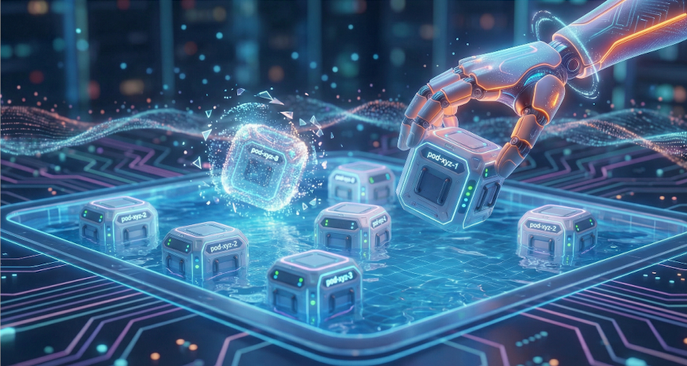
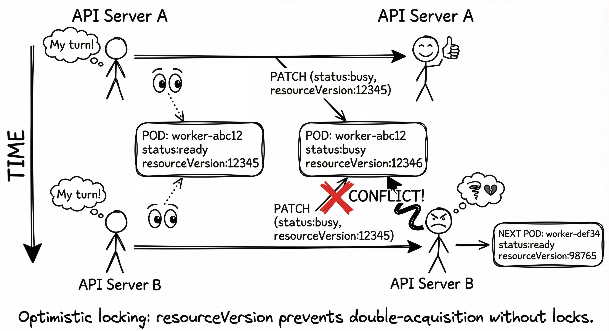
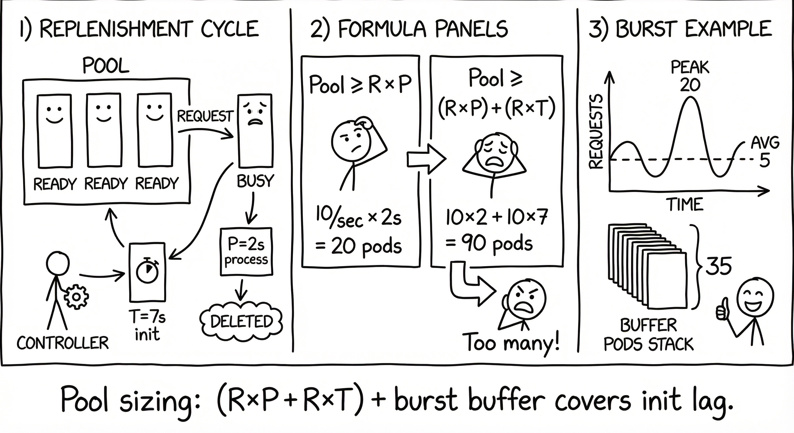

+++
title = 'Blazing Fast Pods - Idle Pool Pattern'
date = 2025-12-29T21:54:12-08:00
categories = ["Kubernetes", "Fast", "PodPool", "QuickStartup"]
+++

This is the last part in our quest for blazing fast pods on Kubernetes.
In [Blazing Fast Pods - Placeholder Pattern](https://medium.com/@the.gigi/blazing-fast-pods-placeholder-pattern-a1b5781fddce) we saw how to get a pod scheduled immediately. In [Blazing Fast Pods - Image Preloading](https://medium.com/@the.gigi/blazing-fast-pods-image-preloading-421cadd91065) we ensured container images are already present on nodes. Now, we'll complete the journey with the idle pool pattern - maintaining a pool of ready-to-go pods that can be claimed instantly when needed.

**"The best time to plant a tree was 20 years ago. The second best time is now." ~ Chinese Proverb**

<!--more-->



## ⚠️ The Problem ⚠️

Even if we can schedule pods immediately with the placeholder pattern and preload the all images the pod still needs to do a lot of work before it's ready:

- Start containers
- Run initialization code
- Load data into memory
- Establish connections to databases and services
- Warm up caches
- Load ML models and embeddings

For example, here's a pod that needs to load a face recognition model and embeddings for multiple face images:

```shell
❯ kubectl run face-worker --image=g1g1/face-it-worker --restart=Never
pod/face-worker created

❯ kubectl wait --for=condition=Ready pod/face-worker --timeout=60s
pod/face-worker condition met

❯ kubectl describe pod face-worker | rg Events: -A 15
Events:
  Type    Reason     Age   From               Message
  ----    ------     ----  ----               -------
  Normal  Scheduled  22s   default-scheduler  Successfully assigned default/face-worker to kind-control-plane
  Normal  Pulled     22s   kubelet            Container image "g1g1/face-it-worker" already present on machine
  Normal  Created    22s   kubelet            Created container: face-worker
  Normal  Started    22s   kubelet            Started container face-worker
```

The container started immediately (image was preloaded), but let's check the application logs:

```shell
❯ kubectl logs face-worker | tail -5
2025-12-29T10:32:45Z INFO Loading face recognition model...
2025-12-29T10:32:48Z INFO Model loaded (3.2s)
2025-12-29T10:32:48Z INFO Loading embeddings for 1000 faces...
2025-12-29T10:32:52Z INFO Embeddings loaded (4.1s)
2025-12-29T10:32:52Z INFO Worker ready to process requests
```

Even though the pod started quickly, the application took **7.3 seconds** to initialize. For time-sensitive workloads, this is unacceptable. Users expect instant responses. Also, initialization time can be much longer in the general case.


But, slow initialization is not the only problem. Sometimes, the initialization sequence might fail. This can be due to heavy load on services called during initialization or networking issues or any other intermittent issue.

## ✅ The Standard Solution ✅

If our workload is a long-running service where each pod can handle any request then the standard Kubernetes Deployment + Service + HPA + PDB is all you need. You can define a sufficiently large number of minimum replicas (e.g. 100) for the HPA and you can rest assured that you will always have at least that many pods up and running. If the load on these 100 pods goes above some threshold (CPU, memory or custom metrics) the HPA will resize the Deployment to ensure new replicas are created. This works great with the placeholder pattern and the image preloader.   

## 🏊 The Idle Pool Solution 🏊

However, some workloads require launching dedicated pods on the fly for each request. Kubernetes provides the Job resource for these situations, but there is no way to accelerate the initialization sequence for job pods. The idle pool pattern solves this by maintaining a pool of **pre-initialized pods** that are ready to handle requests immediately. Here's how it works:

1. **Create a pool of ready pods as a Kubernetes deployment** - Pods start up, run initialization, and become ready
2. **Label them as available** - The pods have `status=ready` label (this is the Deployment selector)
3. **When work arrives** - Detach a pod from the pool by changing its label to `status=busy`. It is not part of the Deployment anymore.
4. **Pool auto-replenishes** - Kubernetes deployment controller creates a replacement pod
5. **Process the work** - The detached pod handles the request with zero startup time
6. **Cleanup** - After work completes, the used pod just terminates (the Deployment already replaced it, although the replacement pod might not be ready yet)

The key insight is that **changing a pod's label removes it from the deployment's selector**, causing the deployment controller to create a replacement. This happens **while the original pod is still processing**, so the pool is quickly replenished.

The reason we don't return complete pods to the Deployment by changing the label back to `status=ready` is that the pod has potentially done sensitive work that might be too risky to clean up. The safest approach is to just discard completed pods.


For the rest of this article we will focus on this approach.

## 👨‍💻 Hands-On Example: Face-It 👨‍💻

Let's see this pattern in action with a practical (or not) example. We'll use a face recognition service, but the pattern applies to any workload that benefits from instant startup: LLM inference, database queries with connection pooling, data processing pipelines, etc.

We have an idle pool (regular Kubernetes Deployment) of face recognition workers and an API server that receives authentication requests with an image, detaches a pod from the pool and sends it the image to recognize based on a pre-configured set of vectors. The face recognition algorithm details are not relevant for discussing the idle pool pattern, but if you're curious the complete source code + documentation is available here:

https://github.com/the-gigi/face-it

The face recognition worker and the API server are both implemented in Rust, which is a language and an ecosystem I'm in the process of learning.

### The Setup

**Worker Deployment** (`worker-deployment.yaml`):

```yaml
apiVersion: apps/v1
kind: Deployment
metadata:
  name: worker
  namespace: face-it-workers
spec:
  replicas: 3
  selector:
    matchLabels:
      app: face-recognition-worker
      status: ready
  template:
    metadata:
      labels:
        app: face-recognition-worker
        status: ready
    spec:
      containers:
      - name: worker
        image: face-it-worker:latest
        ports:
        - containerPort: 8080
        readinessProbe:
          httpGet:
            path: /ready
            port: 8080
          initialDelaySeconds: 5
          periodSeconds: 5
        resources:
          requests:
            memory: "256Mi"
            cpu: "500m"
```

The critical parts:
- `replicas: 3` (We want 3 ready pods available)
- `status: ready` in both selector and template (This label controls pool membership)

**API Server Configuration**:

The API server searches for pods with both labels, picks a pod and changes its `status` label from `ready` to `busy`:

```rust
const WORKER_SELECTOR: &str = "app=face-recognition-worker,status=ready";

async fn acquire_pod(&self) -> Result<Option<Pod>> {
    // List all ready pods
    let pods = self.pod_ops.list_pods(&self.namespace, WORKER_SELECTOR).await?;

    if pods.is_empty() {
        return Ok(None);
    }

    // Shuffle to avoid thundering herd
    let mut shuffled = pods.clone();
    shuffled.shuffle(&mut rand::thread_rng());

    // Try to acquire a pod
    for pod in shuffled {
        let resource_version = pod.metadata.resource_version.as_ref()?;

        // Atomically change status=ready to status=busy
        match self.pod_ops.patch_pod_labels(
            &self.namespace,
            &pod.metadata.name,
            vec![("status".to_string(), "busy".to_string())],
            resource_version,  // Optimistic locking
        ).await {
            Ok(updated_pod) => {
                return Ok(Some(updated_pod));
            }
            Err(ApiError::Kubernetes(ref msg))
                if msg.contains("conflict") => {
                // Another API server instance got this pod, try next
                continue;
            }
            Err(e) => return Err(e),
        }
    }

    Ok(None)
}
```

### What Happens Step-by-Step

Let's trace through a request:

**Step 1: Initial State** - 3 ready pods in the pool

```shell
❯ kubectl get pods -n face-it-workers -l status=ready
NAME                      READY   STATUS    RESTARTS   AGE
worker-7d8f9c5b4-abc12    1/1     Running   0          5m
worker-7d8f9c5b4-def34    1/1     Running   0          5m
worker-7d8f9c5b4-ghi56    1/1     Running   0          5m
```

**Step 2: Request Arrives** - API server calls `acquire_pod()`

```shell
❯ curl -X POST http://api-server:8080/authenticate \
  -H "Content-Type: application/json" \
  -d '{"image": "base64encodedimage..."}'
```

**Step 3: Pod Acquired** - Label changes from `ready` to `busy`

The API server patches pod `worker-7d8f9c5b4-abc12`:

```shell
❯ kubectl get pods -n face-it-workers -l status=ready
NAME                      READY   STATUS    RESTARTS   AGE
worker-7d8f9c5b4-def34    1/1     Running   0          5m
worker-7d8f9c5b4-ghi56    1/1     Running   0          5m

❯ kubectl get pods -n face-it-workers -l status=busy
NAME                      READY   STATUS    RESTARTS   AGE
worker-7d8f9c5b4-abc12    1/1     Running   0          5m
```

Notice: Only 2 pods match `status=ready` now!

**Step 4: Deployment Creates Replacement**

The deployment controller sees only 2 pods match its selector, but it wants 3. It immediately creates a replacement.

The following get pods with watch command shows the new pod worker-7d8f9c5b4-jkl78 starting with a status of ContainerCreating and after two seconds it Running and seven seconds later it becomes ready.
```shell
❯ kubectl get pods -n face-it-workers -w
NAME                      READY   STATUS              RESTARTS   AGE
worker-7d8f9c5b4-abc12    1/1     Running             0          5m
worker-7d8f9c5b4-def34    1/1     Running             0          5m
worker-7d8f9c5b4-ghi56    1/1     Running             0          5m
worker-7d8f9c5b4-jkl78    0/1     ContainerCreating   0          1s
worker-7d8f9c5b4-jkl78    0/1     Running             0          3s
worker-7d8f9c5b4-jkl78    1/1     Running             0          10s
```

**Step 5: Work Completes** - Response time ~220ms (no cold start!)

```json
{
  "match": true,
  "confidence": 0.94,
  "processing_time_ms": 218
}
```

**Step 6: Pool is Full Again** - The replacement pod is ready

```shell
❯ kubectl get pods -n face-it-workers -l status=ready
NAME                      READY   STATUS    RESTARTS   AGE
worker-7d8f9c5b4-def34    1/1     Running   0          6m
worker-7d8f9c5b4-ghi56    1/1     Running   0          6m
worker-7d8f9c5b4-jkl78    1/1     Running   0          45s
```

The entire cycle took about 10 seconds (time to initialize a new pod), but the user experienced **zero wait time** because they got an already-initialized pod.


## 🔒 The Concurrency Challenge 🔒

What happens when multiple API server instances try to acquire the same pod simultaneously? This is where **optimistic locking** with Kubernetes resource versions comes in.

Every Kubernetes resource has a `metadata.resourceVersion` field that changes on every update. When we patch a pod's labels, we include the resource version we read:

```rust
// Read pod (includes current resource version)
let pod = self.pod_ops.get_pod(&self.namespace, "worker-abc12").await?;
let resource_version = pod.metadata.resource_version;  // "12345"

// Patch with resource version check
self.pod_ops.patch_pod_labels(
    &self.namespace,
    "worker-abc12",
    vec![("status", "busy")],
    &resource_version,  // "12345"
).await?;
```

If another API server instance patches the same pod first, the resource version changes to `12346`. When our patch arrives with version `12345`, Kubernetes rejects it with a conflict error. We simply try the next pod in our shuffled list.

This ensures **exactly-once acquisition** without distributed locks or coordination.



## 📊 Pool Sizing Strategy 📊

How many replicas should your pool have? To understand this, we first need to clarify how the pool replenishes.

### Understanding Pool Replenishment

Remember: **Pods are never returned to the pool**. Here's what actually happens:

1. **Pod Acquired**: API server changes pod label from `status=ready` to `status=busy` (detaches from deployment)
2. **Replacement Started**: Deployment controller immediately creates a new pod to replace it
3. **Original Pod Works**: The detached pod processes the request
4. **Original Pod Deleted**: After request completes, the used pod is destroyed
5. **Replacement Becomes Ready**: The new pod finishes initialization and joins the pool

Note that step 5 may or may not happen before step 4.

The key insight: **The replacement pod doesn't reuse the terminated pod's resources immediately**. Kubernetes needs time to:
- Schedule the new pod (usually instant with available node capacity)
- Pull the image (instant if preloaded)
- Start the container (1-2 seconds)
- Run initialization code (loading models, data, etc.) - **this is the potential bottleneck**

The most critical element is to ensure that there are nodes available to schedule new replacement pods with pre-loaded images. 
Then, the initialization time (**T seconds**) becomes the limiting factor for pool replenishment.

### 1. Request Rate and Processing Time

If requests arrive at **R requests/second** and each pod takes **P seconds** to process a request, you need at least:

```
Pool Size ≥ R × P
```

**Example:**
- 10 requests/second
- 2 seconds per request
- Pool size: **10 × 2 = 20 pods**

This assumes pods become available instantly after processing. But they don't - they get deleted and their nodes become available for replacement pods.

### 2. Accounting for Replenishment Time

Each acquired pod takes **T seconds** to be replaced by a ready pod. During this time, your pool has one fewer available pod. If your request rate is high, you need extra pods to cover this gap:

```
Pool Size ≥ (R × P) + (R × T)
```

**Example:**
- 10 requests/second
- 2 seconds per request
- 7 seconds to replenish (initialize new pod)
- Pool size: **(10 × 2) + (10 × 7) = 90 pods**

Wait, that's a lot of pods! This is why pool sizing matters and why reducing initialization time is critical.

### 3. Burst Capacity

For variable workloads, you want extra capacity for bursts:

```
Pool Size = (R × P + T) + burst_buffer
```

**Example:**
- Average: 5 requests/second
- Peak: 20 requests/second
- 2 seconds per request (P)
- 1 second for initialization (T)
- Burst buffer: 20 pods
- Pool size: **5 × (2 + 1) + 20 = 35 pods**

Also, for many workloads the time per request (P) is variable, and then you have to decide if you calculate based on the average P or max P or something in between and rely on the buffer to handle situations where lots of active pods take longer than usual to complete.



### 4. Cost vs. Performance Trade-off

More pods = faster response but higher cost. Find the sweet spot:

- **Under-provisioned**: Requests wait for pod replenishment (slow)
- **Right-sized**: Requests always get a ready pod (fast)
- **Over-provisioned**: Idle pods waste resources (expensive)

Monitor these metrics:
- **Pool exhaustion rate**: How often do you run out of ready pods?
- **Average wait time**: Time spent waiting for a pod to become available

## 🔄 Managing Pools for Multiple Workloads 🔄

The previous techniques we explored (placeholder pattern and image preloading) apply universally to all pods. But the idle pool pattern is different - **each pool contains pods running a specific workload image**.

If your system handles multiple workload types (face recognition, document processing, video transcoding, etc.), you need separate pools for each:

**Face Recognition Pool**:
```yaml
apiVersion: apps/v1
kind: Deployment
metadata:
  name: face-recognition-pool
spec:
  replicas: 5
  selector:
    matchLabels:
      workload: face-recognition
      status: ready
  template:
    metadata:
      labels:
        workload: face-recognition
        status: ready
    spec:
      containers:
      - name: worker
        image: the-org/face-recognition-worker:v1.2.3
        resources:
          requests:
            memory: "512Mi"
            cpu: "1000m"
```

**Document Processing Pool**:
```yaml
apiVersion: apps/v1
kind: Deployment
metadata:
  name: document-processing-pool
spec:
  replicas: 10
  selector:
    matchLabels:
      workload: document-processing
      status: ready
  template:
    metadata:
      labels:
        workload: document-processing
        status: ready
    spec:
      containers:
      - name: worker
        image: the-org/document-processor:v2.0.1
        resources:
          requests:
            memory: "1Gi"
            cpu: "2000m"
```

**Video Transcoding Pool**:
```yaml
apiVersion: apps/v1
kind: Deployment
metadata:
  name: video-transcoding-pool
spec:
  replicas: 3
  selector:
    matchLabels:
      workload: video-transcoding
      status: ready
  template:
    metadata:
      labels:
        workload: video-transcoding
        status: ready
    spec:
      containers:
      - name: worker
        image: the-org/video-transcoder:v3.1.0
        resources:
          requests:
            memory: "2Gi"
            cpu: "4000m"
```

Your API server routes requests to the appropriate pool based on the workload type. Each pool runs a different container image optimized for its specific task.

### Resource-Based Pools for the Same Workload

Sometimes you may want multiple pools with the **same image** but different resource allocations to handle varying request complexity:

**Small Jobs Pool** (fast, lightweight requests):
```yaml
metadata:
  name: face-recognition-small
spec:
  replicas: 20
  selector:
    matchLabels:
      workload: face-recognition
      size: small
      status: ready
  template:
    spec:
      containers:
      - name: worker
        image: myorg/face-recognition-worker:v1.2.3
        resources:
          requests:
            memory: "256Mi"
            cpu: "500m"
```

**Large Jobs Pool** (complex, resource-intensive requests):
```yaml
metadata:
  name: face-recognition-large
spec:
  replicas: 5
  selector:
    matchLabels:
      workload: face-recognition
      size: large
      status: ready
  template:
    spec:
      containers:
      - name: worker
        image: myorg/face-recognition-worker:v1.2.3
        resources:
          requests:
            memory: "2Gi"
            cpu: "4000m"
```

This approach lets you optimize resource allocation and pool sizes based on both workload type and request complexity.

## 🎯 Idle Pool Design Considerations 🎯

### 1. Why Not Return Pods to the Pool?

You might wonder: why delete used pods instead of returning them to the pool by changing the label back to `status=ready`?

The answer is **simplicity and safety**:

**Simpler Logic**: Deleting is a one-way operation. If you return pods to the pool, you need:
- State management (busy → cleaning → ready transitions)
- Cleanup verification logic
- Error handling for failed cleanup
- Monitoring to ensure pods are actually clean

With deletion, you just terminate the pod and let the deployment create a fresh one. No state machine, no cleanup validation.

**Guaranteed Fresh State**: A new pod from the deployment is guaranteed to:
- Start with a clean memory space
- Run the full initialization sequence
- Have no leftover state from previous work
- Be identical to all other pods in the pool

**Security Isolation**: Even though pod memory is cleared on deletion, during processing the pod might have:
- Written sensitive data to logs
- Created temporary files
- Cached credentials or keys
- Modified shared volumes

Deleting ensures complete isolation between requests. This is especially important for sensitive workloads like biometric authentication, payment processing, or healthcare data.

**Deployment Controller Handles It**: The deployment controller already knows how to create replacement pods. Why reinvent that logic? Let Kubernetes do what it does best.

### 2. When to Use Idle Pools

Idle pools make sense when:

- Initialization is expensive
- Response time matters (user-facing)
- Workload is bursty (unpredictable traffic)
- Cost of idle pods is acceptable

Idle pools don't make sense when:

- Initialization is fast (<100ms)
- Workload is predictable and steady
- Resources are extremely constrained

### 3. Dynamically adjusting the pool size

We discussed how to calculate the pool size based on expected request rate and the duration of a request. We also introduced a buffer to handle short bursts, but if there is a sustained increased load then even our buffer will be exhausted quickly. Our pods will become pending and have to wait for new nodes to be scheduled, the daemonset to pull the images  and incur the initialization's overhead. Note that the lead time for adding capacity is minutes when the pool is exhausted. If this is a real concern, the solution is an elastic pool where a controller oversees the pool saturation and when it reaches let's say 50% it increases the size by let's say 25%. So, ideally the reaming 50% capacity will be sufficient to service requests for a few minutes until the extra capacity comes online. This is obviously even more expansive as we provision a large amount of compute that is typically unused.  


### 4. Combining All Three Patterns

For truly blazing fast pods, use all three patterns together:

1. **Placeholder Pattern** → Immediate scheduling
2. **Image Preloading** → No image pull time
3. **Idle Pool Pattern** → No initialization time

Result: **Instant pod availability with zero cold start**

## 🏠 Take Home Points 🏠

- Even with scheduled pods and preloaded images, initialization time (loading data, warming caches, establishing connections) creates cold starts
- The idle pool pattern maintains a pool of pre-initialized pods that are ready to handle requests immediately
- Pods are detached from the pool by changing labels, triggering automatic replenishment by the deployment controller
- Pool sizing depends on request rate, processing time, and replenishment time - monitor and adjust
- Use optimistic locking (Kubernetes resource versions) to handle concurrent acquisition across multiple API server instances
- Consider multiple pools for different workload types (fast/heavy, CPU/GPU, different regions)
- Combine with placeholder pattern and image preloading for zero cold starts
- It's gonna cost ya!

🇨🇳 再见，我的朋友们 🇨🇳

