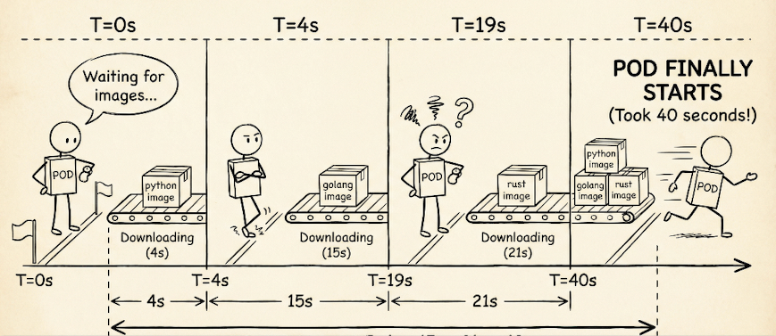
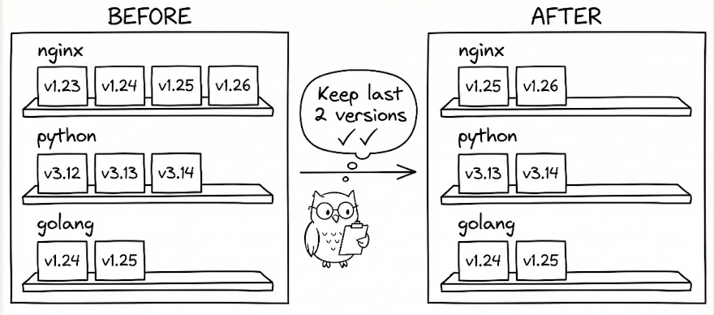

+++
title = 'Blazing Fast Pods - Image Preloading'
date = 2025-12-14T21:54:12-08:00
categories = ["Kubernetes", "Images", "Preloading", "Fast"]
+++

Let's continue our journey towards blazing fast pods on Kubernetes.
In [Blazing Fast Pods - Placeholder Pattern](https://medium.com/@the.gigi/blazing-fast-pods-placeholder-pattern-a1b5781fddce)

we saw how to get a pod scheduled immediately. But, that's just the beginning. Once the pod is scheduled to a node
Kubernetes needs to download the images of all its containers before it can run. Ideally, the images are already on the
node. Let's see how to make it happen every time.

**“Victory loves preparation” ~ Latin proverb**

<!--more-->


## The problem

The problem is that large images can take a while to download into the node. For example, here I run my favorite debug
pod

```
❯ kubectl run -it --image g1g1/py-kube -- bash
All commands and output from this session will be recorded in container logs, including credentials and sensitive information passed through the command prompt.
If you don't see a command prompt, try pressing enter.
kuser@bash:/app$
```

Let's check the events and see how long it took to load the image:

```
❯ kubectl describe po bash | rg Events: -A 10
Events:
  Type    Reason     Age    From               Message
  ----    ------     ----   ----               -------
  Normal  Scheduled  4m16s  default-scheduler  Successfully assigned default/bash to kind-control-plane
  Normal  Pulling    4m16s  kubelet            Pulling image "g1g1/py-kube"
  Normal  Pulled     4m     kubelet            Successfully pulled image "g1g1/py-kube" in 15.981s (15.981s including waiting). Image size: 129338587 bytes.
  Normal  Created    4m     kubelet            Created container: bash
  Normal  Started    4m     kubelet            Started container bash
```

So, it took about 16 seconds to download 129,338,587 bytes for this image. That's compressed layers that need to be
decompressed and copied to disk. The bigger the image the longer the wait. But, that's not all. If your pod has multiple
containers, Kubernetes will load the images for each container sequentially. There is no way to download images in
parallel to the same node.

Here is a pod with three containers.

```
echo 'apiVersion: v1
  kind: Pod
  metadata:
    name: tri-lang
  spec:
    restartPolicy: Never
    containers:
    - name: python
      image: python:3.12-slim
      command: ["sleep","infinity"]
    - name: golang
      image: golang:1.23
      command: ["sleep","infinity"]
    - name: rust
      image: rust:1.83
      command: ["sleep","infinity"]' | kubectl apply -f -
pod/tri-lang created      
```

Let's see how it long takes to load all the images:

```
❯ kubectl describe po tri-lang | rg Events: -A 20
Events:
  Type    Reason     Age   From               Message
  ----    ------     ----  ----               -------
  Normal  Scheduled  105s  default-scheduler  Successfully assigned default/tri-lang to kind-control-plane
  Normal  Pulling    105s  kubelet            Pulling image "python:3.12-slim"
  Normal  Pulled     101s  kubelet            Successfully pulled image "python:3.12-slim" in 4.425s (4.425s including waiting). Image size: 43474862 bytes.
  Normal  Created    100s  kubelet            Created container: python
  Normal  Started    100s  kubelet            Started container python
  Normal  Pulling    100s  kubelet            Pulling image "golang:1.23"
  Normal  Pulled     85s   kubelet            Successfully pulled image "golang:1.23" in 15.727s (15.727s including waiting). Image size: 293403951 bytes.
  Normal  Created    85s   kubelet            Created container: golang
  Normal  Started    85s   kubelet            Started container golang
  Normal  Pulling    85s   kubelet            Pulling image "rust:1.83"
  Normal  Pulled     63s   kubelet            Successfully pulled image "rust:1.83" in 21.129s (21.129s including waiting). Image size: 590583972 bytes.
  Normal  Created    63s   kubelet            Created container: rust
  Normal  Started    63s   kubelet            Started container rust
```

As you can see the first image (Python) is downloaded and the container is started and only then the Golang image is
downloaded and finally Rust. Overall it took more than 40 seconds to download the images.

But, it can be even worse. If another pod is scheduled to the node at about the same time and that pod starts downloading an image our
pod might have to wait for that pod.



The bottom line is that big images can really slow down your pod. We want our pods to be blazing fast. Let's get it!

## The Solution

The solution is conceptually super simple. The images should already be present on the node, so we don't have to download them. Let's
create another pod with the same containers.

```
❯echo 'apiVersion: v1
kind: Pod
metadata:
  name: tri-lang2
spec:
  restartPolicy: Never
  containers:
  - name: python
    image: python:3.12-slim
    command: ["sleep","infinity"]
  - name: golang
    image: golang:1.23
    command: ["sleep","infinity"]
  - name: rust
    image: rust:1.83
    command: ["sleep","infinity"]' | kubectl apply -f -
pod/tri-lang2 created
```

Now, the pod starts within a second because all the images are already present:

```
❯kubectl describe po tri-lang2 | rg Events: -A 20
Events:
  Type    Reason     Age   From               Message
  ----    ------     ----  ----               -------
  Normal  Scheduled  63s   default-scheduler  Successfully assigned default/tri-lang2 to kind-control-plane
  Normal  Pulled     63s   kubelet            Container image "python:3.12-slim" already present on machine
  Normal  Created    63s   kubelet            Created container: python
  Normal  Started    63s   kubelet            Started container python
  Normal  Pulled     63s   kubelet            Container image "golang:1.23" already present on machine
  Normal  Created    63s   kubelet            Created container: golang
  Normal  Started    63s   kubelet            Started container golang
  Normal  Pulled     63s   kubelet            Container image "rust:1.83" already present on machine
  Normal  Created    63s   kubelet            Created container: rust
  Normal  Started    63s   kubelet            Started container rus
```

## The Image Preloader

OK. But, how do we make sure the images are always present on every node? This is where the Kubernetes DaemonSet comes in.
The DaemonSet is a workload that is automatically provisioned on every node (or on every node that meets some condition).

But, we don't want the DaemonSet to actually hog any resources on the node. All we want are the images. A nice trick is
use init containers. Init containers in a pod are containers that Kubernetes loads before the regular containers,
and when they are done it unloads them.


Let's put it all together.

```shell
echo '
apiVersion: apps/v1
kind: DaemonSet
metadata:
  name: image-preloader
  namespace: kube-system
spec:
  selector:
    matchLabels:
      app: image-preloader
  template:
    metadata:
      labels:
        app: image-preloader
    spec:
      tolerations:
      - operator: Exists
      initContainers:
      - name: preload-py-kube
        image: g1g1/py-kube
        imagePullPolicy: IfNotPresent
        command: ["/bin/sh", "-c", "echo preloaded g1g1/py-kube"]
      - name: preload-python
        image: python:3.12-slim
        imagePullPolicy: IfNotPresent
        command: ["/bin/sh", "-c", "echo preloaded python:3.12-slim"]
      - name: preload-golang
        image: golang:1.23
        imagePullPolicy: IfNotPresent
        command: ["/bin/sh", "-c", "echo preloaded golang:1.23"]
      - name: preload-rust
        image: rust:1.83
        imagePullPolicy: IfNotPresent
        command: ["/bin/sh", "-c", "echo preloaded rust:1.83"]
      containers:
      - name: pause
        image: registry.k8s.io/pause:3.9
        imagePullPolicy: IfNotPresent
' | kubectl apply -f -
```

## Getting serious

Let's do a full hands-on repro from scratch on a local `kind` cluster. (Your pod names and timings may differ.)

### 1. Select your kind context

Make sure you're working with your kind cluster. The output confirms we're connected to a single-node cluster that's
Ready.

```shell
❯ kubectl config use-context kind-kind
Switched to context "kind-kind".

❯ kubectl get nodes -o wide
NAME                 STATUS   ROLES           AGE   VERSION   INTERNAL-IP   EXTERNAL-IP   OS-IMAGE                         KERNEL-VERSION     CONTAINER-RUNTIME
kind-control-plane   Ready    control-plane   28h   v1.33.1   172.19.0.7    <none>        Debian GNU/Linux 12 (bookworm)   6.10.14-linuxkit   containerd://2.1.1
```

### 2. Delete pods and the preloader

Clean up any existing test pods and remove the old preloader DaemonSet if it exists. This ensures we start from a clean
state.

```shell
❯ kubectl delete pod --all -n default
pod "tri-lang" deleted

❯ kubectl -n kube-system delete ds image-preloader --ignore-not-found=true
DaemonSet.apps "image-preloader" deleted
```

### 3. Connect to the node and remove images

In `kind`, each node is a Docker container. We'll exec into it and use containerd tooling to list and remove images.
This step simulates starting with a node that doesn't have our application images cached.

List the images (output shows 5 image references - one image has both a tag and digest reference):

```shell
❯ docker exec kind-control-plane sh -lc 'ctr -n k8s.io images ls -q | egrep "(g1g1/py-kube|python:3.12-slim|golang:1.23|rust:1.83)" || true'
docker.io/g1g1/py-kube:latest
docker.io/g1g1/py-kube@sha256:1910d1835ca6b92ce1611f4115928a417e17d06b2ee89ce65aafda3070d044f9
docker.io/library/golang:1.23
docker.io/library/python:3.12-slim
docker.io/library/rust:1.83
```

Remove them (the output echoes each image reference as it's deleted):

```shell
❯ docker exec kind-control-plane sh -lc 'ctr -n k8s.io images ls -q | egrep "(g1g1/py-kube|python:3.12-slim|golang:1.23|rust:1.83)" | xargs -r ctr -n k8s.io images rm'
docker.io/g1g1/py-kube:latest
docker.io/g1g1/py-kube@sha256:1910d1835ca6b92ce1611f4115928a417e17d06b2ee89ce65aafda3070d044f9
docker.io/library/golang:1.23
docker.io/library/python:3.12-slim
docker.io/library/rust:1.83
```

Verify they're gone (the "(none)" output confirms no matching images remain):

```shell
❯ docker exec kind-control-plane sh -lc 'ctr -n k8s.io images ls -q | egrep "(g1g1/py-kube|python:3.12-slim|golang:1.23|rust:1.83)" || echo "(none)"'
(none
```

### 4. the preloader and verify it pulled all images

Deploy the DaemonSet using the `echo ... | kubectl apply -f -` command from the previous section. The `rollout status`
command blocks until the DaemonSet is fully deployed.

```shell
❯ kubectl -n kube-system rollout status ds/image-preloader --timeout=180s
Waiting for daemon set "image-preloader" rollout to finish: 0 of 1 updated pods are available...
daemon set "image-preloader" successfully rolled out
```

Now inspect the preloader pod events. This is the proof that the preloader actually pulled all the images. Notice:

- Each init container pulls its image **sequentially** (not in parallel)
- Pull times: g1g1/py-kube (7.4s), python (4.2s), golang (11.8s), rust (18.1s), pause (1.3s)
- Total time: ~43 seconds to pull all images
- The images range from 268KB to 590MB in size

```shell
❯ kubectl -n kube-system describe pod -l app=image-preloader | rg "^Events:" -A 50
Events:
  Type    Reason     Age   From               Message
  ----    ------     ----  ----               -------
  Normal  Scheduled  58s   default-scheduler  Successfully assigned kube-system/image-preloader-4p7pd to kind-control-plane
  Normal  Pulling    58s   kubelet            Pulling image "g1g1/py-kube"
  Normal  Pulled     51s   kubelet            Successfully pulled image "g1g1/py-kube" in 7.362s (7.362s including waiting). Image size: 129338587 bytes.
  Normal  Created    51s   kubelet            Created container: preload-py-kube
  Normal  Started    51s   kubelet            Started container preload-py-kube
  Normal  Pulling    49s   kubelet            Pulling image "python:3.12-slim"
  Normal  Pulled     45s   kubelet            Successfully pulled image "python:3.12-slim" in 4.222s (4.222s including waiting). Image size: 43474862 bytes.
  Normal  Created    45s   kubelet            Created container: preload-python
  Normal  Started    45s   kubelet            Started container preload-python
  Normal  Pulling    44s   kubelet            Pulling image "golang:1.23"
  Normal  Pulled     32s   kubelet            Successfully pulled image "golang:1.23" in 11.79s (11.79s including waiting). Image size: 293403951 bytes.
  Normal  Created    32s   kubelet            Created container: preload-golang
  Normal  Started    32s   kubelet            Started container preload-golang
  Normal  Pulling    31s   kubelet            Pulling image "rust:1.83"
  Normal  Pulled     13s   kubelet            Successfully pulled image "rust:1.83" in 18.137s (18.137s including waiting). Image size: 590583972 bytes.
  Normal  Created    13s   kubelet            Created container: preload-rust
  Normal  Started    13s   kubelet            Started container preload-rust
  Normal  Pulling    12s   kubelet            Pulling image "registry.k8s.io/pause:3.9"
  Normal  Pulled     11s   kubelet            Successfully pulled image "registry.k8s.io/pause:3.9" in 1.269s (1.269s including waiting). Image size: 268051 bytes.
  Normal  Created    11s   kubelet            Created container: pause
  Normal  Started    10s   kubelet            Started container pause
```

### 5. Create `tri-lang` and confirm zero pulling

Now let's create a regular pod using the same three images. The `wait` command blocks until the pod is Ready.

```shell
❯ echo 'apiVersion: v1
kind: Pod
metadata:
  name: tri-lang
spec:
  restartPolicy: Never
  containers:
  - name: python
    image: python:3.12-slim
    command: ["sleep","infinity"]
  - name: golang
    image: golang:1.23
    command: ["sleep","infinity"]
  - name: rust
    image: rust:1.83
    command: ["sleep","infinity"]' | kubectl apply -f -
pod/tri-lang created

❯ kubectl -n default wait --for=condition=Ready pod/tri-lang --timeout=180s
pod/tri-lang condition met
```

Let's check the events and notice the key difference: **all three images show "already present on machine"**. No
pulling! The pod becomes Ready in about 1 second instead of the 40+ seconds it would have taken to pull the images. This
is the payoff of image preloading.

```shell
❯ kubectl describe po tri-lang | rg "^Events:" -A 20
Events:
  Type    Reason     Age   From               Message
  ----    ------     ----  ----               -------
  Normal  Scheduled  21s   default-scheduler  Successfully assigned default/tri-lang to kind-control-plane
  Normal  Pulled     20s   kubelet            Container image "python:3.12-slim" already present on machine
  Normal  Created    20s   kubelet            Created container: python
  Normal  Started    20s   kubelet            Started container python
  Normal  Pulled     20s   kubelet            Container image "golang:1.23" already present on machine
  Normal  Created    20s   kubelet            Created container: golang
  Normal  Started    20s   kubelet            Started container golang
  Normal  Pulled     20s   kubelet            Container image "rust:1.83" already present on machine
  Normal  Created    20s   kubelet            Created container: rust
  Normal  Started    20s   kubelet            Started container rust
```

## Image Preloading Design

Image preloading is a useful and effective technique on the quest for the holy grale of instant pods. But, not every pod
requires instant loading. Your pre-loader DaemonSet shouldn't pre-load each and every image you may want to run in your
cluster. Exercise judgement and curate the set of images you need to preload.

Note that the DaemonSet manifest configuration includes the versions of every image and must be updated regularly (
hopefully you have a proper GitOps-based CI/CD process).

If you run a sophisticated setup with multiple node pools where specific workloads are desginated to specific node pools
then it makes sense to have multiple pre-loader DaemonSets with node affinity and toleration for the target node pools.

### Example: Multiple Node Pools with Targeted Preloading

Let's say you have two node pools in your cluster:

**1. ML Node Pool** - GPU nodes for machine learning workloads:

- Label: `workload-type=ml`
- Taint: `workload=ml:NoSchedule` (prevents non-ML pods from scheduling here)

**2. Web Node Pool** - Standard nodes for web services:

- Label: `workload-type=web`
- Taint: `workload=web:NoSchedule` (prevents non-web pods from scheduling here)

Here's how to create targeted preloader DaemonSets for each pool:

**ML Node Pool Preloader:**

```yaml
apiVersion: apps/v1
kind: DaemonSet
metadata:
  name: image-preloader-ml
  namespace: kube-system
spec:
  selector:
    matchLabels:
      app: image-preloader-ml
  template:
    metadata:
      labels:
        app: image-preloader-ml
    spec:
      # Target ML nodes with node affinity
      affinity:
        nodeAffinity:
          requiredDuringSchedulingIgnoredDuringExecution:
            nodeSelectorTerms:
              - matchExpressions:
                  - key: workload-type
                    operator: In
                    values:
                      - ml
      # Tolerate the ML taint
      tolerations:
        - key: workload
          operator: Equal
          value: ml
          effect: NoSchedule
      initContainers:
        # ML-specific images
        - name: preload-pytorch
          image: pytorch/pytorch:2.1.0-cuda12.1-cudnn8-runtime
          imagePullPolicy: IfNotPresent
          command: [ "/bin/sh", "-c", "echo preloaded pytorch" ]
        - name: preload-tensorflow
          image: tensorflow/tensorflow:2.15.0-gpu
          imagePullPolicy: IfNotPresent
          command: [ "/bin/sh", "-c", "echo preloaded tensorflow" ]
        - name: preload-jupyter
          image: jupyter/scipy-notebook:latest
          imagePullPolicy: IfNotPresent
          command: [ "/bin/sh", "-c", "echo preloaded jupyter" ]
      containers:
        - name: pause
          image: registry.k8s.io/pause:3.9
          imagePullPolicy: IfNotPresent
```

**Web Node Pool Preloader:**

```yaml
apiVersion: apps/v1
kind: DaemonSet
metadata:
  name: image-preloader-web
  namespace: kube-system
spec:
  selector:
    matchLabels:
      app: image-preloader-web
  template:
    metadata:
      labels:
        app: image-preloader-web
    spec:
      # Target web nodes with node affinity
      affinity:
        nodeAffinity:
          requiredDuringSchedulingIgnoredDuringExecution:
            nodeSelectorTerms:
              - matchExpressions:
                  - key: workload-type
                    operator: In
                    values:
                      - web
      # Tolerate the web taint
      tolerations:
        - key: workload
          operator: Equal
          value: web
          effect: NoSchedule
      initContainers:
        # Web-specific images
        - name: preload-nginx
          image: nginx:1.25-alpine
          imagePullPolicy: IfNotPresent
          command: [ "/bin/sh", "-c", "echo preloaded nginx" ]
        - name: preload-node
          image: node:20-alpine
          imagePullPolicy: IfNotPresent
          command: [ "/bin/sh", "-c", "echo preloaded node" ]
        - name: preload-redis
          image: redis:7-alpine
          imagePullPolicy: IfNotPresent
          command: [ "/bin/sh", "-c", "echo preloaded redis" ]
      containers:
        - name: pause
          image: registry.k8s.io/pause:3.9
          imagePullPolicy: IfNotPresent
```

This approach ensures:

- ML images (large, GPU-enabled) only preload on expensive GPU nodes
- Web images (smaller, more frequent) only preload on standard nodes
- Each pool gets exactly the images it needs, nothing more
- Resource efficiency: no wasted disk space on unnecessary images

### Image Storage and Cleanup Strategy

Image preloading is powerful, but it introduces important operational considerations around disk space management and garbage collection. Let's address them systematically.

## Where Are Images Stored?

Container images are stored on the **node's root volume** under `/var/lib/containerd/` (or `/var/lib/docker/` for older setups).

**In different environments:**
- **kind**: Docker container's filesystem (typically 20-50GB)
- **EKS**: EC2 instance root EBS volume (default often 20GB - may be too small!)
- **GKE**: Boot disk of the node (default varies by machine type)
- **AKS**: OS disk of the node (default 30-128GB depending on VM size)

**Critical**: You need to allocate sufficient disk space for:
1. Operating system (~5-10GB)
2. Preloaded images (e.g., 4 images × 300MB each = 1.2GB)
3. Application workload images (not preloaded)
4. Multiple versions during updates (×2-3 multiplier)
5. Safety buffer (20-30%)

**Example calculation:**
```
Preloaded: 4 images × 300MB = 1.2GB
App images: 10 images × 500MB = 5GB
Versions: 2x multiplier = 12.4GB
Buffer: 30% = 16.1GB
OS: 10GB
Total: ~30GB minimum
```

## The Kubelet Garbage Collection Problem

The [Kubelet automatically cleans up unused images](https://kubernetes.io/docs/concepts/architecture/garbage-collection/#containers-images) every 5 minutes when disk usage crosses `imageGCHighThresholdPercent` (default: 85%). It removes images based on **last used time** (oldest first). This is a problem for our preloaded images as the kubelet might remove important images that will require pulling when a container needs them.


## The Solution: Custom Image Cleanup

The solution has two parts that work together:

### Part 1: Disable Kubelet's Automatic Image GC**

We configure kubelet to never trigger automatic garbage collection:

```yaml
apiVersion: kubelet.config.k8s.io/v1beta1
kind: KubeletConfiguration
imageGCHighThresholdPercent: 100  # Never trigger GC (disk must be 100% full)
imageGCLowThresholdPercent: 80    # If GC somehow triggers, stop at 80%
```

**What this does:**

- **When disk < 100%**: Kubelet does nothing. Images stay forever.
- **When disk = 100%**: Kubelet tries GC as a last resort (but we have much bigger problems if ran out of disk space completely)

Our custom cleanup (Part 2) is responsible for all image management. 

### Part 2: Add Smart Cleanup to the Preloader

Since we've disabled kubelet's automatic cleanup in Part 1, we need our own cleanup logic. Instead of deploying a separate DaemonSet, we can simply **replace the useless pause container** with a cleanup container!

1. **Init containers**: Preload images (same as before)
2. **Main container**: Replace `pause` with a cleanup container that:
   - Runs cleanup daily at 3 AM
   - Keeps last 2 versions of ANY image on the node
   - Always checks if images are in use before removing

Here's the improved DaemonSet:

```yaml
apiVersion: apps/v1
kind: DaemonSet
metadata:
  name: image-preloader
  namespace: kube-system
spec:
  selector:
    matchLabels:
      app: image-preloader
  template:
    metadata:
      labels:
        app: image-preloader
    spec:
      tolerations:
      - operator: Exists
      hostPID: true
      initContainers:
      - name: preload-py-kube
        image: g1g1/py-kube
        imagePullPolicy: IfNotPresent
        command: ["/bin/sh", "-c", "echo preloaded g1g1/py-kube"]
      - name: preload-python
        image: python:3.12-slim
        imagePullPolicy: IfNotPresent
        command: ["/bin/sh", "-c", "echo preloaded python:3.12-slim"]
      - name: preload-golang
        image: golang:1.23
        imagePullPolicy: IfNotPresent
        command: ["/bin/sh", "-c", "echo preloaded golang:1.23"]
      - name: preload-rust
        image: rust:1.83
        imagePullPolicy: IfNotPresent
        command: ["/bin/sh", "-c", "echo preloaded rust:1.83"]
      containers:
      - name: cleanup
        image: alpine:3.19
        command: ["/bin/sh", "-c"]
        args:
        - |
          cleanup_images() {
            echo "=== Image cleanup on $(hostname) at $(date) ==="

            # Get all images grouped by base name
            nsenter -t 1 -m -u -i -n -p ctr -n k8s.io images ls -q | while read image; do
              # Extract base name (without tag/digest)
              base=$(echo "$image" | sed 's/:.*$//' | sed 's/@.*$//')
              echo "$base|$image"
            done | sort > /tmp/all_images.txt

            # For each unique base, keep last 2 versions
            cat /tmp/all_images.txt | cut -d'|' -f1 | uniq | while read base; do
              # Get all versions of this image, keep newest 2
              grep "^${base}|" /tmp/all_images.txt | cut -d'|' -f2 | tail -n +3 | while read old_image; do
                # Check if image is in use
                in_use=$(nsenter -t 1 -m -u -i -n -p ctr -n k8s.io containers ls -q | \
                  xargs -I {} nsenter -t 1 -m -u -i -n -p ctr -n k8s.io containers info {} 2>/dev/null | \
                  grep -c "$old_image" || true)

                if [ "$in_use" -eq 0 ]; then
                  echo "  Removing old version: $old_image"
                  nsenter -t 1 -m -u -i -n -p ctr -n k8s.io images rm "$old_image" 2>/dev/null || true
                else
                  echo "  Keeping (in use): $old_image"
                fi
              done
            done

            rm -f /tmp/all_images.txt
            echo "=== Cleanup complete ==="
          }

          while true; do
            if [ "$(date +%H)" = "03" ] && [ "$(date +%M)" = "00" ]; then
              cleanup_images
              sleep 120
            fi
            sleep 60
          done
        securityContext:
          privileged: true
```

**Key changes from the simple version:**
1. Added `hostPID: true` to access the node's containerd
2. Replaced `pause` container with `cleanup` container
3. Cleanup keeps last 2 versions of **every image** (not just preloaded ones)

**Example cleanup behavior:**
```
All images on disk before cleanup:
- nginx:1.23, 1.24, 1.25, 1.26
- python:3.12, 3.13, 3.14
- golang:1.24, 1.25
- the-app:v1.0, v1.1, v1.2, v1.3


After cleanup (keeps last 2 of each):
- nginx:1.25, 1.26 ✓ (last 2 kept)
- python:3.13, 3.14 ✓ (last 2 kept)
- golang:1.24, 1.25 ✓ (both kept - only 2 exist)
- the-app:v1.2, v1.3 ✓ (last 2 kept)

Removed: nginx:1.23, 1.24, python:3.12, the-app:v1.0, v1.1
```



## 🏠 Take Home Points 🏠

- Once a pod is scheduled on a node it needs to pull all its container images if not already present
- Downloading large images can take a substantial time, especially if the pod has multiple containers
- Even worse, the images must be pulled one after the other and might even be blocked by other pods pulling images
- The solution is simply to ensure the images are always available on every node by using a preloader DaemonSet
- You can have different preloader DaemonSets with different images on different node pools
- Disable the built-in kubelet image GC and let preloader take care of intelligent unused image pruning

🇪🇸 Agur lagunak 🇪🇸
