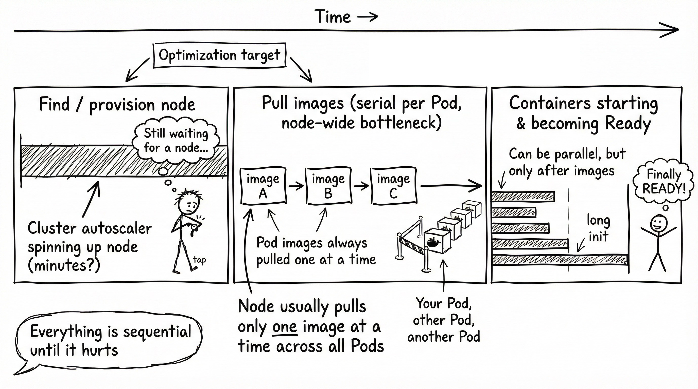
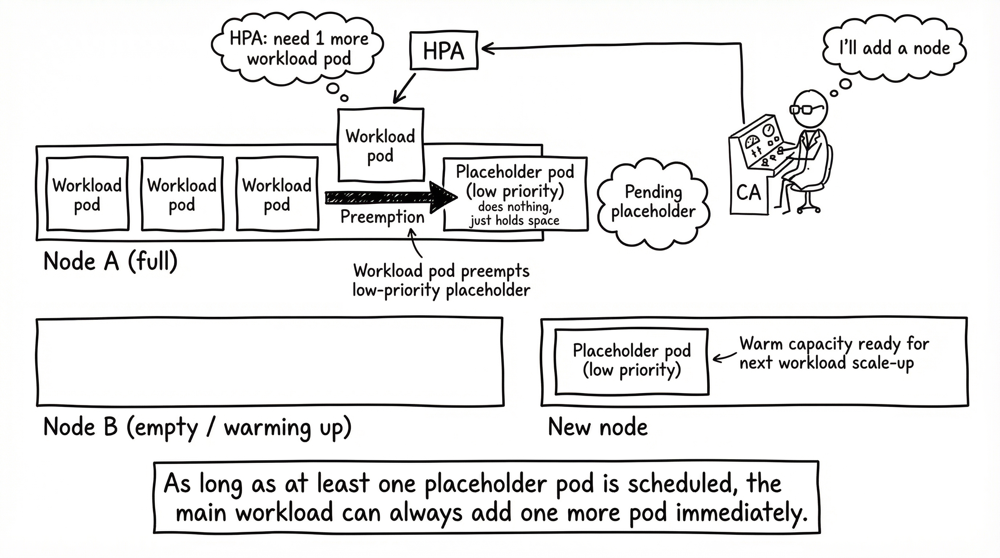

+++
title = 'Blazing Fast Pods - Placeholder Pattern'
date = 2025-12-14T21:54:12-08:00
categories = ["Kubernetes", "Scheduling", "Placeholder", "Capacity"]
+++

🚨 IMPORTANT ANNOUNCEMENT!!!! 🚨 I decided to cut down on the emojis in my articles. If you come here for the emojis you're out of luck ☘️.

In
the [Art and Science of Kubernetes Binpacking](https://medium.com/@the.gigi/the-art-and-science-of-kubernetes-bin-packing-b878746f41f0)
I waxed poetic about squeezing every last bit of resources in your cluster and minimizing your costs. This time we're
looking at a different use case - minimizing the time it takes to get new pods up and running. Let me be very clear it's
going to cost you 💰!

**“Speed costs money. How fast do you want to go?”  ~ Unknown**

<!--more-->


## 💥 The Problem 💥 

Our goal is to have pods scheduled and ready to go ASAP. But, there are three things need to happen before a pod is good to go:

1. There must be a node that the pod can be scheduled to
2. The images of all the containers in the pod must be pulled to this node
3. All the containers must be ready

All of them take time. If you need to provision a new node, it can take minutes. If the node doesn't have the images you need you can spend a long time pulling images. Finally, if a container in your pod has a long initialization sequence it adds up. Note that all these happen in a sequence, so they add up. Multiple containers can get ready in parallel, but they have to wait for a node to be available first and only then the images can be pulled.

Images for a pod are ALWAYS pulled serially. So, if you have multiple containers in a pod the time to pull all the images accumulates. It can actually be worse if another pod is scheduled to the same node because by default the node sends just one request at a time to pull images across all pods. So, our pod may have to wait for other pod's images to be pulled.

See https://kubernetes.io/docs/concepts/containers/images/#serial-and-parallel-image-pulls for all the gory details.

Today, we're going to cover the first point: making sure we always have a node ready to go and our pods can always be scheduled immediately. 
We will deal with the points in future blogs.




## ⚡ Instant Node Provisioning ⚡

OK. If there is no available node for our pod there are no tricks. We have to wait for a new node to be provisioned, which can take several minutes. To make matters worse, it's possible that your cloud provider has a temporary capacity outage and no nodes are available. So, the only way to ensure an instant node is available for our pod is to have enough room for our pod on an already existing node.    

Let's discuss some solutions and when they are relevant. 

# 📦 Large fixed sized deployment 📦

Here is a deployment with 100 nginx replicas. This will always have 100 nginx pods ready to handle traffic.

```
apiVersion: apps/v1
kind: Deployment
metadata:
  name: nginx-deployment
spec:
  replicas: 100
  selector:
    matchLabels:
      app: nginx
  template:
    metadata:
      labels:
        app: nginx
    spec:
      containers:
        - name: nginx
          image: nginx
          ports:
            - containerPort: 80
          resources:
            requests:
              cpu: 100m
              memory: 128Mi
            limits:
              cpu: 200m
              memory: 256Mi
```

This solves the problem as long you never need more than 100 pods. If you need 101 pods and there is no room on existing nodes you'll have to wait several minutes for a new node to be provisioned. Also, you ALWAYS pay for 100 pods even if you need far less.  

## 📈 Deployment + HPA 📈

Here is the same deployment with an HPA. Note that no replicas are specified in the Deployment spec now.

```
apiVersion: apps/v1
kind: Deployment
metadata:
  name: nginx-deployment
spec:
  selector:
    matchLabels:
      app: nginx
  template:
    metadata:
      labels:
        app: nginx
    spec:
      containers:
        - name: nginx
          image: nginx
          ports:
            - containerPort: 80
          resources:
            requests:
              cpu: 100m
              memory: 128Mi
            limits:
              cpu: 200m
              memory: 256Mi
```

The HPA determines the scaling behavior of the deployment. Minimum and maximum replicas as well as when scaling up or down is needed. In this case when the average CPU utilization across all pods reaches 80% the HPA will add a replica to the deployment, which will try to schedule a new pod. If there is no room for the pod the cluster autoscaler will provision a new node.

```
apiVersion: autoscaling/v2
kind: HorizontalPodAutoscaler
metadata:
  name: nginx-deployment-hpa
spec:
  scaleTargetRef:
    apiVersion: apps/v1
    kind: Deployment
    name: nginx-deployment
  minReplicas: 20
  maxReplicas: 100
  metrics:
    - type: Resource
      resource:
        name: cpu
        target:
          type: Utilization
          averageUtilization: 80
```

This is fine for many cases, but if your workload experiences a spike of requests and the CPU utilization reaches 100% than your workload will not be able new requests promptly until a new node is provisioned (several minutes, remember). Also, in case of workloads with lots of large pods  (e.g. 100 large pods) one extra node might not be enough if only one or two pods can fit on it.

## 🎯 Workload Deployment + HPA + Placeholder Deployment 🎯 

This solution ensures arbitrary extra capacity by creating low-priority pods that just sit there and take up space on a node. When the HPA scales up our workload deployment and a new pod needs a node it can always bump a low-priority placeholder pod, which will become unscheduled. The cluster autoscaler will at this point start to provision a new node for the displaced placeholder pod, which is fine because the placeholder's job is just keep a warm node ready for the workload pods. As long as you have at least one scheduled placeholder pod the main workload deployment can always add one more pod immediately.  



We can use this placeholder pattern for ensuring overall capacity. For simplicity, I recommend to have the placeholder deployment resource requirement fir exactly the available resources on a node. This way each placeholder node keeps exactly one node available and warm. It is easy to reason about and increase or decrease the number of available nodes by resizing the placeholder deployment. If your placeholders request a small amount of resources then multiple placeholder pods may be scheduled on the same node, which can make it unclear how much idle capacity you actually have available. 

First, we need to create a low-priority PriorityClass:

```
apiVersion: scheduling.k8s.io/v1
kind: PriorityClass
metadata:
  name: low-priority
value: -10
globalDefault: false
description: "Low priority class for placeholder pods"
```

Now, the placeholder deployment:

```
apiVersion: apps/v1
kind: Deployment
metadata:
  name: placeholder-deployment
spec:
  replicas: 5
  selector:
    matchLabels:
      app: placeholder
  template:
    metadata:
      labels:
        app: placeholder
    spec:
      priorityClassName: low-priority
      containers:
        - name: placeholder
          image: registry.k8s.io/pause:3.9
          resources:
            requests:
              cpu: 7500m
              memory: 30Gi
```

I use the pause container image as these pods don't do anything. Note that if we can use image or images of our primary workload in the placeholder pod. This will save the image pull time for workload pods when they replace the placeholder. I'll discuss a more general solution for minimizing image pull times in a future blog.

So, how to decide how many placeholder pods/nodes do you need? This should be based on metrics. You should look at recent bursts of activity for your workload and estimate how many placeholder pods it takes to handle it and then add some buffer on top.

## 🏠 Take Home Points 🏠

- Pods need to be scheduled on a node, pull images and initialize before they can handle requests
- If you want instant scheduling for pods the nodes must already be provisioned
- Low-priority placeholder pods prevent the cluster autoscaler from scaling down node

Until next time, godspeed (or should I say podspeed), my friends  
