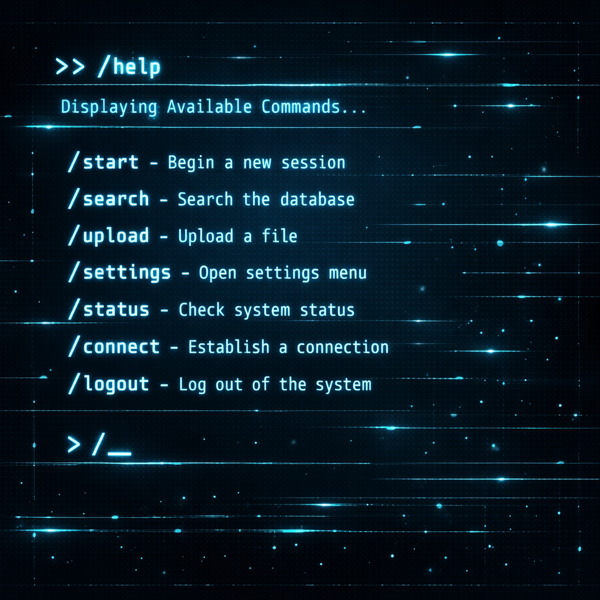
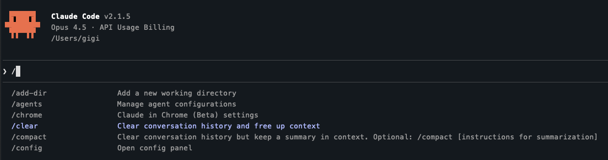
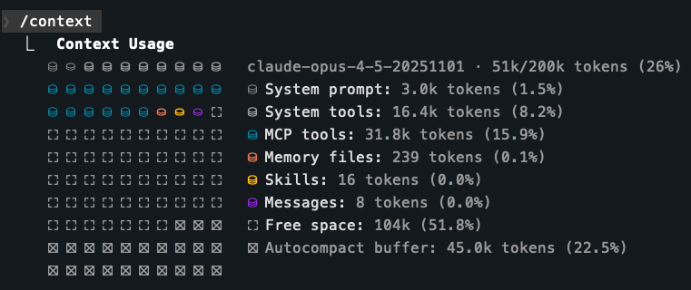
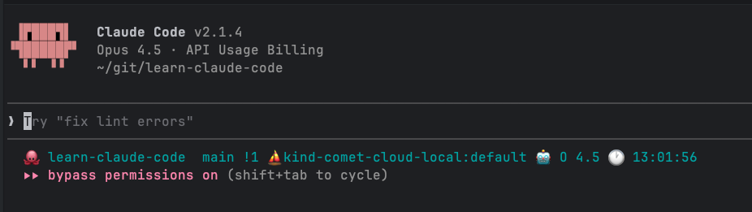
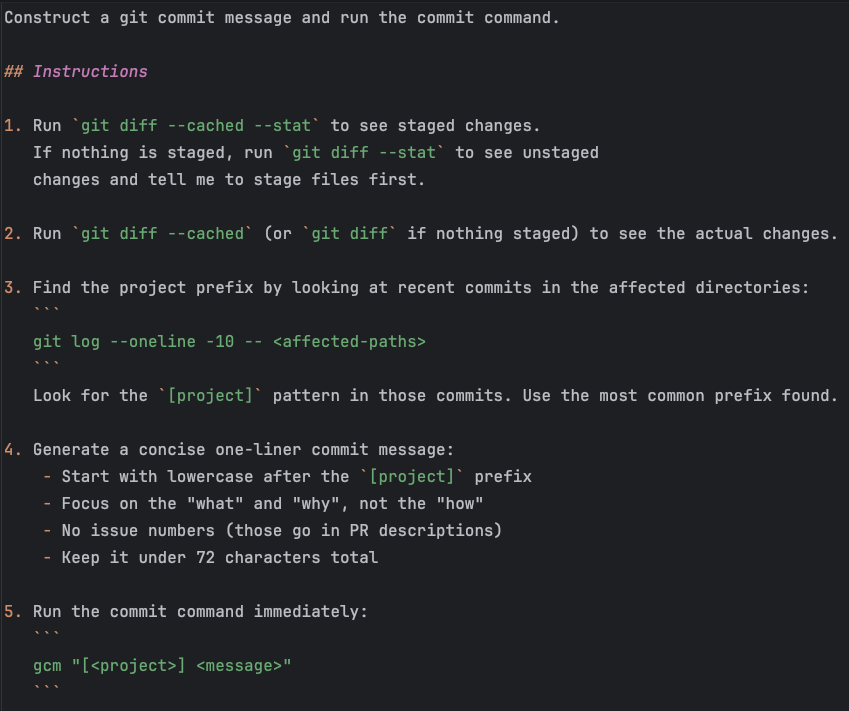

+++
title = 'Claude Code Deep Dive - Slash Commands'
date = 2026-01-11T13:30:00-08:00
categories = ["Claude", "ClaudeCode", "AICoding", "AIAgent", "CodingAssistant"]
+++

This is the second article in the *CCDD* (Claude Code Deep Dive) series. If you haven't read the first one, check
out [Claude Code Deep Dive - Basics](/posts/2026/01/cc-deep-dive-01-basics/) where I covered getting started,
permissions, sessions and running Claude Code in the terminal and IDE.

Today we're diving into slash commands. We'll cover both the built-in ones and how to create your own custom commands.

**"Automation is not about replacing humans, it's about amplifying them." ~ Satya Nadella**

<!--more-->



## ⌨️ Built-in Slash Commands ⌨️

Claude Code has a ton of useful slash commands. Just type `/` and start scrolling.



I'll cover the ones I've actually used, but explore on your own - there's more than what I'm showing here.

### /clear (aka /reset)

When you're done with a conversation and want to start fresh, `/clear` is your friend. It's faster than exiting and
starting Claude Code again.

### /compact

The `/compact` command summarizes the conversation and replaces the current context with the summary. Claude Code does
this automatically when the context window fills up, but here's the thing - automatic compaction might keep less
important stuff and throw away useful insights.

The nice thing about `/compact` is you can provide instructions that Claude will consider when compacting. For important
projects, I prefer asking Claude to track progress in plan files or issue trackers. When context fills up, I just exit
and start again pointing to the plan file rather than hoping auto-compaction retains what matters.

### /context

This one is super cool if you're into context engineering. Here's what the output looks like:



Let me break this down. The context window is 200k tokens. First line shows 51k tokens (26%) are currently used. Seems
like we have 3/4 available, right? Nope.

**The Autocompact Buffer**: 45k tokens (22.5%) is reserved for autocompaction. Why? The context window limit applies to
input + output combined. When autocompaction triggers, the model needs room to generate the summary. Without reserved
space, a full context would leave no room for output. So right off the bat, you only have about half the context window
for your actual conversation.

**System Overhead**: The system prompt and tools eat almost 20k tokens (~10%) - this is non-negotiable.

**MCP Tools**: Here's where it gets interesting. I have three MCP servers (Linear, Notion, Datadog) that consume almost
32k tokens (15.9%). Each MCP server exposes multiple tools. For example Linear has 25 tools and Notion has 14 tools.
Let's look at some of Notion tools:

```
     └ mcp__notion__notion-create-database: 5.8k tokens
     └ mcp__notion__notion-update-database: 6.0k tokens
     └ mcp__notion__notion-create-pages: 2.0k tokens
     └ mcp__notion__notion-update-page: 2.0k tokens
     └ mcp__notion__notion-create-comment: 1.6k tokens
```

Just these five Notion tools take about 17k tokens!

So, MCP tools consume significant context before you even start. If you don't need certain MCP servers for a session,
disabling them frees up substantial space.

**Memory Files**

These are the CLAUDE.md files that contain persistent knowledge and can be spread across different directories and in
your home directory. I don't bloat the CLAUDE.md files too much, so memory files don't take much of the context here.
Barely 239 tokens (0.1%)

**Skills**

Skills are cool. They let Claude Code load new knowledge dynamically based on minimal description and the current query
as opposed to always lurking in the context. There'll be much more on that in a later article.

**Messages**

Messages is the conversation history. In this case, I just started a new session so there aren't too many messages. Just
8 tokens (0.04%). As a conversation get longer and Claude Code performs multiple tool calls (also count ad messages) the
context gets filled up until compaction is in order.

### /cost

Want to know how much you're spending? `/cost` gives you the breakdown:

```
❯ /cost
  ⎿  Total cost:            $2.69
     Total duration (API):  5m 12s
     Total duration (wall): 9h 39m 12s
     Total code changes:    10 lines added, 1 line removed
     Usage by model:
             claude-haiku:  42.1k input, 790 output, 0 cache read, 11.9k cache write ($0.0609)
          claude-opus-4-5:  3.4k input, 10.7k output, 1.7m cache read, 235.3k cache write, 1 web search ($2.63)
```

In five minutes of API time I spent $2.69, mostly on Opus. The cost differences between Haiku, Sonnet, and Opus are
significant. We'll cover model selection and cost optimization in a future article.

### /config (aka /settings)

Configure how Claude Code operates. It updates your `.claude/settings.json` file:

```
❯ /config
  ❯ Auto-compact                              true
    Show tips                                 true
    Thinking mode                             true
    Prompt suggestions                        true
    Rewind code (checkpoints)                 true
    Verbose output                            false
    Terminal progress bar                     true
    Default permission mode                   Accept edits
    Respect .gitignore in file picker         true
    Auto-update channel                       latest
    Theme                                     Dark mode
    Notifications                             Auto
    Output style                              default
    Language                                  Default (English)
    Editor mode                               normal
    Model                                     opus
```

### /status

Get an overview of your current Claude Code setup:

```
❯ /status
  Version: 2.1.3
  Session name: /rename to add a name
  Session ID: 4eb36de6-c9f2-4c22-8ad3-a8232ea6c078
  cwd: /Users/gigi
  Auth token: none
  API key: /login managed key
  Organization: Perplexity AI
  Email: gigi.sayfan@perplexity.ai

  Model: opus (claude-opus-4-5-20251101)
  MCP servers: notion ✔, linear ✔, datadog ✔
  Memory: user (.claude/CLAUDE.md)
  Setting sources: User settings, Shared project settings, Project local settings
```

Both `/status` and `/config` are part of the same interface - you can switch between tabs with arrow keys.

### /statusline

This one lets you set up a persistent status line below the prompt. It can auto-generate one based on your PS1 shell
prompt. Default output looks like:

```
  [12:49:28] /Users/gigi/git/learn-claude-code (main) Opus 4.5
```

I have a fancy Powerlevel10k shell prompt with custom emojis, so I asked Claude to create a matching status line script.
It extracts directory info (with emoji replacement logic), Kubernetes cluster, Git status, AWS profile, Python
virtualenv, time, and current model:



The script lives in `~/.claude/statusline-command.sh` and settings.json just references it. Pretty neat for keeping
track of your environment at a glance.

## 🔧 Creating Custom Slash Commands 🔧

Here's where it gets fun. You can create your own slash commands as markdown files.

You can have repo-specific commands in your repo's `.claude/commands/`. They'll appear as `/project:<name>`

You can also have global commands in `~/.claude/commands/`. They'll appear for all projects as `/user:<name>`

It's pretty straight forward to create a new custom command. Simply create a `.md` file with your prompt. The filename
becomes the command name. You can use `$ARGUMENTS` to capture anything typed after the command.

### Example: Git Commit Command

I created a `/gcm` command that analyzes changes, finds the project prefix pattern from recent commits, generates a
commit message, and runs the commit:



Now I just type `/gcm` and Claude handles the rest. No more thinking about commit messages.

## ⏭️ What's Next ⏭️

There are many more slash commands related to agents, skills, hooks, and plugins that I'll cover in future articles.
Next up in the series, I'm planning to cover CLAUDE.md files and how to configure Claude Code's behavior per-project.

## 🏠 Take Home Points 🏠

- `/context` is your friend for understanding token usage
- MCP tools can eat significant context - disable what you don't need
- `/cost` helps you track spending across models
- Custom slash commands turn repetitive prompts into one-liners
- Store custom commands in your repo for version control, symlink globally
- Explore all slash commands [here](https://code.claude.com/docs/en/slash-commands) 

🇮🇱 !להתראות, חברים 🇮🇱
