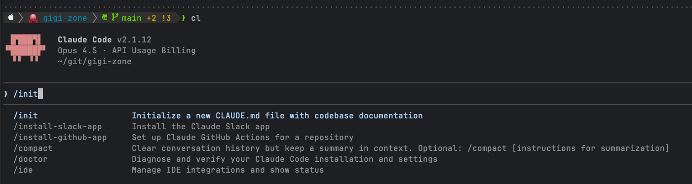
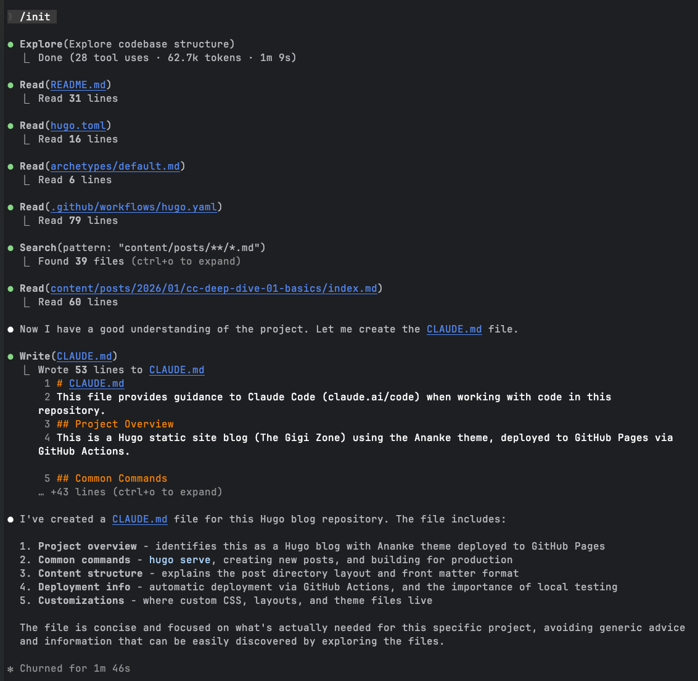

+++
title = 'Claude Code Deep Dive - Total Recall'
date = 2026-01-18T13:30:00-08:00
categories = ["Claude", "ClaudeCode", "AICoding", "AIAgent", "CodingAssistant"]
+++

When you start or resume a conversation with Claude Code it doesn't start from scratch. It knows a lot right off the
bat, and it can recall even more stuff later. Now, there are multiple ways to structure this memory such as **CLAUDE.md**
files, agent skills and sub-agents. Today, we're going to focus on **CLAUDE.md** files and level up your Claude Code
game.

**"One of the keys to happiness is a bad memory." ~ Rita Mae Brown**

<!--more-->


This is the third article in the *CCDD* (Claude Code Deep Dive) series. The previous articles are:

1. [Claude Code Deep Dive - Basics](https://medium.com/@the.gigi/claude-code-deep-dive-basics-ca4a48003b02)
2. [Claude Code Deep Dive - Slash Commands](https://medium.com/@the.gigi/claude-code-deep-dive-slash-commands-9cd6ff4c33cb)

## 🧠 The Claude Code Memory System 🧠

**CLAUDE.md** files are instruction files that tell Claude Code how to work with your project. They're automatically
loaded
into the context when you run Claude Code. Think of them as persistent notes you leave for Claude - project conventions,
custom commands, team preferences, and anything else Claude should know before it starts working.

Unlike regular conversation context that gets compacted or lost, **CLAUDE.md** files are always there. Every single
session.
This is your way to shape how Claude behaves without repeating yourself.

## 📍 Where in the World is CLAUDE.md? 📍

Claude Code automatically discovers and loads memory files from multiple locations in a hierarchy (from highest to
lowest priority):

**Enterprise Policy** — `/Library/Application Support/ClaudeCode/CLAUDE.md` (macOS)
- Organization-wide instructions managed by IT

**Project Memory** — `./CLAUDE.md` or `./.claude/CLAUDE.md`
- Team-shared instructions for the project

**Project Rules** — `./.claude/rules/*.md`
- Modular, topic-specific project instructions

**User Memory** — `~/.claude/CLAUDE.md`
- Personal preferences for all projects

**User Rules** — `~/.claude/rules/*.md`
- Personal rules for all projects

**Project Memory (Local)** — `./CLAUDE.local.md`
- Personal project-specific preferences (deprecated)

Claude Code combines all these memory files, automatically adding them to the prompt. When working with files in
subdirectories, any **CLAUDE.md** files in those subdirectories are also pulled into the context.

### 🎬 The Hierarchy in Action 🎬

Here's a typical setup showing how I organize things. My personal user **CLAUDE.md** contains stuff that applies to any
project, be it a personal project or work-related. Here is a snippet from my personal global **CLAUDE.md**:

**~/.claude/CLAUDE.md** (personal):

```markdown
- you should pay attention to branches when working on a project. make sure we are on the right branch
- don't speculate. don't say "likely" or "probably". if you have a theory, check it and then reply.
- no assumptions! verify your assumptions or ask for more information
- always run the unit tests after making changes
```

And, here is a little snippet from a work project's **CLAUDE.md**

```markdown
- don't git commit/push or terraform apply or helm upgrade without explicit approval
- always run mypy when I modify Python files
- PRs should always be associated with a Linear issue. the PR description should always be `ref <Linear issue number>`.
  for example, `ref AI2-826`
```

It is common for project **CLAUDE.md** to provide dev workflow commands and architecture guide. Here is a fictional
project
**CLAUDE.md** file:

```markdown
# The App Project

Web application using React + FastAPI.

# Commands

- Dev: `npm run dev` (frontend) + `uvicorn main:app` (backend)
- Test: `npm test && pytest`
- Lint: `npm run lint && ruff check .`

# Architecture

- Backend: api/
- Web Frontend: src/components/
- Console Frontend: cli/
- Shared types: types/

# Personal Preferences

@~/.claude/projects/the-app/CLAUDE.md
```

Note the personal preferences import in the last line. When you specify files with @ they will always be included in the
context. This pattern of mentioning a personal **CLAUDE.md** file for a specific project lets instruct Claude Code how
to
behave to match your style on a project by project level (in addition to the global ~/.claude/CLAUDE.md).

Here is an example of local **CLAUDE.md** for `the-app` project:
**~/.claude/projects/the-app/CLAUDE.md** (personal):

```markdown
# Local Settings

- Database: postgresql://localhost/the_app_dev
- Test with --verbose flag
- Deploy to staging with approval
```

### 📥 The Import System 📥

Ok. Let's talk a little bit more about the import system. Remember that `@` symbol? It lets you pull in other files (not
just other ClAUDE.md files) into the context. This is super useful for keeping personal settings outside the repo while
still having them available and also lets you organize your **CLAUDE.md** into multiple files if you wish. For example,
your
**CLAUDE.md** file can be just a list of imports like so:

```markdown
@docs/architecture.md
@docs/testing.md
@docs/guardrails.md
@docs/forbidden.md
```

The old way was to use `CLAUDE.local.md` files (which are .gitignored automatically), but there's a catch - git
worktrees don't copy them. If you work with multiple worktrees (like I do), you'd have to recreate your personal
settings in each one. Annoying!

The import approach keeps personal settings in your home directory, making them work seamlessly across all git
worktrees:

```markdown
# In your project's CLAUDE.md

@~/.claude/projects/the-project/CLAUDE.md
```

Alright, but what if I just mention a file path without an explicit import? For example:

```markdown
If you're working on sensitive stuff check out `docs/security.md` 
```

So, Claude Code will be aware that there is a file with information about security, but it will not be pulled
automatically into the context. Claude can decide to read this file and pull it into the context if it considers the
current task sensitive enough.

Note, the recommended way for this kind of dynamic pulling into the context is putting it into a skill, which we will
discuss in a future blog. But, just referencing files without import in **CLAUDE.md** works too.

## 📚 Modular Rules with `.claude/rules/` 📚

For larger projects, you can organize instructions into multiple focused files instead of cramming everything into one
**CLAUDE.md**. This is great because by virtue of putting a lot of files under a rules directly they will be
automatically included as opposed to explicitly importing them with @.

### 🏗️ Basic Structure 🏗️

```
the-project/
├── .claude/
│   ├── CLAUDE.md           # Main project instructions
│   └── rules/
│       ├── code-style.md   # Code style guidelines
│       ├── testing.md      # Testing conventions
│       └── security.md     # Security requirements
```

All `.md` files in `.claude/rules/` are automatically loaded with the same priority as `.claude/CLAUDE.md`. You can
also create subdirectories to organize rules by topic:

```
.claude/rules/
├── frontend/
│   ├── react.md
│   └── styles.md
├── backend/
│   ├── api.md
│   └── database.md
└── general.md
```

### 🎯 Path-Specific Rules 🎯

Here's where it gets really powerful. You can scope rules to specific files using YAML frontmatter with a `paths` field:

```markdown
---
paths:
  - "src/api/**/*.ts"
---

# API Development Rules

- All API endpoints must include input validation
- Use the standard error response format
- Include OpenAPI documentation comments
```

This rule only applies when Claude is working on files matching `src/api/**/*.ts`. Rules without a `paths` field apply
to all files unconditionally.

### 🔍 Glob Patterns 🔍

The `paths` field supports standard glob patterns:

- `**/*.ts` — All TypeScript files in any directory
- `src/**/*` — All files under `src/` directory
- `*.md` — Markdown files in project root only
- `src/components/*.tsx` — React components in specific directory

You can also use multiple patterns and brace expansion:

```yaml
---
paths:
  - "src/**/*.{ts,tsx}"
  - "{src,lib}/**/*.ts"
  - "tests/**/*.test.ts"
---
```

### 👤 User-Level Rules 👤

You can also create personal rules that apply to all your projects:

```
~/.claude/rules/
├── preferences.md    # Your personal coding preferences
└── workflows.md      # Your preferred workflows
```

User-level rules are loaded before project rules, so project rules take precedence when there's a conflict.

## 🛠️ Useful Memory Commands 🛠️

A couple of slash commands make working with memory files easier:

**`/init`** - Bootstrap a **CLAUDE.md** for your project. Claude analyzes your project structure and tech stack to
generate
a starter file. Great for new projects!

**`/memory`** - Opens your memory files in your system editor. Use this for on-the-fly edits during a session

## 🧩 Putting It All Together 🧩

Alright, let's claudify the [Gigi Zone](https://github.com/the-gigi/gigi-zone), which is the repo where I write my
blogs.



Cool! Claude churned (his words not mine) for less than two minutes and came back with the following:



Check out
the [generated CLAUDE.md](https://github.com/the-gigi/gigi-zone/blob/371c8e85db0010f7dfb8640cccf31f7d79ad436b/CLAUDE.md)
if you're curious.

I made a few small changes, but overall it gets the job done.

I plan to customize it a little further and add a couple of slash commands and possibly a hook, but not today.

Let's see how many tokens it takes. Ha! insignificant.

```
Memory files · /memory
  └ ~/.claude/CLAUDE.md: 239 tokens
  └ CLAUDE.md: 388 tokens
```

## 📄 The Other Markdown Files 📄

**CLAUDE.md** is awesome, but there are a couple of other Markdown files that may overlap or even fully duplicate its
content. I'm talking specifically about **README.md** and **AGENTS.md**.

### 📖 README.md 📖

**README.md** is for human users - project overview, installation, usage, etc. Some content is relevant for Claude Code,
but not all of it (like "follow me on LinkedIn" requests).

You may also want to give Claude different instructions or background than humans get.

### 🤖 AGENTS.md 🤖

[AGENTS.md](https://agents.md) is an emerging standard from the [Agentic AI Foundation](https://aaif.io) (a Linux
Foundation project). It's the equivalent of **CLAUDE.md** for other AI coding agents like OpenAI Codex, Amp, and Gemini
CLI.

**AGENTS.md** supports nested files in subdirectories, but lacks **CLAUDE.md** features like `@` imports, rules
directories, and personal overrides.

I hope the **AGENTS.md** spec will evolve to support these features. Then Claude Code can just adopt it and we'll have
one standard file for all AI agents.

### 🤝 Reconciliation Options 🤝

So, let's look at some approaches for managing all these files and possibly sharing some content.

**Import**
- **README.md**: `@README.md` in CLAUDE.md (adds some irrelevant context)
- **AGENTS.md**: `@AGENTS.md` in CLAUDE.md (can add Claude-specific imports too)

**Symlink**
- **README.md**: README.md → CLAUDE.md (design for both audiences)
- **AGENTS.md**: CLAUDE.md → AGENTS.md (lose rules/imports features)

**Separate files**
- Keep them separate and accept some duplication. Let Claude help maintain both.

There are pros and cons to each approach and I don't have a strong opinion on which one is best. You'll have to figure it out for your use case, environment, and culture.

## 🏢 Managing Project-Level CLAUDE.md Files in a Monorepo 🏢

Here is the situation, you have multiple teams working on different projects in the same monorepo. Your project -
`awesome-project` - is spread across multiple directories in the monorepo - backend, frontend, infra, etc. You want
Claude Code to be aware of the all the components of your project. you don't want to clutter the root of the repo with
the awesome-project specific instructions and context. One way to accomplish it is by having a **CLAUDE.md** file in
each of the awesome-project subdirectories. In order to avoid duplication, you can manage just one such file and create
symlinks in the other subdirectories. Here is what it looks like:

```
root/
├── backend/
│   └── awesome-project/
│       ├── CLAUDE.md
│       ├── src/
│       └── test/
├── frontend/
│   └── awesome-project/
│       ├── CLAUDE.md
│       ├── src/
│       └── test/
└── infra/
    └── awesome-project/
        ├── CLAUDE.md
        ├── src/
        └── test/
```

In a future blog we'll look into [Claude Code plugins](https://code.claude.com/docs/en/plugins), which provide a more
complete and elegant solution to the same problem.

## ⏭️ What's Next ⏭️

So far, we've covered the basics, slash commands, and now the memory system works. The CCDD series will continue with
more advanced topics:

- Skills
- MCP support
- Subagents
- Hooks
- Plugins
- Beyond the terminal
- Managing multiple Claude Code sessions in parallel
- Comparison with other AI coding agents

## 🏠 Take Home Points 🏠

- **CLAUDE.md** files are persistent memory loaded every session
- Memory hierarchy: enterprise → project → project rules → user → user rules → local
- Use `.claude/rules/` for modular, topic-specific instructions
- Path-specific rules with YAML frontmatter let you scope instructions to specific files
- Imports (`@`) are better than `.local.md` files for worktree compatibility
- Keep it concise - every token counts
- Use `/init` to bootstrap and `/memory` to edit
- Maintain your **CLAUDE.md** files like you maintain your code

🇦🇺 Hooroo, mates! 🇦🇺
