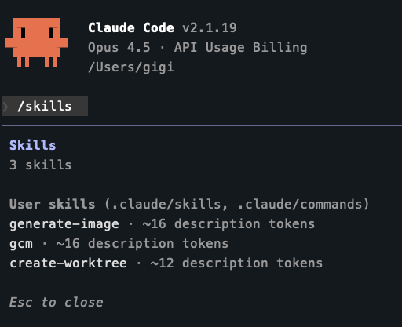
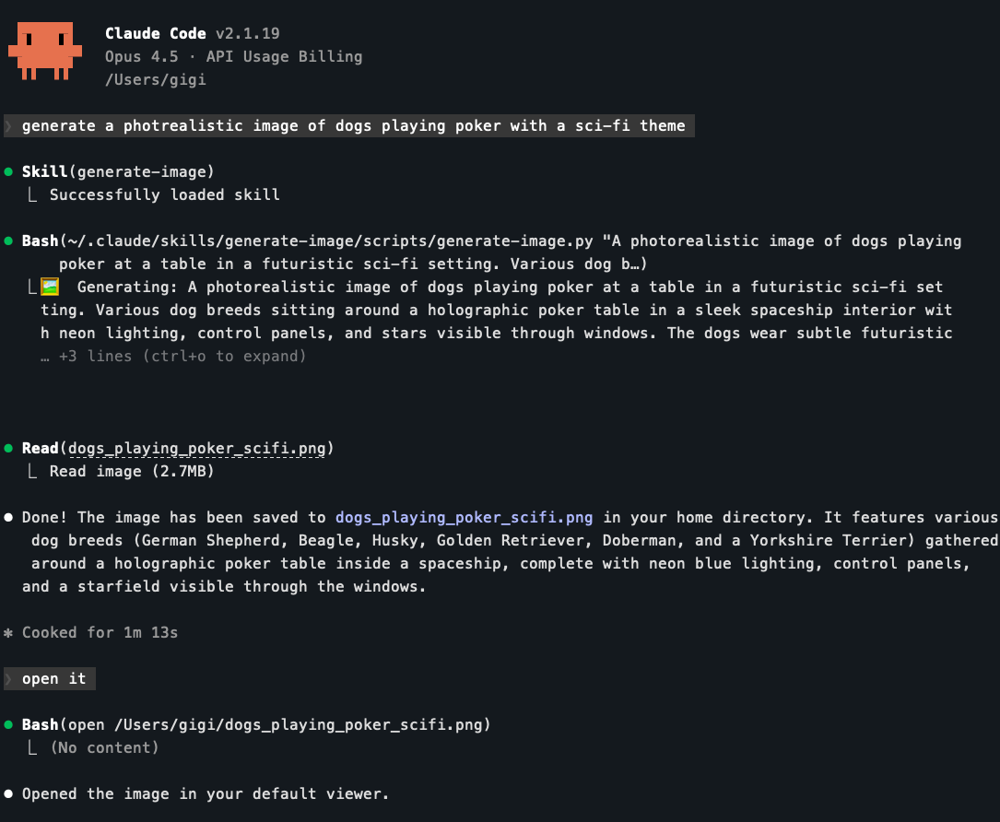

+++
title = 'Claude Code Deep Dive - Mad Skillz'
date = 2026-01-24T13:30:00-08:00
categories = ["Claude", "ClaudeCode", "AICoding", "AIAgent", "CodingAssistant", "AgentSkills"]
+++

One of the most iconic scenes in the Matrix is when Neo uploads Jiu Jitsu and Kung Fu into his brain. Claude Code skills
are **EXACTLY** the same. Let's learn about the why, what, and how of agent skills and even create our own skill so
Claude Code can generate images for us.

**"I know Kung-Fu." ~ Neo**

<!--more-->


This is the fourth article in the *CCDD* (Claude Code Deep Dive) series. The previous articles are:

1. [Claude Code Deep Dive - Basics](https://medium.com/@the.gigi/claude-code-deep-dive-basics-ca4a48003b02)
2. [Claude Code Deep Dive - Slash Commands](https://medium.com/@the.gigi/claude-code-deep-dive-slash-commands-9cd6ff4c33cb)
3. [Claude Code Deep Dive - Total Recall](https://medium.com/@the.gigi/claude-code-deep-dive-total-recall-cb0317d67669)

## 🧠 What are skills? 🧠

A skill is just a directory that contains a `SKILL.md` file plus optional scripts, templates, and docs. The `SKILL.md` file
must have frontmatter with a name and a description:

```
---
name: awesome-skill
description: awesome skill for doing cool stuff!!!
---
```

There are a lot of optional frontmatter fields too. But, this is not a reference manual, so check them out yourself
later!

Everything after the frontmatter is free-form Markdown. Think of it as a mini playbook for Claude to follow.

## 🧭 What's the Big Deal about Skills? 🧭

So far that sounds a lot like the stuff you can put in **CLAUDE.md**. Right, except skills are a clean
context-engineering solution. Instead of clattering **CLAUDE.md** with every workflow, you keep
targeted knowledge in skills and let Claude Code load them on demand. You get focus because only the relevant
instructions enter the context. You get reuse because a skill can live once and serve many projects. And you get
automation because scripts and templates let Claude actually do the work instead of just describing it.

This approach is so useful that it became an open standard (https://agentskills.io) used by most of the industry. More
on that later.

## 🧱 Where Do Skills Live? 🧱

Claude Code looks for skills in these locations:

- Enterprise (managed settings.json)
- Personal: `~/.claude/skills`
- Subdirectory: `foo/.claude/skills`
- Project: `.claude/skills`
- Plugin: `<plugin>/skills`

Nested skills behave like nested **CLAUDE.md** files: the closer the skill is to the file you're working on, the more
specific it is. If multiple skills share the same name, higher-priority locations win (enterprise > personal >
subdirectory > project). Plugin skills use a `plugin-name:skill-name` namespace, so they don't conflict with other
levels. If a skill and a slash command share the same name, the skill wins.

## 🔦 How Are Skills Loaded? 🔦

Only the frontmatter (name + description) is loaded into context at first. Claude sees a list of available skills and
decides which one to load when it's needed. When it chooses a skill, the full `SKILL.md` content is pulled in, and any referenced files
like scripts or templates can be loaded as needed.

This is why the description matters. It’s the trigger.

## 🛠️ Create Your Own Skill 🛠️

Alright. Let's create our own skill from scratch. Claude Code can analyze images, but it can't generate images out of
the box. This is a pretty useful capability, so I built a skill for that.

Here is the structure:

```
skills/generate-image/
├── SKILL.md
└── scripts/
    └── generate-image.py
```

No need for too many explanations about how it works since the SKILL.md file does exactly that :-)

```markdown
---
name: generate-image
description: Generate images using OpenAI's gpt-image-1.5 model
---

# Generate Image

Create images from text prompts using the `scripts/generate-image.py` script.

## Usage

./scripts/generate-image.py "prompt" [output_file]

## When to use

- User asks for an image, icon, logo, illustration
- Visual content would help explain something
```

The [generate-image.py](https://github.com/the-gigi/learn-claude-code/blob/main/skills/generate-image/scripts/generate-image.py)
script does the actual work. Claude reads the skill, runs the script, which generates the image and saves it to
the output file. That's it.

You can check the existing skills available to you in Claude Code itself by typing `/skills`. It will show a list of
skills as well as custom slash commands. And, yes you can run skills directly just like slash commands:



Let's see it in action. I told Claude Code to generate an image of dogs playing poker (classic), and it figured out it needs to load the skill and then run the
script, which executed perfectly.



I then asked Claude Code to open it, which it did (using the `open` command in the terminal via the built-in Bash tool)


That's about it. You can ask Claude to help you write your own skills of course. It is very skilled at that (see what I did there?).

Let's see where skills are in the overall AI agent community as of January 2026.

## ⚖️ Claude Code Skills vs Agent Skills ⚖️

Skills started at Anthropic, but the idea is now open and shared across the ecosystem. The emerging standard lives at
[agentskills.io](https://agentskills.io/) and is supported by multiple AI coding agents. Claude Code uses the same core
concept: a `SKILL.md` file with name/description frontmatter plus optional features. But, the Anthropic skills are a
superset of agent skills, so if you use primarily Claude Code I recommend checking out
the [Anthropic skills docs](https://code.claude.com/docs/en/skills) (or this blog post).

If you stick to the lowest common denominator of Agent skills, then your skills will be portable across tools, which is
exactly the point. One skill, many AI agents.

## ⏭️ What's Next ⏭️

So far, we've covered the basics, slash commands, the memory system and now agent skills. The CCDD series will continue
with more advanced topics:

- MCP support
- Subagents
- Hooks
- Plugins
- Beyond the terminal
- Managing multiple Claude Code sessions in parallel
- Comparison with other AI coding agents

## 🏠 Take Home Points 🏠

- Skills are on-demand knowledge modules, not permanent context
- `SKILL.md` frontmatter (name/description) is the trigger
- Keep skills small, focused, and reusable
- Scripts and templates turn skills into real automation
- The skills format is becoming a cross-agent standard

🇧🇬 Чао, приятели! 🇧🇬
