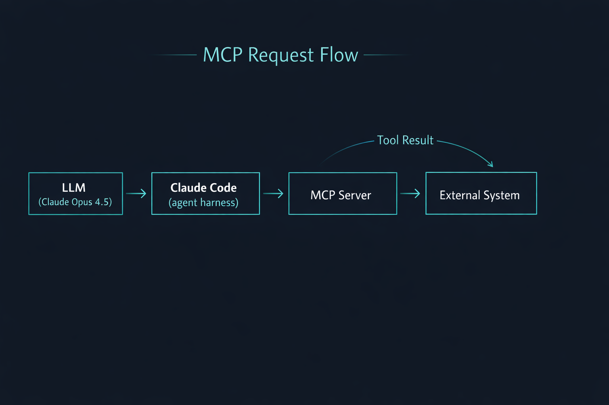
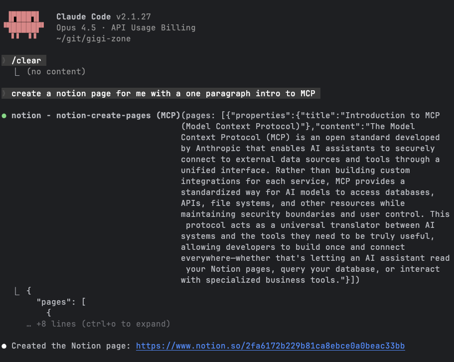
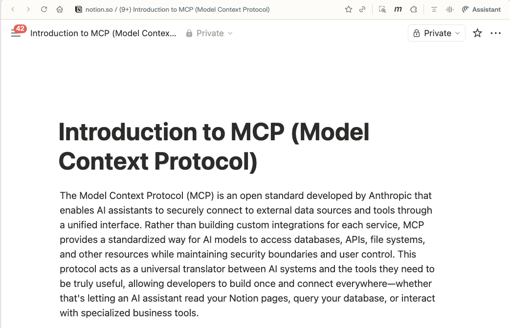

+++
title = 'Claude Code Deep Dive - MCP Unleashed'
date = 2026-01-31T13:30:00-08:00
categories = ["Claude", "ClaudeCode", "AICoding", "AIAgent", "CodingAssistant", "MCP"]
+++

AI agents are all about tools 🧰. Without tools the agent can answer questions (including generating code for you), but
you'll have to take the answer (or code) and do something about it. You empower agents by giving them tools and let them
iterate on tasks by invoking these tools ⚙️.

Claude Code comes out of the box with multiple useful tools ✨, including the Bash tool that lets it run any command-line
program on your computer. But, often you may want to let it access additional capabilities. This is where the MCP (model
context protocol) comes in and allows you to extend Claude Code with arbitrary tools and access to remote systems 🔌.

**"Give us the tools, and we will finish the job." ~ Winston Churchill**

<!--more-->


This is the fifth article in the *CCDD* (Claude Code Deep Dive) series. The previous articles are:

1. [Claude Code Deep Dive - Basics](https://medium.com/@the.gigi/claude-code-deep-dive-basics-ca4a48003b02)
2. [Claude Code Deep Dive - Slash Commands](https://medium.com/@the.gigi/claude-code-deep-dive-slash-commands-9cd6ff4c33cb)
3. [Claude Code Deep Dive - Total Recall](https://medium.com/@the.gigi/claude-code-deep-dive-total-recall-cb0317d67669)
4. [Claude Code Deep Dive - Mad Skillz](https://medium.com/@the.gigi/claude-code-deep-dive-mad-skillz-6fda40f7b9f8)

## ⏳ A Trip Down Memory Lane ⏳

**SKIP THIS SECTION IF YOU'RE NOT IN THE MOOD FOR SOME RUMINATIONS**

Let's start with a little story from my past. My first startup job fresh out of university was the director of software
development in a three-person startup, where I was the only one with any software background. It failed spectacularly,
but it was super cool. The idea was to film a person doing some activity using a robotic system that moved the video
camera and then embed it in another film. For example, you have a video of people doing whitewater rafting, and you want
to
embed another person in the video. Now, we're talking about 1996! No Nano Banana, my friends! No mobile phones, barely
some dial-up internet.

In order to do that you need to analyze the original video and extract a so-called camera script and then use that to
control the robotic system that moves the video camera.

The robotic system came with a C SDK and I started to integrate it into my Windows C++ and MFC (no connection to MCP)
application. This is where I had an epiphany moment when I ran into this C code:

```C
// From commdlg.h
typedef UINT_PTR (CALLBACK *LPOFNHOOKPROC)(
    HWND   hdlg,
    UINT   uiMsg,
    WPARAM wParam,
    LPARAM lParam
);

typedef struct tagOFNA {
    DWORD         lStructSize;
    HWND          hwndOwner;
    HINSTANCE     hInstance;
    LPCSTR        lpstrFilter;
    // ...
    LPOFNHOOKPROC lpfnHook;   // function pointer here
    LPARAM        lCustData;
    // ...
} OPENFILENAMEA, *LPOPENFILENAMEA;

BOOL GetOpenFileNameA(
    LPOPENFILENAMEA lpofn
);
```

If you're utterly confused you're in good company. This is a fine example of
Microsoft's [Hungarian notation](https://en.wikipedia.org/wiki/Hungarian_notation). But, beyond the gibberish of type
names and weird variable names with inscrutable prefixes I was really confused by the `LPOFNHOOKPROC lpfnHook` struct
member.
My understanding up to this point was that functions are something you call in your program, passing input arguments and
getting back a result. Now, I did take a [Scheme](https://en.wikipedia.org/wiki/Scheme_(programming_language)) course at
the university and I knew about functional programming, but I didn't think it's a real thing that applies to C and
Windows API programming.

Eventually I realized that this thing means that when I call the `GetOpenFileNameA()` Windows API I can provide a struct
that includes a pointer to a function in my code, Windows will display a file selection GUI dialog to the user and then
Windows will call **my** code!!! That blew my mind 🤯.

OK. So, LLM tool calling is virtually the same. When you call an LLM you can provide it with tools (functions) that
follow a specific format (just like the Windows API defines a very specific format to pass a hook function to the
`GetOpenFileNameA()` function). Then, the LLM can call these tools (via your AI framework or application host) and
incorporate the results
into the conversation. MCP is just a standard way to define tools and invoke them (plus a little more that nobody uses
like resources and
prompts).

## 🔌 What is MCP? 🔌

[MCP (Model Context Protocol)](https://modelcontextprotocol.io) is an open standard for connecting AI agents to tools,
data, and external systems. It provides a structured way for the model to call a declared tool with a schema and get
back a structured response, which keeps integrations predictable and auditable. Anthropic developed MCP in the ancient
times of November 2024. Yeah, it's hard to fathom how old this protocol is 👴.

Anyway, MCP got enthusiastically adopted by the entire ecosystem. Anthropic graciously contributed MCP to
the [AAIF (Agentic AI Foundation)](https://aaif.io), which is a new open foundation to advance open and accessible AI.
It is part of the Linux Foundation (yes, it's nested). The AAIF includes several projects besides MCP such AGENTS.md and
Goose. Surprisingly, CLAUDE.md is not included.

## 🧱 Claude Code + MCP in One Diagram 🧱



The LLM requests a tool call, Claude Code executes it by calling the right MCP server, the external system responds, and
the MCP server returns some data. Claude Code include the tool response in the context and the LLM can continue to the
next step based on the new information.

I will not elaborate much more about MCP itself because this article is about how Claude Code integrates and supports
MCP. I'll just add that you can run local MCP servers or remote ones. Check out the
official [docs](https://modelcontextprotocol.io/docs/getting-started/intro) for more.

## 🧭 Why MCP Matters for Claude Code 🧭

Claude Code comes with several [built-in tools](https://code.claude.com/docs/en/settings#tools-available-to-claude). It
can search and edit files, run any command-line program, do web searches and reason about your code. MCP
turns it into a real operator by giving it access to your live systems in a controlled, contract-driven way. In
practice, this is the difference between "tell me
what needs to be done" and "do the thing for me".

## 🧠 MCP and the Context 🧠

MCP *used* to be a serious context tax because every MCP server preloaded all its tool schemas, which can be
substantial. That has improved a lot. In recent builds, MCP tools are **loaded on demand**, and `/context` makes it
explicit by showing a separate MCP section and even
telling you that the tools aren’t in the main token budget until you invoke them.

Here’s a real `/context` snapshot (redacted) that shows the on‑demand behavior and the available MCP tools list (no MCP
tool is currently loaded):

```
❯ /context
  ⎿  Context Usage
     ⛁ ⛁ ⛁ ⛁ ⛁ ⛁ ⛁ ⛁ ⛁ ⛀   claude-opus-4-5-20251101 · 141k/200k tokens (71%)
     ⛁ ⛁ ⛀ ⛀ ⛁ ⛁ ⛁ ⛁ ⛁ ⛁
     ⛁ ⛁ ⛁ ⛁ ⛁ ⛁ ⛁ ⛁ ⛁ ⛁   Estimated usage by category
     ⛁ ⛁ ⛁ ⛁ ⛁ ⛁ ⛁ ⛁ ⛁ ⛁   ⛁ System prompt: 2.8k tokens (1.4%)
     ⛁ ⛁ ⛁ ⛁ ⛁ ⛁ ⛁ ⛁ ⛁ ⛁   ⛁ System tools: 16.8k tokens (8.4%)
     ⛁ ⛁ ⛁ ⛁ ⛁ ⛁ ⛁ ⛁ ⛁ ⛁   ⛁ Custom agents: 259 tokens (0.1%)
     ⛁ ⛁ ⛁ ⛁ ⛁ ⛁ ⛁ ⛁ ⛁ ⛁   ⛁ Memory files: 5.2k tokens (2.6%)
     ⛁ ⛁ ⛶ ⛶ ⛶ ⛶ ⛶ ⛶ ⛶ ⛶   ⛁ Skills: 530 tokens (0.3%)
     ⛶ ⛶ ⛶ ⛝ ⛝ ⛝ ⛝ ⛝ ⛝ ⛝   ⛁ Messages: 115.6k tokens (57.8%)
     ⛝ ⛝ ⛝ ⛝ ⛝ ⛝ ⛝ ⛝ ⛝ ⛝   ⛶ Free space: 26k (12.9%)
                           ⛝ Autocompact buffer: 33.0k tokens (16.5%)

     MCP tools · /mcp (loaded on-demand)

     Available
     └ mcp__datadog__list_ci_pipelines
     └ mcp__datadog__get_pipeline_fingerprints
     └ mcp__datadog__get_logs
     └ mcp__datadog__get_logs_field_values
     └ mcp__datadog__get_teams
     └ mcp__datadog__get_metrics
     └ mcp__datadog__get_metric_fields
     └ mcp__datadog__get_metric_field_values
     └ mcp__datadog__list_metrics
     └ mcp__datadog__list_service_definitions
     └ mcp__datadog__get_service_definition
     └ mcp__datadog__list_monitors
     └ mcp__datadog__list_slos
     └ mcp__notion__notion-search
     └ mcp__notion__notion-fetch
     └ mcp__notion__notion-create-pages
     └ mcp__notion__notion-update-page
     └ mcp__notion__notion-move-pages
     └ mcp__notion__notion-duplicate-page
     └ mcp__notion__notion-create-database
     └ mcp__notion__notion-update-data-source
     └ mcp__notion__notion-create-comment
     └ mcp__notion__notion-get-comments
     └ mcp__notion__notion-get-teams
     └ mcp__notion__notion-get-users
     └ mcp__notion__notion-query-data-sources
     └ mcp__linear__list_comments
     └ mcp__linear__create_comment
     └ mcp__linear__list_cycles
     └ mcp__linear__get_document
     └ mcp__linear__list_documents
     └ mcp__linear__create_document
     └ mcp__linear__update_document
     └ mcp__linear__get_issue
     └ mcp__linear__list_issues
     └ mcp__linear__create_issue
     └ mcp__linear__update_issue
     └ mcp__linear__list_issue_statuses
     └ mcp__linear__get_issue_status
     └ mcp__linear__list_issue_labels
     └ mcp__linear__create_issue_label
     └ mcp__linear__list_projects
     └ mcp__linear__get_project
     └ mcp__linear__create_project
     └ mcp__linear__update_project
     └ mcp__linear__list_project_labels
     └ mcp__linear__list_teams
     └ mcp__linear__get_team
     └ mcp__linear__list_users
     └ mcp__linear__get_user
     └ mcp__linear__search_documentation
```

If you want a quick inventory of what’s connected right now, `/mcp` gives you a clean status view of your MCP servers:

```
❯ /mcp
────────────────────────────────────────────────────────────────────────────
 Manage MCP servers
 3 servers

   User MCPs (/Users/gigi/.claude.json)
 ❯ datadog · ✔ connected
   linear · ✔ connected
   notion · ✔ connected
```

Under the hood, Claude Code uses [MCP Tool Search](https://code.claude.com/docs/en/mcp#scale-with-mcp-tool-search) to
discover relevant MCP tools when needed, instead of preloading every tool schema up front. That’s the key to why MCP
tools are no longer a constant context tax until you actually invoke them.

There’s another practical guardrail worth knowing: Claude Code warns when MCP output exceeds 10,000 tokens and caps
output by default at 25,000 tokens to keep your context from exploding. You can raise the cap with the
`MAX_MCP_OUTPUT_TOKENS` environment variable when launching Claude Code, but it’s usually better to paginate or
summarize at the server layer.
See [MCP output limits](https://code.claude.com/docs/en/mcp#mcp-output-limits-and-warnings).

OK. Let's see what happens if I ask Claude Code to write a quick Notion page for me.



As you can see Claude determined dynamically it needs the MCP notion server and called the `notion-create-pages` tool.

Here is the generated page:


Let's see how the context looks now. Ha! now, we can see that Claude Code loaded only the notion-create-pages tool,
which took 2K tokens. At least, the rest of the Notion MCP tools remain just available and don't clutter the context.

```
❯ /context                                                                                                                                                                                                                                      
  ⎿  Context Usage                                                                                                                                                                                                                              
     ⛁ ⛁ ⛁ ⛁ ⛁ ⛁ ⛁ ⛁ ⛁ ⛁   claude-opus-4-5-20251101 · 33k/200k tokens (17%)                                                                                                                                                                     
     ⛀ ⛀ ⛀ ⛶ ⛶ ⛶ ⛶ ⛶ ⛶ ⛶                                                                                                                                                                                                                        
     ⛶ ⛶ ⛶ ⛶ ⛶ ⛶ ⛶ ⛶ ⛶ ⛶   Estimated usage by category                                                                                                                                                                                          
     ⛶ ⛶ ⛶ ⛶ ⛶ ⛶ ⛶ ⛶ ⛶ ⛶   ⛁ System prompt: 2.7k tokens (1.4%)                                                                                                                                                                                  
     ⛶ ⛶ ⛶ ⛶ ⛶ ⛶ ⛶ ⛶ ⛶ ⛶   ⛁ System tools: 16.9k tokens (8.5%)                                                                                                                                                                                  
     ⛶ ⛶ ⛶ ⛶ ⛶ ⛶ ⛶ ⛶ ⛶ ⛶   ⛁ MCP tools: 2.0k tokens (1.0%)                                                                                                                                                                                      
     ⛶ ⛶ ⛶ ⛶ ⛶ ⛶ ⛶ ⛶ ⛶ ⛶   ⛁ Memory files: 950 tokens (0.5%)                                                                                                                                                                                    
     ⛶ ⛶ ⛶ ⛶ ⛶ ⛶ ⛶ ⛶ ⛶ ⛶   ⛁ Skills: 113 tokens (0.1%)                                                                                                                                                                                          
     ⛶ ⛶ ⛶ ⛝ ⛝ ⛝ ⛝ ⛝ ⛝ ⛝   ⛁ Messages: 924 tokens (0.5%)                                                                                                                                                                                        
     ⛝ ⛝ ⛝ ⛝ ⛝ ⛝ ⛝ ⛝ ⛝ ⛝   ⛶ Free space: 143k (71.7%)                                                                                                                                                                                           
                           ⛝ Autocompact buffer: 33.0k tokens (16.5%)                                                                                                                                                                           
                                                                                                                                                                                                                                                
     MCP tools · /mcp (loaded on-demand)                                                                                                                                                                                                        
                                                                                                                                                                                                                                                
     Loaded                                                                                                                                                                                                                                     
     └ mcp__notion__notion-create-pages: 2.0k tokens   
```

Now, this is all super fresh. Just two weeks ago Claude Code eagerly loaded ALL MCP tools. In my case, it was 32K
tokens, which is 15.9% of the entire context window!
If you don't believe me check
out [Claude Code Deep Dive - Slash Commands](https://medium.com/@the.gigi/claude-code-deep-dive-slash-commands-9cd6ff4c33cb)
where I discussed the `/context` slash command among other commands.

So, the takeaway is that you don't have to be too stingy, and it's OK define a lot of MCP tools. But, even with
on‑demand loading, once a tool is used its schema sticks around until compaction, so being reasonable about MCP tool
definitions
still matters. Don't just define every MCP tool you run into. Exercise some judgment. If you bombard Claude Code with
lots of unnecessary MCP tools, it may confuse him and cause him to call the wrong tool at the wrong time.

## 🔐 Security, Permissions, and Trust 🔐

MCP doesn’t magically solve security. It makes security *possible*. The model is untrusted, the MCP server is trusted
because it may need to access external system with their own authentication and authorization. Validate inputs, protect
secrets server-side, log tool calls, and require explicit confirmation for destructive actions. Claude Code also warns
that third-party MCP servers are unverified, so treat them like any other dependency.

## 🛠️ Configure MCP Servers 🛠️

Claude Code has first-class MCP support and the docs are clear about where configuration lives. The simplest path is
using the CLI: `claude mcp add` for local, project, or user scopes. Local scope stores config in `~/.claude.json`, while
project scope writes a `.mcp.json` in your repo.

If you want some MCP tools to be shared by your team, use `.mcp.json` in the repo. It is versioned, scoped to the
project, and makes
onboarding much easier because everyone gets the same tool stack. But, don't put credentials in source control. Use
environment variables.

Also worth knowing: you can flip the direction and use **Claude Code itself as an MCP server** for other AI frameworks
or clients. Run `claude mcp serve` and your MCP client can call Claude Code’s tools (View, Edit, LS, etc.) via stdio.
The
official docs show the exact config snippet to plug this into Claude Desktop or any other MCP client. See
[Use Claude Code as an MCP server](https://code.claude.com/docs/en/mcp#use-claude-code-as-an-mcp-server).

Here are the MCP servers configured in my personal `~/.claude.json`. Secrets are redacted, but the structure is
real:

```json
{
  "mcpServers": {
    "notion": {
      "type": "http",
      "url": "https://mcp.notion.com/mcp"
    },
    "linear": {
      "type": "http",
      "url": "https://mcp.linear.app/mcp",
      "headers": {
        "Authorization": "Bearer ***REDACTED***"
      }
    },
    "datadog": {
      "type": "stdio",
      "command": "uvx",
      "args": [
        "--python",
        "3.13",
        "--from",
        "git+https://github.com/shelfio/datadog-mcp.git",
        "datadog-mcp"
      ],
      "env": {
        "DD_API_KEY": "***REDACTED***",
        "DD_APP_KEY": "***REDACTED***",
        "DD_SITE": "datadoghq.com"
      }
    }
  }
}
```

Note that the type determines if it's a local tool (stdio) or a remote tool (http). Claude Code doesn't really care. It
will just invoke the tool, but for operators it matters a lot as you need to consider resource constraints and security
for local MCP servers as well as networking and access for remote MCP servers.

## ⏭️ What's Next ⏭️

The next posts in the series will cover the following topics:

- Subagents
- Hooks
- Plugins
- Beyond the terminal
- Managing multiple Claude Code sessions in parallel
- Comparison with other AI coding agents

## 🏠 Take Home Points 🏠

- MCP is a standard way to interface the LLM with your systems
- Treat MCP servers like production APIs (schemas, logs, guardrails, observability)
- Keep an eye on context with `/context` and be pragmatic about the MCP tools you use
- Start small so the security and failure modes are easy to reason about

🇵🇹 Tchau, amigos! 🇵🇹
