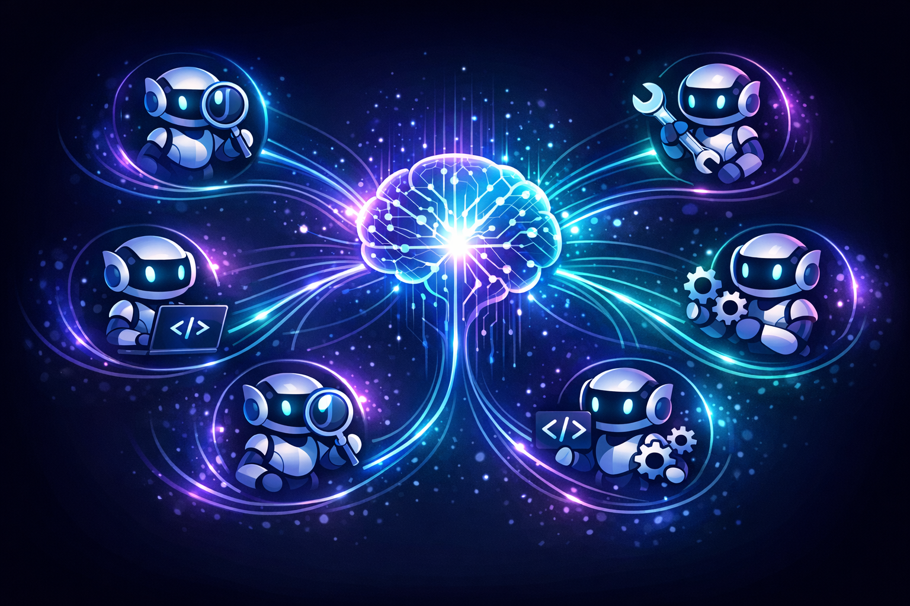
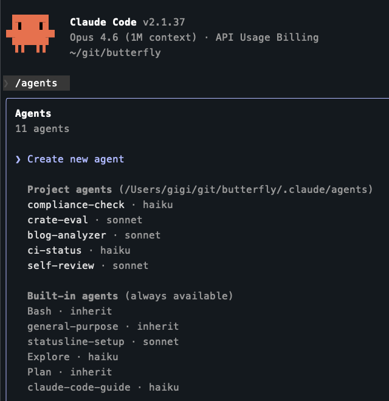

+++
title = 'Claude Code Deep Dive - Subagents in Action'
date = 2026-02-08T13:30:00-08:00
categories = ["Claude", "ClaudeCode", "AICoding", "AIAgent", "CodingAssistant", "Subagents"]
+++

Claude Code is a capable agent on its own, but some tasks are too big, too noisy, or too specialized for a single
conversation to handle well 🤯. Subagents let Claude Code spawn autonomous child processes, each with its own context
window, tools, and instructions, to divide and conquer 🧩.

Claude Code comes with several built-in subagents that are very useful. But, when you add custom subagents to the mix a
single Claude Code instance becomes a full-fledged multi-agent system that can do anything and is not limited to
coding 🚀. Then, the real story is who designs these subagents, when they are designed and built, and what that tells
us about the future of human-AI collaboration.

**"We have to learn the bitter lesson that building in how we *think* we think does not work in the long run." ~ Rich
Sutton**

<!--more-->



This is the sixth article in the *CCDD* (Claude Code Deep Dive) series. The previous articles are:

1. [Claude Code Deep Dive - Basics](https://medium.com/@the.gigi/claude-code-deep-dive-basics-ca4a48003b02)
2. [Claude Code Deep Dive - Slash Commands](https://medium.com/@the.gigi/claude-code-deep-dive-slash-commands-9cd6ff4c33cb)
3. [Claude Code Deep Dive - Total Recall](https://medium.com/@the.gigi/claude-code-deep-dive-total-recall-cb0317d67669)
4. [Claude Code Deep Dive - Mad Skillz](https://medium.com/@the.gigi/claude-code-deep-dive-mad-skillz-9dfb3fa40981)
5. [Claude Code Deep Dive - MCP Unleashed](https://medium.com/@the.gigi/claude-code-deep-dive-mcp-unleashed-0c7692f9c2c2)

## 🤖 What are Subagents? 🤖

A subagent is an autonomous child agent spawned by the main Claude Code agent. Think of it like delegating a task to a
colleague. You give them a brief well-defined task, they go off and do the work, and they come back with a result. The parent agent can keep going or wait while the subagent does its thing.

Each subagent gets its own **context window** (so its work doesn't eat into your main conversation's context), its own
**tools** (you can restrict what it can do), a **focused system prompt** (tailored instructions for the task), and an
optional **model override** (route cheap tasks to Haiku, hard tasks to Opus).

Why does this matter? A few reasons.

**Context isolation** is the big one. If you ask Claude Code to explore a large codebase, the exploration output floods
your conversation with thousands of lines of file contents and grep results. Even with the new Opus 4.6 and million
token context window. Filling your context with irrelevant intermediate artifacts will gradually reduce the coherence
and quality of Claude Code responses. With a subagent, all that noise stays in the subagent's context. You only get back
the summary.

**Parallelism** is the other killer feature. Sure, Claude Code can already run multiple tool calls in parallel (fire
off three `Grep` searches at once). But subagent parallelism is different. It's parallel *autonomous workflows*. Each
subagent can run a multi-step sequence (read files, analyze, decide, act, summarize) independently. Claude Code can
spawn one subagent researching your database schema, another analyzing test failures, a third reading documentation,
all running concurrently as separate multi-turn conversations. Skills (covered in
[CCDD #4 - Mad Skillz](https://medium.com/@the.gigi/claude-code-deep-dive-mad-skillz-9dfb3fa40981)) can also run
multi-step workflows, but they execute sequentially in the main conversation context. It is possible to run skills as subagents with their own isolated context, but I recommend avoiding that and using a
proper subagent definition instead. You can still package domain knowledge in a skill and have the subagent load it
via the `skills` frontmatter field, getting the best of both worlds.

**Specialization** means you can give a subagent exactly the tools and knowledge it needs, nothing more. A code reviewer
that can only read files. A database explorer that can only run SELECT queries. A test runner that can execute bash but
can't edit your source code.

**Model selection** lets you use a fast and cheap model with small context for simple tasks, and use a fancy model like
Opus 4.6 (well, fancy for February 2026) for the main agent. OK. let's take a quick look at the built-in agents.

## 🧰 Built-in Subagent Types 🧰

Claude Code ships with several built-in subagents that it uses automatically. **Explore** is a fast, read-only agent
powered by Haiku for searching and analyzing codebases. When Claude needs to find files or understand code, it
delegates to Explore to keep the exploration out of your context. **Plan** is a research agent used during plan mode to
gather codebase context before presenting you with a plan. **General-purpose** is the full-power agent for complex,
multi-step tasks that need both reading and writing. **Bash** runs terminal commands in a separate context.

You don't need to configure any of these. Claude Code decides when to use them based on the task. But, you can
explicitly ask: "Use the Explore agent to find all API endpoints in this project."

Beyond the built-in types, Claude Code supports background execution (subagents running concurrently while you keep
working), resumption (continuing a subagent's work from where it left off, with full context preserved), and
auto-compaction (subagents manage their own context window independently). The
[official documentation](https://code.claude.com/docs/en/sub-agents) covers these mechanics in detail.

But the built-in subagents are just the beginning. The real power shows up when you build your own.

## 🎨 Custom Subagents 🎨

A custom subagent is defined by a Markdown file with YAML frontmatter, the same pattern you might recognize from
skills (covered in
[CCDD #4](https://medium.com/@the.gigi/claude-code-deep-dive-mad-skillz-9dfb3fa40981)). The difference is that instead
of instructions that run in the main conversation, a subagent runs in its own isolated context.

Here's what a subagent definition looks like:

```markdown
---
name: code-reviewer
description: Reviews code for quality and best practices. Use proactively after code changes.
tools: Read, Grep, Glob, Bash
model: sonnet
---

You are a senior code reviewer. When invoked:

1. Run git diff to see recent changes
2. Focus on modified files
3. Review for clarity, security, error handling, and test coverage

Provide feedback organized by priority:

- Critical issues (must fix)
- Warnings (should fix)
- Suggestions (consider improving)
```

The file has two parts: the YAML frontmatter (between `---` markers) configures the subagent's identity and
capabilities, and the Markdown body becomes the system prompt that guides its behavior. Subagents receive only this
system prompt (plus basic environment details like working directory), not the full Claude Code system prompt.

You can store these files in `.claude/agents/` (project-level, shared via version control), `~/.claude/agents/`
(user-level, available across all your projects), or pass them via `--agents` on the CLI for one-off sessions. You can
also create them interactively with the `/agents` slash command, and Claude will generate the system prompt for
you based on a description.

Here are the agents I have defined for one of my projects (along with the built-in agents):



The frontmatter is how you control your subagents. Let's see what fields are available and what they mean.

Only `name` and `description` are required. The `description` is especially important because it's how Claude Code
decides when to delegate to this subagent (include "use proactively" if you want Claude to reach for it
automatically). Beyond that, `tools` and `model` are the fields you'll use most: `tools` restricts what the subagent
can do (allowlist or denylist), and `model` lets you route cheap tasks to Haiku while keeping your main agent on Opus.

There are several more fields for MCP server access, preloaded skills, persistent memory, hooks, permissions, and even
a `color` to visually distinguish subagents in the UI. The
[official docs](https://code.claude.com/docs/en/sub-agents) cover all of them. You'll see some of these in action in
the Butterfly example below.

Let's see what this looks like in practice.

## 🔧 Real-World Example: Butterfly 🔧

Let me show you a concrete setup from a Rust project called Butterfly (a social media promotion tool). The project
has five custom subagents in `.claude/agents/`. Here are two of them in full.

A content analysis subagent that reads blog posts and generates social media drafts:

```markdown
---
name: blog-analyzer
description: "Analyze a gigi-zone blog post and extract structured data
  for social media promotion. Use when preparing social media content
  from a blog post."
tools: Read, Glob, Grep, WebFetch
model: sonnet
color: blue
---

You are a content analyst for the butterfly project. Your job is to
analyze blog posts from gigi-zone and produce structured data for
social media promotion.

Blog posts are Hugo leaf bundles at
`content/posts/<year>/<month>/<slug>/index.md` with TOML front matter
(`+++` delimited) containing `title`, `date`, and `categories`. The
`<!--more-->` marker separates the excerpt from the body.

When given a post slug or path:

1. Locate and read the post's `index.md`
2. Extract:
   - Title, date, categories (from TOML front matter)
   - Excerpt (content before `<!--more-->`)
   - Key takeaways (3-5 bullets summarizing value to readers)
   - Series membership (detect numbered slug patterns like `*-01-*`)
   - Hero image (check for `images/` subdirectory)
   - Published URL

3. Generate draft social media text:

   **Bluesky** (max 300 graphemes): engaging hook + key insight + link
   **Twitter/X** (max 280 chars): similar but shorter
   **LinkedIn** (longer form): professional tone, 2-3 paragraphs

All drafts are for human review only - never post directly.
```

Notice it gets `Read`, `Glob`, `Grep` for codebase access and `WebFetch` for checking published URLs, but no `Write`,
`Edit`, or `Bash`. It can analyze but not modify anything or execute commands. The `model: sonnet` keeps it capable
but cheaper than Opus, and `color: blue` makes it visually distinct in the UI.

A code review subagent that catches issues before human review:

```markdown
---
name: self-review
description: Review code changes before PR submission. Use as part of
  the pr-submit workflow to catch issues before human review.
tools: Bash, Read, Glob, Grep
model: sonnet
---

You are a code reviewer for the butterfly project. Review the current
branch's changes against origin/main and provide actionable feedback.

## What to Review

Run `git diff origin/main...HEAD` to see all changes, then evaluate:

### Code Quality
- Clean, idiomatic Rust
- No unnecessary complexity
- Error handling is appropriate
- No security issues (credential leaks, injection, etc.)

### Test Coverage
- New functionality has corresponding tests
- Edge cases are considered
- Mocks used for external API calls

### Project Conventions (from CLAUDE.md)
- No credentials or secrets in code
- Consistent with existing code style
- Module structure follows project layout

## Output Format

Respond with exactly one of:

**APPROVED** - if changes are ready for human review.

**CHANGES_REQUESTED** - if there are issues that should be fixed.
List each issue with file, line, description, and suggested fix.

Be pragmatic, not pedantic. Don't flag style preferences - only flag
real problems that would matter in review.
```

This one gets `Bash` (to run `git diff`) plus read-only tools, but no `Write` or `Edit`. The `/pr-submit` skill
orchestrates it: run the self-review subagent, if it returns CHANGES_REQUESTED fix the issues and re-run (max 5
iterations), then create the PR.

That's the composition pattern in action: **skills** orchestrate workflows in the main conversation, **subagents** do
focused work in isolated contexts with restricted tools, specific models, and clear output contracts.

## 🤔 Who Should Design Subagents? 🤔

The Butterfly subagents are *human-designed and pre-defined*. Someone (well, me and Claude together 🤷) sat down,
figured out the workflows, and codified them. They're predictable, auditable, and encode institutional knowledge.
But they're also static, bounded by what we anticipated at design time. As the codebase, tools, and workflows evolve,
someone needs to update the definitions to match.

This is solid engineering. But is it the best approach?

Claude Code already designs subagents on the fly. Every time it uses the Task tool, it's choosing which agent type
to use (Explore for research, Bash for commands, general-purpose for complex tasks), crafting a prompt from the current
task context, deciding what information to pass along, whether to run foreground or background, and whether to run
multiple subagents in parallel.

You don't see most of this because it happens behind the scenes. But when Claude Code decides "I need to search the
codebase for all files importing the authentication module, check the test coverage, and review the error handling
patterns, let me spawn three subagents for that," it does on-the-fly subagent orchestration in real time.

The prompt it writes for each subagent isn't a template. It's generated from the full context of your conversation,
your codebase, and the specific task at hand. Every invocation is a purpose-built subagent, crafted for that moment.

You can guide this by putting instructions in your CLAUDE.md. Butterfly's CLAUDE.md, for example, tells Claude that
self-review is mandatory before PR submission and that side-effect operations require human approval. Claude Code reads
those constraints and figures out how to satisfy them, choosing which subagents to spawn, what prompts to write, and
how to chain the results together. That's the hybrid approach: human-defined constraints with AI-designed execution.

It can get even more dynamic. What if Claude Code created custom subagents during a conversation? This is the
ultimate experience. Note that new agents are not available until restart, so Claude Code will have to find a proper
checkpoint (because some subagents or tools are running in parallel) and then restart itself.

## 📐 The Bitter Lesson of Subagent Design 📐

Rich Sutton's [Bitter Lesson](http://www.incompleteideas.net/IncIdeas/BitterLesson.html) is one of the most important
essays in AI. The core argument: across 70 years of AI research, **general methods that scale with computation
consistently beat hand-engineered approaches** that try to encode human knowledge. We saw it in chess (Deep Blue's
brute-force search vs. hand-crafted evaluation), in Go (AlphaGo's self-play vs. human-designed heuristics), in
computer vision (deep learning vs. hand-crafted features like SIFT), and in NLP (transformers vs. linguistic rules).

The pattern is always the same. Researchers build systems encoding human domain knowledge. This works at first. Then
the hand-engineered approach plateaus and even inhibits further progress. Eventually a general method that scales with
computation dramatically overtakes it. The research community reluctantly accepts the result.

Now look at subagent design through this lens.

Human-crafted subagents are the hand-engineered approach. We encode our understanding of workflows, our knowledge of
tool selection, our judgment about task decomposition. And it works. Those Butterfly subagents are genuinely useful.

But an AI that designs subagents on the fly is the general method. It adapts to each situation. It discovers novel
combinations of tools and approaches. And it **improves as the underlying model gets stronger**. Every model
upgrade makes every on-the-fly subagent design better, without anyone updating a single configuration file.

The Bitter Lesson says the question isn't *whether* AI-designed subagents will surpass human-designed ones. It's
*when*. And given what we're already seeing today, Claude Code autonomously orchestrating multi-step workflows,
choosing tool combinations, and generating tailored prompts, the answer may already be "now" for many tasks.

### So Should We Stop Designing Subagents?

No. At least not yet. And maybe not ever completely.

The Bitter Lesson has a nuance that's easy to miss. Sutton doesn't say human knowledge is useless. He says encoding
*how we think we think* into the system doesn't scale. But encoding **constraints, policies, and guardrails** is
different. "Only run SELECT queries" isn't telling the AI *how to think*. It's defining the boundaries of safe
operation.

The most effective approach today is the hybrid: **human-defined constraints with AI-designed execution**.
Humans set the boundaries (tool restrictions, approval gates, safety rules). The AI figures out the how (task
decomposition, prompt design, tool selection). As models get better, the human-defined part can get thinner. But the
guardrails matter, especially when subagents can execute code on your machine or have network access.

## 👥 A Note on Agent Teams 👥

Subagents are children of a single Claude Code session: the parent agent spawns them and collects their results. Agent
teams are a different concept: multiple independent Claude Code instances running as peers, each with its own full
context, collaborating on a shared codebase. Where subagents are vertical (parent delegates to child), agent teams are
horizontal (peers coordinate). We'll explore agent teams in a future post on running multiple Claude Code sessions in
parallel.

## ⏭️ What's Next ⏭️

The next posts in the series will cover the following topics:

- Hooks
- Plugins
- Beyond the terminal
- Running multiple Claude Code sessions in parallel (including agent teams)
- Comparison with other AI coding agents

## 🏠 Take Home Points 🏠

- Subagents give Claude Code context isolation, parallelism, and specialization. Delegate noisy or complex work to
  child agents so your main conversation stays clean.
- Custom subagents are defined in Markdown files with YAML frontmatter. Store them in `.claude/agents/` for the
  project or `~/.claude/agents/` for global access.
- The two dimensions of subagent design are *who designs* (human vs. AI) and *when* (pre-defined vs. on-the-fly),
  giving a 2×2 matrix of approaches.
- The Bitter Lesson predicts that AI-designed, on-the-fly subagents will overtake hand-crafted ones as models improve,
  and this is already happening today.
- The practical sweet spot right now is human-defined constraints (tool restrictions, approval gates, safety guardrails)
  with AI-designed execution (task decomposition, prompt crafting, tool selection).

🇲🇾 Jumpa lagi, kawan-kawan! 🇲🇾
