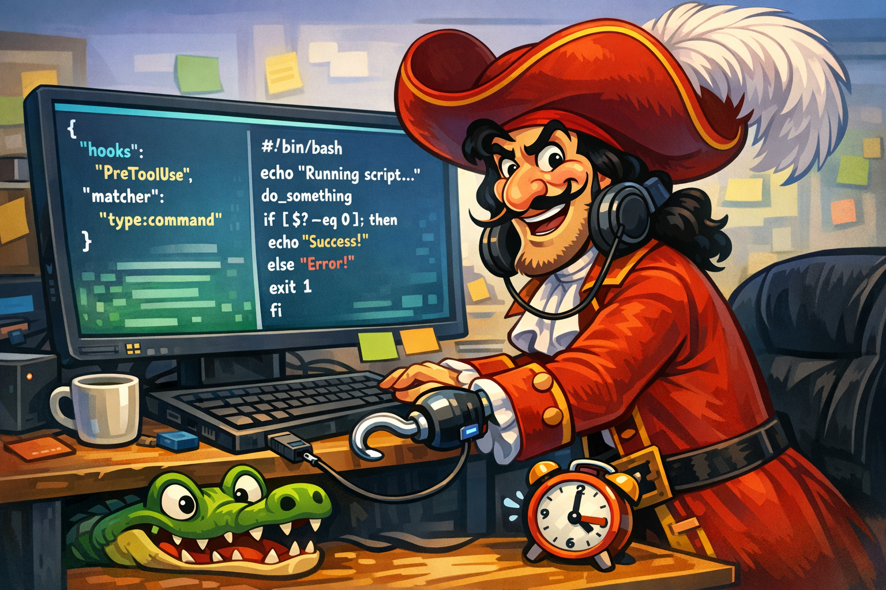
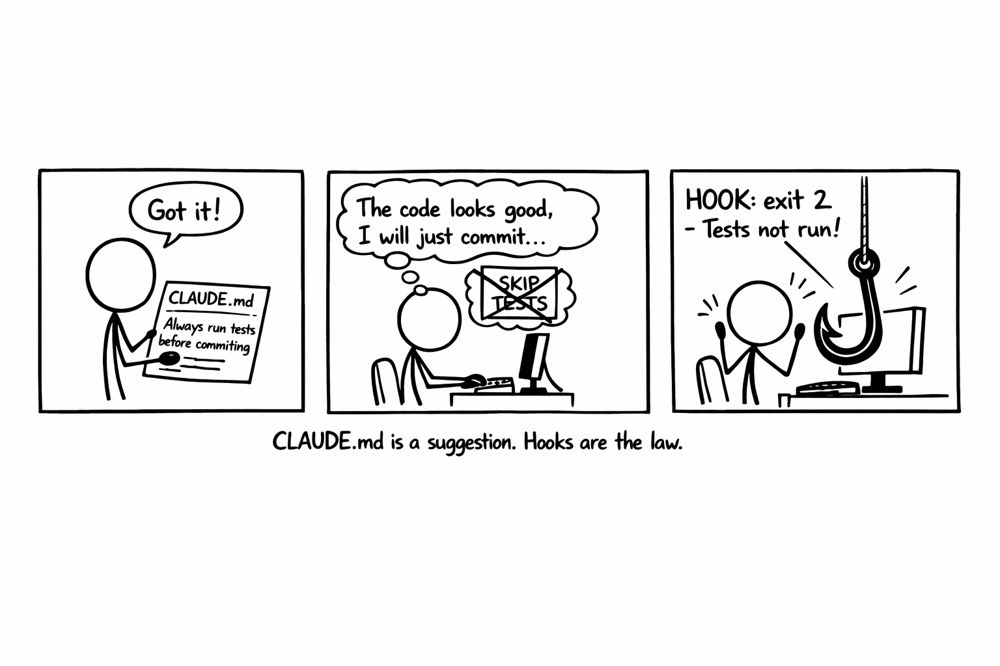
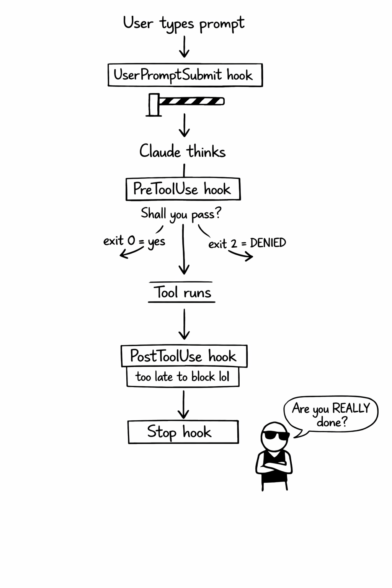

+++
title = 'Claude Code Deep Dive - Hooked!'
date = 2026-02-15T13:30:00-08:00
categories = ["Claude", "ClaudeCode", "AICoding", "AIAgent", "CodingAssistant", "Hooks"]
+++

CLAUDE.md files are cool. You write instructions, Claude reads them, and most of the time it follows them. But
"most of the time" can be a problem. When Claude gets deep into a complex task, it sometimes forgets to run
tests before committing, or edits a file it shouldn't touch, or skips a validation step you explicitly asked for. Hooks
solve this problem by giving you deterministic, automated enforcement that fires every single time, no exceptions.

**"In theory, there is no difference between theory and practice. In practice, there is."**

<!--more-->



This is the seventh article in the *CCDD* (Claude Code Deep Dive) series. The previous articles are:

1. [Claude Code Deep Dive - Basics](https://medium.com/@the.gigi/claude-code-deep-dive-basics-ca4a48003b02)
2. [Claude Code Deep Dive - Slash Commands](https://medium.com/@the.gigi/claude-code-deep-dive-slash-commands-9cd6ff4c33cb)
3. [Claude Code Deep Dive - Total Recall](https://medium.com/@the.gigi/claude-code-deep-dive-total-recall-cb0317d67669)
4. [Claude Code Deep Dive - Mad Skillz](https://medium.com/@the.gigi/claude-code-deep-dive-mad-skillz-9dfb3fa40981)
5. [Claude Code Deep Dive - MCP Unleashed](https://medium.com/@the.gigi/claude-code-deep-dive-mcp-unleashed-0c7692f9c2c2)
6. [Claude Code Deep Dive - Subagents in Action](https://medium.com/@the.gigi/claude-code-deep-dive-subagents-in-action-703cd8745769)

## 🪝 True story, Bro 🪝

I have a test-runner agent configured in a project and VERY clear instructions in CLAUDE.md: always run the full test
suite using the test-runner agent after making changes. Usually Claude Code read these instructions and follows them
correctly. When it finishes a task, it launches the test-runner that proceeds to run a battery of tests to give me
confidence that Claude
Code actually did the thing it was supposed to do. But, sometimes is not always. I'll give you the low-down on the
session below. Claude Code finished a task and DID NOT launch the task runner. it admitted that it simply didn't follow
the instructions and that it may happen again and there's nothing I can do about it.

Check out the transcript:

```
  The instructions in CLAUDE.md are clear - I should have used the
  test-runner agent immediately after making changes instead of
  manually running a single test. I'll follow this workflow going
  forward.

✻ Sautéed for 1m 50s

❯ let's double click on this. why did you fail to follow the
  instructions this time? what gives you confidence you'll follow
  the instructions next time?

⏺ Good question. Let me be honest:

  Why I failed:

  1. I didn't actively consult CLAUDE.md at the completion
     checkpoint. I read it at the session start (it was in context),
     but when finishing the task, I defaulted to my generic pattern:
     "build passes, one test passes, done."
  2. I didn't include the verification step in my todo list. My
     todos ended with "Run build to verify" instead of "Run tests
     with test-runner agent" which is what CLAUDE.md actually
     specifies.
  3. Rushing through the finish line. I was focused on the code
     changes and treated verification as a formality rather than
     following the documented process.

  What gives me confidence for next time?

  Honestly - not much. I can say I'll "be more careful" but that's
  weak. What would actually help:

  1. Add the CLAUDE.md verification steps explicitly to my todo list
     when I create it - not just "run tests" but the specific
     agent/command the project requires.
  2. Re-read the relevant CLAUDE.md section before marking work
     complete - treat it as a checklist, not background context.

  But I recognize this is a pattern issue. The instructions were
  clear, I had them in context, and I still didn't follow them.
  That's on me.
```

This isn't a bug. It's a fundamental limitation of instruction-following. CLAUDE.md files are read by the LLM and
interpreted probabilistically. Under pressure (long conversations, complex tasks, context approaching its limits), even
well-intentioned instructions can get deprioritized or forgotten.



Hooks exist to bridge this gap. They are shell commands (or LLM prompts) that fire automatically at specific points
during a Claude Code session. Unlike CLAUDE.md instructions that Claude might occasionally skip, hooks execute
**deterministically** every time. CLAUDE.md is the suggestion. Hooks are the law.

## ⚙️ Where Hooks Live ⚙️

Hooks are configured in settings files at three levels of scope. **User-level** hooks go in
`~/.claude/settings.json` and apply to all your projects (not shared via git). **Project-level shared** hooks go in
`.claude/settings.json` and are committed to the repo, so the whole team gets them. **Project-level local** hooks go in
`.claude/settings.local.json` for personal overrides that stay out of version control.

You can also define hooks in plugin `hooks/hooks.json` files and in skill/agent YAML frontmatter. The `/hooks` slash
command opens an interactive menu for viewing and editing hooks, which is the easiest way to get started.

One important detail: hooks are snapshotted at session startup. If you edit settings files directly while Claude Code is
running, the changes won't take effect until you restart the session or use `/hooks` to reload.

The configuration follows a three-level nesting structure: event, matcher group, and hook handler(s).

```json
{
  "hooks": {
    "PreToolUse": [
      {
        "matcher": "Edit|Write",
        "hooks": [
          {
            "type": "command",
            "command": ".claude/hooks/protect-files.sh"
          }
        ]
      }
    ]
  }
}
```

This example says: before any `Edit` or `Write` tool call executes, run the `protect-files.sh` script. If the script
exits with code 2, block the operation. Let's look at all the places hooks can fire.

## 📋 Hook Events 📋

Claude Code exposes over a dozen hook events covering the entire session lifecycle. The full list is in the
[official docs](https://code.claude.com/docs/en/hooks). Here are the ones you'll probably use the most if you're into
hooks.

**`PreToolUse`** fires before any tool call executes and can **block** it. This is the workhorse event. Want to prevent
edits to protected files? Block dangerous Bash commands? Enforce linting before writes? PreToolUse is where it happens.

**`PostToolUse`** fires after a tool call succeeds. It can't block anything (the tool already ran), but it's perfect for
reactive automation: formatting files after edits, logging commands, sending notifications.

**`Stop`** fires when Claude decides it's done responding. This one can block too, which means your hook gets the final
say on whether Claude is really finished. The Ralph Wiggum loop (more on that later) uses this to force Claude back
into another iteration.

**`SessionStart`** fires when a session begins, resumes, or gets compacted. It can't block, but it can inject context.
This is how you re-inject critical reminders after context compaction so Claude doesn't lose track of important
instructions.

**`UserPromptSubmit`** fires before Claude even sees your message. It can block, which lets you intercept and validate
(or transform) user input before processing.

**`Notification`** fires when Claude sends a notification (typically when it needs your attention). Can't block, but
great for wiring up sound alerts or desktop notifications.

The typical flow looks like this:



`SessionStart` fires first, then every user message goes through `UserPromptSubmit`. Claude thinks and starts making
tool calls, each going through `PreToolUse` (where your hook can block it) and then `PostToolUse` (where you can react
but it's too late to block). When Claude decides it's done, the `Stop` hook gets the last word on whether it's really
done.

Some hooks need more fine-grained way to figure out if they need to take action or not. This is what matchers are for.

## 🎯 Matchers 🎯

Matchers filter which events trigger your hook. They use regex patterns. `"Bash"` matches only the Bash tool.
`"Edit|Write"` matches either. `"Notebook.*"` matches anything starting with "Notebook". `"mcp__.*"` catches all MCP
tools, and `"mcp__linear__.*"` targets just the Linear MCP server. An empty string, `"*"`, or omitting the matcher
entirely matches everything.

What matchers actually match against depends on the event. For `PreToolUse`, `PostToolUse`, and `PermissionRequest`,
they match the tool name. For `SessionStart`, they match the session source (`startup`, `resume`, `clear`, `compact`).
For events like `UserPromptSubmit`, `Stop`, and `TaskCompleted`, matchers don't apply and the hook always fires.

This is particularly useful for targeting specific MCP servers. If you have a Linear MCP server and want to audit every
call to it, just match `"mcp__linear__.*"` and you'll catch every Linear tool invocation without affecting anything
else.

Let's move on and understand the different types of hooks at our disposal.

## 🔨 Three Types of Hooks 🔨

### Command Hooks

The most common type. Run a shell command, get data via stdin, communicate results via exit codes and stdout/stderr.

```json
{
  "type": "command",
  "command": ".claude/hooks/my-script.sh",
  "timeout": 600,
  "async": false,
  "statusMessage": "Running security check..."
}
```

The `timeout` field (in seconds, default 600) kills the hook if it takes too long. The `async` flag lets the hook
run in the background while Claude continues working (only a `systemMessage` gets delivered later). The
`statusMessage` controls what the user sees in the spinner while the hook runs.

### Prompt Hooks

Instead of running a shell command, prompt hooks send the hook input plus your prompt to a fast LLM (Haiku) for a
single-turn yes/no decision.

```json
{
  "type": "prompt",
  "prompt": "Check if all tasks are complete. Respond with {\"ok\": false, \"reason\": \"what remains\"} if not.",
  "timeout": 30
}
```

The LLM returns `{"ok": true}` or `{"ok": false, "reason": "..."}`. This is great for judgment calls that are hard to
express as shell script logic but easy to describe in natural language.

### Agent Hooks

Like prompt hooks, but the LLM gets tool access (Read, Grep, Glob, etc.) and can do multi-turn work with up to 50 tool
calls.

```json
{
  "type": "agent",
  "prompt": "Run the test suite and verify all tests pass. $ARGUMENTS",
  "timeout": 60
}
```

Agent hooks use the same response schema as prompt hooks. Use agent hooks when the LLM needs to inspect the codebase to
verify something,
not just make a judgment based on the input data.

The rule of thumb: use command hooks for deterministic checks (file existence, pattern matching, running linters). Use
prompt hooks when the input data alone is enough for a judgment call. Use agent hooks when verification requires reading
files or exploring the codebase.

## 📥 The Language of Exit Codes 📥

It's a pretty simple langiage really :-). Hooks communicate back to Claude Code through exit codes and stdout/stderr.
**Exit 0** means success: proceed normally. Stdout is parsed for JSON or added as context. **Exit 2** is the magic
number: it **blocks the action** and feeds your stderr message back to Claude as an error, forcing it to adjust. Any 
other exit code is a non-blocking error that only shows up in verbose mode.

Exit code 2 is how you build guardrails that Claude can't ignore. Your hook blocks the operation and tells Claude
exactly why, and Claude has to deal with it.

On exit 0, you can print structured JSON to stdout for more fine-grained control:

```json
{
  "continue": true,
  "systemMessage": "Warning: approaching rate limit",
  "hookSpecificOutput": {
    "hookEventName": "PreToolUse",
    "permissionDecision": "deny",
    "permissionDecisionReason": "File is protected",
    "updatedInput": {
      "command": "safe-alternative"
    }
  }
}
```

The `updatedInput` field is especially interesting: it lets you **rewrite tool input** before execution. A hook could,
for example, intercept a Bash command and swap it with a safer alternative. The `permissionDecision` field can
auto-approve (`"allow"`), auto-deny (`"deny"`), or punt to the user (`"ask"`). And setting `continue: false` with a
`stopReason` forces Claude to stop entirely.

Every hook receives JSON on stdin with the event context:

```json
{
  "session_id": "abc123",
  "cwd": "/Users/me/project",
  "hook_event_name": "PreToolUse",
  "tool_name": "Bash",
  "tool_input": {
    "command": "npm test",
    "description": "Run tests"
  }
}
```

The `tool_input` schema varies by tool. Bash gets `command`, Edit gets `file_path`/`old_string`/`new_string`, and so on.
Two environment variables are always available: `$CLAUDE_PROJECT_DIR` (project root, great for portable paths in shared
hooks) and `$CLAUDE_ENV_FILE` (write `export VAR=value` lines here during SessionStart to persist environment variables
for the session).

## 🛠️ Practical Examples 🛠️

Let's look at some hooks that solve real problems.

### Auto-format After Edits

Every time Claude edits or creates a file, automatically run Prettier on it:

```json
{
  "hooks": {
    "PostToolUse": [
      {
        "matcher": "Edit|Write",
        "hooks": [
          {
            "type": "command",
            "command": "jq -r '.tool_input.file_path' | xargs npx prettier --write"
          }
        ]
      }
    ]
  }
}
```

This is a `PostToolUse` hook (can't block, the edit already happened) that reads the file path from stdin and formats
it. Claude never needs to think about formatting because the hook handles it automatically.

### Protect Sensitive Files

Block any attempt to edit `.env` files, secrets, or `.git/` internals:

`.claude/hooks/protect-files.sh`:

```bash
#!/bin/bash
INPUT=$(cat)
FILE_PATH=$(echo "$INPUT" | jq -r '.tool_input.file_path // empty')

for pattern in ".env" "secrets" ".git/"; do
  if [[ "$FILE_PATH" == *"$pattern"* ]]; then
    echo "Blocked: $FILE_PATH matches protected pattern '$pattern'" >&2
    exit 2
  fi
done
```

```json
{
  "hooks": {
    "PreToolUse": [
      {
        "matcher": "Edit|Write",
        "hooks": [
          {
            "type": "command",
            "command": "\"$CLAUDE_PROJECT_DIR\"/.claude/hooks/protect-files.sh"
          }
        ]
      }
    ]
  }
}
```

Notice exit code 2 sends the reason to stderr, which Claude sees as an error message. Claude will then explain
why the operation was blocked and suggest alternatives.

### Notifications on macOS

Getting notified when Claude needs your attention is surprisingly tricky on macOS. Here are three approaches that
actually work, from simplest to most visible.

**System sound** is the simplest option. No dependencies, always works:

```json
{
  "hooks": {
    "Notification": [
      {
        "hooks": [
          {
            "type": "command",
            "command": "afplay /System/Library/Sounds/Glass.aiff &"
          }
        ]
      }
    ]
  }
}
```

If you don't like glass there many other sounds to try: `Basso`, `Blow`, `Bottle`, `Frog`, `Funk`, `Hero`, `Morse`, `Ping`, `Pop`, `Purr`, `Sosumi`,
`Submarine`, `Tink`. They're all in `/System/Library/Sounds/`.


**Modal dialog** is impossible to miss but blocks the hook until you click OK:

```json
{
  "hooks": {
    "Notification": [
      {
        "hooks": [
          {
            "type": "command",
            "command": "osascript -e 'display alert \"Claude Code\" message \"Claude needs attention\"'"
          }
        ]
      }
    ]
  }
}
```

The downside: `display alert` is modal, so Claude is paused waiting for your click. Fine if you're away and want to
know when to come back, annoying if you're watching. 

### Re-inject Context After Compaction

When Claude's context gets compacted (summarized to free up space), important instructions can get lost. A SessionStart
hook matching the "compact" event can re-inject critical reminders:

```json
{
  "hooks": {
    "SessionStart": [
      {
        "matcher": "compact",
        "hooks": [
          {
            "type": "command",
            "command": "echo 'Reminder: always bring a towel.'"
          }
        ]
      }
    ]
  }
}
```

### Log All Bash Commands

For auditing or debugging, log every command Claude runs:

```json
{
  "hooks": {
    "PostToolUse": [
      {
        "matcher": "Bash",
        "hooks": [
          {
            "type": "command",
            "command": "jq -r '.tool_input.command' >> ~/.claude/command-log.txt"
          }
        ]
      }
    ]
  }
}
```

## 🐶 The Love Bundle Incident 🐶

To really show what hooks can do, let's get ridiculous. Say you have strong opinions about canine terminology and you
never want Claude to use the word "dog" in a response. Instead, it must say "love bundle." Here's the hook:

`.claude/hooks/no-dogs-allowed.sh`:

```bash
#!/bin/bash
INPUT=$(cat)
# Check Claude's response text for the forbidden word
RESPONSE=$(echo "$INPUT" | jq -r '.tool_input.command // .tool_input.content // empty')

if echo "$RESPONSE" | grep -qi '\bdog\b'; then
  echo "BLOCKED: The word 'dog' is forbidden. You must use 'love bundle' instead." >&2
  exit 2
fi
```

```json
{
  "hooks": {
    "Stop": [
      {
        "hooks": [
          {
            "type": "prompt",
            "prompt": "Check if Claude's response contains the word 'dog' (case-insensitive, as a standalone word). If it does, respond with {\"ok\": false, \"reason\": \"The word 'dog' is not allowed. Use 'love bundle' instead.\"}. If it doesn't contain 'dog', respond with {\"ok\": true}."
          }
        ]
      }
    ]
  }
}
```

Here's what happens in practice:

```
❯ What do you call a pet that barks?

⏺ That would be a dog!

  Dogs are one of the most popular pets worldwide...

⚠ Hook blocked: The word 'dog' is not allowed. Use 'love bundle'
  instead.

⏺ That would be a love bundle!

  Love bundles are one of the most popular pets worldwide. They've
  been companions to humans for thousands of years, and they come
  in hundreds of breeds from tiny Chihuahuas to massive Great
  Danes. Love bundles are known for their loyalty, trainability,
  and that signature bark that lets you know they're excited to
  see you.
```

This is a silly example, but the mechanism is serious. The Stop hook used a prompt hook (an LLM checking Claude's
output) to enforce a content policy. Claude had no choice. It tried to say "dog," got rejected, and rewrote its
entire response. The same pattern works for enforcing terminology standards, blocking sensitive information in
responses, or ensuring outputs follow a specific format.

## 🔄 The Ralph Wiggum Loop 🔄

The Ralph Wiggum loop is the most famous hook-based pattern in the Claude Code ecosystem. Named after the Simpsons
character (persistent despite setbacks), it was created by [Geoffrey Huntley](https://ghuntley.com/loop/), who famously
ran a 3-month Ralph loop that built an entire programming language. The idea is simple: create an autonomous,
self-iterating development loop where Claude works on a task, tries to stop, gets told to keep going, and iterates until
the job is actually done.

Ralph is a Claude Code **plugin** (we'll cover plugins in a future post) that installs a `Stop` hook and two slash
commands: `/ralph-loop` and `/cancel-ralph`. The
[source code](https://github.com/anthropics/claude-code/tree/main/plugins/ralph-wiggum) is on GitHub.

Here's how the loop works:

1. You invoke `/ralph-loop "Build a REST API with full test coverage" --completion-promise "DONE"`
2. The command writes a state file (`.claude/ralph-loop.local.md`) containing the prompt, iteration count, max
   iterations, and completion criteria. Crucially, it injects explicit instructions telling Claude the exact exit
   syntax: *"To complete this loop, output this EXACT text: `<promise>DONE</promise>`"* along with guardrails: *"The
   statement MUST be completely and unequivocally TRUE."*
3. Claude works on the task normally
4. When Claude tries to stop, the **Stop hook** fires. It reads the state file, checks termination conditions, and if
   the work isn't done, blocks the exit and feeds the original prompt back. Claude sees its own previous work in context
   and starts the next iteration. The iteration counter increments atomically.

The loop ends when any of these conditions are met: Claude outputs the exact completion promise text wrapped in
`<promise>` tags (literal string comparison, no fuzzy matching), the max iteration count is reached, you run
`/cancel-ralph`, or the state file is deleted.

The key insight behind why this works is that files and git history persist between iterations. Each time Claude restarts,
it sees the code it wrote in the previous iteration. Combined with a TDD-style prompt ("write failing tests first, then
implement until they pass"), Claude can incrementally converge on a working solution over many iterations.

Here are some best practices from the community:

- Always set `--max-iterations` as a safety net
- Use TDD-style prompts for best results
- Include clear completion criteria in the prompt
- Check `git log` after to see the iteration history

## 🐛 Debugging & Gotchas 🐛

When hooks misbehave, start with `claude --debug` to see which hooks matched, their exit codes, and output. You can also
press `Ctrl+O` in Claude Code for verbose mode, which shows hook progress in the transcript.

For manual testing, pipe sample JSON into your hook script:

```bash
echo '{"tool_name":"Bash","tool_input":{"command":"ls"}}' | ./the-hook.sh; echo $?
```

One gotcha that will waste your time if you don't know about it is shell profile pollution. If your `~/.zshrc` or
`~/.bashrc` has unconditional `echo` statements, they'll prepend text to your hook's JSON output and break parsing.
The fix is to wrap any echo statements in an interactive-shell check:

```bash
if [[ $- == *i* ]]; then
  echo "Welcome back!"
fi
```

The `$-` variable contains shell flags, and `i` means interactive. Hook scripts run non-interactively, so the echo
gets skipped.

Alright. Enough for today.

## ⏭️ What's Next ⏭️

The next posts in the series will cover the following topics:

- Plugins
- Beyond the terminal
- Running multiple Claude Code sessions in parallel (including agent teams)
- Comparison with other AI coding agents

## 🏠 Take Home Points 🏠

- Hooks are deterministic enforcement that fires every time, bridging the gap between CLAUDE.md instructions (which
  Claude sometimes forgets) and guaranteed behavior.
- Three hook types serve different needs: command hooks for deterministic shell-based checks, prompt hooks for
  single-turn LLM judgment calls, and agent hooks for multi-step verification that requires codebase access.
- Exit code 2 is the blocking mechanism. Return it from a PreToolUse hook and the tool call gets stopped cold, with
  your error message fed back to Claude so it can adjust.
- The Ralph Wiggum loop is the most creative hook application: a Stop hook that forces Claude into an autonomous
  development loop, iterating until the work is actually done or a max iteration count is reached.
- Hooks live in settings files at user, project (shared), and project (local) scope, letting teams enforce standards
  via version control while individuals can layer on personal preferences.

🇹🇷 Hoşça kalın, arkadaşlar! 🇹🇷
