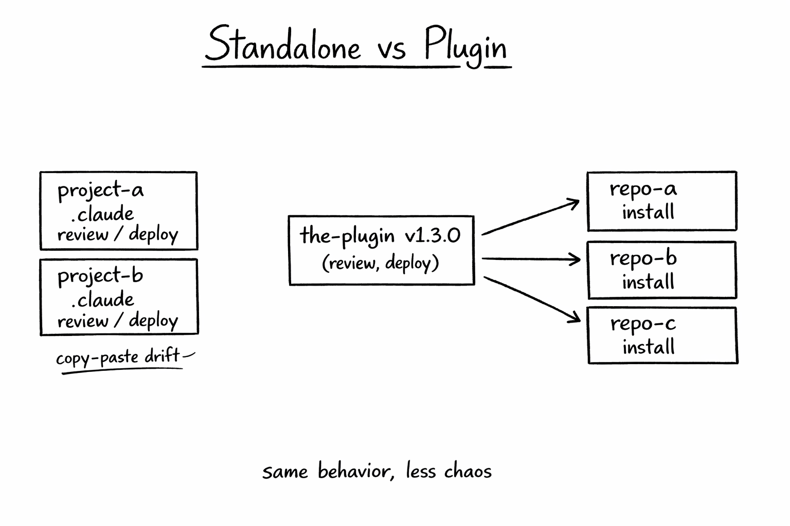
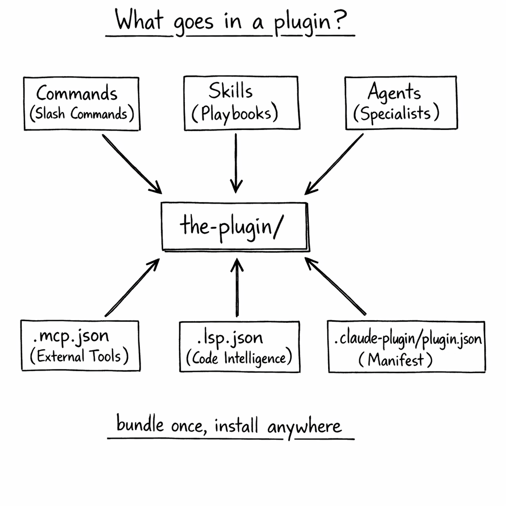
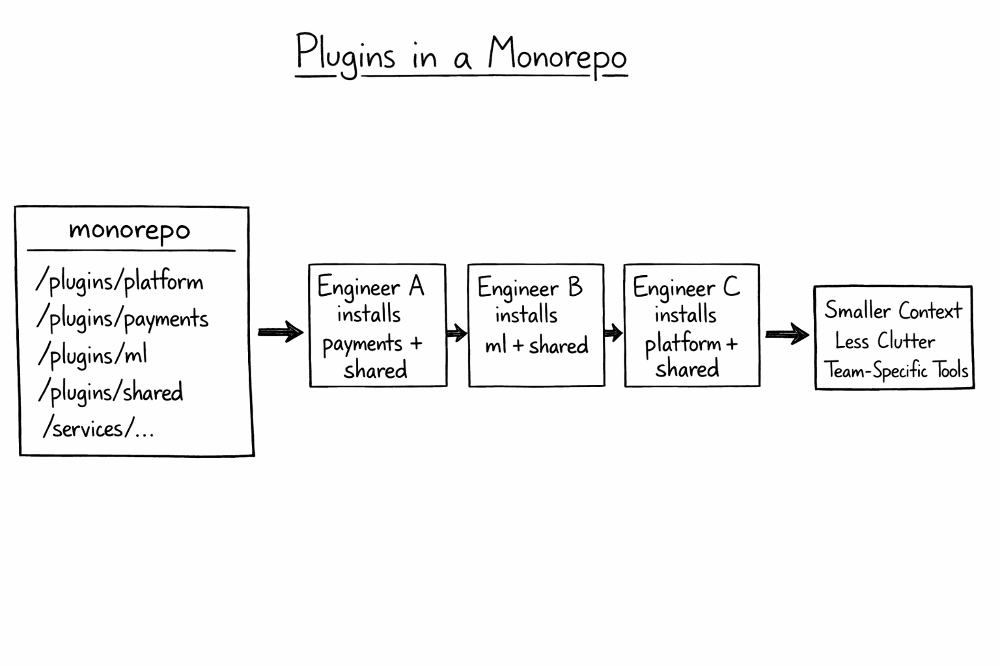

+++
title = 'Claude Code Deep Dive - Plug and Play'
date = 2026-02-22T13:30:00-08:00
categories = ["Claude", "ClaudeCode", "AICoding", "AIAgent", "CodingAssistant", "Plugins"]
+++

You've built your skills, wired up your hooks, and assembled your subagents. Now your `.claude/` directory is a
sprawling mess of Markdown files that only you understand, and sharing it with a teammate means either committing your
deeply personal CLAUDE.md or handing them a zip file like it's 2003.

There's a better way. Plugins are how Claude Code goes from solo power tool to a shareable, versioned, installable
ecosystem.

**"The best code is code you don't have to write." ~ Jeff Atwood**

<!--more-->


This is the eighth article in the *CCDD* (Claude Code Deep Dive) series. The previous articles are:

1. [Claude Code Deep Dive - Basics](https://medium.com/@the.gigi/claude-code-deep-dive-basics-ca4a48003b02)
2. [Claude Code Deep Dive - Slash Commands](https://medium.com/@the.gigi/claude-code-deep-dive-slash-commands-9cd6ff4c33cb)
3. [Claude Code Deep Dive - Total Recall](https://medium.com/@the.gigi/claude-code-deep-dive-total-recall-cb0317d67669)
4. [Claude Code Deep Dive - Mad Skillz](https://medium.com/@the.gigi/claude-code-deep-dive-mad-skillz-9dfb3fa40981)
5. [Claude Code Deep Dive - MCP Unleashed](https://medium.com/@the.gigi/claude-code-deep-dive-mcp-unleashed-0c7692f9c2c2)
6. [Claude Code Deep Dive - Subagents in Action](https://medium.com/@the.gigi/claude-code-deep-dive-subagents-in-action-703cd8745769)
7. [Claude Code Deep Dive - Hooked!](https://medium.com/@the.gigi/claude-code-deep-dive-hooked-8492c9b5c9fb)

## 📦 What Even Is a Plugin? 📦

Claude Code has a LOT of knobs to control its operation like commands, skills, subagents, hooks, MCP servers and LSP
servers.
A plugin is a directory that bundles these Claude Code extensions into a single installable, shareable unit. Pretty much
anything you'd normally scatter across your `.claude/` directory
can be packaged into a plugin and distributed to teammates, the community, or future-you on a fresh machine.

The magic ingredient is a manifest file at `.claude-plugin/plugin.json`. That file gives the plugin an identity: a
name (which becomes the namespace for all its skills), a version, a description, and optional metadata. Everything
else flows from that.

```json
{
  "name": "the-plugin",
  "description": "Some awesome Claude Code extensions",
  "version": "1.0.0",
  "author": {
    "name": "Gigi Sayfan"
  }
}
```

Here's the thing: the manifest is actually **optional**. If you omit it, Claude Code auto-discovers components in
their default locations and uses the directory name as the plugin name. But you want the manifest. It's how you
control namespacing, versioning, and what shows up in the plugin manager.

The full plugin directory structure looks like this:

```
the-plugin/
├── .claude-plugin/
│   └── plugin.json          # Your plugin's identity card
├── commands/                # Slash commands (Markdown files)
├── agents/                  # Custom subagent definitions
├── skills/                  # Agent Skills (SKILL.md folders)
├── hooks/                   # Event handlers (hooks.json)
├── .mcp.json                # MCP server configs
└── .lsp.json                # LSP server configs
```

You don't need all of these. A plugin can be a single skill. It can be just an MCP config. It's a packaging mechanism,
not a prescribed bundle. You decide what goes into your plugin.

## 🆚 Plugins vs. Standalone Configuration 🆚

Before plugins, you'd drop things directly into `.claude/`. That still works, and for personal, project-specific
stuff it's still the right approach. But there's a clear line between when to use each.

- **Skill names:** standalone uses `/hello`; plugin uses `/the-plugin:hello`.
- **Scope:** standalone is usually one project; plugins are meant for multiple projects and teams.
- **Sharing:** standalone is manual copy/paste; plugins use install commands or a marketplace.
- **Versioning:** standalone is "whatever is in git"; plugins use semantic versions.
- **Best for:** standalone is personal workflows and quick experiments; plugins are for team tools and community
  distribution.

The **namespacing** is the most tangible difference. Standalone skills get short names: `/review`, `/deploy`,
`/test`. Plugin skills are namespaced: `/the-plugin:review`, `/the-plugin:deploy`, `/the-plugin:test`. That `/` in the
middle is not a quirk — it's conflict prevention. If you install ten plugins that all have a `review` skill, they all
coexist without trampling each other.

The downside is typing. `/code-review-toolkit:review` is a lot of characters. But you get tab completion, and most
skills that truly matter get invoked automatically by context rather than manually.



Now that the "why plugins" case is clear, let's open one up and look at what actually goes inside.

## 🧩 What Goes in a Plugin 🧩

This section is mostly a refresher, since we covered most of these components in earlier CCDD episodes.



Let's walk through the components one by one, starting with slash commands.

### Slash Commands

Plugins package standalone slash commands in `commands/` as Markdown files, same format as in
[CCDD #2](https://medium.com/@the.gigi/claude-code-deep-dive-slash-commands-9cd6ff4c33cb).
These are great for explicit, user-invoked workflows.

```markdown
# commands/release-checklist.md

Run a pre-release checklist for this repo:

1. Verify tests pass
2. Verify version/changelog updates
3. Produce a release summary with risks
```

In plugin form, commands are namespaced just like skills. So `release-checklist.md` becomes
`/the-plugin:release-checklist`.

### Skills

Skills inside a plugin live in `skills/<skill-name>/SKILL.md`. They're identical in format to the standalone skills
covered in [CCDD #4](https://medium.com/@the.gigi/claude-code-deep-dive-mad-skillz-9dfb3fa40981) — YAML frontmatter
with `name` and `description`, Markdown body as the playbook. The only difference is that they get the plugin's
namespace prefix.

```markdown
---
name: code-review
description: Reviews code for best practices and potential issues. Use when reviewing code, checking PRs, or analyzing code quality.
---

When reviewing code, check for:

1. Code organization and structure
2. Error handling and edge cases
3. Security concerns (no credentials, no injection vectors)
4. Test coverage for new functionality
```

That skill becomes `/the-plugin:code-review`. Or if your plugin is named `toolkit`, it becomes `/toolkit:code-review`.
The `$ARGUMENTS` token still works — `/the-plugin:hello Gigi` passes "Gigi" as `$ARGUMENTS`.

Skills can also include supporting files alongside `SKILL.md` — scripts, templates, reference documents. Claude reads
the skill and executes the scripts as needed:

```
skills/
├── code-review/
│   ├── SKILL.md
│   └── reference.md     # Extra context Claude can load
└── deploy/
    ├── SKILL.md
    └── scripts/
        └── pre-deploy-check.sh
```

### Subagents

Subagents in a plugin live in `agents/`. Same Markdown+frontmatter format from
[CCDD #6](https://medium.com/@the.gigi/claude-code-deep-dive-subagents-in-action-703cd8745769). They appear in the
`/agents` interface and Claude can invoke them automatically based on task context.

```markdown
---
name: security-auditor
description: Audits code for security vulnerabilities. Use proactively when reviewing authentication, authorization, or data handling code.
tools: Read, Glob, Grep
model: sonnet
---

You are a security-focused code reviewer. Scan for:

- Hardcoded credentials or API keys
- SQL/command injection vectors
- Insecure deserialization
- Missing input validation
- Exposed sensitive data in logs

Report findings by severity: Critical / High / Medium / Low.
```

Plugin agents use the same scoping as standalone agents — they just travel with the plugin.

### Hooks

Plugin hooks live in `hooks/hooks.json` (or inline in `plugin.json`). Same event model from
[CCDD #7](https://medium.com/@the.gigi/claude-code-deep-dive-hooked-8492c9b5c9fb) — `PreToolUse`, `PostToolUse`,
`Stop`, etc. The key difference: hook scripts can reference `${CLAUDE_PLUGIN_ROOT}`, an environment variable that
always resolves to the plugin's installation directory.

```json
{
  "hooks": {
    "PostToolUse": [
      {
        "matcher": "Write|Edit",
        "hooks": [
          {
            "type": "command",
            "command": "${CLAUDE_PLUGIN_ROOT}/scripts/format-code.sh"
          }
        ]
      }
    ]
  }
}
```

The `${CLAUDE_PLUGIN_ROOT}` variable is super useful. Without it you'd have to hardcode absolute paths, which breaks
the moment anyone installs your plugin on their own machine.

### MCP Servers

Plugins can bundle MCP server configurations in `.mcp.json`. The MCP servers start automatically when the plugin is
enabled and appear as standard tools to Claude. Plugin MCP configs can also use `${CLAUDE_PLUGIN_ROOT}`:

```json
{
  "mcpServers": {
    "plugin-database": {
      "command": "${CLAUDE_PLUGIN_ROOT}/servers/db-server",
      "args": [
        "--config",
        "${CLAUDE_PLUGIN_ROOT}/config.json"
      ]
    }
  }
}
```

A deployment plugin can, for example, bundle an MCP server that talks to your staging environment API and provides
Claude with
real-time deployment status. That's the power move: combine a `/deploy` skill with a staging MCP server and
a pre-deploy-check hook into one installable unit.

### LSP Servers

This is the component that didn't exist before plugins, and it's really cool. LSP (Language Server Protocol)
servers give Claude real-time code intelligence — the same type-checking, symbol lookup, and go-to-definition
capabilities your IDE has (if you still use an IDE of course. I don't). Claude can now know that `Foo` doesn't implement
interface `Bar` through the language server as opposed to performing text-level search. It makes it more reliable and
more efficient.

```json
{
  "go": {
    "command": "gopls",
    "args": [
      "serve"
    ],
    "extensionToLanguage": {
      ".go": "go"
    }
  }
}
```

Anthropic ships official LSP plugins for Python TypeScript , and Rust. Install the one that
matches your stack and Claude gets reliable type diagnostics instead of guessing from text. The language server runs in
the background and serves symbols, definitions, and type information on demand.

Note that you must install the language server binary on your machine. The plugin just configures it.

See https://code.claude.com/docs/en/plugins-reference#lsp-servers.

## 🔌 Installing and Managing Plugins 🔌

Once you've found a plugin (more on finding them in a moment), installation is one command:

```bash
# From the official Anthropic marketplace
claude plugin install @anthropic/deploy-helper

# From a GitHub repo
claude plugin install github:username/repo-name

# From a local directory (dev/testing)
claude plugin install ./the-plugin

# Or test without installing at all
claude --plugin-dir ./the-plugin
```

That `--plugin-dir` flag is worth highlighting. It loads a plugin for one session without installing it globally. This
is your dev/test loop: make a change, run `claude --plugin-dir ./the-plugin`, try the skill, exit, iterate. No
install/uninstall cycle required.

### Managing installed plugins

The `claude plugin` command comes with several convenient sub-commands to manage your installed plugins:

```bash
claude plugin list                              # See what's installed
claude plugin update @anthropic/deploy-helper   # Update one plugin
claude plugin update --all                      # Update everything
claude plugin remove @anthropic/deploy-helper   # Remove a plugin (you can use uninstall too)
claude plugin enable the-plugin                 # Re-enable a disabled plugin
claude plugin disable the-plugin                # Disable without removing
```

Alright, let's talk about installation scopes.

### Installation Scopes

This mirrors the scoping model from the rest of Claude Code. Everything has user/project/local/managed scope:

- `user` (default): `~/.claude/settings.json` for personal tools that work everywhere.
- `project`: `.claude/settings.json` for team-shared config committed to git.
- `local`: `.claude/settings.local.json` for project-specific personal overrides (gitignored).
- `managed`: `managed-settings.json` for enterprise read-only policy.

```bash
# Install only for this project (committed to git, shared with team)
claude plugin install @anthropic/deploy-helper --scope project

# Install locally for this project (gitignored, personal override)
claude plugin install debug-plugin --scope local
```

Project-scoped plugins are how you enforce team-wide tooling. Commit `.claude/settings.json` with the plugin listed,
and every developer who clones the repo gets the same Claude Code experience. The security-auditor subagent, the
company-specific deployment hooks, the custom code review skill are all there on `git clone`.

## 🏪 The Plugin Ecosystem 🏪

The plugin system launched in October 2025, and in the few months since, the ecosystem has grown fast. Anthropic's
official marketplace at [plugins.claude.ai](https://plugins.claude.ai) has verified community plugins alongside
Anthropic-built ones. The community really took to plugin and built thousands of them. It can be pretty overwhelming,
actually.

As of early 2026, there are over 12,000 plugins across the official
marketplace, [ClaudePluginHub](https://claudepluginhub.com),
and [Claude-Plugins.dev](https://claude-plugins.dev). The GitHub
[awesome-claude-code](https://github.com/anthropics/claude-code/tree/main/plugins) repository has a curated list
organized by category.

Anthropic ships several official plugins in the Claude Code repository itself. Let's check out some of the highlights:

**`code-review`** — Automated PR review via 5 parallel Sonnet subagents: CLAUDE.md compliance, bug detection, PR
history, historical context, and code comments. Each agent runs independently and a confidence-based scoring system
filters false positives.

**`feature-dev`** — A 7-phase structured feature development workflow. Three specialized subagents (`code-explorer`,
`code-architect`, `code-reviewer`) handle codebase analysis, architecture design, and quality review respectively.

**`commit-commands`** — Adds `/commit`, `/commit-push-pr`, and `/clean_gone` for streamlined git operations. Dead
simple, extremely useful.

**`security-guidance`** — A `PreToolUse` hook that monitors 9 security patterns (command injection, XSS, eval usage,
dangerous HTML, pickle deserialization, os.system calls, and more) and warns before writing potentially dangerous code.

**`ralph-wiggum`** — Yes, really. Bundles the Ralph Wiggum loop from
[CCDD #7](https://medium.com/@the.gigi/claude-code-deep-dive-hooked-8492c9b5c9fb) into a plugin, adding `/ralph-loop`
and `/cancel-ralph` commands and the Stop hook that drives the autonomous iteration loop. One install, zero setup.

**`plugin-dev`** — A meta-plugin. It contains skills, subagents, and guided workflows specifically for *building other
plugins*. The `agent-creator`, `plugin-validator`, and `skill-reviewer` subagents help you write, validate, and
refine your own plugins. Dogfooding at its finest.

The community's consensus best-of-four for 2026 so far: Language Server plugin (for real-time type intelligence),
Superpowers (20+ production-proven skills), commit-commands, and a PR review toolkit. Plus Context7 and Sequential
Thinking as MCPs. That's seems like the sweet spot for many developers — a few plugins, a couple of MCP servers — before
the context overhead get tight.

## 🏗️ Plugins in a Monorepo 🏗️

Let's say you work in a large organization with hundreds or thousands of other engineers. You work some project that may
be spread across multiple directories. The Claude Code's project scope is directory based, so it doesn't work well for
multi-directory projects. You can't put all your team's stuff (skills, agents, hooks, etc) in the root of the repo
because then you'll clutter the context for every engineer. This is where plugins shine. The trick is to create a
directory based marketplace in your monorepo. The marketplace will contain the plugins of every team (as well as
general-purpose plugins). Every team member will install only the plugins relevant for them. Problem solved!



That model is the practical pattern: shared plugin inventory, team-specific installs, and less context clutter per engineer.

## ⏭️ What's Next ⏭️

The CCDD series continues. Coming up:

- Beyond the terminal (Claude Code in CI/CD, GitHub Actions, headless)
- Running multiple Claude Code sessions in parallel (including agent teams)
- Comparison with other AI coding agents

## 🏠 Take Home Points 🏠

- Plugins are the packaging and distribution layer for everything in `.claude/` - commands, skills, agents, hooks, MCP, LSP
- The manifest (`.claude-plugin/plugin.json`) is optional but recommended as it controls the namespace, version, and
  plugin manager display
- Plugin skills are always namespaced (`/plugin-name:skill-name`) to prevent conflicts - standalone configs keep the
  short names
- `${CLAUDE_PLUGIN_ROOT}` is the key variable for skills, hooks and MCP configs that need to reference files within the plugin
- Four installation scopes: `user` (personal, global), `project` (team-shared via git), `local` (project-specific,
  gitignored), and `managed` (enterprise read-only policy)
- `claude --plugin-dir ./the-plugin` is the dev loop - test without installing
- LSP plugins are the hidden gem: real-time type intelligence for Claude, same as your IDE
- Create a private plugin marketplace for your monorepo 

🇯🇵 またね、みんな！ 🇯🇵
