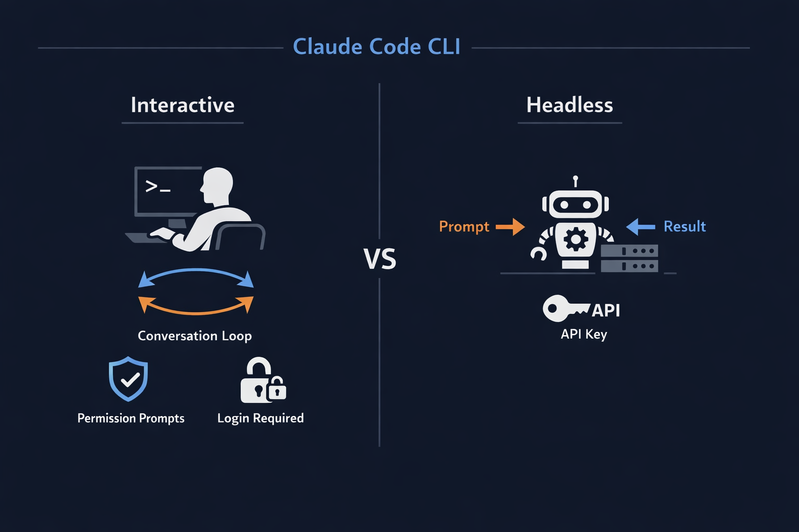
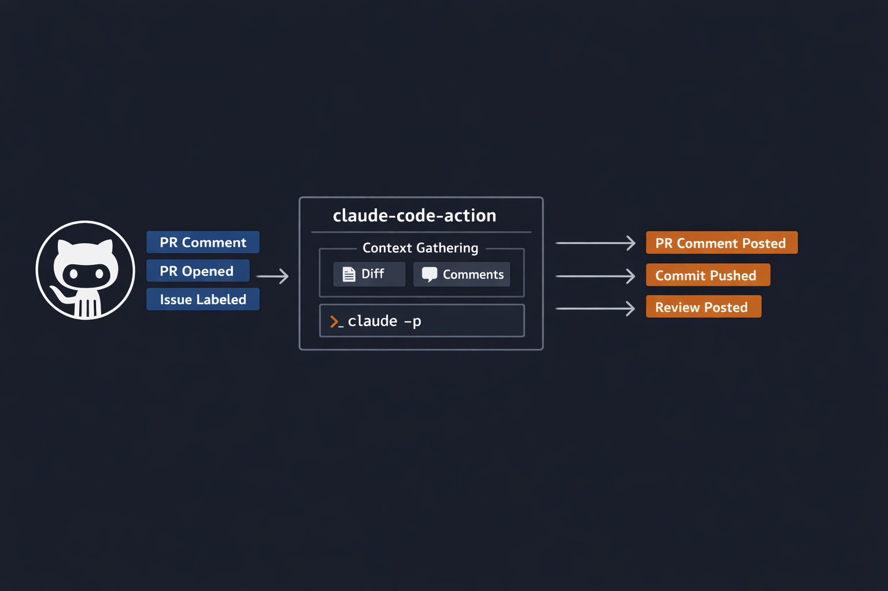

+++
title = 'Claude Code Deep Dive - Pipeline Dreams'
date = 2026-03-08T13:30:00-08:00
categories = ["Claude", "ClaudeCode", "AICoding", "AIAgent", "CodingAssistant", "CICD"]
+++

Claude Code in the terminal is awesome, but there are other ways to unleash Claude Code. One of the most useful ways is to integrate Claude Code into your CI/CD pipeline! Now, it can react to PR events, respond to user comments or just run on a schedule. 

**"If you automate a mess, you get an automated mess." ~ Rod Michael**

<!--more-->


This is the ninth article in the *CCDD* (Claude Code Deep Dive) series. The previous articles are:

1. [Claude Code Deep Dive - Basics](https://medium.com/@the.gigi/claude-code-deep-dive-basics-ca4a48003b02)
2. [Claude Code Deep Dive - Slash Commands](https://medium.com/@the.gigi/claude-code-deep-dive-slash-commands-9cd6ff4c33cb)
3. [Claude Code Deep Dive - Total Recall](https://medium.com/@the.gigi/claude-code-deep-dive-total-recall-cb0317d67669)
4. [Claude Code Deep Dive - Mad Skillz](https://medium.com/@the.gigi/claude-code-deep-dive-mad-skillz-9dfb3fa40981)
5. [Claude Code Deep Dive - MCP Unleashed](https://medium.com/@the.gigi/claude-code-deep-dive-mcp-unleashed-0c7692f9c2c2)
6. [Claude Code Deep Dive - Subagents in Action](https://medium.com/@the.gigi/claude-code-deep-dive-subagents-in-action-703cd8745769)
7. [Claude Code Deep Dive - Hooked!](https://medium.com/@the.gigi/claude-code-deep-dive-hooked-8492c9b5c9fb)
8. [Claude Code Deep Dive - Plug and Play](https://medium.com/@the.gigi/claude-code-deep-dive-plug-and-play-af03f77c6568)

## 🏭 Going Headless 🏭

When you run `claude` in your terminal, you get the full interactive experience: a conversation loop where you type prompts, approve tool calls, and watch Claude think. That's great for development. It's terrible for automation. CI runners don't have as many fingers as you and me.

The headless mode is a single flag: `claude -p`. The `-p` stands for "print". Claude Code reads your prompt, does the work, prints the result, and exits. One shot, no conversation loop, no permission prompts to click through. Simple and elegant. 

```bash
# Interactive (human at the keyboard)
claude

# Headless (CI pipeline, cron job, script)
claude -p "Run the test suite and report failures"
```



The other critical difference is authentication. Interactive mode uses your logged-in account (via `claude login`). Headless mode uses an API key, because there's nobody around to open a browser and click "Authorize." Set the `ANTHROPIC_API_KEY` environment variable and you're good to go. Every CI system has a mechanism for injecting secrets into environment variables, so this works everywhere.

Let's give it a try:

```bash
export ANTHROPIC_API_KEY="sk-ant-<redacted>"

❯ claude -p "What's this repo all about in 30 words or less?"

A Hugo static site blog called "The Gigi Zone" using the Ananke theme, deployed to GitHub Pages. 
Features a Claude Code Deep Dive series and various technical posts.
```

It's that simple. You can also run a bunch of headless Claude Code sessions in parallel.

## 🎛️ Controlling the Machine 🎛️

Running `claude -p "do something"` is fine for quick scripts, but real CI workflows need more control. The CLI flags break into three groups: output control, permissions, and resource limits.

### Output control

By default, headless mode prints plain text. That's fine for humans reading logs, but if your pipeline needs to parse the response, you should consider structured output. The `--output-format` flag gives you three options.

`text` is the default: Claude's response as a plain string. `json` wraps the response in a JSON object that includes the result text, a `session_id` (useful for resuming later), token usage stats, and an optional `structured_output` field. `stream-json` is the real-time option: newline-delimited JSON objects streamed as Claude works, one event per line (requires the `--verbose` flag).

```bash
# Plain text (default)
claude -p "Summarize the last 3 commits" --output-format text

# JSON with metadata (recommended to pipe to jq if you want to look at it yourself)
claude -p "Summarize the last 3 commits" --output-format json | jq

# Streaming events (requires --verbose)
claude -p "Summarize the last 3 commits" --output-format stream-json --verbose
```

The JSON output looks like this. Not super human-readable, but contains a lot of metadata in addition to the answer in a well-defined format. 

```json 
{
  "type": "result",
  "subtype": "success",
  "is_error": false,
  "duration_ms": 11092,
  "duration_api_ms": 8465,
  "num_turns": 2,
  "result": "Here are the last 3 commits:\n\n1. **`eaf94e6`** - Claude Code Deep Dive - Plug and Play\n2. **`aa556bb`** - Claude Code Deep Dive - Hooked!\n3. **`d81289b`** - Claude Code Deep Dive - Subagents in Action\n\nAll three are CCDD series blog posts. They cover Plug and Play (likely about plugins/extensions), Hooks, and Subagents in Action, respectively.",
  "stop_reason": null,
  "session_id": "be3798f1-9fe6-4235-82df-2de2c1cd731c",
  "total_cost_usd": 0.242565,
  "usage": {
    "input_tokens": 4,
    "cache_creation_input_tokens": 34926,
    "cache_read_input_tokens": 34715,
    "output_tokens": 276,
    "server_tool_use": {
      "web_search_requests": 0,
      "web_fetch_requests": 0
    },
    "service_tier": "standard",
    "cache_creation": {
      "ephemeral_1h_input_tokens": 0,
      "ephemeral_5m_input_tokens": 34926
    },
    "inference_geo": "",
    "iterations": [],
    "speed": "standard"
  },
  "modelUsage": {
    "claude-opus-4-6[1m]": {
      "inputTokens": 4,
      "outputTokens": 276,
      "cacheReadInputTokens": 34715,
      "cacheCreationInputTokens": 34926,
      "webSearchRequests": 0,
      "costUSD": 0.242565,
      "contextWindow": 1000000,
      "maxOutputTokens": 32000
    }
  },
  "permission_denials": [],
  "fast_mode_state": "off",
  "uuid": "7ab5f92a-5551-4941-a820-53a43c8ebeb9"
}
```

If you need Claude to return data in a specific shape (not just prose), pass `--json-schema` with a JSON Schema definition. The response lands in the `structured_output` field, validated against your schema. This is incredibly useful for CI: extract function names, list failing tests, categorize issues, all in a shape your downstream scripts can consume without fragile regex parsing.

```bash
❯ claude -p "Show all TODO comments in the repo" \
  --output-format json \
  --json-schema '{"type":"object","properties":{"todos":{"type":"array","items":{"type":"object","properties":{"file":{"type":"string"},"line":{"type":"number"},"text":{"type":"string"}}}}},"required":["todos"]}' | jq .structured_output
{
  "todos": [
    {
      "file": "layouts/_default/summary-with-image.html",
      "line": 27,
      "text": "TODO: add author"
    },
    {
      "file": "themes/ananke/layouts/partials/summary-with-image.html",
      "line": 26,
      "text": "TODO: add author"
    },
    {
      "file": "themes/ananke/layouts/_default/summary-with-image.html",
      "line": 23,
      "text": "TODO: add author"
    },
    {
      "file": "themes/ananke/README.md",
      "line": 383,
      "text": "TODO: (section header in theme README)"
    }
  ]
}
```

OK. Let's talk permissions.

### Permissions

In interactive mode, Claude asks you before running shell commands or editing files (unless you dangerously skip permissions or allowed certain tools in config) . That doesn't work when nobody's watching. 

The `--allowedTools` flag auto-approves specific tools so Claude can operate autonomously.

```bash
# Let Claude read, search, and run git commands
claude -p "Review the diff for security issues" \
  --allowedTools "Read,Grep,Glob,Bash(git diff *),Bash(git log *)"
```

Notice the `Bash(git diff *)` syntax. You can scope Bash permissions to specific command prefixes, so Claude can run `git diff` but not `rm -rf /`. The wildcard matches anything after the prefix. On the flip side, `--disallowedTools` removes tools from Claude's context entirely. The model won't even see them as options.

The `--permission-mode` flag controls the overall permission behavior. Set it to `plan` and Claude will describe what it would do without actually doing it (great for dry runs). Or if you're feeling brave (AKA reckless), `--permission-mode skipPermissions` auto-approves everything, though you need to explicitly opt in with the `--allow-dangerously-skip-permissions` flag as a safety guard.

### Resource limits

CI/CD pipelines need guardrails. The `--max-turns` flag caps the number of agentic iterations (each tool use plus response counts as one turn). If Claude is stuck in a loop trying to fix a test, it'll stop after N turns instead of burning through your budget. The `--max-budget-usd` flag sets a hard dollar limit on API costs for the session.

```bash
claude -p "Fix the failing tests" \
  --max-turns 10 \
  --max-budget-usd 5.00 \
  --allowedTools "Bash(npm test *),Read,Edit"
```

These two flags together form a safety net. You should set them in every CI/CD job. You'll thank yourself when a prompt accidentally triggers an infinite investigation loop.

## 🔗 Chaining Sessions 🔗

One-shot prompts are the simple case. Real-world CI workflows often need multi-step pipelines where each step builds on the previous one. Claude Code supports this through session continuation.

The `--continue` flag picks up the most recent session in the current directory. The `--resume` flag takes a specific session ID, which you can capture from the JSON output of a previous run. This all works in the terminal too as we covered in [CCDD #1 - Basics](https://medium.com/@the.gigi/claude-code-deep-dive-basics-ca4a48003b02). Anyway, this means you can split a complex workflow into discrete steps, each in its own CI stage, and Claude carries the full conversation context forward.

```bash
# Step 1: Analyze the codebase
session_id=$(claude -p "Analyze this codebase for performance bottlenecks" \
  --output-format json \
  --allowedTools "Read,Grep,Glob" | jq -r '.session_id')

# Step 2: Generate fixes (same context, new prompt)
claude -p "Now generate fixes for the top 3 bottlenecks you found" \
  --resume "$session_id" \
  --allowedTools "Read,Edit"

# Step 3: Validate the fixes
claude -p "Run the benchmark suite and compare before/after" \
  --resume "$session_id" \
  --allowedTools "Bash(npm run benchmark *),Read"
```

Each step sees the full history of the conversation. Claude remembers what it analyzed in Step 1 when it generates fixes in Step 2, and remembers both when it runs benchmarks in Step 3. No need to re-explain the context or re-read the same files. However, each step gets its own set of tools appropriate for its task.

The `--append-system-prompt` flag is the other chaining primitive. It adds custom instructions to Claude's system prompt without replacing the defaults. This is how you inject CI-specific context: the branch name, the PR author, the list of changed files, whatever your pipeline knows that Claude should know.

```bash
claude -p "Review the changes in this PR" \
  --append-system-prompt "You are reviewing PR #${PR_NUMBER} by ${PR_AUTHOR}. Changed files: ${CHANGED_FILES}. Focus on security and performance." \
  --allowedTools "Read,Grep,Glob"
```

If you need ephemeral runs that don't pollute the session history, pass `--no-session-persistence`. The session exists only for that invocation and leaves no trace on disk.

You can for example capture the output from one ephemeral run and start a fresh session with that output.


## 🔧 Headless in the Wild 🔧

The beauty of `claude -p` is that it's just a CLI command. Any CI system that can run shell commands can run Claude Code. Here's what that looks like in a few popular systems.

### Jenkins (Groovy)

```groovy
pipeline {
    agent any
    environment {
        ANTHROPIC_API_KEY = credentials('anthropic-api-key')
    }
    stages {
        stage('Code Review') {
            steps {
                sh '''
                    claude -p "Review the changes in this commit for bugs and security issues" \
                        --output-format json \
                        --allowedTools "Read,Grep,Glob" \
                        --max-turns 5 \
                        --max-budget-usd 2.00
                '''
            }
        }
    }
}
```

### GitLab CI

```yaml
code-review:
  stage: review
  image: node:20
  variables:
    ANTHROPIC_API_KEY: $ANTHROPIC_API_KEY
  before_script:
    - npm install -g @anthropic-ai/claude-code
  script:
    - |
      claude -p "Review the merge request changes for quality issues" \
        --output-format json \
        --allowedTools "Read,Grep,Glob" \
        --max-turns 5
```

### Generic shell script

```bash
#!/bin/bash
set -euo pipefail

# Works anywhere: CircleCI, Buildkite, Azure Pipelines, local cron...
result=$(claude -p "Run linting and report issues" \
    --output-format json \
    --allowedTools "Bash(npm run lint *),Read" \
    --max-turns 3 \
    --max-budget-usd 1.00)

# Parse the output
issues=$(echo "$result" | jq -r '.result')
echo "Claude found: $issues"
```

The pattern is the same everywhere: install Claude Code, set the API key, run `claude -p` with appropriate flags. The CI system doesn't matter. If it can execute `bash`, it can execute Claude Code.

## 🐙 Enter GitHub Actions 🐙

Running `claude -p` in any CI/CD pipeline is straightforward, but GitHub has a first-class integration that goes further. The `claude-code-action` is a GitHub Action built and maintained by Anthropic that wraps headless mode with GitHub-native features: reading PR diffs, posting review comments, creating commits, and responding to @-mentions.

The architecture has two parts. First, you install the Claude GitHub App on your repository (visit https://github.com/apps/claude or run `/install-github-app` from the Claude Code CLI). The App grants the permissions Claude needs to interact with your repository: reading contents, writing comments on issues and PRs, and pushing commits. Second, you add the `anthropics/claude-code-action` to your GitHub Actions workflow. The Action handles the orchestration: it gathers context from the GitHub event (the PR diff, the comment text, the issue description), constructs a prompt, runs `claude -p` under the hood, and posts the results back to GitHub.



That last part is worth repeating. The Action calls headless mode under the hood. Everything you learned about `claude -p` flags applies here too, through the `claude_args` parameter. The Action is a convenience layer, not a different system.

## 🎬 Action Workflows 🎬

The Action supports several trigger patterns. Here are the three most common.

### Respond to @claude in PR comments

This is the interactive pattern. Someone comments `@claude fix the type error in auth.ts` on a PR, and Claude reads the PR diff, makes the fix, and pushes a commit.

```yaml
name: Claude Code
on:
  issue_comment:
    types: [created]
  pull_request_review_comment:
    types: [created]

jobs:
  claude:
    if: contains(github.event.comment.body, '@claude')
    runs-on: ubuntu-latest
    steps:
      - uses: actions/checkout@v4
      - uses: anthropics/claude-code-action@v1
        with:
          anthropic_api_key: ${{ secrets.ANTHROPIC_API_KEY }}
```

That's really it. No `prompt` parameter needed because the Action extracts the prompt from the comment that mentions @claude.

### Auto-review every PR

This fires automatically when a PR opens or receives new commits. Claude reviews the diff and posts comments.

```yaml
name: Code Review
on:
  pull_request:
    types: [opened, synchronize]

jobs:
  review:
    runs-on: ubuntu-latest
    steps:
      - uses: actions/checkout@v4
      - uses: anthropics/claude-code-action@v1
        with:
          anthropic_api_key: ${{ secrets.ANTHROPIC_API_KEY }}
          prompt: "Review this PR for bugs, security issues, and adherence to our coding standards."
          claude_args: "--max-turns 5"
```

### Issue-to-PR automation

Label an issue with `auto-implement` and Claude picks it up, reads the description, writes the code, and opens a PR. This one is borderline magical.

```yaml
name: Implement Issues
on:
  issues:
    types: [opened, labeled]

jobs:
  implement:
    if: contains(github.event.issue.labels.*.name, 'auto-implement')
    runs-on: ubuntu-latest
    steps:
      - uses: actions/checkout@v4
      - uses: anthropics/claude-code-action@v1
        with:
          anthropic_api_key: ${{ secrets.ANTHROPIC_API_KEY }}
          prompt: "Implement the feature described in this issue. Write tests."
          claude_args: "--max-turns 10 --model claude-opus-4-6"
```

## ⚙️ Tuning the Action ⚙️

The Action has a handful of parameters that cover most use cases.

The `prompt` parameter is the instruction Claude receives. For @claude workflows it's optional (the comment is the prompt), but for automated triggers like PR opens or cron jobs, you need it. You can pass a skill invocation here too, like `prompt: "/review"`, and Claude will invoke that skill from your repository's `.claude/` directory.

The `trigger_phrase` parameter defaults to `@claude` but you can change it to anything: `@ai-review`, `@bot`, whatever fits your team's conventions.

The `claude_args` parameter is the escape hatch to every headless flag we discussed earlier. Anything you'd pass to `claude -p` on the command line goes here. Model selection, turn limits, tool restrictions, system prompt additions, etc.

```yaml
- uses: anthropics/claude-code-action@v1
  with:
    anthropic_api_key: ${{ secrets.ANTHROPIC_API_KEY }}
    prompt: "Review this PR"
    claude_args: |
      --max-turns 5
      --model claude-sonnet-4-6
      --disallowedTools WebSearch,WebFetch
      --append-system-prompt "Focus on security and performance"
```

CLAUDE.md files in your repository are auto-detected and loaded. No configuration needed. Drop a CLAUDE.md in your repo root with your project's coding standards, review criteria, and architectural guidelines, and every Claude Action run will follow them. This is the same CLAUDE.md that Claude Code reads in interactive mode, so your local development experience and your CI experience stay in sync.

For organizations that route API traffic through cloud providers instead of directly to Anthropic, the Action supports both AWS Bedrock and Google Vertex AI. Set `use_bedrock: "true"` or `use_vertex: "true"` and provide the appropriate cloud credentials. The model identifier format differs slightly per provider, but the rest works the same.

## 🤔 When to Use Which 🤔

So you have two options: raw headless mode with `claude -p`, or the GitHub Action. When should you reach for which?

The GitHub Action is the right choice when your workflow lives in GitHub and you want GitHub-native integration. It handles context gathering (PR diffs, issue descriptions, comment threads), output routing (posting comments, pushing commits), and authentication (the GitHub App) out of the box. You don't have to script any of that yourself. If you're doing PR reviews, @claude interactions, or issue-to-PR automation on GitHub, the Action saves you a lot of plumbing.

Raw headless mode is the right choice for everything else. Jenkins, GitLab, CircleCI, Buildkite, Azure Pipelines, a cron job on your laptop, a custom orchestration script. The headless CLI is the universal interface. It also gives you finer-grained control: you pick the output format, you parse the response however you want, you chain sessions across arbitrary pipeline stages. The GitHub Action is built on top of headless mode, so anything the Action can do, headless mode can do too. The reverse is not true.

Think of it as a convenience/universality tradeoff. The Action is a convenience layer for GitHub workflows. Headless mode is the capability layer that works everywhere. If you're on GitHub and the Action's defaults match your needs, use the Action. If you need custom orchestration or you're not on GitHub, go headless.

## ⏭️ What's Next ⏭️

The CCDD series continues. Coming up:

- Even more fun ways to run Claude Code
- Running multiple Claude Code sessions in parallel (agent teams)
- Comparison with other AI coding agents
- The Agent SDK for building custom agents on top of Claude

## 🏠 Take Home Points 🏠

- `claude -p` is the foundation: one flag turns Claude Code from interactive tool to headless automation engine, authenticated via `ANTHROPIC_API_KEY`
- Output formats (`text`, `json`, `stream-json`) and `--json-schema` let you integrate Claude's responses into any pipeline, from plain log output to structured data your scripts can parse
- Permission flags (`--allowedTools`, `--disallowedTools`) and resource limits (`--max-turns`, `--max-budget-usd`) are non-negotiable in CI: lock down what Claude can do and how much it can spend
- The GitHub Action (`claude-code-action`) is a convenience layer built on headless mode: it handles GitHub-specific plumbing (PR diffs, comments, commits) so you don't have to
- Session chaining (`--continue`, `--resume`) enables multi-step pipelines where each stage inherits the full conversation context from previous stages

🇰🇷 다음에 또 만나요, 친구들! 🇰🇷
