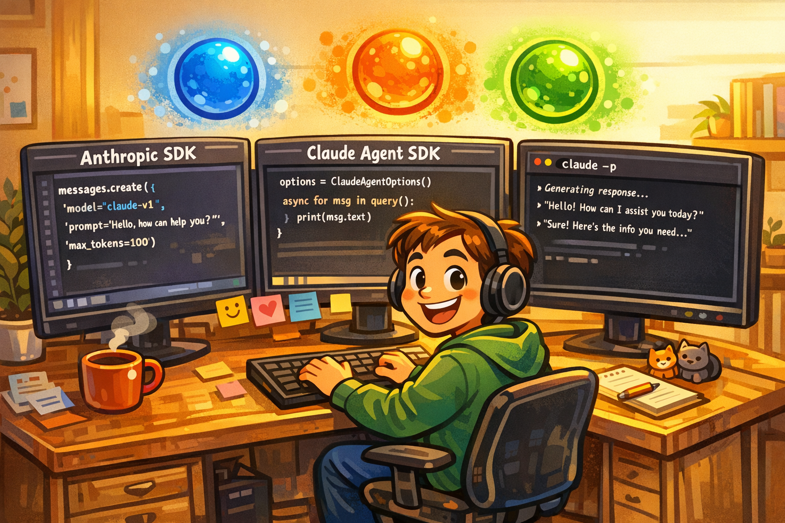
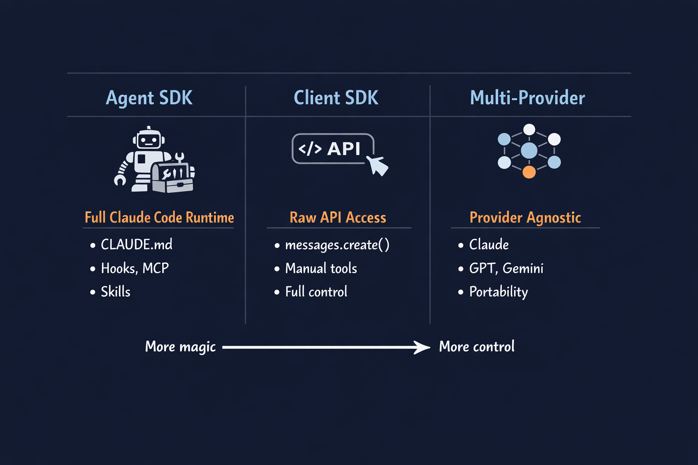
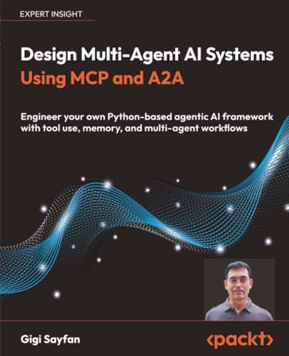
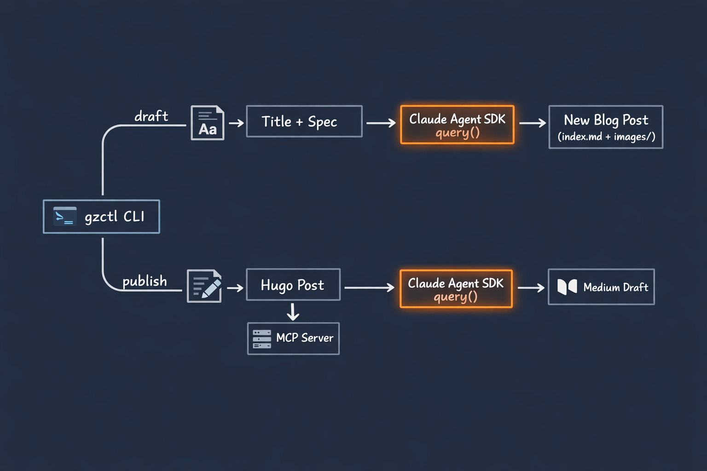
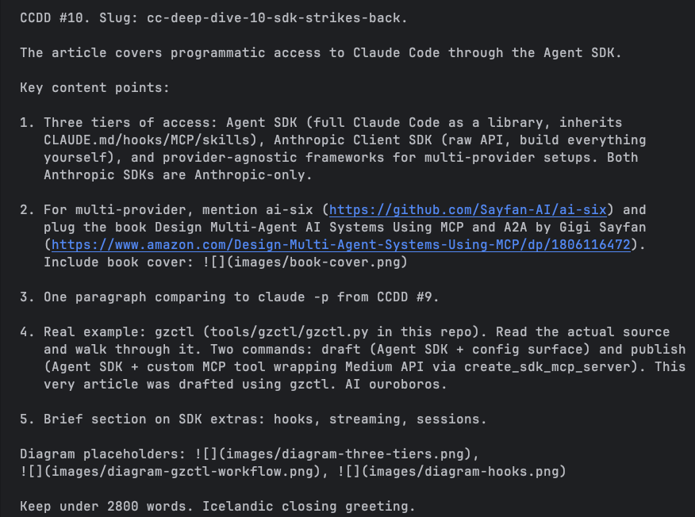
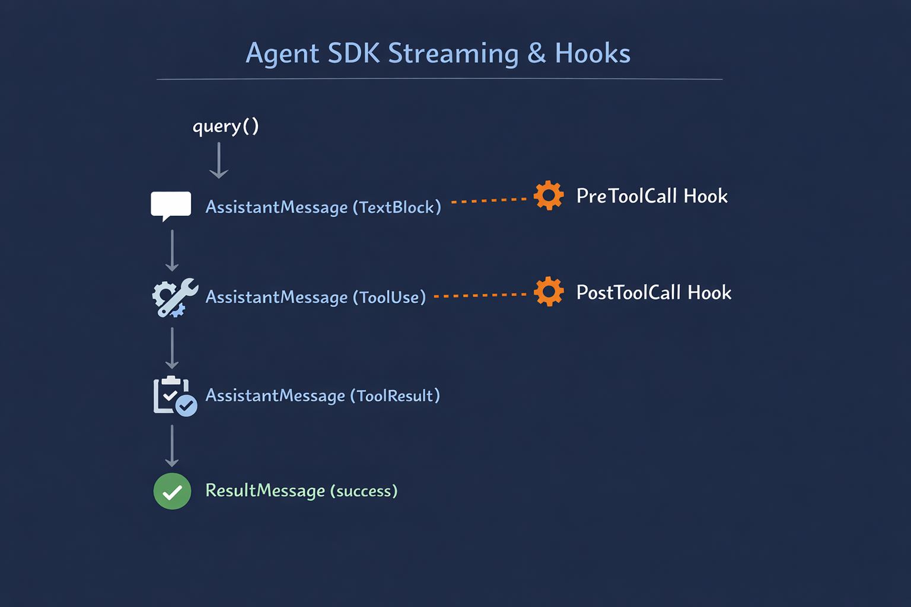

+++
title = 'Claude Code Deep Dive - The SDK Strikes Back'
date = 2026-03-08T15:00:00-08:00
categories = ["Claude", "ClaudeCode", "AICoding", "AIAgent", "CodingAssistant", "SDK"]
+++

Running Claude Code at the terminal is awesome 💻. Running it headless in CI is powerful 🚀. But the real leverage comes when you embed Claude Code directly in your own code. The Claude Agent SDK turns the full Claude Code machinery into a Python library 🐍 (there is a TypeScript SDK too). You have the entire Claude Code ecosystem at your fingertips (if you're still typing that is 😉). In this CCDD article we will explore the Claude Agent SDK, compare it to the Anthropic Client SDK and build a useful CLI program using the Claude Agent SDK to help me manage the [Gigi Zone](https://the-gigi.github.io/gigi-zone/) blog. The customary quote is coming for the first time from Claude itself! I couldn't find a better quote from a real person 🤖.

**"The best automation is the automation that builds automation."** ~ Claude Sonnet 4.6

<!--more-->



This is the tenth article in the *CCDD* (Claude Code Deep Dive) series. The previous articles are:

1. [Claude Code Deep Dive - Basics](https://medium.com/@the.gigi/claude-code-deep-dive-basics-ca4a48003b02)
2. [Claude Code Deep Dive - Slash Commands](https://medium.com/@the.gigi/claude-code-deep-dive-slash-commands-9cd6ff4c33cb)
3. [Claude Code Deep Dive - Total Recall](https://medium.com/@the.gigi/claude-code-deep-dive-total-recall-cb0317d67669)
4. [Claude Code Deep Dive - Mad Skillz](https://medium.com/@the.gigi/claude-code-deep-dive-mad-skillz-9dfb3fa40981)
5. [Claude Code Deep Dive - MCP Unleashed](https://medium.com/@the.gigi/claude-code-deep-dive-mcp-unleashed-0c7692f9c2c2)
6. [Claude Code Deep Dive - Subagents in Action](https://medium.com/@the.gigi/claude-code-deep-dive-subagents-in-action-703cd8745769)
7. [Claude Code Deep Dive - Hooked!](https://medium.com/@the.gigi/claude-code-deep-dive-hooked-8492c9b5c9fb)
8. [Claude Code Deep Dive - Plug and Play](https://medium.com/@the.gigi/claude-code-deep-dive-plug-and-play-af03f77c6568)
9. [Claude Code Deep Dive - Pipeline Dreams](https://medium.com/@the.gigi/claude-code-deep-dive-pipeline-dreams-5b6b4a5cf2ce)

## 🗂️ Three Tiers of Access 🗂️

When it comes to programmatic access to Claude, there are three distinct tiers, each with different tradeoffs.

The first tier is the **Agent SDK** (`claude-agent-sdk`). This is a Python or TypeScript) wrapper around `claude -p`. When you call `query()`, the SDK spawns the Claude Code CLI as a subprocess and communicates over stdin/stdout via JSON-lines. You get all the configuration surfaces for free: CLAUDE.md files in your working directory, hooks, MCP servers, and skills. You do not have to wire any of that up. It is all already there, inherited automatically because the actual `claude` binary runs underneath.

The second tier is the **Anthropic Client SDK** (the `anthropic` Python or TypeScript package). This is the raw API. You construct `messages.create()` calls, manage conversation history yourself, define tools in JSON Schema, and parse responses. Maximum control, minimum magic. If you need fine-grained control over every API parameter or want to build a completely custom agent architecture from scratch, this is where you start. Both the Agent SDK and the Client SDK are Anthropic-only: they talk to Anthropic's API and nothing else.

The third tier a little different. Think about a **provider-agnostic framework** that allows you to mix and match Anthropic models, OpenAI models, Gemini models, and others (including local models) without rewriting your application logic. If portability matters, or you are building a product that benefits from multiple providers, this is the tier to consider. You lose Claude-specific features (no CLAUDE.md inheritance, no hooks, no skills), but you gain the freedom to avoid vendor lock-in. Of course the framework may support the Claude machinery and even transparently translate it to other providers.



On the multi-provider side, my very own [AI-6 framework](https://github.com/Sayfan-AI/ai-six) is a good example. If you want to dive deeper into designing multi-agent systems that work across providers and protocols, check out my recently published book [Design Multi-Agent AI Systems Using MCP and A2A](https://www.amazon.com/Design-Multi-Agent-Systems-Using-MCP/dp/1806116472) where I cover what's possible in depth.



Alright, shameless plugging is over! Let's get to business

## 🔀 SDK vs. claude -p 🔀

[CCDD #9](https://medium.com/@the.gigi/claude-code-deep-dive-pipeline-dreams-5b6b4a5cf2ce) covered `claude -p`: the headless mode that turns Claude Code into a one-shot CLI command. The Agent SDK covers the same use cases, but from a different angle.

Under the hood, the Agent SDK spawns `claude -p` as a subprocess and communicates over stdin/stdout using a JSON-lines stream. It is a thin wrapper, not a separate runtime. Every `query()` call starts a `claude -p` process, sends your prompt, and streams back typed message objects. You get the same Claude Code engine with a Pythonic interface on top: no shell escaping, no manual JSON parsing, no `subprocess.run()` boilerplate.

The practical difference is composability. With raw `claude -p`, your configuration lives in flags: `--allowedTools`, `--max-turns`, `--mcp-server`. With the Agent SDK, it lives in a `ClaudeAgentOptions` object you construct in code. You can build it dynamically, reuse it across multiple calls, inject it as a dependency, or derive different option sets for different task types in the same program.

Because the SDK runs the actual `claude` CLI underneath, everything works: CLAUDE.md files, hooks, MCP servers, and skills all fire exactly as they do when you run `claude -p` directly. The rule of thumb: use `claude -p` when your orchestration is shell scripts and your integration is text output. Use the Agent SDK when your orchestration is Python and you want typed access to the message stream.

I was really surprised when I discovered it, because in my mind an SDK is all about providing language-specific clients that communicate with an API. In this case, the functionality of Claude Code is running locally as a Bun application. There is no Claude Code API, so it makes sense to automate the Claude Code CLI and just paper over the friction of working programmatically with a CLI.

## 🛠️ Meet gzctl 🛠️

When I try to understand some concept, idea or technology I typically build something and then write about it. If that something is actually useful even better. 

So, towards this end I built a small Python CLI called `gzctl` (stands for Gigi Zone Control) to manage my [Gigi Zone](https://the-gigi.github.io/gigi-zone/) blog. It lives at [tools/gzctl/gzctl.py](https://the-gigi.github.io/gigi-zone/tools/gzctl/gzctl.py) in the repo. It is built with [Click](https://click.palletsprojects.com/) and the [Claude Agent SDK](https://pypi.org/project/claude-agent-sdk/), and it has three commands: `draft`, `publish`, and `publish-py`.

`draft` generates a new blog post from a title and a content spec. `publish` uses Claude to convert the post to Medium format, then publishes through an in-process MCP server. `publish-py` is a pure Python fallback that does the same thing with regex instead of Claude. In between `draft` and `publish` the human (as in myself) has to do the leg work of converting the draft to a high quality blog post, but Claude can perfectly handle most of the boilerplate aspects.



btw, thing this very article was drafted with `gzctl draft`. An AI agent writing an article about AI agents writing articles. The [ouroboros](https://en.wikipedia.org/wiki/Ouroboros) is complete.

I also, plan to publish it to Medium using `gzctl publish` command, but for obvious reasons like maintaining the integrity of the universe and preserving the directionality of time I can't publish until I actually write the article ;-)

## ✏️ The draft Command ✏️

Let's see what the code looks like.

The `draft` command constructs a prompt from the title, spec, and today's date, then hands it to the Agent SDK, with some of Claude Code's built-in tools:

```python
options = ClaudeAgentOptions(
    cwd=str(GIGI_ZONE_DIR),
    allowed_tools=["Read", "Write", "Bash", "Glob"],
    permission_mode="acceptEdits",
    max_turns=10,
)

async for message in query(prompt=prompt, options=options):
    if isinstance(message, AssistantMessage):
        for block in message.content:
            if isinstance(block, TextBlock):
                click.echo(block.text)
            elif isinstance(block, ToolUseBlock):
                click.echo(f"[tool] {block.name}", err=True)
    elif isinstance(message, ResultMessage):
        if message.is_error:
            click.echo(f"\nError: {message.result}", err=True)
        else:
            click.echo("\nDraft created successfully!")
```

A few things worth noticing here. `ClaudeAgentOptions` is where the Claude Code configuration surface lives in the SDK. The `cwd` parameter sets the working directory, which determines the  CLAUDE.md files Claude Code will find and load automatically. The blog's CLAUDE.md contains the writing style guide, the series structure, and the formatting conventions. Claude picks all of that up because `cwd` points to the repo root. No extra prompting needed.

`allowed_tools` restricts what Claude can do during the task. Drafting a post requires reading existing posts for structural reference, writing the new one, and using Bash to check directory layouts. Nothing destructive. `permission_mode="acceptEdits"` means Claude can write files without stopping to ask for confirmation on each one, which is fine when you know the task is scoped.

The `async for` loop streams messages as they arrive. `AssistantMessage` contains what Claude says while working: reasoning, status updates, intermediate observations. `ResultMessage` is the final verdict. Streaming means your terminal shows progress in real time rather than hanging silently until the entire task completes.

The prompt itself instructs Claude to look at existing posts to infer naming conventions, read CLAUDE.md for the style guide, create the directory structure with an `images/` subdirectory, and write a complete post. Claude handles all the mechanics. The human provides the creative direction via the spec and then of going over it and making changes.

I included the [spec](https://the-gigi.github.io/gigi-zone/tools/gzctl/blog_specs/ccdd-10.txt) for the blog draft itself in the repo, so you can check it out for yourself.



Super cool. Let's move on to the `publish` command, which is even cooler if I may say so myself.

## 📤 The publish Command 📤

The `publish` command is a two-step pipeline. First, Claude converts the Hugo post to Medium-ready markdown. Then, an in-process MCP server handles the actual Medium API call.

**Step 1: Agent-powered conversion.** The agent reads the Hugo post, applies the conversion rules (stripping front matter, resolving image URLs, adding a free-link banner), and writes the result to a temp file. All the domain-specific knowledge lives in the prompt:
    
```python
prompt = f"""Convert a Hugo blog post to Medium-ready markdown.

Read the post at: {index_file}

Conversion rules:
1. Strip the TOML front matter (+++ blocks) entirely
2. Add this free link as the VERY FIRST LINE, before anything else:
   🔓 **Not a Medium member? [Read this article for free]({free_link_url})** 🔓
3. Remove the <!--more--> line
4. Convert relative image links to absolute URLs
5. Remove any HTML tags like  lines
6. Collapse more than 2 consecutive blank lines into 2

Write the converted markdown to: {output_file}
"""

options = ClaudeAgentOptions(
    cwd=str(GIGI_ZONE_DIR),
    allowed_tools=["Read", "Write"],
    permission_mode="acceptEdits",
    max_turns=5,
)
```

Why use Claude for this instead of regex? Regex works for the common cases (there is a `publish-py` fallback that does exactly that), but markdown conversion has edge cases: nested code blocks, unusual image paths, HTML fragments mixed with markdown. Claude handles these naturally without growing the regex into a maintenance burden.

**Step 2: MCP-powered publish.** Once the converted markdown is on disk, an in-process MCP server wraps the Medium API:

```python
@tool(
    name="publish_draft",
    description="Publish a pre-prepared markdown article as a draft on Medium. "
    "The content is read from a temp file automatically.",
    input_schema={
        "type": "object",
        "properties": {
            "title": {"type": "string", "description": "Article title"},
            "tags": {"type": "array", "items": {"type": "string"}},
        },
        "required": ["title"],
    },
)
async def publish_draft(args):
    pub_content = content_file.read_text()
    post = await loop.run_in_executor(
        None,
        lambda: client.create_post(
            user_id=user["id"],
            title=args["title"],
            content=pub_content,
            content_format="markdown",
            tags=args.get("tags", [])[:5],
            publish_status="draft",
        ),
    )
    return {"content": [{"type": "text", "text": json.dumps({"id": post["id"], "url": post["url"]})}]}

server = create_sdk_mcp_server(name="medium", tools=[publish_draft])
```

`create_sdk_mcp_server` builds an in-process MCP server from `@tool`-decorated async functions. No network hop, no separate process. Claude sees a clean MCP tool interface. Your secrets stay in Python.

Notice the tool reads content from a pre-written temp file rather than accepting it as an argument. This is a practical workaround: the SDK's MCP transport has a size limit (~10KB) on tool call arguments. Passing a full blog post as a string argument silently drops the connection. Writing to a file and having the handler read it sidesteps the limit entirely.

The server object goes into `ClaudeAgentOptions` with the MCP naming convention `mcp__<server_name>__<tool_name>`:

```python
options = ClaudeAgentOptions(
    cwd=str(GIGI_ZONE_DIR),
    allowed_tools=["mcp__medium__publish_draft"],
    permission_mode="acceptEdits",
    max_turns=5,
    mcp_servers={"medium": server},
)
```

The Medium API token never touches Claude. Authentication stays in Python. Claude only sees a clean tool interface.

One last practical detail. Medium's editor converts " - " (space-hyphen-space) to an em dash during rendering (nothing to do with the common LLM phenomenon of spamming em dashes all over the place). The code inserts a zero-width space (`\u200b`) after the hyphen to prevent this. The title and body look identical to readers but do not get mangled. Exactly the kind of quirk you only discover by publishing a few posts with scrambled titles.

## ⚡ SDK Extras ⚡

The `gzctl` walkthrough covers the core pattern. The SDK has a few more capabilities worth a mention.

**Streaming** is built into the `async for` loop you have already seen. Each yielded message is typed: `AssistantMessage` for output during the task, `ResultMessage` for the final outcome. Content blocks within `AssistantMessage` can be `TextBlock` for prose, or tool-call and tool-result blocks for structured interactions. The typed stream lets you log tool usage, display progress indicators, or route different message types to different outputs without parsing raw text.



**Hooks** in the Agent SDK connect to the same lifecycle hook system covered in [CCDD #7](https://medium.com/@the.gigi/claude-code-deep-dive-hooked-8492c9b5c9fb). You can register handlers that fire before and after tool calls, letting you log every tool invocation, inject additional context mid-task, or block operations that do not meet your criteria. The Agent SDK exposes this as a Python API rather than shell scripts in `.claude/hooks/`, but the underlying mechanism is the same. If you have hooks configured in CLAUDE.md, they fire during Agent SDK sessions too, because it is the same runtime.

**Sessions** carry context between calls. `query()` can accept a session ID to resume a previous conversation, the same way `claude -p --resume` does at the CLI level. For `gzctl` each command is self-contained and sessions are not needed, but for multi-step workflows where step two depends on what step one discovered, session continuation means the second call inherits the full conversation history and does not have to re-examine the same files from scratch.

The full configuration surface of `ClaudeAgentOptions` maps closely to the `claude -p` CLI flags, because both are interfaces to the same Claude Code runtime. The ergonomic difference is Python objects with IDE autocomplete (obsolete these days) and type checking vs. string flags with manual escaping.

## ⏭️ What's Next ⏭️

The CCDD series continues. Coming up:

- Recurring tasks with `/loop`
- Running multiple Claude Code sessions in parallel (agent teams and fan-out patterns)
- Voice mode
- Comparing Claude Code with other AI coding agents

## 🏠 Take Home Points 🏠

- The Agent SDK is a thin Python wrapper around `claude -p`: it spawns the CLI as a subprocess and streams typed messages over stdin/stdout, so CLAUDE.md, hooks, MCP servers, and skills all work automatically
- Three access tiers exist for different needs: Agent SDK (full Claude Code, Anthropic-only), Anthropic Client SDK (raw API, Anthropic-only), and provider-agnostic frameworks for multi-provider portability
- `create_sdk_mcp_server` lets you wrap any Python code as an in-process MCP tool: Claude gets a clean protocol interface, your secrets and business logic stay in Python
- Real production use looks like `gzctl` - an application (doesn't have to be CLI) that constructs prompts, configures `ClaudeAgentOptions`, and streams results, while Claude handles the actual work.

🇮🇸 Bless bless, vinir! 🇮🇸
