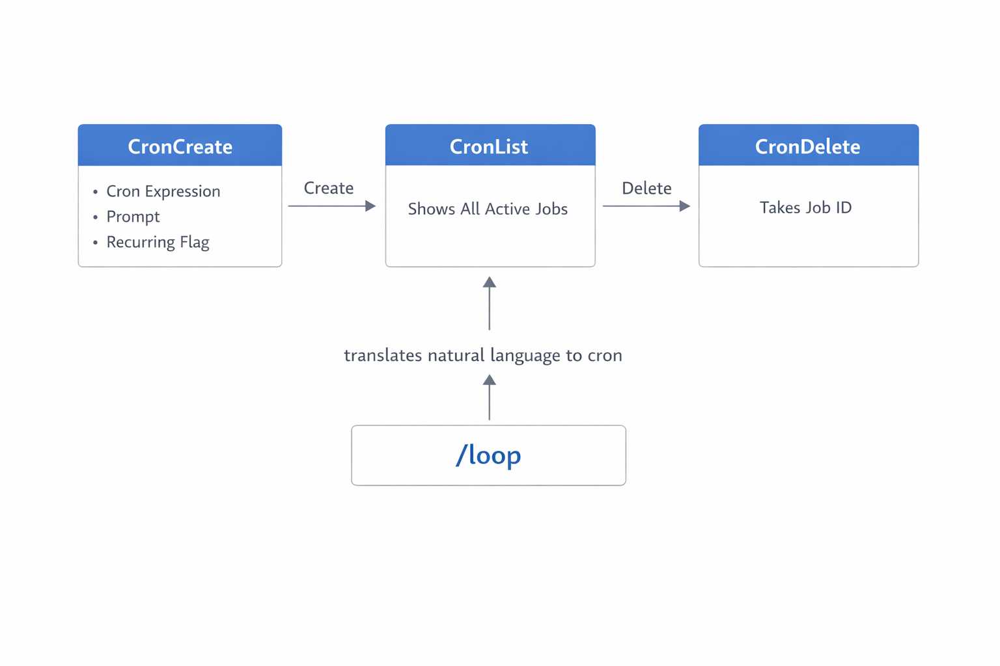
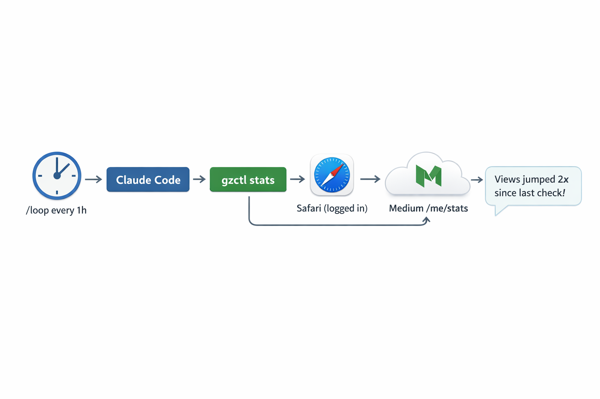

+++
title = 'Claude Code Deep Dive - On the Clock'
date = 2026-03-14T10:00:00-08:00
categories = ["Claude", "ClaudeCode", "AICoding", "AIAgent", "CodingAssistant", "Automation"]
+++

You know what's better than asking Claude to check something? Having Claude check it for you automatically, on a
schedule, while you do something else ⏰. Claude Code has a built-in recurring task system that turns your session into a
lightweight cron daemon. Set it up, walk away, come back to results 📋. In this CCDD article we'll dig into the
scheduling primitives, rant about naming choices, and track how a freshly published blog post performs on Medium 📊.

**"Time is what we want most, but what we use worst."** ~ William Penn

<!--more-->


This is the eleventh article in the *CCDD* (Claude Code Deep Dive) series. The previous articles are:

1. [Claude Code Deep Dive - Basics](https://medium.com/@the.gigi/claude-code-deep-dive-basics-ca4a48003b02)
2. [Claude Code Deep Dive - Slash Commands](https://medium.com/@the.gigi/claude-code-deep-dive-slash-commands-9cd6ff4c33cb)
3. [Claude Code Deep Dive - Total Recall](https://medium.com/@the.gigi/claude-code-deep-dive-total-recall-cb0317d67669)
4. [Claude Code Deep Dive - Mad Skillz](https://medium.com/@the.gigi/claude-code-deep-dive-mad-skillz-9dfb3fa40981)
5. [Claude Code Deep Dive - MCP Unleashed](https://medium.com/@the.gigi/claude-code-deep-dive-mcp-unleashed-0c7692f9c2c2)
6. [Claude Code Deep Dive - Subagents in Action](https://medium.com/@the.gigi/claude-code-deep-dive-subagents-in-action-703cd8745769)
7. [Claude Code Deep Dive - Hooked!](https://medium.com/@the.gigi/claude-code-deep-dive-hooked-8492c9b5c9fb)
8. [Claude Code Deep Dive - Plug and Play](https://medium.com/@the.gigi/claude-code-deep-dive-plug-and-play-af03f77c6568)
9. [Claude Code Deep Dive - Pipeline Dreams](https://medium.com/@the.gigi/claude-code-deep-dive-pipeline-dreams-5b6b4a5cf2ce)
10. [Claude Code Deep Dive - The SDK Strikes Back](https://medium.com/@the.gigi/claude-code-deep-dive-the-sdk-strikes-back-03b8d501ec38)

## ⏰ Recurring Tasks, Not Loops ⏰

Claude Code can run prompts on a schedule. You set up a task, it fires every N minutes (or hours, or days), and Claude
executes the prompt each time. The feature is accessed through the `/loop` command, which is... a terrible name for it.
Let me explain.

A loop runs continuously. You enter the loop, you check a condition, you do work, you go back to the top. That's what
the [Ralph Loop](https://ghuntley.com/loop/) pattern does in the agentic AI world: run an agent, check if the work is
done, if not, run it again with fresh context. Keep going until the task is complete. That's a loop.

What Claude Code's `/loop` does is schedule a cron job. A recurring task that fires on a timer. You're not looping.
You're scheduling. The task fires, runs to completion, and then nothing happens until the next scheduled time. There's
no iteration, no condition check, no "keep going until done." It's `crontab`, not `while`. If they called it `/schedule`
or `/every` or even `/cron`, it would describe exactly what it does. But here we are, and `/loop` is what we've got.
Naming things is hard, even for Anthropic.

Rant over. Let's look at how it actually works.

## 🔧 The Cron Primitives 🔧

Under the hood, Claude Code's scheduling system is built on three tools: **CronCreate**, **CronList**, and **CronDelete
**. These are the real primitives. `/loop` is just a friendly skill that translates natural language into CronCreate
calls.

**CronCreate** is the workhorse. It takes three parameters:

- **cron**: A standard 5-field cron expression (minute, hour, day-of-month, month, day-of-week) in your local timezone.
  `*/5 * * * *` means every 5 minutes. `0 9 * * 1-5` means weekdays at 9am. If you've ever written a crontab, you know
  the drill.
- **prompt**: The prompt Claude will execute each time the task fires. This can be anything you'd type at the Claude
  Code prompt, including invoking other slash commands or skills.
- **recurring**: A boolean, true by default. Set to false for one-shot reminders that fire once and auto-delete.

Here's what a CronCreate call looks like in practice:

```json
{
  "cron": "*/10 * * * *",
  "prompt": "Check the CI status on PR #42 and summarize any failures",
  "recurring": true
}
```

**CronList** takes no parameters. It returns all active scheduled tasks in the current session with their IDs, cron
expressions, and prompts. Ask Claude "what scheduled tasks do I have?" and it calls CronList for you.

**CronDelete** takes a single parameter: the job ID returned by CronCreate. When you're done monitoring something, tell
Claude to cancel it and it removes the task.

There is no **CronUpdate**. If you want to change the interval or the prompt, you delete the existing task and create a
new one. Not elegant, but simple and predictable.



Let's see what the `/loop` skill is all about.

## 🎯 /loop: The Friendly Face 🎯

Most of the time you won't call the Cron primitives directly. The `/loop` skill parses natural language and does the
translation for you. It accepts three forms:

Leading interval: `/loop 5m check the build status`

Trailing interval: `/loop check the build status every 2 hours`

No interval (defaults to 10 minutes): `/loop check the build status`

Supported units are `s` (seconds, rounded up to 1 minute), `m` (minutes), `h` (hours), and `d` (days).

You can also loop over other commands and skills: `/loop 20m /review-pr 1234` runs your PR review skill every 20
minutes.

For one-shot reminders, just use natural language without `/loop`: "remind me at 3pm to push the release branch" or "in
45 minutes, check whether the integration tests passed." These create a single-fire task that auto-deletes after
execution.

Let's see it in action.

```
❯ /loop 30s give me a funny quote from big lebawsky                                                                                                                                                                                                                     

⏺ Parsing: 30s is the interval (rule 1), prompt is 
  "give me a funny quote from big lebawsky". 30s rounds up to 1 minute.

⏺ CronCreate(*/1 * * * *: give me a funny quote from big lebawsky)
  ⎿ Scheduled f0f0f1d8 (Every minute)

⏺ Scheduled. Here's the summary:

  - Prompt: "give me a funny quote from big lebawsky"
  - Cron: */1 * * * * (every minute, rounded up from 30s)
  - Job ID: f0f0f1d8
  - Note: Auto-expires after 3 days. Cancel anytime with: "cancel job f0f0f1d8"

⏺ "Yeah, well, you know, that's just, like, your opinion, man." - The Dude

⏺ "I'm the Dude, so that's what you call me. That, or His Dudeness, or Duder, or El Duderino,
  if you're not into the whole brevity thing." - The Dude

⏺ "Careful, man, there's a beverage here!" - The Dude
```

## ⚠️ Constraints and Gotchas ⚠️

Recurring tasks in Claude Code come with some important boundaries to keep in mind.

**Session-scoped.** Tasks live only in the current Claude Code session. Close the terminal, exit Claude, or lose your
connection, and all scheduled tasks vanish. There is no persistence to disk, no daemon running in the background. This
is intentional: it keeps the system simple and prevents forgotten tasks from running indefinitely on your machine.

**Three-day expiry.** Even if you leave a session running, recurring tasks automatically expire after 3 days. They fire
one final time, then self-delete. This is a safety net for the "I set up a task and forgot about it" scenario.

**No catch-up.** If Claude is busy processing a long request when a task is supposed to fire, it queues once. It does
not stack up missed executions. When Claude becomes idle, the queued prompt runs, but you won't get five back-to-back
executions because you were busy for 50 minutes with a 10-minute interval.

**One-minute minimum.** The underlying scheduler has cron-level granularity. Seconds are rounded up to the nearest
minute. You can't poll every 30 seconds.

**50 task limit.** A single session can have at most 50 scheduled tasks. More than enough for any reasonable use case,
but the limit exists.

**Jitter.** To avoid thundering-herd effects (many users' tasks all firing at exactly :00), the scheduler adds a small
deterministic offset. Recurring tasks fire up to 10% of their period late (max 15 minutes). One-shot tasks near the top
or bottom of the hour fire up to 90 seconds early. The offset is consistent across firings, so your task always fires at
the same slightly-off time.

**Kill switch.** Set `CLAUDE_CODE_DISABLE_CRON=1` to disable the entire scheduling system. The `/loop` skill becomes
unavailable.

Let's see some options to work around these limitations

## 🏗️ Durable Recurring Tasks 🏗️

What if you need tasks that run reliably for longer than three days? First, you can build your own very easily (
especially with Claude Code helping). This is exactly where the Claude Agent SDK
from [CCDD #10](https://medium.com/@the.gigi/claude-code-deep-dive-the-sdk-strikes-back-03b8d501ec38) shines. You define
a system-level cron job on your machine that invokes a small script or program using the SDK. This can run locally or in
the cloud, and it survives reboots, session exits, and everything else.

Beyond DIY, there are two Anthropic-adjacent options worth knowing about. **Claude Code Desktop** supports persistent
scheduled tasks with a graphical setup. You configure them once and they run in the background regardless of whether you
have a terminal open. **GitHub Actions** with a `schedule` trigger gives you cron-style automation that runs in CI. If
your recurring task involves a repository (running tests, checking dependencies, generating reports), a scheduled
workflow is the natural home for it. Both of these deserve their own deep dive in a future CCDD article.

## 📊 The Medium Stats Tracker 📊

Let's build something practical (for me). You just published a new blog post on Medium and you want to watch how it
performs:
presentations (feed impressions), views, and reads. Instead of refreshing the stats page every hour, let Claude do it on
a schedule while you keep working in the same session.

This is a perfect fit for session-scoped recurring tasks. You publish, you monitor for a day or two, and then you move
on to the next. No need for durable scheduling.

**Step 1: A stats tool.** Medium's official API has no stats endpoints (the API is deprecated, in fact). But if you're
logged into Medium in Safari, you can scrape the stats page via AppleScript. I added a `stats` subcommand
to [gzctl](https://github.com/the-gigi/gigi-zone/blob/main/tools/gzctl/gzctl.py) (the blog management CLI
from [CCDD #10](https://medium.com/@the.gigi/claude-code-deep-dive-the-sdk-strikes-back-03b8d501ec38)):

```python
def _fetch_medium_stats() -> str:
    """Fetch Medium stats page content via Safari."""
    script = '''
    tell application "Safari"
        if (count of windows) = 0 then
            make new document
        end if
        set newTab to make new tab at end of tabs of front window
            with properties {URL:"https://medium.com/me/stats"}
        set current tab of front window to newTab
        delay 8
        set pageText to do JavaScript "document.body.innerText"
            in newTab
        close newTab
        return pageText
    end tell
    '''
    result = subprocess.run(
        ["osascript", "-e", script],
        capture_output=True, text=True, timeout=30,
    )
    return result.stdout
```

The tool opens a Safari tab (reusing the existing window if any), grabs the stats page text, and closes the tab. It
works when Safari already has your Medium session cookies. No API tokens, no headless
browser setup, no fragile cookie extraction.

**Prerequisites:** Safari needs "Allow JavaScript from Apple Events" enabled (Safari Settings > Developer tab) and you
need to be logged into Medium in Safari.

Running it manually looks like this:

```
$ gzctl stats "SDK"
Fetching Medium stats...
   130 pres      71 views     14 reads  Claude Code Deep Dive - The SDK Strikes Back
```

The `stats` command also supports `--json` output and optional title filtering, which makes it easy for Claude to parse
programmatically.

**Step 2: Schedule it.** With the tool in place, tell Claude to track your freshly published post:

```
/loop 1h run gzctl stats "Basics" and note the trend. show as a graph.
```

Claude sets up a recurring task that fires every hour. Each time it runs the stats tool it notes the changes and display
them as a graph.

**Managing the task.** Once it's running, you have full control over the lifecycle. Ask "what scheduled tasks do I
have?" and Claude calls CronList to show all active jobs with their IDs, cron expressions, and prompts. Want to change
the interval from hourly to every 30 minutes? Tell Claude to delete the current task and create a new one. When you're
done watching, "cancel the stats tracker" triggers CronDelete and the task is gone. There is no update operation: to
modify a task you always delete and recreate.



Let's see when is the right time to this capability and when it's best to use other alternatives.

## 🆚 When to Use What 🆚

Recurring tasks in a Claude Code session are great for interactive, session-scoped automation. You're working, you want
something
checked periodically while you focus on other things, you set it up, it runs alongside you.

But they are not a replacement for durable scheduling. If you need a task that survives restarts, runs unattended
overnight, or triggers on events rather than time, you want something else. **GitHub Actions** with a `schedule` trigger
gives you cron-style automation that runs in CI, persists across sessions, and doesn't depend on your terminal being
open. **Claude Code Desktop** offers persistent scheduled tasks with a graphical setup for those who prefer that path.

If you're actively working and want a background assistant, use `/loop`. If you want heavy-duty durable long-running
workflows that are related to a specific repo choose GitHub Actions. If you're a Claude Code Desktop person use that.
Otherwise, you can always DIY it with the Claude Agent SDK or `claude -p`.

## ⏭️ What's Next ⏭️

The CCDD series continues. Coming up:

- Running multiple Claude Code sessions in parallel (agent teams and fan-out patterns)
- Voice mode
- Comparing Claude Code with other AI coding agents

## 🏠 Take Home Points 🏠

- Claude Code's "loop" is really a session-scoped cron scheduler, not a loop. Three primitives power it: CronCreate,
  CronList, and CronDelete. There is no CronUpdate.
- `/loop` translates natural language intervals into cron expressions. Use it for convenience, but understand the
  primitives underneath.
- Tasks are session-scoped (gone when you exit), auto-expire after 3 days, and have a 1-minute minimum granularity with
  built-in jitter.
- Recurring tasks shine for session-scoped monitoring: tracking a new blog post's performance, watching CI, polling
  deploys. They are not a replacement for durable scheduling.
- For durable scheduling that survives restarts, use GitHub Actions, Claude Code Desktop or build your own.

🇹🇿 Kwaheri, marafiki! 🇹🇿
