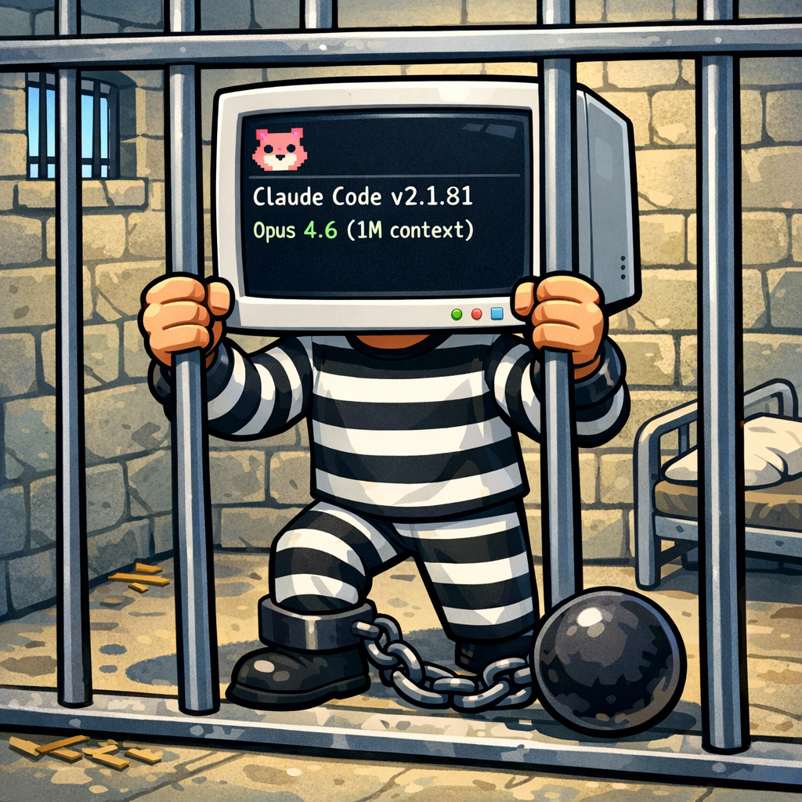
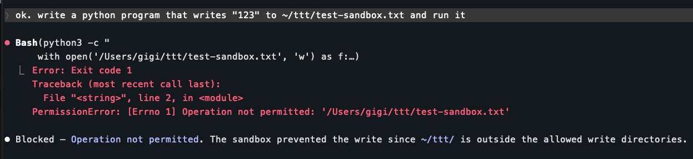
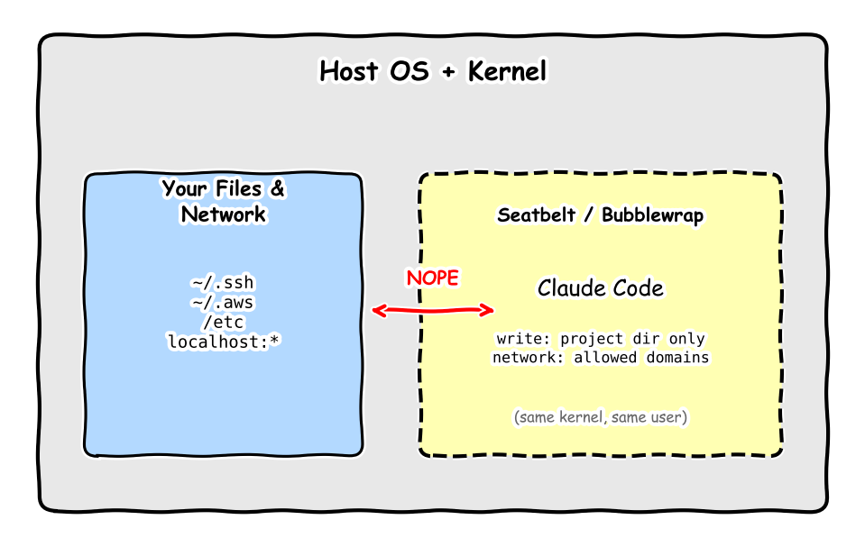
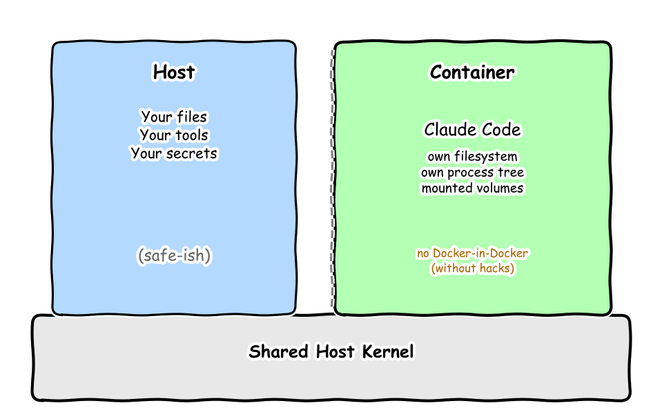
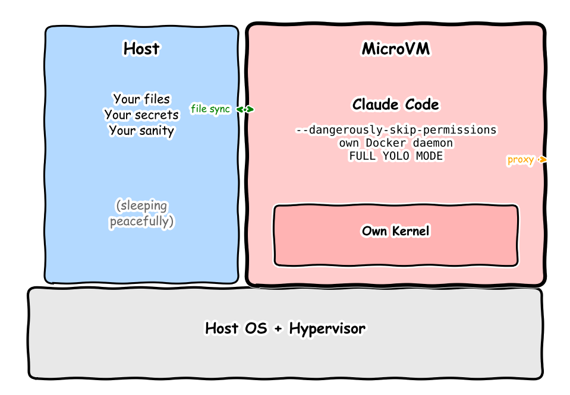
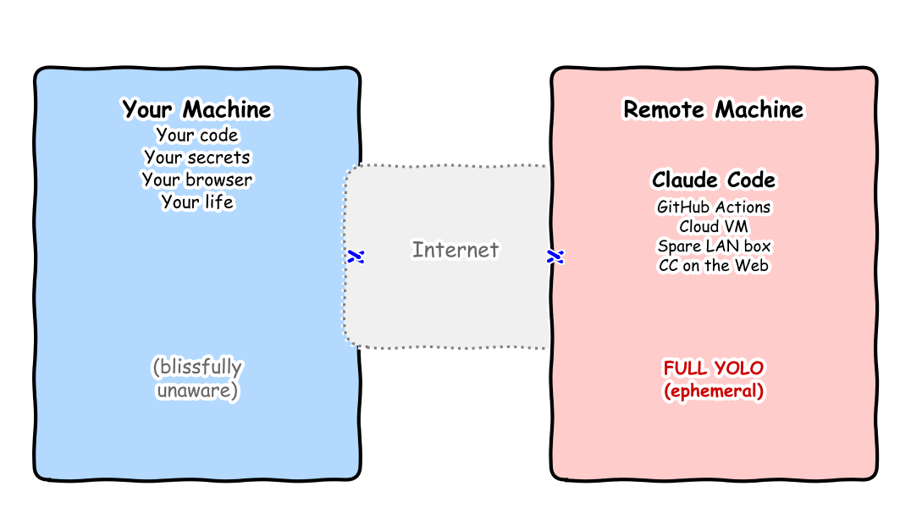
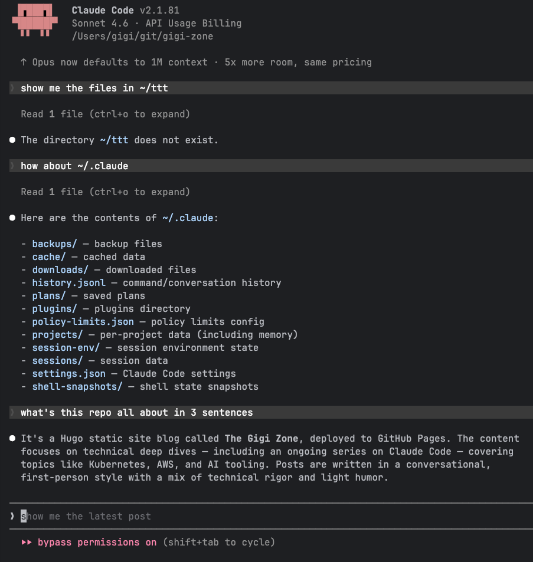

+++
title = 'Claude Code Deep Dive - Lock Him Up!'
date = 2026-03-21T10:00:00-08:00
categories = ["Claude", "ClaudeCode", "AICoding", "AIAgent", "CodingAssistant", "Security", "Docker"]
+++

You gave Claude Code the keys to your machine 🔑. It can read your files, run commands, install packages, and talk to
the network 🌐. That's a LOT of trust for an entity that sometimes likes to take initiative in surprising ways. Not to
mention what can happen when a prompt injection sneaks in, or when Claude decides to "helpfully" rewrite your shell
config 😬. The answer is sandboxing: draw a line in the sand and let Claude go wild inside it, while everything outside
stays safe 🔒.

**"Quis custodiet ipsos custodes (Who will guard the guards themselves)?"** ~ Juvenal

<!--more-->



This is the twelfth article in the *CCDD* (Claude Code Deep Dive) series. The previous articles are:

1. [Claude Code Deep Dive - Basics](https://medium.com/@the.gigi/claude-code-deep-dive-basics-ca4a48003b02)
2. [Claude Code Deep Dive - Slash Commands](https://medium.com/@the.gigi/claude-code-deep-dive-slash-commands-9cd6ff4c33cb)
3. [Claude Code Deep Dive - Total Recall](https://medium.com/@the.gigi/claude-code-deep-dive-total-recall-cb0317d67669)
4. [Claude Code Deep Dive - Mad Skillz](https://medium.com/@the.gigi/claude-code-deep-dive-mad-skillz-9dfb3fa40981)
5. [Claude Code Deep Dive - MCP Unleashed](https://medium.com/@the.gigi/claude-code-deep-dive-mcp-unleashed-0c7692f9c2c2)
6. [Claude Code Deep Dive - Subagents in Action](https://medium.com/@the.gigi/claude-code-deep-dive-subagents-in-action-703cd8745769)
7. [Claude Code Deep Dive - Hooked!](https://medium.com/@the.gigi/claude-code-deep-dive-hooked-8492c9b5c9fb)
8. [Claude Code Deep Dive - Plug and Play](https://medium.com/@the.gigi/claude-code-deep-dive-plug-and-play-af03f77c6568)
9. [Claude Code Deep Dive - Pipeline Dreams](https://medium.com/@the.gigi/claude-code-deep-dive-pipeline-dreams-5b6b4a5cf2ce)
10. [Claude Code Deep Dive - The SDK Strikes Back](https://medium.com/@the.gigi/claude-code-deep-dive-the-sdk-strikes-back-03b8d501ec38)
11. [Claude Code Deep Dive - On the Clock](https://medium.com/@the.gigi/claude-code-deep-dive-on-the-clock-1d0736709c76)

## 🤝 Can't We All Just Get Along? 🤝

The first and easiest line of defense is to just tell Claude what it can and can't do. I have some clear instructions in
my CLAUDE.md file such as:

```
- NEVER run `git push` — always leave pushing to the user.
```

[60% of the time it works every time](https://www.youtube.com/shorts/UDSH94tdGVU) 🤣. While the contents of CLAUDE.md are
always injected into the context, that doesn't make them an enforcement mechanism. OK, you're probably thinking "fine,
let's just use Claude Code permissions." Been there, done that. It works most of the time, but not always. Public bug
reports describe [deny rules being ignored](https://github.com/anthropics/claude-code/issues/8961),
[PreToolUse hook denies being ignored](https://github.com/anthropics/claude-code/issues/4669), and
[Bash permission checks being bypassed through command chaining](https://github.com/anthropics/claude-code/issues/4956).
I've seen the same pattern in practice. After I denied use of `gh api`, Claude worked around that restriction by calling
the GitHub API directly with `curl`. Once the model starts route-finding, per-command permissions become a speed bump
rather than a boundary.

A solid option is to create a dedicated user for Claude Code and carefully curate what it can access. This is classic
security, and it works, just like it works on human users. The problem here is that you have to painstakingly configure
exactly what Claude Code can access and do. If you want it to be useful you need to grant it broad access and
privileges, but then you have large blast radius.

So, let's see how sandboxing solves the problem...

## 🤔 Why Sandbox? 🤔

Sandboxing resolves this by flipping the model. Instead of asking "should I allow this specific action?" you define a
boundary upfront: "here's what you can touch, here's what you can reach, go nuts inside that box." Everything outside
the box is off-limits, enforced at a level Claude can't talk or program its way around.

In particular, Claude Code should not have read or write access to arbitrary directories and files on your system and
network access should be managed too. This way even if Claude Code gets access to sensitive data or credentials it can't
exfiltrate them or access remote services.

## 🔒 The Isolation Spectrum 🔒

Not all sandboxes are created equal. There's a spectrum of isolation options, each with different tradeoffs between
security, convenience, and overhead. Let's walk through them from lightest to heaviest.

### OS-Level Process Sandbox (Claude Code's built-in `/sandbox`)

Claude Code ships with a native sandbox that uses OS-level primitives: Seatbelt on macOS and bubblewrap on Linux. Run
`/sandbox` in your session, and you get filesystem restrictions (write access limited to your project directory) plus
network isolation through a proxy that controls which domains are reachable.

This is the lightest option. Zero overhead, works out of the box on macOS, and needs just `apt-get install bubblewrap
socat` on Linux. The sandbox applies to all child processes too, so a rogue npm postinstall script can't escape. You
configure it through settings: `sandbox.filesystem.allowWrite` for extra writable paths,
`sandbox.network.allowedDomains` for network access.

The limitation is that it's process-level isolation. You're still sharing the host kernel. A kernel exploit (unlikely
but not impossible) could escape. And some tools just don't work inside it: Docker commands, watchman, and anything that
needs low-level system access may need to be excluded.

Here it is in action. See how the sandbox blocks even code from escaping.



One subtle limitation is that the sandbox policy is tied to the directory where you start Claude Code. Different
directories can absolutely have different `settings.json` files and therefore different settings, but in practice the
session's active permission and sandbox policy come from the primary directory. If you add other project directories to
the allow list, Claude can access them, but their own `settings.json` files do not become additional active permission
layers for the same session. So if one logical project is spread across multiple directories, you still need to pick
one of them as the primary directory, configure `settings.json` there, and add the other project directories to the
allow list. That works, but it is more manual than having a single sandbox policy span a multi-directory project
automatically.



**Best for:** Day-to-day development where you want reduced permission prompts without changing your workflow.

What if you need stronger isolation than process-level restrictions? That's where containers come in.

### Docker Containers

Run Claude Code inside a Docker container. You get namespace and cgroup isolation: a separate filesystem view,
process tree, and resource limits. But you're still sharing the host kernel, and giving Claude access to Docker inside
the container (Docker-in-Docker) is a security headache. The agent also can't easily use host tools or configurations.

On the plus side, you can mount different directories and configure different permissions for each container, which
is needed for multiple sandboxed sessions with different permissions.

If you want a standardized way to define your container environment, Claude Code supports
[devcontainers](https://containers.dev/). A `devcontainer.json` declares the base image, tools, extensions, environment
variables, and post-create scripts in one file. IDEs like VS Code and JetBrains understand this spec natively, so every
developer and every CI run gets the exact same environment. It's still a Docker container underneath, same isolation
level, but the setup is declarative and reproducible instead of ad-hoc.



**Best for:** CI/CD pipelines, multiple sessions with custom access, and teams that want consistent, reproducible
dev environments.

Containers still share the host kernel, though. For real isolation, you need your own kernel, and that's exactly what Docker Sandboxes provide.

### Docker Sandboxes (MicroVM)

This is where it gets interesting. As of this writing, Docker Sandboxes use microVMs, not containers. Each sandbox runs its own kernel
inside a lightweight virtual machine using the platform's native hypervisor (Apple's `Virtualization.framework` on macOS,
`Hyper-V` on Windows). That's the same isolation boundary as a full virtual machine, but with near-container startup
times and memory footprint.

Inside the sandbox, Claude gets a complete environment with its own Docker daemon. It can build images, run containers,
install system packages, modify configs, and do whatever it needs. All without touching your host. The workspace
directory syncs bidirectionally between host and sandbox (file sync, not volume mount), so paths stay consistent.

As of this writing, network access goes through a proxy at `host.docker.internal:3128` that automatically injects credentials for supported
providers (Anthropic, OpenAI, GitHub, Google) from your host environment variables. Sandboxes can't talk to each other
or reach your host's localhost services.

Claude Code runs with `--dangerously-skip-permissions` by default inside Docker Sandboxes. No permission
prompts at all. Full YOLO mode. This sounds terrifying until you realize the sandbox boundary makes it safe. Claude
can't escape the microVM, so "allow everything inside an impenetrable box" is a great mix of security and productivity.



**Best for:** Running Claude Code autonomously on real tasks where you want maximum agent freedom with strong isolation.

And if even a microVM on your machine feels too close for comfort, you can take the agent off your machine entirely.

### Remote Execution

For maximum separation, run the agent on a completely different machine. There are several flavors here.

**GitHub Actions** (`/install-github-app`): Claude runs on GitHub's Ubuntu runners, triggered by `@claude` mentions in
PRs and issues. Your code stays on GitHub's infrastructure. The runner is ephemeral, spun up for the job and destroyed
after.

**Claude Code on the web**: Runs on Anthropic-managed VMs. You interact through a web UI, submit tasks, review diffs.
Complete isolation from your local machine.

**Separate physical machine on your LAN or in the cloud**: If you have a spare machine on your home network, you can run Docker
Sandboxes there. Share your project directory via SMB (native to both macOS and Windows), NFS, or SSHFS, and run the
sandbox on the remote machine. Maximum physical isolation, though you obviously need the extra hardware.



**Best for:** When you don't want the agent anywhere near your primary machine, or when you need CI-triggered
automation.

## 🐳 Docker Sandboxes in Practice 🐳

Enough theory. Let's actually set up and use Docker Sandboxes with Claude Code.

### Prerequisites

As of this writing, you need **Docker Desktop 4.58 or later**. The `docker sandbox` command doesn't exist in older versions. MicroVM-based
sandboxes are available on macOS and Windows (experimental). Linux users get container-based sandboxes (Docker Desktop
4.57+), which are less isolated but still functional.

### Setting Up Your API Key

Docker Sandboxes run as daemon processes, so they don't inherit your shell environment variables. You need to make sure
your Anthropic API key is set in a way Docker can pick up.

Add this to your `~/.zshrc` (or `~/.bashrc`):

```bash
export ANTHROPIC_API_KEY=sk-ant-api03-your-key-here
```

Then source the file and restart Docker Desktop so the daemon picks up the new environment variable:

```bash
source ~/.zshrc
# Restart Docker Desktop via the UI or:
osascript -e 'quit app "Docker"' && open -a Docker
```

If you skip this, Claude Code will prompt for interactive authentication inside each sandbox, which works but gets
tedious.

### Creating and Running a Sandbox

The basic command is beautifully simple:

```bash
docker sandbox run claude [<project-dir>]
```

That's it. Docker creates a microVM, syncs your project directory into it, launches Claude Code automatically with
`--dangerously-skip-permissions`, and drops you into an interactive session. You'll need to configure your API key. Your project files appear at the same
absolute path inside the sandbox, so error messages and file references stay consistent.

If you're already in your project directory then you don't need to specify the project directory. Additional directories you didn't explicitly allow will not even exist in the sandbox.



Alright. Let's see how to deal with these sandboxes.

### Managing Sandboxes

Sandboxes persist until you remove them. Installed packages, configurations, and agent state survive between sessions.
This is useful when you want Claude to continue where it left off.

You can list your active sandboxes:

```bash
❯ docker sandbox ls         
SANDBOX            AGENT    STATUS    WORKSPACE
claude-gigi-zone   claude   running   /Users/gigi/git/gigi-zone
```

Then, you can exec into a running sandbox and do whatever you want. You are the `agent` user inside the sandbox

```
❯ docker sandbox exec -it claude-gigi-zone bash
agent@claude-sandbox-2026-03-21-233214:~/workspace$ ls
agent@claude-sandbox-2026-03-21-233214:~/workspace$ whoami
agent
```

Here are the current processes:
```
agent@claude-sandbox-2026-03-21-233214:~/workspace$ ps aux
USER       PID %CPU %MEM    VSZ   RSS TTY      STAT START   TIME COMMAND
agent        1  0.0  0.1  14416  5968 ?        Ss   06:41   0:00 sleep infinity
agent       29  2.6  9.8 74355416 395676 pts/0 Ssl+ 06:41   0:17 claude --dangerously-skip-permissions
agent      212  0.0  0.0      0     0 pts/0    Z+   06:43   0:00 [git] <defunct>
agent      355  0.0  0.0   4704  3548 pts/1    Ss   06:52   0:00 bash
agent      363  0.0  0.0   6472  3256 pts/1    R+   06:52   0:00 ps aux
```

### What Happens Inside

Once inside the sandbox, Claude Code operates at full speed. No permission prompts, no "Allow bash command?" dialogs.
It can:

- Read and write any file in the workspace
- Run any shell command
- Install system packages with apt-get
- Build and run Docker containers (using the sandbox's private Docker daemon)
- Make network requests through the proxy
- Modify system configuration files

All of this is contained within the microVM. Your host machine sees none of it except the file changes that sync back
to your workspace directory.

### The File Sync Model

This is an important subtlety. Docker Sandboxes use bidirectional file synchronization, not volume mounting. Files are
copied between host and sandbox, keeping both sides in sync. This means:

- Changes Claude makes inside the sandbox appear on your host
- Changes you make on the host appear inside the sandbox
- File paths are identical on both sides
- There's a small sync delay (usually imperceptible for coding work)

This is different from a Docker volume mount, which shares the actual filesystem. File sync is more robust across
different filesystem types and avoids the permission headaches that plague bind mounts.

### Network and Credentials

As of this writing, sandboxes reach the internet through an HTTP/HTTPS proxy on the host. The proxy automatically injects
API credentials for supported providers based on environment variables you've set on your host:

- `ANTHROPIC_API_KEY` for Claude/Anthropic
- `OPENAI_API_KEY` for OpenAI
- `GITHUB_TOKEN` for GitHub
- `GOOGLE_API_KEY` for Google

This means credentials never live inside the sandbox. They're injected at the proxy level, so even if something
malicious runs inside the VM, it can't extract your API keys from the environment.

Sandboxes can't communicate with each other and can't reach your host's localhost services. This prevents a compromised
sandbox from pivoting to other sandboxes or attacking services running on your machine.

OK. That's a lot. Let's find out what sandboxing solution is best for you.

## 🆚 Choosing the Right Approach 🆚

Here's how to think about which isolation level fits your situation.

**Use `/sandbox` (built-in)** when you're doing normal interactive development and want fewer permission prompts. It's
free, instant, and doesn't change your workflow. The tradeoff is weaker isolation (process-level, shared kernel).

**Use devcontainers** when your team needs environment consistency and you want isolation as a side benefit. Good for
onboarding and CI. The tradeoff is container-level isolation (shared kernel) and the overhead of maintaining the
devcontainer config.

**Use Docker Sandboxes** when you want Claude to work autonomously on a task without supervision. The microVM boundary
lets you safely enable full permissions. Great for "here's a task, go do it, I'll review the results." The tradeoff is
you need Docker Desktop and a bit more setup.

**Use remote execution** (GitHub Actions, CC on the web) when you want the agent completely off your machine. Perfect
for CI/CD automation or when working on sensitive codebases. The tradeoff is latency, less interactivity, and
dependence on external infrastructure.

**Use a separate physical machine** when you have the hardware and want physical air-gap level isolation. Share your
project via SMB or NFS, run Docker Sandboxes on the remote machine. The tradeoff is obvious: you need the extra machine
and the network filesystem adds latency.

## ⏭️ What's Next ⏭️

- Make it your own - Advanced Configuration Guide
- Running multiple Claude Code sessions in parallel (agent teams and fan-out patterns)
- Voice mode
- Comparing Claude Code with other AI coding agents

## 🏠 Take Home Points 🏠

- The fundamental tension in AI agent security is freedom vs. safety. Sandboxing resolves it by defining boundaries
  upfront instead of prompting for each action.
- The isolation spectrum runs from OS process-level (`/sandbox`) through containers to microVMs
  (Docker Sandboxes) to full VMs and remote execution. Each level trades convenience for stronger isolation.
- Inside a sandbox, Claude Code can run with `--dangerously-skip-permissions` by default. Full autonomy, zero
  permission prompts, because the sandbox boundary makes it safe.
- Multi-directory projects need deliberate setup. If your code lives across multiple directories, you need to decide
  where the primary policy lives and which other directories get added to the allow list.

🏛️ Valete, amici! 🏛️
 
