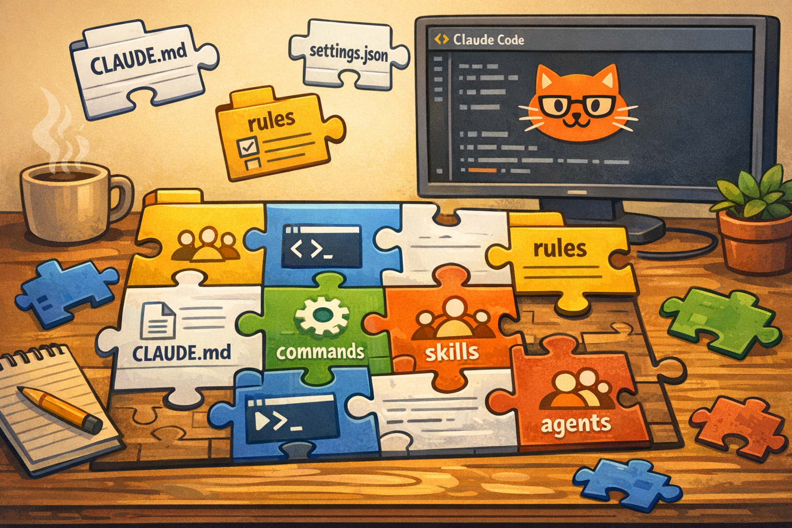
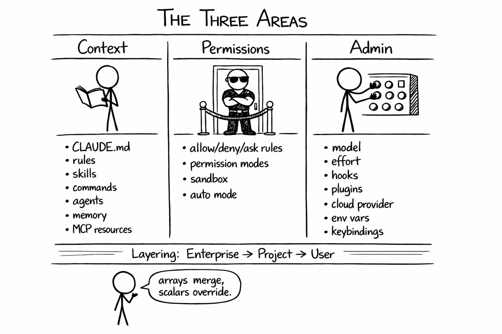
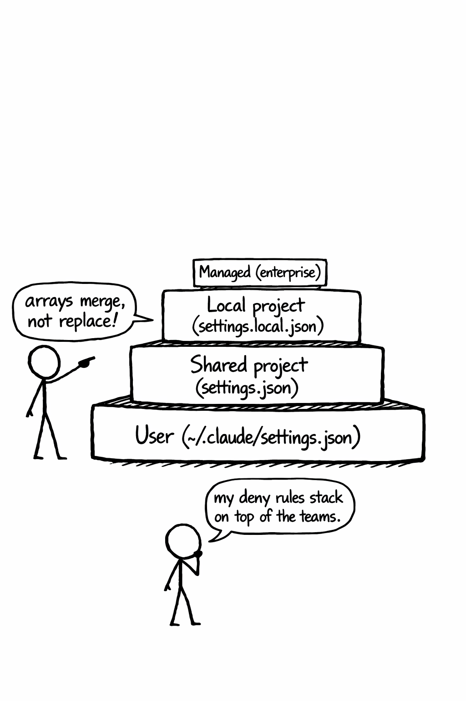

+++
title = 'Claude Code Deep Dive - Putting It All Together'
date = 2026-03-28T10:00:00-08:00
categories = ["Claude", "ClaudeCode", "AICoding", "AIAgent", "CodingAssistant", "Configuration"]
+++

Over twelve CCDD articles we've explored Claude Code's features one by one: CLAUDE.md, slash commands, skills, MCP, subagents, hooks, plugins, pipelines, the SDK, scheduling, and sandboxing 🧩. Each one introduced its own files, settings, and conventions. If you've been following along you might be wondering: where does everything actually go? 🤔 Today we zoom out and look at the full picture 🗺️. It can be challenging to see the forest from the trees 🌳, but in the end it's all about context engineering and making sure Claude Code is well-behaved.

**"For every minute spent organizing, an hour is earned."** ~ Benjamin Franklin

<!--more-->



This is the thirteenth article in the *CCDD* (Claude Code Deep Dive) series. The previous articles are:

1. [Claude Code Deep Dive - Basics](https://medium.com/@the.gigi/claude-code-deep-dive-basics-ca4a48003b02)
2. [Claude Code Deep Dive - Slash Commands](https://medium.com/@the.gigi/claude-code-deep-dive-slash-commands-9cd6ff4c33cb)
3. [Claude Code Deep Dive - Total Recall](https://medium.com/@the.gigi/claude-code-deep-dive-total-recall-cb0317d67669)
4. [Claude Code Deep Dive - Mad Skillz](https://medium.com/@the.gigi/claude-code-deep-dive-mad-skillz-9dfb3fa40981)
5. [Claude Code Deep Dive - MCP Unleashed](https://medium.com/@the.gigi/claude-code-deep-dive-mcp-unleashed-0c7692f9c2c2)
6. [Claude Code Deep Dive - Subagents in Action](https://medium.com/@the.gigi/claude-code-deep-dive-subagents-in-action-703cd8745769)
7. [Claude Code Deep Dive - Hooked!](https://medium.com/@the.gigi/claude-code-deep-dive-hooked-8492c9b5c9fb)
8. [Claude Code Deep Dive - Plug and Play](https://medium.com/@the.gigi/claude-code-deep-dive-plug-and-play-af03f77c6568)
9. [Claude Code Deep Dive - Pipeline Dreams](https://medium.com/@the.gigi/claude-code-deep-dive-pipeline-dreams-5b6b4a5cf2ce)
10. [Claude Code Deep Dive - The SDK Strikes Back](https://medium.com/@the.gigi/claude-code-deep-dive-the-sdk-strikes-back-03b8d501ec38)
11. [Claude Code Deep Dive - On the Clock](https://medium.com/@the.gigi/claude-code-deep-dive-on-the-clock-1d0736709c76)
12. [Claude Code Deep Dive - Lock Him Up!](https://medium.com/@the.gigi/claude-code-deep-dive-lock-him-up-ea142fc8246b)

## 🗺️ Three Areas, One System 🗺️

Claude Code's configuration surface breaks down into three areas:

**Context** is what Claude knows. CLAUDE.md files, rules, skills, commands, subagents, auto memory, MCP server resources, and `@` imports. These shape the model's understanding of your project, your preferences, and the task at hand. Context engineering is the most critical aspect of building real-world agentic AI systems.

**Permissions** is what Claude can do. Permission rules (`allow`, `deny`, `ask`), permission modes, sandbox settings for filesystem and network isolation, and the auto mode classifier. MCP tools live here too: they're discovered through context, but their execution is governed by permissions. This is where you draw the line between autonomy and safety. The consequences of mismanaging permissions can be catastrophic as many naive OpenClaw users discovered. 

**Admin** is how Claude Code itself is set up. Model selection, effort level, hooks, plugins, cloud provider routing (Bedrock, Vertex, Foundry), keybindings, shell configuration, worktree settings, status line, and environment variables. The stuff that keeps the engine running.

Every configuration file touches one or more of these areas. `settings.json` spans all three. CLAUDE.md is pure context. Sandbox config is pure permissions. Hooks are admin (they're deterministic enforcement that runs outside the model). Plugins bundle things from all three areas into distributable packages.

Cutting across these three areas is the **layering system**. Each area can be configured at multiple scopes: user (personal), project shared (team), project local (personal per-project), and enterprise (organization). When scopes overlap, the precedence is enterprise > local project > shared project > user, with array settings (like permission rules) merging across layers rather than replacing.

Enterprise/managed settings are beyond the scope of this series. If you're an admin, check the [official settings documentation](https://docs.anthropic.com/en/docs/claude-code/settings) for managed-settings.json, MDM delivery, and the `allowManaged*Only` lockdown options.



Let's start with the context.

## 🧠 Context: What Claude Knows 🧠

Context engineering is the art of giving Claude the right information at the right time. Here's every file that contributes to it, organized by where it lives. If you want to dive deeper I link to the relevant CCDD articles that cover each one.

**User scope** (`~/.claude/`, personal, all projects):

- `CLAUDE.md`: personal instructions loaded every session. Your universal preferences: coding style, safety guardrails, workflow habits. See [Total Recall (#03)](https://medium.com/@the.gigi/claude-code-deep-dive-total-recall-cb0317d67669)
- `rules/*.md`: modular instruction files with optional path scoping via YAML frontmatter. See [Total Recall (#03)](https://medium.com/@the.gigi/claude-code-deep-dive-total-recall-cb0317d67669)
- `commands/*.md`: personal slash commands, appear as `/user:<name>`. See [Slash Commands (#02)](https://medium.com/@the.gigi/claude-code-deep-dive-slash-commands-9cd6ff4c33cb)
- `skills/`: personal skills, auto-invoked when trigger conditions match. See [Mad Skillz (#04)](https://medium.com/@the.gigi/claude-code-deep-dive-mad-skillz-9dfb3fa40981)
- `agents/*.md`: personal subagent definitions with their own model, tools, instructions. See [Subagents (#06)](https://medium.com/@the.gigi/claude-code-deep-dive-subagents-in-action-703cd8745769)
- `projects/<project>/memory/`: auto memory that Claude builds over time. `MEMORY.md` index (first 200 lines) loads at session start; topic files load on demand. All worktrees for the same repo share one memory directory.

**Project scope** (`.claude/` and project root, team-shared via git):

- `CLAUDE.md`: can live at root or in `.claude/`. Project architecture, dev commands, testing conventions, coding standards. Supports `@` imports to pull in other files. Can import personal per-project config with `@~/.claude/projects/<project>/CLAUDE.md`. See [Total Recall (#03)](https://medium.com/@the.gigi/claude-code-deep-dive-total-recall-cb0317d67669)
- `rules/*.md`: project rules, often path-scoped (different standards for frontend vs. backend). See [Total Recall (#03)](https://medium.com/@the.gigi/claude-code-deep-dive-total-recall-cb0317d67669)
- `commands/*.md`: project slash commands, appear as `/project:<name>`. See [Slash Commands (#02)](https://medium.com/@the.gigi/claude-code-deep-dive-slash-commands-9cd6ff4c33cb)
- `skills/`: project skills, shared with the team. See [Mad Skillz (#04)](https://medium.com/@the.gigi/claude-code-deep-dive-mad-skillz-9dfb3fa40981)
- `agents/*.md`: project subagents for code review, testing, security auditing. See [Subagents (#06)](https://medium.com/@the.gigi/claude-code-deep-dive-subagents-in-action-703cd8745769)
- `.mcp.json` (at project root): MCP server definitions. Claude discovers available tools and resources through these servers. See [MCP Unleashed (#05)](https://medium.com/@the.gigi/claude-code-deep-dive-mcp-unleashed-0c7692f9c2c2)

**Subdirectory scope** (on demand):

- `CLAUDE.md` files in subdirectories load automatically when Claude reads files in that directory. Useful in monorepos where different parts of the codebase need different instructions. See [Total Recall (#03)](https://medium.com/@the.gigi/claude-code-deep-dive-total-recall-cb0317d67669)
- `.claude/skills/` in subdirectories are also discovered by proximity. If you're editing files in `packages/frontend/`, Claude finds skills in `packages/frontend/.claude/skills/`. See [Mad Skillz (#04)](https://medium.com/@the.gigi/claude-code-deep-dive-mad-skillz-9dfb3fa40981)
- Other `.claude/` contents (commands, agents, rules, settings) only work at the project root or user home. Rules can still target specific paths via YAML frontmatter, they just don't need to live in subdirectories to do it.

**Session scope** (CLI flags, ephemeral):

- `--system-prompt` / `--append-system-prompt`: inject instructions for a single run. Useful in CI. See [Pipeline Dreams (#09)](https://medium.com/@the.gigi/claude-code-deep-dive-pipeline-dreams-5b6b4a5cf2ce)

MCP servers deserve a note here. They span context and permissions. When Claude discovers an MCP server, the tool schemas and resources become part of its context (it knows what tools exist and what they can do). But actually calling those tools is governed by permission rules. You can allow `mcp__servername__toolname` in your permissions, or let the user approve each call interactively.

## 🔒 Permissions: What Claude Can Do 🔒

Permissions control what actions Claude is allowed to take. The configuration lives primarily in `settings.json` across all scopes.

### Permission Rules

The `permissions` object in `settings.json` has four parts: `allow` (auto-approved), `deny` (blocked), `ask` (always prompt), and `defaultMode`. Here's part of my personal setup:

```json
{
  "permissions": {
    "allow": [
      "WebSearch"
    ],
    "deny": [
      "Bash(*git commit*)",      
      "Bash(*git push*)",
      "Bash(*gh pr merge*)",
      "Bash(*kubectl delete*)",
      "Bash(*kubectl apply*)",
      "Bash(*kubectl scale*)",
      "Bash(*kubectl edit*)",
      "Bash(*kubectl patch*)",
      "Bash(*kubectl rollout restart*)"
    ],
    "ask": [
      "Bash(helm upgrade:*)",
      "Bash(terraform apply:*)",
      "Bash(just tf apply:*)",
      "Bash(kubectl create:*)"
    ],
    "defaultMode": "acceptEdits"
  }
}
```

The rule syntax is `Tool(specifier)`. Bash specifiers are glob patterns: `Bash(*git push*)` matches any command containing "git push". Read and Edit specifiers follow gitignore syntax with path prefixes (`//path` for absolute, `~/path` for home-relative, `/path` for project-relative). MCP tools use `mcp__servername__toolname`. Subagents use `Agent(Name)`.

Evaluation order is **deny > ask > allow**. A deny rule always wins. This is the same syntax used in `--allowedTools` / `--disallowedTools` CLI flags (covered in [Pipeline Dreams (#09)](https://medium.com/@the.gigi/claude-code-deep-dive-pipeline-dreams-5b6b4a5cf2ce)) and the SDK's `allowed_tools` parameter (covered in [The SDK Strikes Back (#10)](https://medium.com/@the.gigi/claude-code-deep-dive-the-sdk-strikes-back-03b8d501ec38)).

### Permission Modes

The `defaultMode` sets the overall behavior. There are six options: `default` (prompts on first use), `acceptEdits` (auto-accepts file edits), `plan` (read-only), `auto` (auto-approves with a safety classifier), `dontAsk` (auto-denies unless pre-approved), and `bypassPermissions` (skips all prompts). You can cycle through available modes during a session with `Shift+Tab`, though only a subset appears by default: `auto` requires `--enable-auto-mode` at startup and `bypassPermissions` requires `--dangerously-skip-permissions`. The auto mode classifier can be further tuned with the `autoMode` settings key, where you provide prose rules in `allow` and `soft_deny` arrays. See the [permission modes documentation](https://code.claude.com/docs/en/permission-modes) for the full details.

### Sandbox

The sandbox provides OS-level filesystem and network isolation for the Bash tool. It's a harder boundary than permission rules (which the model can sometimes work around). Note that the built-in Claude Code permissions and even the sandbox are not foolproof and there are stronger solutions for critical systems. We covered it thoroughly in [Lock Him Up! (#12)](https://medium.com/@the.gigi/claude-code-deep-dive-lock-him-up-ea142fc8246b).

The last bucket is admin. Let's see how to control and manage Claude Code itself.

## ⚙️ Admin: How Claude Code Runs ⚙️

Admin configuration controls the Claude Code runtime itself. It doesn't influence what the model knows or what it's allowed to do. It determines how the engine operates.

### Model and Effort

In `settings.json`: `model` overrides the default model (e.g., `"opus[1m]"` for Opus with 1M context). `effortLevel` sets reasoning effort (`"low"`, `"medium"`, `"high"`). `availableModels` restricts the `/model` picker, useful for teams that want to standardize. Can also be set per session with `--model` and `--effort` flags, or via `ANTHROPIC_MODEL` and `CLAUDE_CODE_EFFORT_LEVEL` env vars.

### Hooks

Hooks are deterministic enforcement that fires outside the model. They live in the `hooks` key of `settings.json` at any scope. User hooks apply everywhere. Project hooks apply to the team. Use `settings.local.json` for personal project hooks. Plugins can also bundle hooks. Covered in depth in [Hooked! (#07)](https://medium.com/@the.gigi/claude-code-deep-dive-hooked-8492c9b5c9fb).

### Plugins

Plugins package skills, commands, agents, hooks, MCP configs, and LSP configs into distributable bundles. They're installed via `claude plugin install` and configured through the `enabledPlugins` key in `settings.json`. Plugin skills are namespaced (`/plugin-name:skill-name`) to avoid conflicts. Covered in [Plug and Play (#08)](https://medium.com/@the.gigi/claude-code-deep-dive-plug-and-play-af03f77c6568).

### Cloud Providers

Anthropic is the creator of Claude and Claude Code. It is the default LLM provider that Claude Code talks to, but you can use other providers.
You can point Claude Code at AWS Bedrock, Google Vertex AI, or Microsoft Foundry via environment variables (`CLAUDE_CODE_USE_BEDROCK`, `CLAUDE_CODE_USE_VERTEX`, `CLAUDE_CODE_USE_FOUNDRY`). Region-specific model routing, credential refresh scripts (`awsAuthRefresh`, `awsCredentialExport`), and gateway URLs are all configurable. See the [official docs](https://docs.anthropic.com/en/docs/claude-code/bedrock-vertex) for details.

You can actually run Claude Code against local models too. We will explore that in a future CCDD article.

### Other Admin Knobs

There's a bunch of stuff here that may or may not be relevant for you.

- `env`: persistent environment variables injected into every session
- `language`: preferred response language (e.g., `"japanese"`)
- `attribution`: customize git commit/PR attribution
- `keybindings.json`: custom keyboard shortcuts (`~/.claude/keybindings.json`)
- `statusLine`: custom status line command for the TUI (mentioned in [Slash Commands (#02)](https://medium.com/@the.gigi/claude-code-deep-dive-slash-commands-9cd6ff4c33cb))
- `defaultShell`: `"bash"` or `"powershell"`
- `worktree.symlinkDirectories` / `worktree.sparsePaths`: worktree configuration
- `claudeMdExcludes`: glob patterns to skip specific CLAUDE.md files (useful in monorepos)
- `autoMemoryEnabled`: toggle auto memory on or off

For the complete list, see the JSON schema (`https://json.schemastore.org/claude-code-settings.json`) or check the [official settings docs](https://docs.anthropic.com/en/docs/claude-code/settings).


Let's look now into one of the most important yet potentially confusing topics - the layering system.

## 📐 The Layering System 📐

Every area (context, permissions, admin) can be configured at multiple scopes. The scopes and their precedence:

1. **Enterprise/managed** (highest): deployed by IT via MDM, system paths, or the Claude.ai admin console. Read-only. Can lock down lower scopes with `allowManaged*Only` settings.
2. **Local project** (`.claude/settings.local.json`): personal overrides for a specific project. Gitignored.
3. **Shared project** (`.claude/settings.json`): team configuration committed to git.
4. **User** (`~/.claude/settings.json`): personal preferences across all projects.

The important thing: **array settings merge, scalars override**. If your team denies `Bash(*rm -rf*)` in the project settings and you deny `Bash(*git push*)` in your user settings, both rules apply. Neither replaces the other. This makes permissions additive and safe by default.

For context files (CLAUDE.md, rules, skills, commands, agents), all scopes load together. Project CLAUDE.md doesn't replace your personal one. They're concatenated. Project rules load alongside your personal rules. The only precedence question is which takes priority when instructions conflict, and there the more specific scope wins (project over user).

There's also `~/.claude.json` (not inside `.claude/`), a separate global config file that stores OAuth sessions, user-scoped MCP server definitions, and UI preferences like `editorMode` and `teammateMode`.



Let's take a quick look at environment variables and CLI flags.

## 🌍 Environment Variables & CLI Flags 🌍

Environment variables and CLI flags are session-level overrides. They're useful for one-off tweaks, CI pipelines, and scripts, but for anything persistent, put it in `settings.json` instead.

We covered CLI flags extensively in [Pipeline Dreams (#09)](https://medium.com/@the.gigi/claude-code-deep-dive-pipeline-dreams-5b6b4a5cf2ce) (`--allowedTools`, `--max-turns`, `--max-budget-usd`, `--permission-mode`) and in [The SDK Strikes Back (#10)](https://medium.com/@the.gigi/claude-code-deep-dive-the-sdk-strikes-back-03b8d501ec38) (`ClaudeAgentOptions`). For the full list of 100+ environment variables and 50+ CLI flags, see the [CLI reference](https://docs.anthropic.com/en/docs/claude-code/cli-reference) and [settings documentation](https://docs.anthropic.com/en/docs/claude-code/settings).

## 🧩 Putting It All Together 🧩

Knowing where everything lives is only half the battle. The harder question is which mechanism is the best in each use and how to combine them. Here's how to think about it.

### CLAUDE.md vs. Rules vs. @-imports

CLAUDE.md (at project root or `~/.claude/`) is for instructions that should always be in context. Your coding standards, common commands, project architecture, safety guardrails. If Claude needs to know it on every task, it belongs in CLAUDE.md.

Rules (`rules/*.md`) are for instructions that only apply sometimes. The key feature is path scoping via YAML frontmatter: a rule can target specific file patterns like `**/*.proto` or `**/migrations/*.sql`, loading only when Claude touches matching files. This is ideal for cross-cutting concerns that don't map to a single directory: protobuf style rules that apply wherever `.proto` files appear, migration safety checks for any SQL migration file, or strict header requirements for all `*.h` files across the repo (yes, talking to you old C/C++ hands!). Rules are also nice for keeping CLAUDE.md from growing into an unreadable wall of text. Think of CLAUDE.md as the constitution and rules as the bylaws.

`@`-imports pull external files into CLAUDE.md at load time. Use them for content that already exists somewhere else and shouldn't be duplicated: your team's API style guide, a CONTRIBUTING.md, a schema file. The imported content becomes part of CLAUDE.md's context, so only import things Claude genuinely needs on most tasks. Don't `@`-import your entire docs folder.

### CLAUDE.md vs. MEMORY.md

There's a second source of always-on context that's easy to confuse with CLAUDE.md: auto memory (`MEMORY.md` and its topic files in `~/.claude/projects/<project>/memory/`). The difference is ownership. CLAUDE.md is written and maintained by you. MEMORY.md is written and maintained by Claude, based on what it learns during conversations: your preferences, project context, feedback you've given, and references to external systems.

In practice the two can overlap. You might tell Claude "always run tests after changes" and it saves that to memory. If it's important enough to enforce reliably, put it in CLAUDE.md yourself. Memory is best for things Claude discovers organically: that you prefer terse responses, that a certain API quirk needs a workaround. Think of CLAUDE.md as what you tell Claude up front and MEMORY.md as what Claude remembers from working with you.

If you notice memory entries duplicating your CLAUDE.md instructions, you can clean them up from either file. Redundancy wastes context and can cause confusion when the two sources drift apart. On the other hand, you don't control MEMORY.md, so you may prefer to focus on CLAUDE.md and hope that Claude itself is smart enough not to duplicate too much into MEMORY.md. You can also disable MEMORY.md if it causes you too much stress.

### Directory-level CLAUDE.md

Subdirectory CLAUDE.md files load automatically when Claude reads files in that directory. This is the monorepo tool. If `packages/auth/` has its own testing framework, deployment pipeline, and coding conventions that differ from the rest of the repo, give it its own CLAUDE.md. The instructions load only when Claude is working in that directory, so they don't add noise elsewhere.

Don't scatter CLAUDE.md files in every directory "just in case." Each one adds context when active and adds maintenance burden. Use them strategically when a subdirectory has different conventions, not when it just has different code. For example, if you have a backend and frontend top-level directories probably  dedicated frontend and backend CLAUDE.md files are in order. 

### Skills vs. Commands vs. Agents

These three all give Claude reusable behavior, but they trigger differently and have different capabilities.

**Commands** (`commands/*.md`) are the simplest. They're prompt templates invoked explicitly with `/project:name` or `/user:name`. The user decides when to run them. Use commands for workflows you run on demand: drafting a PR description, generating a changelog, running a specific review checklist. Commands are predictable because the user controls when they fire.

**Skills** (`skills/`) are auto-invoked when trigger conditions match. The user doesn't have to remember to call them. Use skills for behaviors that should always happen in certain contexts: "when the user asks to build an API endpoint, always include input validation and error handling per our standards" or "when modifying database models, always generate a migration." Skills are more powerful than commands but harder to debug when they fire unexpectedly. Also, the user can invoke skills as slash commands.

**Agents** (`agents/*.md`) are for tasks that need their own identity and context: a dedicated model, a restricted tool set, custom instructions, or isolation from the main conversation. A code review agent that uses a cheaper model. A security audit agent that only has read access. A test-writing agent with its own conventions. If the task just needs a prompt template, use a command. If it needs autonomy with guardrails, use an agent. It's a great way for a high-level agent to execute a sub-task without cluttering its own context.

### Directory-level Skills

Like directory-level CLAUDE.md, skills in subdirectory `.claude/skills/` are discovered by proximity. They're the monorepo version of skills. If `packages/frontend/` has React-specific patterns that don't apply to the backend, put those skills in `packages/frontend/.claude/skills/`. Claude picks them up when working in that directory.

### Quick Decision Guide

Start by asking two questions: does this apply always or conditionally? And does the user trigger it or should Claude trigger it automatically?

Always applies, no trigger needed: **CLAUDE.md** (or `@`-import if the content lives elsewhere).

Applies conditionally by file path: **rules** (with path scoping) or **directory-level CLAUDE.md** (if the scope is a whole subdirectory).

User-triggered workflow: **command**.

Auto-triggered by context: **skill** (or directory-level skill for monorepos).

Needs its own model/tools/isolation: **agent**.

When in doubt, start with CLAUDE.md. Move things to rules or skills only when CLAUDE.md gets too long or when you need conditional/automatic behavior. The simplest mechanism that works is the right one.

Finally, Claude Code itself is really great at organizing its own configuration. Ask it for advice and if you're really confident let it refactor it on its own

## ⏭️ What's Next ⏭️

Looks like this series will never end :-). Claude Code just keeps improving itself faster and faster (you know that Claude Code is writing 100% of its own code) 

- Running multiple Claude Code sessions in parallel (agent teams and fan-out patterns)
- Computer use
- Channels
- Remote control
- Voice mode
- Running Claude Code against local models
- Comparing Claude Code with other AI coding agents

## 🏠 Take Home Points 🏠

- Claude Code's configuration surface has three areas: **context** (what Claude knows), **permissions** (what Claude can do), and **admin** (how Claude Code runs).
- The **layering system** cuts across all three: enterprise > local project > shared project > user. Array settings merge, scalars override.
- Project config is for the team (committed to git). User config is for you (stays local). Keep them separate.
- Permission rules use `Tool(specifier)` syntax with deny > ask > allow evaluation order. The same syntax works in settings.json, CLI flags, and the SDK.
- Start with `/init` to bootstrap, then grow your configuration organically. Each area was covered in depth across the series: this article is the map.
- LetClaude Code help with its own configuration

🇹🇭 ลาก่อนนะ เพื่อนๆ! 🇹🇭
