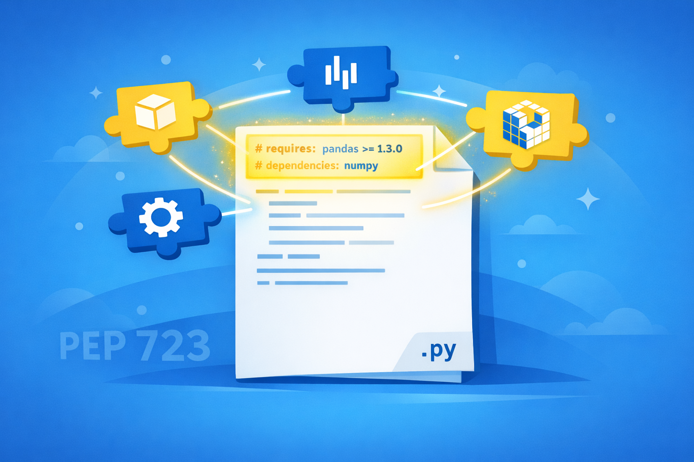
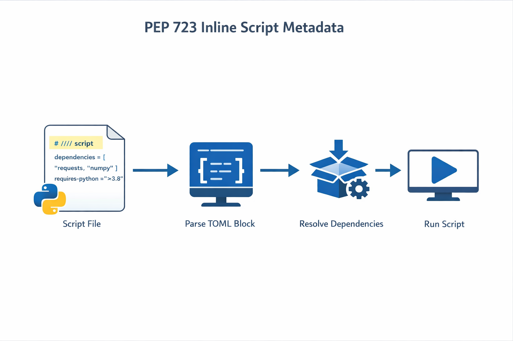
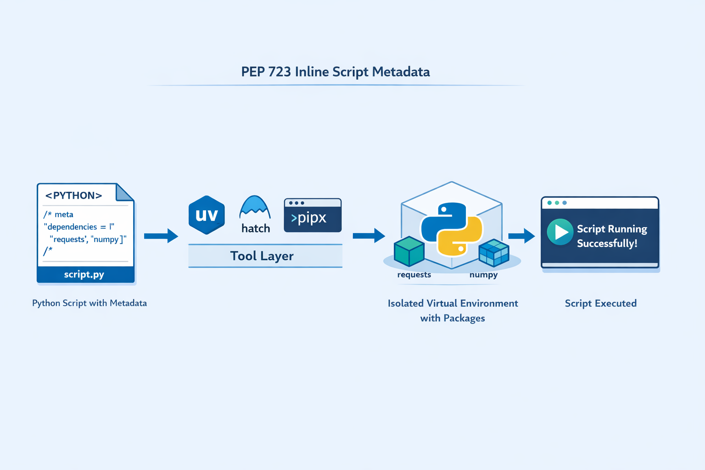

+++
title = 'PEP Talk #1 - PEP 723: Inline Script Metadata'
date = 2026-03-15T10:00:00-08:00
categories = ["Python", "PEP", "Scripting"]
+++

Every Python developer has been there. You write a quick script, it needs `requests` (or `click`, or `pandas`), and suddenly your "quick script" needs a whole project setup. What if the script itself could just say what it needs? This is where inline script metadata comes in...

**"Simple is better than complex." -- The Zen of Python, PEP 20**

<!--more-->



This is the first post in a new series I'm calling **PEP Talk**, where I pick an interesting Python Enhancement Proposal (AKA PEP) and explore it in depth. We'll look at what problem it solves, how it works, and put it to use in the real world.

For the inaugural post, I'm starting with one of my favorites: **PEP 723, Inline Script Metadata**.

## 🐍 The Problem 🐍

Python is awesome for quick scripts (and in general). Need to hit an API? Parse some JSON? Automate a tedious task? A single `.py` file gets the job done. But the moment your script needs a third-party package, the simplicity evaporates.

Consider this innocent little script:

```python
import requests

response = requests.get("https://api.github.com/zen")
print(response.text)
```

Three lines. Clean. Simple. Except it doesn't work out of the box because `requests` isn't in the standard library. So now you need to:

1. Create a virtual environment
2. Activate it
3. Install requests
4. Run the script
5. Somehow communicate to anyone else running this script that they need requests too

That last point is the real kicker. Do you add a `requirements.txt`? A `pyproject.toml`? A `setup.py`? Congratulations, your "quick script" is now a project with multiple files and a README explaining how to set it up.

This is the tension PEP 723 resolves: **how do you declare dependencies for a single-file script without turning it into a project?**

## 📜 The Old Ways 📜

Before PEP 723, the Python ecosystem had several approaches to this problem, none of them great.

**The README approach**: Write a comment at the top of your script saying "make sure you pip install requests first." This works until someone doesn't read the comment. Which is always.

**The requirements.txt companion**: Ship a `requirements.txt` alongside your script. Now you have two files, and if someone grabs just the `.py` file (from a gist, an email, a Slack message) they're back to square one.

**The global install**: Just `pip install requests` globally and hope for the best. This works until two scripts need different versions of the same package, at which point your system Python becomes a conflict zone. In general, it is best practice to leave the system Python alone.

**The shebang hack**: Some creative folks encoded dependency info in comments or docstrings, but there was no standard format, so every tool did it differently.

All of these approaches share the same fundamental flaw: the dependency information lives outside the script or in a non-standard format. PEP 723 fixes this by putting it right where it belongs.

## 🎯 PEP 723: The Specification 🎯

PEP 723 was authored by Ofek Lev, accepted in January 2024, and it introduces a beautifully simple concept: a structured comment block at the top of your Python script that declares metadata in TOML format.

Here's what it looks like:

```python
# /// script
# requires-python = ">=3.11"
# dependencies = [
#   "requests<3",
#   "rich",
# ]
# ///
```

That's it. A comment block that starts with `# /// script`, ends with `# ///`, and contains TOML between them. Every line in the block starts with `#` followed by a space (or just `#` for blank lines).



The block supports three things:

**dependencies**: A list of PEP 508 dependency specifiers. These are the same strings you'd put in a `requirements.txt` or `pyproject.toml`, with full support for version constraints, extras, and environment markers.

**requires-python**: A PEP 440 version specifier for the minimum Python version. Tools should error if they can't provide a compatible interpreter.

**[tool] table**: Tool-specific configuration, following the same `[tool.*]` convention as `pyproject.toml`. This means you can embed your Ruff or mypy config right in the script file.

Here's a more complete example:

```python
# /// script
# requires-python = ">=3.12"
# dependencies = [
#   "httpx>=0.27",
#   "rich>=13.0",
#   "click>=8.1",
# ]
#
# [tool.ruff]
# line-length = 100
# ///

import httpx
from rich import print as rprint
import click

@click.command()
@click.argument("url")
def fetch(url):
    """Fetch a URL and pretty-print the response."""
    r = httpx.get(url)
    rprint(r.json())

if __name__ == "__main__":
    fetch()
```

One file. Dependencies declared. Tool config included. No `pyproject.toml`, no `requirements.txt`, no `setup.cfg`. Just the script.

Everything is right with world... except it doesn't work with vanilla Python. You need some special tool like uv, hatch or pipx.

## ⚙️ How Tools Consume It ⚙️

PEP 723 is a packaging specification, not a language feature. Python itself doesn't read the block. Instead, tools in the ecosystem parse it and act on it.



The workflow looks like this: you write your script with the metadata block, then run it through a compatible tool. The tool reads the block, creates a temporary environment with the declared dependencies, and executes the script. When it's done, the environment can be cached or discarded.

**uv** is probably the most popular tool for this today. Running a script with inline metadata is as simple as:

```bash
uv run script.py
```

That's it. uv reads the metadata block, resolves dependencies, creates an isolated environment (cached for speed), and runs the script. Subsequent runs with the same dependencies are near-instant because uv caches aggressively.

**hatch** (by the same author as PEP 723) supports it natively:

```bash
hatch run script.py
```

**pipx** can also run scripts with inline metadata:

```bash
pipx run script.py
```

Each tool handles the environment lifecycle differently, but the script itself is always the same. That's the beauty of a standard: write once, run with any compatible tool.

## 🔧 Real-World Example: gzctl 🔧

I use PEP 723 in this very blog's tooling. The blog has a CLI tool called `gzctl` that handles drafting and publishing posts. You can read all about `gzctl` and how it works here if you're curious: 
[Claude Code Deep Dive - The SDK Strikes Back](https://medium.com/@the.gigi/claude-code-deep-dive-the-sdk-strikes-back-03b8d501ec38)

Anyway, check out the top of the file:

```python
# /// script
# requires-python = ">=3.12"
# dependencies = ["claude-agent-sdk", "click", "python-dotenv", "medium"]
# ///

"""gzctl - CLI tool for managing the Gigi Zone blog."""

import asyncio
import json
import os
# ... rest of the imports
```

This script has four dependencies, some of them fairly exotic (`claude-agent-sdk`, `medium`). Without PEP 723, I'd need a `pyproject.toml` or at minimum a `requirements.txt`. With it, I just run:

```bash
uv run tools/gzctl/gzctl.py draft "My Post Title" "post spec here"
```

`uv` reads the metadata, installs the four packages (cached after the first run), and executes the script. No virtual environment to manage explicitly. No activate/deactivate dance. If I add a new dependency, I update the one file and uv picks it up on the next run.

This pattern is perfect for project utility scripts that aren't part of the main application but need their own dependencies. The script is self-contained, version-controlled alongside the project, and anyone who clones the repo can run it with a single command.

## 🧩 Under the Hood: Parsing 🧩

One of the nice design decisions in PEP 723 is that parsing is deliberately simple. The spec provides a canonical regex:

```
(?m)^# /// (?P<type>[a-zA-Z0-9-]+)$\s(?P<content>(^#(| .*)$\s)+)^# ///$
```

And a reference implementation in Python:

```python
import re
import tomllib

REGEX = r'(?m)^# /// (?P<type>[a-zA-Z0-9-]+)$\s(?P<content>(^#(| .*)$\s)+)^# ///$'

def read_script_metadata(script: str) -> dict | None:
    matches = list(re.finditer(REGEX, script))
    for match in matches:
        if match.group("type") == "script":
            content = "".join(
                line[2:] if line.startswith("# ") else "\n"
                for line in match.group("content").splitlines(keepends=True)
            )
            return tomllib.loads(content)
    return None
```

This simplicity is intentional. The PEP authors wanted any tool to be able to parse the metadata without pulling in heavy dependencies. Just regex and a TOML parser (which is in the standard library since Python 3.11 via `tomllib`).

There are some rules to keep in mind: duplicate `script` blocks in the same file must cause a tool error (no silently picking the first one), and unclosed blocks are silently ignored. That last bit is a pragmatic choice since it means a partial edit doesn't break existing tools. I personally don't like this choice. If the code is invalid it should produce an error IMO. But, it is needed for tools that may parse the metadata constantly. The failure mode I'm worried about is that I make a mistake and forget to close a block. This will be accepted, but the block will be silently ignored, which will lead to a surprising behavior.

## ⚠️ Gotchas and Limitations ⚠️

PEP 723 is elegant, but it's not magic. There are a few things to watch out for.

**Security**: When you run `uv run script.py`, uv will download and install whatever packages the script declares. If someone sends you a malicious script with `dependencies = ["totally-not-malware"]`, running it installs that package. Review script metadata before running, just as you would review any code.

**No local path dependencies**: The dependency specifiers follow PEP 508, which means they reference packages on PyPI (or configured indexes). You can't point to a local directory like `dependencies = ["../my-local-lib"]`. For that, you're back to `sys.path` manipulation or a proper project setup.

**Not a replacement for projects**: PEP 723 is for scripts, not applications. If your code has grown to multiple files, a package structure, or needs build/publish workflows, use a proper `pyproject.toml`. The sweet spot is single-file utilities, automation scripts, and quick experiments.

**TOML quoting**: The metadata is TOML, so you need to follow TOML rules. This mostly comes up with string quoting. Dependency specifiers with complex version constraints or extras may need careful quoting:

```python
# /// script
# dependencies = [
#   'requests[security]>=2.28,<3',
# ]
# ///
```

**The PEP is frozen**: PEP 723 is now a historical document. The living specification lives on the [PyPA specs page](https://packaging.python.org/en/latest/specifications/inline-script-metadata/). Future updates happen through the PyPA process, not PEP amendments. If you're implementing tool support, check the PyPA spec, not the PEP.

## 🏠 Take Home Points 🏠

- PEP 723 lets you declare dependencies directly inside a Python script using a `# /// script` TOML comment block, making single-file scripts truly self-contained
- Tools like uv, hatch, and pipx read this metadata to automatically create isolated environments and install dependencies before running your script
- The format supports dependency specifiers, Python version requirements, and tool configuration (like Ruff or mypy settings), all in one block
- It's perfect for utility scripts, automation, and prototyping, but not a replacement for `pyproject.toml` in multi-file projects
- The specification is deliberately simple to parse (regex + TOML), making it easy for any tool to support
- If you want to implement a tool that is aware of inline script metadata use the live PYPA spec

🇬🇷 Gia sas filoi! 🇬🇷
