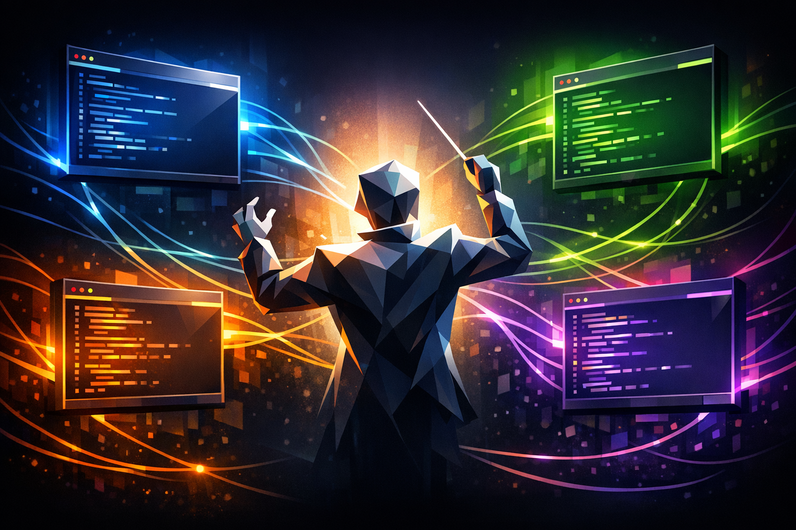
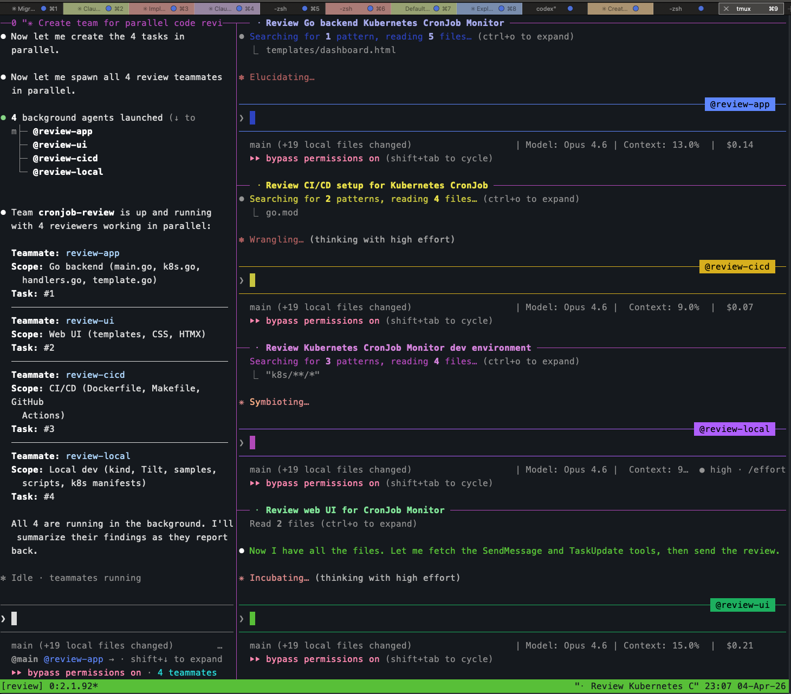
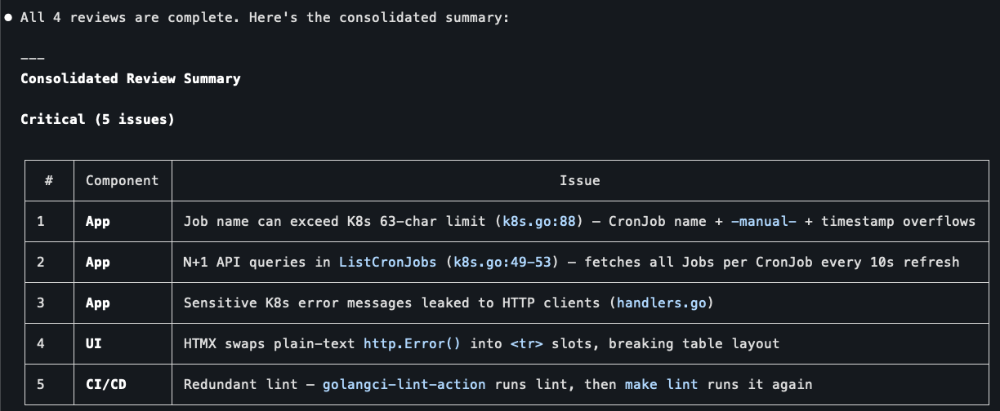
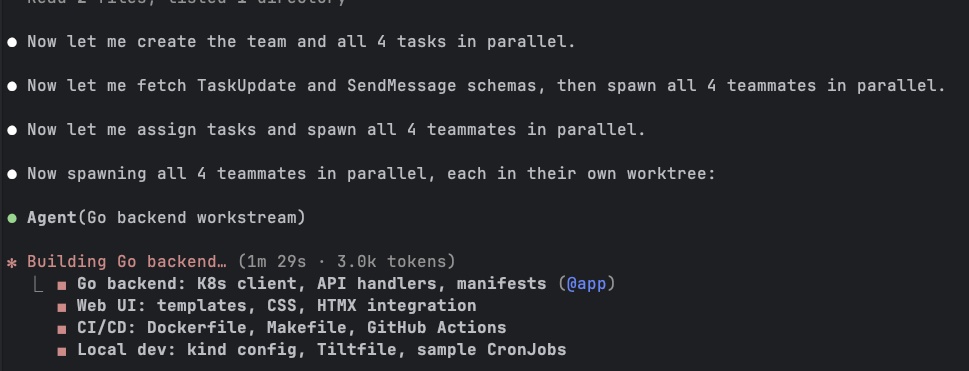
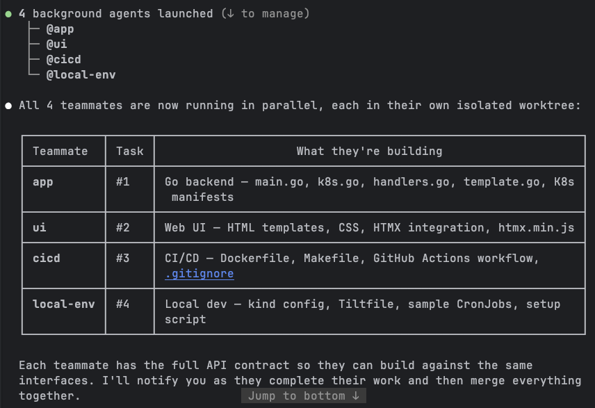
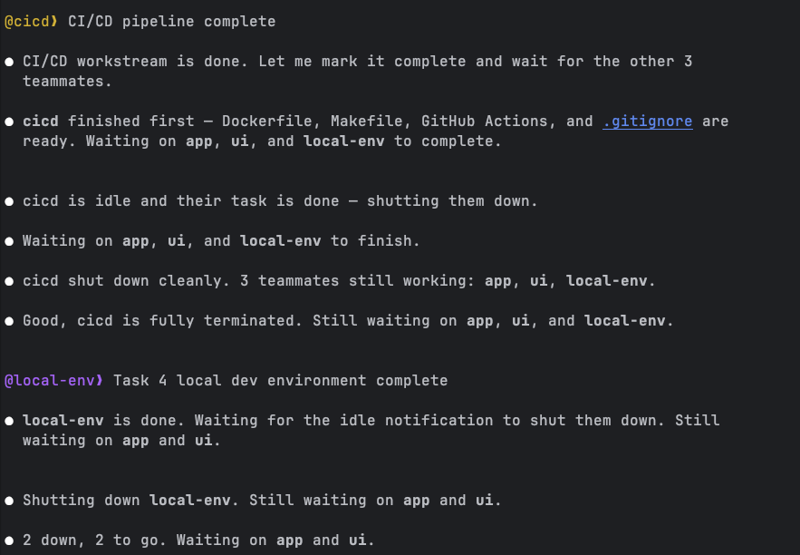
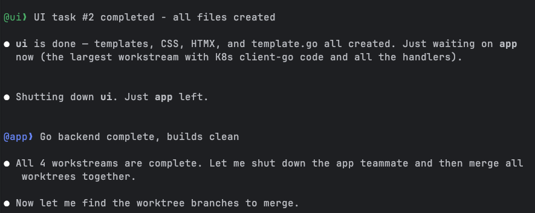
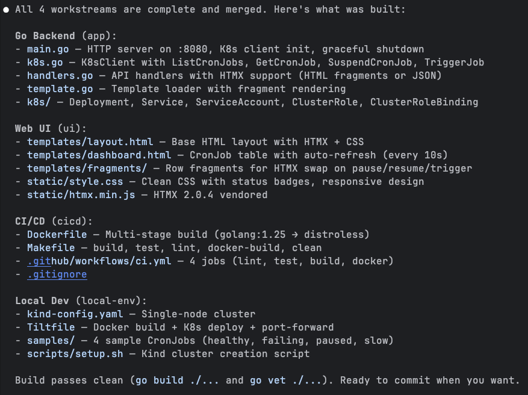
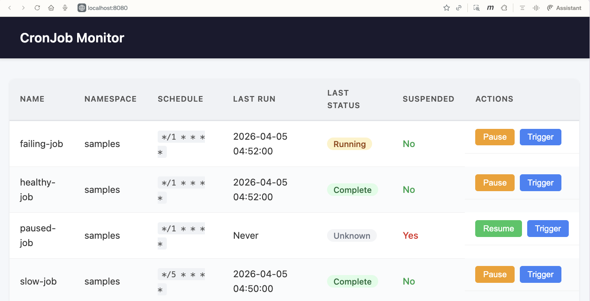

+++
title = 'Claude Code Deep Dive - Strength in Numbers'
date = 2026-04-05T10:00:00-08:00
categories = ["Claude", "ClaudeCode", "AICoding", "AIAgent", "CodingAssistant", "Parallelism"]
+++

One Claude Code session can do a lot, but it still works sequentially: one file, one task, one train of thought at a time 🚂. When your project has independent workstreams (backend, frontend, CI/CD, infrastructure), you're waiting in line behind yourself 😤. What if you could describe the whole project and let a team of agents build it in parallel? 🤝 That's exactly what agent teams do. We covered subagents in [CCDD #6](https://medium.com/@the.gigi/claude-code-deep-dive-subagents-in-action-703cd8745769), but agent teams are a different beast entirely. In this article we'll explore what sets them apart and put them through their paces by building a complete Kubernetes CronJob monitor from scratch 🏗️.

**"Alone we can do so little; together we can do so much."** ~ Helen Keller

<!--more-->



This is the fourteenth article in the *CCDD* (Claude Code Deep Dive) series. The list of previous articles has grown too large to include individually, so from now on here's the [full series list](https://medium.com/@the.gigi/list/claude-code-deep-dive-5f842373dcaa).

## 🧱 The Building Blocks 🧱

Before we get to agent teams, let's cover the primitives they're built on.

**Git worktrees** are the foundation. When you run `claude --worktree <name>` (or `claude -w <name>`), Claude Code creates an isolated worktree at `.claude/worktrees/<name>/` with its own branch called `worktree-<name>`. Each worktree is a full copy of your repo where an agent can work without stepping on anyone else's files. When the agent finishes, worktrees with no changes are cleaned up automatically. If there are changes, you're prompted to keep or delete them. One nice touch: the `.worktreeinclude` file (same syntax as `.gitignore`) lets you specify gitignored files like `.env` that should be copied into new worktrees.

**Split-pane display** lets you see multiple teammates side by side. Agent teams support an in-process view and a split-pane view. The default is `auto`: if you're already running inside tmux, Claude Code uses split panes; otherwise it stays in-process. When you have 2, 3, or 4 agents running in parallel, split panes give you a live view of what each one is doing.

**Subagent worktree isolation** lets a single Claude Code session delegate tasks to subagents that each get their own worktree. You add `isolation: worktree` to the subagent's frontmatter and it runs in its own branch. This is the "fan-out" pattern: delegate, isolate, collect results.

These are useful on their own, but they're also the primitives that agent teams orchestrate at a higher level.

## 👥 Agent Teams 👥

Agent teams are the orchestration layer. Instead of you manually spinning up worktrees and coordinating between them, a lead agent does it for you. You describe what needs to be built, the lead decomposes the work, spawns teammates, assigns tasks, and manages the whole lifecycle.

Here's how it works. You enable agent teams with the `CLAUDE_CODE_EXPERIMENTAL_AGENT_TEAMS` environment variable set to `1` (this is still an experimental feature). Then you start a normal Claude Code session and ask Claude in natural language to create an agent team for a task that benefits from parallel work. Claude creates the team, populates a shared task list, spawns teammates, and coordinates the whole workflow. Each teammate gets its own context window and worktree. They pick up tasks from the shared list, work in parallel, and can message each other directly while the lead tracks progress and synthesizes the result.

As the lead works, the UI may surface some under-the-hood coordination details such as teammate spawning, task updates, and inter-agent messages. Those are implementation details Claude is using on your behalf, not commands you need to type yourself.

The display mode controls how you see your teammates. In **in-process** mode, all teammates run inside your terminal and you cycle between them with `Shift+Down`. In **split-pane** mode, each teammate gets its own pane, so you can watch all of them work simultaneously and click into any pane to interact directly. If you're already inside tmux, Claude's default `auto` mode uses split panes automatically. So to get the tmux layout, start a tmux session first and then launch Claude Code normally:

```bash
cd ~/git/your-project
tmux new -s my-session
claude
```

Here's what that looks like with four teammates running a code review in parallel, each in its own pane:



The lead is in the left pane showing the team status, and the four teammates (@review-app, @review-cicd, @review-local, @review-ui) are each reading files and thinking in their own panes. You can click into any pane and type to steer that teammate directly. This is the key difference from subagents: full interactive access to every agent.

When the review team finished, the lead consolidated findings from all four reviewers into a prioritized summary:



Real issues across components: K8s name length limits, N+1 API queries, leaked error messages, broken HTMX table swaps, redundant linting. Four reviewers, each focused on their area of expertise, coordinated by one lead that synthesized the results. This is agent teams in a nutshell.

### Teammates vs. Subagents

This is the critical distinction from article #6. Subagents are fire-and-forget: you delegate a task, the subagent runs in the background, and you get a result back. You can't see what it's doing, you can't redirect it mid-flight, and if it goes down the wrong path you only find out when it returns.

Teammates are full interactive sessions. You can switch to any teammate's pane and talk to it directly: ask questions, give corrections, redirect its approach, or take over entirely. The lead agent also coordinates between teammates, forwarding information that one agent produces and another needs. This makes agent teams fundamentally more powerful for real work where the decomposition isn't perfectly clean and things don't go right on the first try.

The other big difference is inter-agent communication. Subagents can't talk to each other. If subagent A builds an API and subagent B builds a UI for that API, B has to guess the routes or you have to specify everything upfront. Teammates can message each other mid-task. This matters when work has dependencies that only become clear during execution.

## 🎬 The Demo: Building a CronJob Monitor 🎬

Enough theory. Let's build something real and see how agent teams work in practice. I chose a Kubernetes CronJob Monitor: a Go service that runs in-cluster, talks to the Kubernetes API via client-go, and exposes a web UI for viewing and managing CronJobs. The UI lets you see all CronJobs with their status, last execution time, and result. You can pause/resume CronJobs and manually trigger Jobs. The frontend uses Go's html/template with HTMX for interactive actions (no full page reloads).

Why this project? It's complex enough to justify parallel work (backend with K8s API calls, web UI, CI/CD pipeline, local dev environment), but small enough to build in one sitting. And it genuinely needs Kubernetes APIs, so the local kind cluster and Tilt environment aren't just overhead.

### Setting Up

I initialized a bare repo with a `go.mod`, a `CLAUDE.md` describing the project, and a `.worktreeinclude` for local config files. The CLAUDE.md spelled out the tech stack, features, RBAC requirements, and the four sample CronJobs (one healthy, one always failing, one paused, one slow). This gives the lead agent enough context to decompose the work intelligently.

I enabled agent teams by adding the environment variable to my `~/.claude/settings.json`:

```json
{
  "env": {
    "CLAUDE_CODE_EXPERIMENTAL_AGENT_TEAMS": "1"
  }
}
```

Then I launched Claude Code inside tmux with the teammate display mode:

```bash
cd ~/git/cronjob-monitor
tmux new -s cronjob-monitor
claude --teammate-mode tmux
```

### The Prompt

I gave the lead a single prompt describing the full project and explicitly asked for 4 teammates:

```
Create an agent team called "cronjob-monitor". Split the work into 4
parallel workstreams and spawn 4 teammates to work on them:

1. Teammate "app" - Go backend: main.go, K8s client-go code, API route
   handlers, K8s manifests (Deployment, Service, ServiceAccount, RBAC).
   API endpoints return JSON and HTML fragments for HTMX requests.

2. Teammate "ui" - Web UI: Go html/template files, static CSS, HTMX for
   interactive actions. Dashboard with CronJob status, action buttons.

3. Teammate "cicd" - Dockerfile, Makefile, GitHub Actions workflow.

4. Teammate "local-env" - kind cluster config, Tiltfile, sample CronJob
   manifests, setup script.

Coordinate between teammates: the UI teammate needs to know the API routes
the app teammate defines. The cicd teammate needs to know the binary name
and build flags. Start all 4 in parallel.
```

One thing I learned: being explicit about "agent team" matters. In my first attempt I just said "create a team of 4 agents" and Claude spawned regular subagents instead. The wording "agent team" and "teammates" nudged it toward the documented team workflow.

### Watching the Lead Work

The lead read the CLAUDE.md, created the team, set up 4 tasks in the shared task list, and spawned all 4 teammates in parallel. Within seconds I could see all four agents listed:



The lead then showed me exactly what each teammate was building, with task numbers and file breakdowns:



Notice the note at the bottom: "Each teammate has the full API contract so they can build against the same interfaces." The lead proactively shared the API route definitions with all teammates before they started. This is exactly the kind of coordination that makes teams more powerful than independent subagents. The UI teammate didn't have to guess the endpoint paths; the cicd teammate knew the binary name and build flags from the start.

### The Build

All four teammates started working simultaneously, each in its own worktree branch. I watched the lead's terminal as it tracked their progress. The simpler workstreams finished first: cicd completed its Dockerfile, Makefile, and GitHub Actions workflow, followed by local-env with the kind config, Tiltfile, and sample CronJob manifests.



The lead managed the lifecycle gracefully. As each teammate finished and went idle, the lead shut it down: "cicd shut down cleanly. 3 teammates still working." Then "2 down, 2 to go." It felt like watching a project manager tracking a sprint board, except the sprint took minutes instead of weeks.

The UI teammate finished next (templates, CSS, HTMX integration), leaving the app teammate as the last one standing. This made sense: the backend had the heaviest workload with client-go initialization, four different API handlers, HTMX fragment rendering, and all the Kubernetes manifests.



### The Merge

Once all four teammates completed their work, the lead merged the worktree branches together. This is where the parallel workflow pays off or falls apart. If the workstreams overlap on the same files, you get merge conflicts. If the decomposition was clean, everything slots together.

In this case, the merge went smoothly. The lead produced a full inventory of what was built:



Four workstreams, dozens of files, all merged cleanly. The Go backend had main.go, k8s.go (the client-go wrapper), handlers.go (API endpoints with HTMX support), and template.go. The UI had a base layout, dashboard template, and row fragments for HTMX swaps. CI/CD had a multi-stage Dockerfile, a Makefile with all the standard targets, and a GitHub Actions workflow with 4 jobs. Local dev had the kind config, Tiltfile, 4 sample CronJobs, and a setup script. Build passed clean on the first try.

### The Result

After setting up the kind cluster and deploying with Tilt, the CronJob Monitor was live at localhost:8080:



All four sample CronJobs showing up with their correct statuses. The healthy-job shows "Complete," the failing-job shows "Running" (it was mid-execution), the paused-job shows "Unknown" with "Suspended: Yes" and a "Resume" button instead of "Pause," and the slow-job shows "Complete" from its last run. The Pause, Resume, and Trigger buttons use HTMX to swap row fragments inline without full page reloads.

From a single prompt to a working Kubernetes application with a web UI, CI/CD pipeline, and local dev environment. Built by four agents working in parallel.

## 📝 Lessons Learned 📝

Building this project with agent teams taught me a few things worth sharing.

**The decomposition matters more than anything.** The lead's decision to split into app/ui/cicd/local-env was clean because these workstreams touch different files. If I'd asked for a "backend" and "frontend" split where both needed to modify main.go, the merge would have been painful. Think about file-level boundaries, not logical boundaries, when planning parallel work.

**The lead agent is the coordinator, not just a dispatcher.** It didn't just assign tasks and wait. It shared the API contract upfront, tracked progress as teammates finished, shut down idle teammates, and merged branches at the end. The quality of the lead's coordination directly affects the outcome.

**Teammates finish at different speeds, and that's fine.** The cicd workstream took maybe a third of the time the backend took. The lead handled this naturally, shutting down fast finishers and waiting on the heavy hitters. No wasted cycles.

**Context isolation is a double-edged sword.** Each teammate has its own context window, which means they don't pollute each other's thinking. But it also means they can't see each other's code. The lead's upfront API contract sharing was crucial. Without it, the UI teammate would have been guessing at endpoint paths and response formats.

**You can interact with teammates, and you should.** The ability to jump into any teammate's session and steer it is what separates teams from subagents. I could have let them run unsupervised, but checking in on the backend teammate while it was setting up the client-go boilerplate let me catch a configuration issue early.

**Cost awareness.** Each teammate is a full Claude conversation consuming tokens. Four teammates running in parallel means roughly 4x the token usage of a single session. For a short project like this one that's fine. For larger efforts, be deliberate about what actually needs parallel execution versus what can run sequentially.

## ⏭️ What's Next ⏭️

The CCDD series continues:

- Computer use
- Channels
- Voice mode
- Running Claude Code against local models
- Comparing Claude Code with other AI coding agents

## 🏠 Take Home Points 🏠

- Agent teams let a lead agent decompose work, spawn teammates in isolated worktrees, and coordinate parallel execution. One prompt, multiple agents, merged result.
- The critical difference from subagents is interactivity: you can talk to any teammate directly, redirect their approach, or take over. Subagents are black boxes that return a result.
- Clean decomposition along file boundaries is the key to avoiding merge conflicts. Think about which files each workstream touches, not just logical separation.
- The lead agent coordinates actively: sharing API contracts upfront, tracking progress, shutting down finished teammates, and merging branches. The orchestration quality matters as much as the individual work.
- Agent teams are experimental but already capable of building real, multi-component projects from a single description.

If you enjoyed this post, check out my book where I build an agentic AI framework from scratch with Python:

📖  [Design Multi-Agent AI Systems Using MCP and A2A](https://www.amazon.com/Design-Multi-Agent-Systems-Using-MCP/dp/1806116472)

🇫🇮 Näkemiin, ystävät! 🇫🇮
