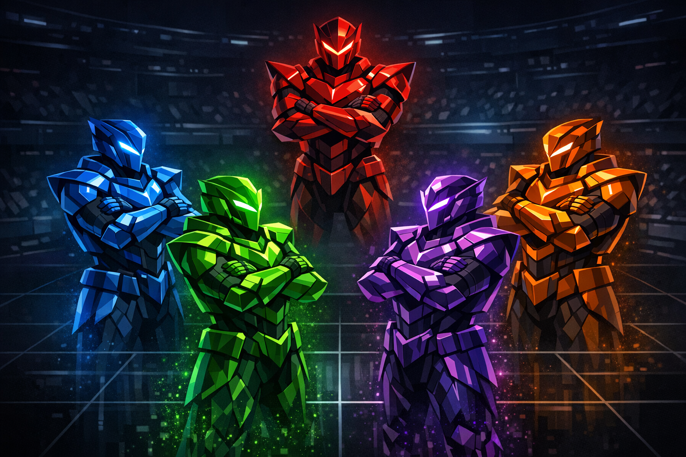
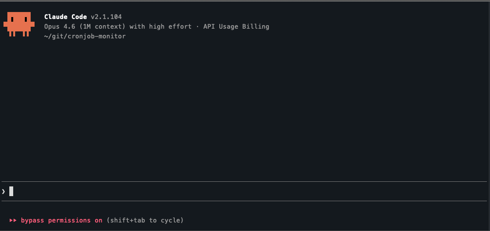
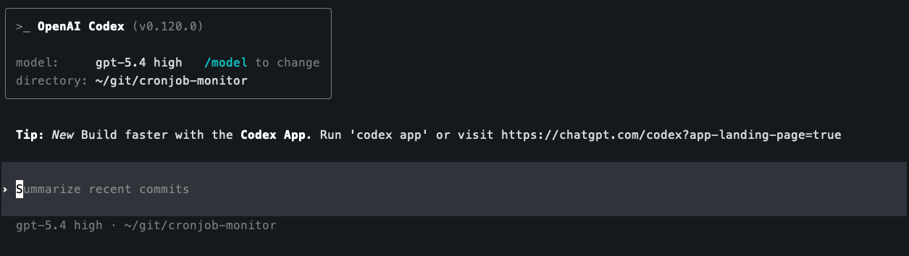
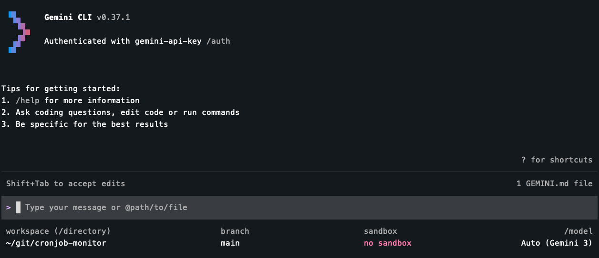
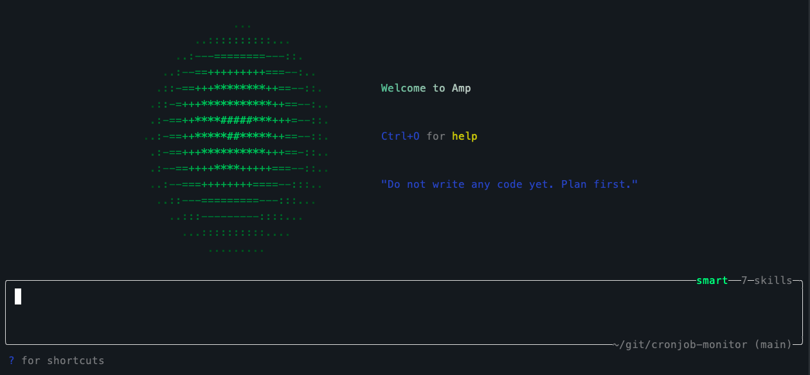
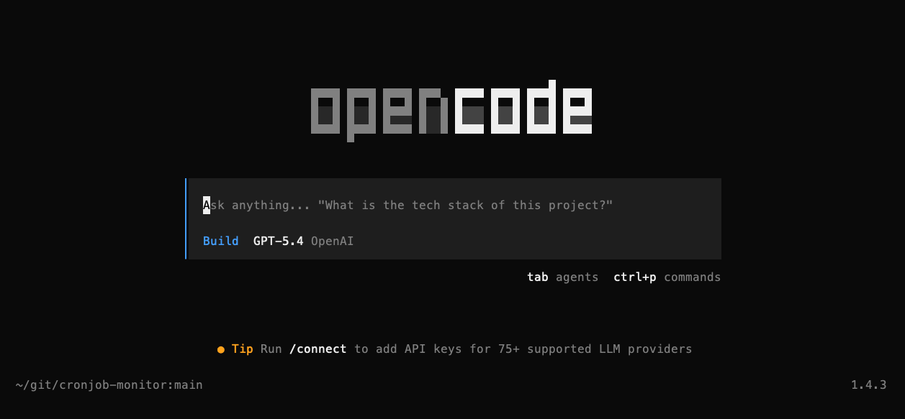
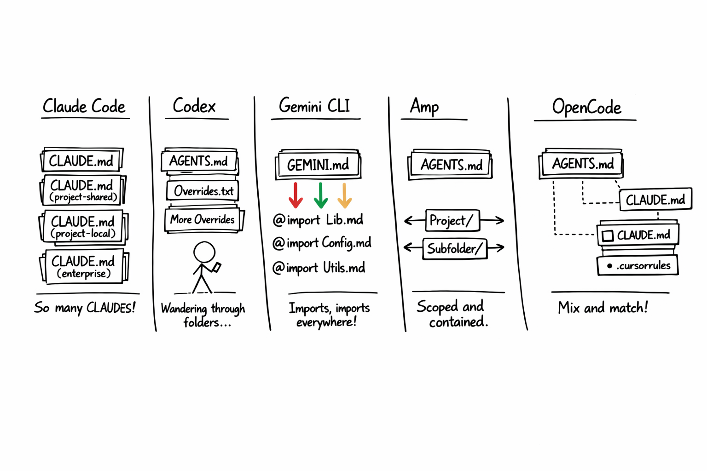
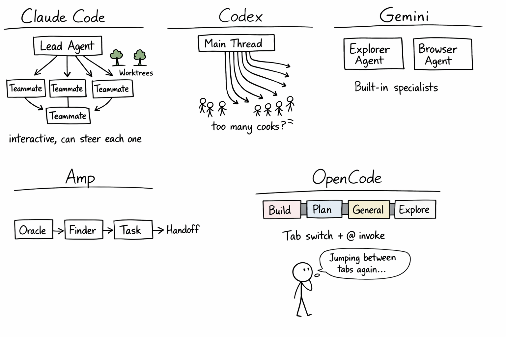
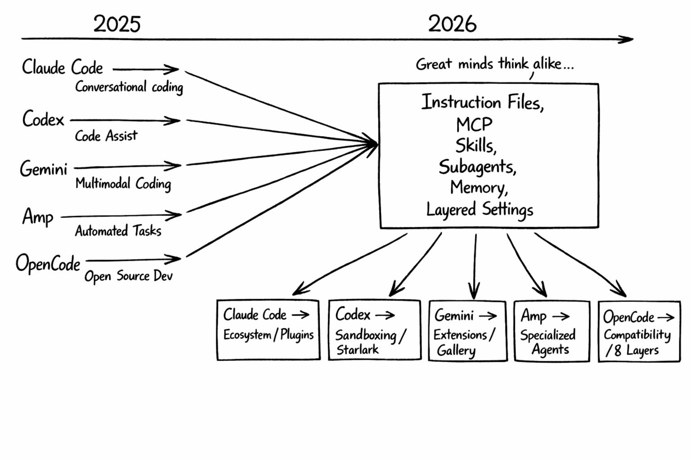

+++
title = 'Claude Code Deep Dive - Know Your Rivals'
date = 2026-04-12T10:00:00-08:00
categories = ["Claude", "ClaudeCode", "AICoding", "AIAgent", "CodingAssistant", "Codex", "Gemini", "Amp", "OpenCode"]
+++

Claude Code isn't the only AI coding agent in town anymore 🏘️. OpenAI has Codex, Google has Gemini CLI, Sourcegraph has Amp, and the open-source world has OpenCode, all competing for your terminal 💻. In this CCDD episode we're going to look at the part that matters most for real-world adoption - the configuration surface 🎛️. How deeply can you customize, extend, and control each of these tools? This is what harness engineering is all about. At the end of the day, this will determine if a tool works just for toy projects or can handle a large-scale production codebase. Let's find out 🔍.

**"If you know the enemy and know yourself, you need not fear the result of a hundred battles."** ~ Sun Tzu

<!--more-->

This is *CCDD #15* (Claude Code Deep Dive). Check out the list of previous articles here:
[CCDD series](https://medium.com/@the.gigi/list/5f842373dcaa).

## 🥊 The Contenders 🥊

Five CLI-first AI coding agents, all vying for a permanent spot in your workflow.

**Claude Code** is Anthropic's CLI agent and the subject of this entire series. Fourteen articles in, we've covered its configuration surface in detail: CLAUDE.md, rules, slash commands, skills, hooks, MCP, subagents, agent teams, plugins, pipelines, the SDK, scheduling, sandboxing, and settings layers. It's the baseline for this comparison. Official docs: [Claude Code docs](https://code.claude.com/docs/en).

**Codex** is OpenAI's open-source CLI agent ([github.com/openai/codex](https://github.com/openai/codex)). Its public docs cover AGENTS.md, rules written in Starlark, hooks, skills, subagents, plugins, MCP, and a strong sandboxing model with platform-native isolation. Official docs: [Codex docs](https://developers.openai.com/codex/overview).

**Gemini CLI** is Google's open-source entry ([github.com/google-gemini/gemini-cli](https://github.com/google-gemini/gemini-cli)). It uses GEMINI.md for project instructions, supports custom commands and extensions, and documents sandboxing, checkpointing, trusted folders, and MCP. Official docs: [Gemini CLI docs](https://google-gemini.github.io/gemini-cli/).

**Amp** is Sourcegraph's coding agent ([ampcode.com](https://ampcode.com)). It uses AGENTS.md, is available in the terminal and editor workflows, and stands out for its specialized helpers: Oracle for deeper reasoning, Librarian for cross-repository research, Task for delegated work, plus preview hooks and built-in secret redaction. Official docs: [AGENTS.md](https://ampcode.com/manual#agentsmd), [Oracle](https://ampcode.com/manual#oracle), [Librarian](https://ampcode.com/manual#librarian), [Subagents](https://ampcode.com/manual#subagents), and [Configuration](https://ampcode.com/manual#configuration).

**OpenCode** is an open-source coding agent ([opencode.ai](https://opencode.ai), [github.com/anomalyco/opencode](https://github.com/anomalyco/opencode)) built around a configurable TUI, plugins, skills, agents, snapshots, and unusually broad model access: 75+ LLM providers through Models.dev, including local models. It uses AGENTS.md and has explicit Claude Code compatibility for CLAUDE.md and `.claude/skills/`. Official docs: [OpenCode docs](https://opencode.ai/docs) and [models docs](https://opencode.ai/docs/models/).

Now let's compare them across 12 dimensions, grouped into four themes.

## 🧠 Context Engineering 🧠

Context engineering is about what the agent knows when you type your messages. Every tool in this comparison starts with a project instruction file, but the details vary.

### Project Instructions

Claude Code reads CLAUDE.md files at multiple levels: user-global (`~/.claude/CLAUDE.md`), project-shared (checked into the repo), and project-local (gitignored, personal). Managed org-wide CLAUDE.md files add another layer. The files are markdown, but not just plain text blobs: imports and path-scoped rules make the system composable. (See [CCDD #3 - Total Recall](https://medium.com/@the.gigi/claude-code-deep-dive-total-recall-cb0317d67669).)

Codex uses AGENTS.md, starting with `~/.codex/AGENTS.md` and then walking from the project root down to the current working directory. At each level it prefers `AGENTS.override.md` over `AGENTS.md`, includes at most one file per directory, and stops when the combined size hits the configurable `project_doc_max_bytes` limit (32 KiB by default). See the [Codex AGENTS.md guide](https://developers.openai.com/codex/guides/agents-md).

Gemini CLI uses GEMINI.md with a `@file.md` import syntax that lets you compose instructions from multiple files (same as CLAUDE.md convention). The filename is configurable too. You can point it at AGENTS.md or CONTEXT.md if you prefer. See the [GEMINI.md docs](https://google-gemini.github.io/gemini-cli/docs/cli/gemini-md.html).

Amp uses AGENTS.md with directory scoping. Parent AGENTS.md files are always included, subtree AGENTS.md files are pulled in when Amp reads files in that subtree, and `@` mentions let you compose additional context files. See the [AGENTS.md docs](https://ampcode.com/manual#agentsmd).

OpenCode uses AGENTS.md as its primary rules file, falls back to CLAUDE.md when AGENTS.md is absent, and also supports additional instruction files via config. It explicitly supports Claude Code compatibility for `~/.claude/CLAUDE.md` and `.claude/skills/`. See the [OpenCode rules docs](https://opencode.ai/docs/rules).

The convergence here is striking. Every tool landed on some flavor of "markdown instructions in or near the repo, with layering or traversal." The filenames differ, but the design pattern is clearly converging.

Context files are only half the story. The other half is what the agent remembers between sessions.

### Memory

All five tools have some form of persistent memory across sessions, but the implementations diverge.

Claude Code has a dedicated auto-memory system that writes markdown files under `~/.claude/projects/<project>/memory/`, with `MEMORY.md` acting as the always-loaded summary and topic files read on demand. (See [CCDD #3 - Total Recall](https://medium.com/@the.gigi/claude-code-deep-dive-total-recall-cb0317d67669).)

Codex's public docs emphasize persistent AGENTS.md guidance, saved conversations, forking/resuming threads, and reusable skills. They do not currently present a Claude-style auto-memory directory as a first-class feature.

Gemini CLI keeps it simple: `/memory add` appends persistent facts to the global `~/.gemini/GEMINI.md`, while `/memory show` and `/memory refresh` let you inspect and reload the active hierarchical context. See the [commands docs](https://google-gemini.github.io/gemini-cli/docs/cli/commands.html) and the [GEMINI.md docs](https://google-gemini.github.io/gemini-cli/docs/cli/gemini-md.html).

Amp leans more on AGENTS.md, saved threads, and its agent workflow than on a separately branded memory subsystem in the public docs.

OpenCode's `/init` command creates an AGENTS.md scaffold for project guidance, and snapshots plus shared sessions provide continuity during iterative work.

### Skills and Reusable Workflows

Several tools in this comparison have an explicit SKILL.md convention. Others package reusable behavior through extensions or plugins instead.

Claude Code's skills are markdown directories that include a SKILL.md file with frontmatter, stored in `.claude/skills/` or `~/.claude/skills/`. They're discovered automatically and invoked when relevant or explicitly via slash commands. Each skill directory can include additional files and scripts. (See [CCDD #4 - Mad Skillz](https://medium.com/@the.gigi/claude-code-deep-dive-mad-skillz-9dfb3fa40981).)

Codex's skills are also directories containing a required SKILL.md plus optional scripts and references. They support progressive disclosure, can be invoked explicitly with `$skill-name` or implicitly when the task matches a skill description, and a built-in `$skill-creator` helps author new ones. See the [Codex skills docs](https://developers.openai.com/codex/skills).

Gemini CLI's public docs center reusable extensions and custom commands rather than a standalone SKILL.md convention. Extensions can package context, custom commands, MCP servers, and tool exclusions. See the [Gemini CLI extensions docs](https://google-gemini.github.io/gemini-cli/docs/extensions/).

Amp has lazily-loaded agent skills (loaded only when relevant) and user-invokable skills that you trigger directly. Configured via `amp.skills.path`. Amp also has a "toolbox" feature where executable scripts act as tools without writing MCP servers. See the [Agent Skills docs](https://ampcode.com/manual#agent-skills) and [Toolboxes](https://ampcode.com/manual#toolboxes).

OpenCode has SKILL.md files with YAML frontmatter in `.opencode/skills/`. It also scans `.claude/skills/` and `.agents/skills/` paths, making it compatible with skills written for Claude Code or Codex-style setups. Skills are loaded on-demand through a native `skill` tool and can be permission-gated. See the [OpenCode skills docs](https://opencode.ai/docs/skills/).

That covers what these tools know and how they load specialized guidance. The next question is how far you can push them beyond their defaults.

## 🔧 Customization 🔧

This is where the configuration surfaces really start to diverge.

### Custom Commands

Claude Code lets you define custom slash commands as markdown files in `.claude/commands/` (project) or `~/.claude/commands/` (user). They're invoked with `/project:command-name` or `/user:command-name` and can include `$ARGUMENTS` placeholders. (See [CCDD #2 - Slash Commands](https://medium.com/@the.gigi/claude-code-deep-dive-slash-commands-9cd6ff4c33cb).)

Codex ships a broad set of built-in slash commands, including `/model`, `/plan`, `/diff`, `/review`, `/agent`, `/fork`, `/status`, and `/permissions`. The public docs focus command customization elsewhere: AGENTS.md, rules, hooks, skills, plugins, and subagents. See the [Codex CLI slash commands docs](https://developers.openai.com/codex/cli/slash-commands).

Gemini CLI has the most structured approach: TOML files in `.gemini/commands/` with subdirectories creating namespaced commands (e.g., `git/commit.toml` becomes `/git:commit`). They support `{{args}}` placeholders, shell injection via `!{...}`, and file content injection via `@{...}`. See the [Gemini CLI commands docs](https://google-gemini.github.io/gemini-cli/docs/cli/commands.html).

Amp's public docs emphasize skills, the command palette, hooks, toolboxes, and AGENTS.md rather than a user-authored slash-command file format. Toolboxes are closer to lightweight local tools than to Claude Code plugins: they expose executable scripts directly to the agent without requiring an MCP server.

OpenCode has template-based custom commands in its `.opencode/commands/` and `~/.config/opencode/commands/` directories, alongside built-in commands like `/init`, `/undo`, `/redo`, `/share`, and `/help`. See the [OpenCode commands docs](https://opencode.ai/docs/commands/).

### Hooks

Hooks let you run code before or after the agent takes actions. This is where the field shows the most variation.

Claude Code has hooks in settings.json with PreToolUse, PostToolUse, and several other event types. Hooks can run shell commands or HTTP handlers, match specific tools with patterns, and support timeouts and async execution. (See [CCDD #7 - Hooked!](https://medium.com/@the.gigi/claude-code-deep-dive-hooked-8492c9b5c9fb).)

Codex does have a proper documented hook system now. It supports events like SessionStart, PreToolUse, PostToolUse, UserPromptSubmit, and Stop. The tool interception side is still work in progress and currently Bash-focused, but the surface is real. Starlark `.rules` files complement hooks rather than replacing them. See the [Codex hooks docs](https://developers.openai.com/codex/hooks).

Gemini CLI's current public docs emphasize extensions, commands, checkpointing, sandboxing, and trusted folders much more than a mature, detailed hook reference. This is one of the less clearly documented parts of Gemini's customization story right now.

Amp has preview hooks. They are documented as a deterministic way to override behavior when AGENTS.md is not enough, but the public docs are still lighter than Claude Code's or Codex's hook references. See [Hooks - Amp](https://ampcode.com/news/hooks).

OpenCode effectively turns plugins into a hook system. Its plugin API exposes a long list of events, including tool execution, permission, session, shell, file, command, and TUI events. See the [OpenCode plugins docs](https://opencode.ai/docs/plugins/).

### MCP

This is the great equalizer. All five tools support the Model Context Protocol for connecting to external tool servers. MCP is Anthropic's protocol, but the entire field adopted it. Each tool has its own config syntax (settings.json, config.toml, opencode.json), but the underlying protocol is the same. If you build or install an MCP server, it works everywhere. (See [CCDD #5 - MCP Unleashed](https://medium.com/@the.gigi/claude-code-deep-dive-mcp-unleashed-0c7692f9c2c2).)

### Plugins and Extensions

Claude Code has plugin marketplaces. Plugins can bundle skills, agents, hooks, MCP servers, and related configuration into installable packages. (See [CCDD #8 - Plug and Play](https://medium.com/@the.gigi/claude-code-deep-dive-plug-and-play-af03f77c6568).)

Codex has a documented plugin system. Plugins can bundle skills, app integrations, and MCP servers, and can be installed from the plugin directory in the app or CLI. See the [Codex plugins docs](https://developers.openai.com/codex/plugins).

Gemini CLI has a strong extension story: `gemini extensions install <github-url>` installs packages that can bundle context, custom commands, MCP servers, and tool exclusions. The public docs also describe a browsable extension ecosystem. See the [Gemini CLI extensions docs](https://google-gemini.github.io/gemini-cli/docs/extensions/).

Amp does not present a Codex- or Claude-style plugin marketplace in the public docs. Extensibility comes through skills, hooks, toolboxes, MCP, and AGENTS.md composition. Toolboxes are better thought of as script-backed tools or an MCP-lite escape hatch, not as packaged plugins. See [Agent Skills](https://ampcode.com/manual#agent-skills), [Toolboxes](https://ampcode.com/manual#toolboxes), and [MCP](https://ampcode.com/manual#mcp).

OpenCode has plugins loadable from npm or `.opencode/plugins/`, configured in opencode.json. See the [OpenCode plugins docs](https://opencode.ai/docs/plugins/).

Customization defines what the agent can do. The next dimension is how it splits work across multiple agents.

## 🤖 Agent Architecture 🤖

How does each tool delegate work and run things in parallel?

### Subagents

Claude Code has subagents with optional worktree isolation (`isolation: worktree` in frontmatter) plus agent teams where a lead spawns interactive teammates that you can steer directly. Custom subagent definitions live in `.claude/agents/`. (See [CCDD #6 - Subagents in Action](https://medium.com/@the.gigi/claude-code-deep-dive-subagents-in-action-703cd8745769) and [CCDD #14 - Strength in Numbers](https://medium.com/@the.gigi/claude-code-deep-dive-strength-in-numbers-e25edb8d242f).)

Codex has multi-agent threads controlled by `agents.max_threads` (default 6) and `agents.max_depth` for nesting. The `/fork` command branches conversations, `/agent` switches threads, and named subagents can have their own configuration. See the [Codex subagents docs](https://developers.openai.com/codex/subagents).

Gemini CLI is clearly agentic, but its current public docs focus more on commands, context files, extensions, and sandboxing than on a deeply documented subagent architecture comparable to Codex or Claude Code.

Amp has the most opinionated helper architecture. Oracle is the specialist for deeper reasoning, Librarian handles cross-repository research, and Task spawns delegated work. Handoff helps move work into a new thread with relevant context. See [Oracle](https://ampcode.com/manual#oracle), [Librarian](https://ampcode.com/manual#librarian), [Subagents](https://ampcode.com/manual#subagents), and [Handoff](https://ampcode.com/manual#handoff).

OpenCode has four built-in agents: Build (full-access development), Plan (read-only analysis), General (multi-step tasks), and Explore (codebase exploration). Custom agents are defined as markdown files in `.opencode/agents/` with configurable model, permissions, temperature, and step limits. You switch between primary agents with Tab and invoke subagents with `@`. See the [OpenCode agents docs](https://opencode.ai/docs/agents/).

### Parallel Execution

Claude Code has git worktrees (`claude -w <name>`) giving each agent its own branch, plus agent teams where a lead orchestrates multiple interactive teammates in parallel, each in its own worktree. (See [CCDD #14 - Strength in Numbers](https://medium.com/@the.gigi/claude-code-deep-dive-strength-in-numbers-e25edb8d242f).)

Codex has multi-agent threads, with up to 6 concurrent open threads by default. See the [Codex subagents docs](https://developers.openai.com/codex/subagents).

Gemini CLI supports multi-directory work through `--include-directories`, checkpointing, and documented sandboxing, but its public docs are lighter on explicit parallel agent orchestration than Claude Code or Codex. See the [Gemini CLI commands docs](https://google-gemini.github.io/gemini-cli/docs/cli/commands.html) and the [checkpointing docs](https://google-gemini.github.io/gemini-cli/docs/cli/checkpointing.html).

Amp's Task tool spawns concurrent sub-agents, and Handoff helps you draft a new thread with relevant files and context from the original thread. No git worktree integration, but the thread model still supports parallel workflows. See [Subagents](https://ampcode.com/manual#subagents) and [Handoff](https://ampcode.com/manual#handoff).

OpenCode supports multiple sessions on the same project, subagents, and a client/server architecture spanning terminal, desktop, and IDE surfaces. See the [OpenCode intro docs](https://opencode.ai/docs/) and the [agents docs](https://opencode.ai/docs/agents/).

More agents means more power, but also more risk. Let's see how each tool keeps things under control.

## 🔒 Safety and Control 🔒

How does each tool prevent the agent from doing things it shouldn't? In general, the tools have permission systems and for extra security sandboxing is the way to go.

### Permissions

Claude Code uses allow/deny/ask rules with glob-pattern matching in settings.json. Rules are layered (enterprise overrides project overrides user) and arrays merge across layers.

Codex has three standard approval policies (`untrusted`, `on-request`, `never`) plus an optional granular policy, and Starlark `.rules` files for fine-grained control. The rules system is distinctive: you write `prefix_rule()` patterns that yield `allow`, `prompt`, or `forbidden`, and the most restrictive match wins. See the [Codex sandboxing docs](https://developers.openai.com/codex/concepts/sandboxing) and the [rules docs](https://developers.openai.com/codex/rules).

Gemini CLI's public docs emphasize trusted folders, sandboxing, and enterprise configuration. Compared with Codex or OpenCode, the current docs are less explicit about a rich approval-policy DSL. See the [trusted folders docs](https://google-gemini.github.io/gemini-cli/docs/cli/trusted-folders.html).

Amp focuses on permission rules, guarded files, and secret redaction rather than a heavyweight sandbox model. See [Permissions](https://ampcode.com/manual#permissions) and [Secret Redaction](https://ampcode.com/news/secret-redaction).

OpenCode has allow/ask/deny per tool with glob patterns (e.g., `bash: { "*": "deny", "git status": "allow" }`). Agent-level overrides let you give different agents different permissions. There's a built-in `doom_loop` detector that catches the agent running the same command repeatedly. See the [OpenCode tools docs](https://opencode.ai/docs/tools/) and the [agents docs](https://opencode.ai/docs/agents/).

### Sandboxing

This is where the approaches diverge most sharply.

Claude Code has a process-level sandbox (enabled via `/sandbox`), Docker Sandboxes (Firecracker microVMs for strong isolation), and devcontainer support. The spectrum runs from lightweight to air-gapped. (See [CCDD #12 - Lock Him Up!](https://medium.com/@the.gigi/claude-code-deep-dive-lock-him-up-ea142fc8246b).)

Codex takes OS-level sandboxing seriously: Seatbelt on macOS and Bubblewrap on Linux/WSL2. Three sandbox modes (`read-only`, `workspace-write`, `danger-full-access`) plus approval policies and writable roots give it one of the clearest local safety models in the group. See the [Codex sandboxing docs](https://developers.openai.com/codex/concepts/sandboxing).

Gemini CLI documents sandboxing through macOS Seatbelt plus container-based isolation with Docker or Podman. It also supports custom profiles and environment-based configuration. See the [Gemini CLI sandboxing docs](https://google-gemini.github.io/gemini-cli/docs/cli/sandbox.html).

Amp does not foreground container sandboxing in the way Codex or Gemini do. Its public security posture emphasizes permissions, guarded files, and best-effort secret redaction with markers like `[REDACTED:amp]`. See [Permissions](https://ampcode.com/manual#permissions) and [Secret Redaction](https://ampcode.com/news/secret-redaction).

OpenCode has snapshot-based change tracking (enabled by default) that lets you review and revert changes, but no built-in container sandboxing. Like Amp, it relies on the permission system rather than isolation and leaves it up to you to manage sandboxing. See the [OpenCode config docs](https://opencode.ai/docs/config/).

### Settings Layers

Every tool has layered settings, but the depth varies.

Claude Code has four layers: user (`~/.claude/settings.json`), project-shared (`.claude/settings.json`, checked in), project-local (`.claude/settings.local.json`, gitignored), and managed settings. Managed settings override everything, arrays merge, scalars override. (See [CCDD #13 - Putting It All Together](https://medium.com/@the.gigi/claude-code-deep-dive-putting-it-all-together-3f623013f161).)

Codex has user (`~/.codex/config.toml`), project (`.codex/config.toml`), profiles, and enterprise-managed configuration options. See the [Codex overview](https://developers.openai.com/codex/overview) and [managed configuration](https://developers.openai.com/codex/enterprise/managed-configuration).

Gemini CLI has layered configuration through settings files, plus environment variables and CLI flags on top. See the [Gemini CLI docs overview](https://google-gemini.github.io/gemini-cli/docs/) and the [GEMINI.md docs](https://google-gemini.github.io/gemini-cli/docs/cli/gemini-md.html).

Amp has user, workspace, and enterprise-managed settings. See the [Configuration docs](https://ampcode.com/manual#configuration).

OpenCode is the most explicit about layering. Its docs describe eight merged config sources: remote organizational defaults, global config, custom config via `OPENCODE_CONFIG`, project config, `.opencode` directories, inline config via `OPENCODE_CONFIG_CONTENT`, managed config files, and macOS managed preferences. See the [OpenCode config docs](https://opencode.ai/docs/config/).

With all 12 dimensions mapped, the big picture starts to emerge.

## 🌊 The Pioneer Effect 🌊

It's worth acknowledging how much convergence there is here. Anthropic created MCP, and that protocol has clearly become shared infrastructure across the entire field. But MCP is no longer the only portability story: plain CLI tools are increasingly attractive for the same reason, because any harness can call them. OpenCode makes cross-tool compatibility explicit by reading CLAUDE.md and `.claude/skills/`, while Amp and Codex both lean into AGENTS.md. The result is that the harness is starting to look pretty portable.

Good ideas should spread, and the competitive pressure has been healthy. Codex added a real Starlark-based policy layer. Gemini CLI invested heavily in extensions and sandboxing. Amp developed specialized helpers with strong opinions about how work should be decomposed. OpenCode pushed hardest on compatibility and explicit layering.

The result is an ecosystem where switching costs are dropping. If you write an MCP server, it works everywhere. If you write a skill, multiple tools can discover it. If you write an AGENTS.md, most tools will read it. Harness engineering converges and it's a good thing.

I still prefer Claude Code at this point because it has the most comprehensive configuration surface. But, the others are not far behind.

With the competitive landscape mapped out, let's go back to the CCDD roadmap and see what's coming next.

## ⏭️ What's Next ⏭️

The CCDD series continues:

- Running Claude Code against local models
- Channels (pushing external events into Claude Code sessions)
- Computer use (GUI automation from the terminal)
- Voice mode

## 🏠 Take Home Points 🏠

- All five major CLI coding agents are converging on the same broad ideas: project instruction files, MCP, reusable workflows, safety controls, and layered configuration.
- Codex is stronger on explicit local safety controls than I originally gave it credit for: AGENTS.md, Starlark rules, hooks, skills, plugins, subagents, and a clear sandboxing model are all documented.
- The philosophical differences are still real. Claude Code bets on ecosystem, Codex on policy and sandboxing, Gemini CLI on extensions, Amp on specialized helpers, and OpenCode on compatibility plus explicit layering.

If you enjoyed this post, check out my book where I build an agentic AI framework from scratch with Python:

📖  [Design Multi-Agent AI Systems Using MCP and A2A](https://www.amazon.com/Design-Multi-Agent-Systems-Using-MCP/dp/1806116472)

🏴󠁧󠁢󠁷󠁬󠁳󠁿 Hwyl fawr, ffrindiau! 🏴󠁧󠁢󠁷󠁬󠁳󠁿
