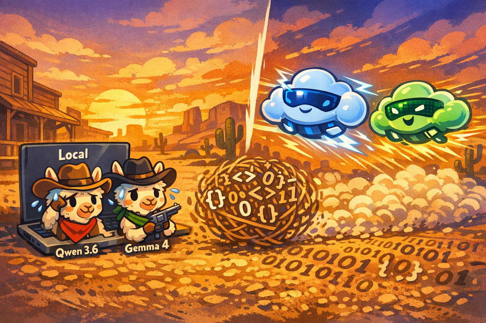
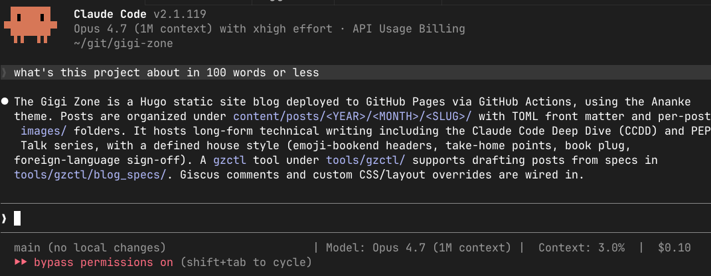
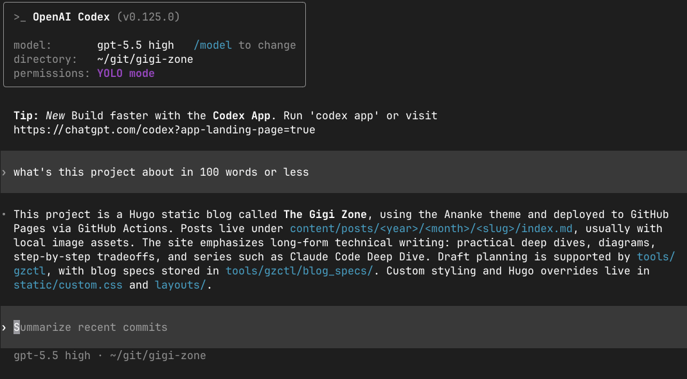
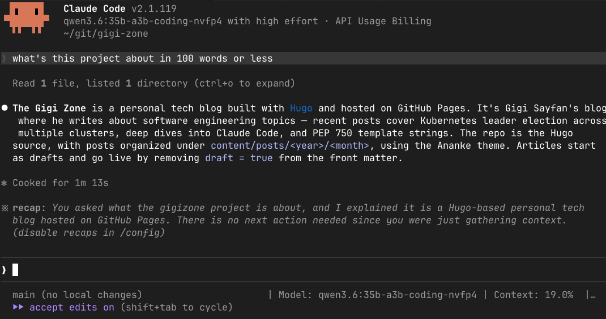
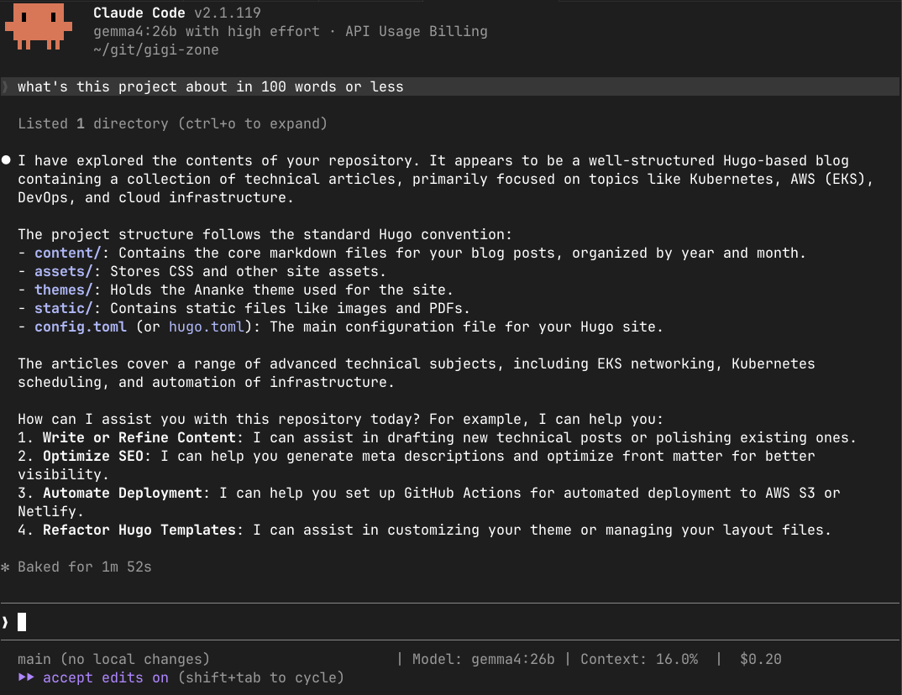
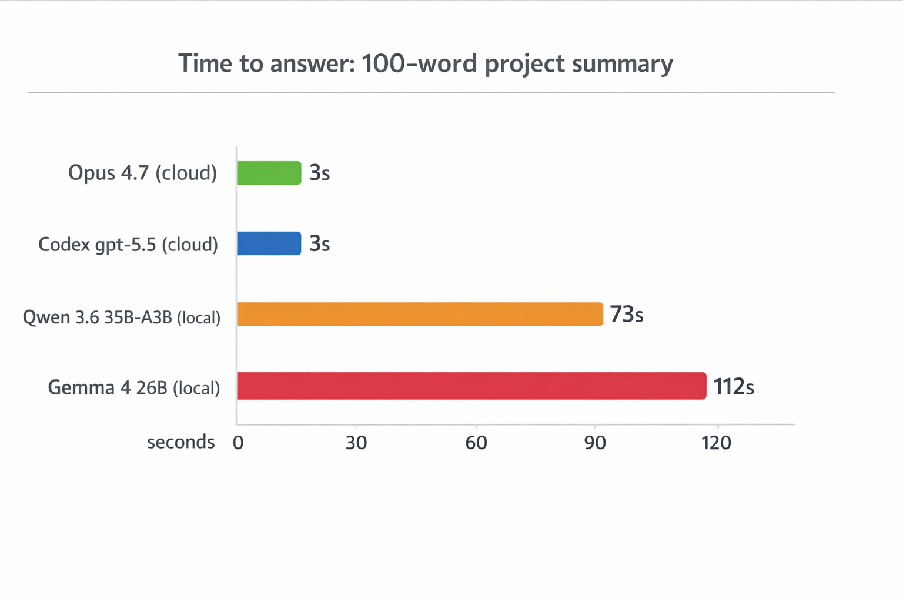
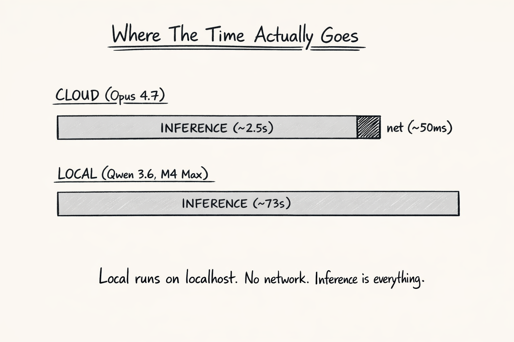
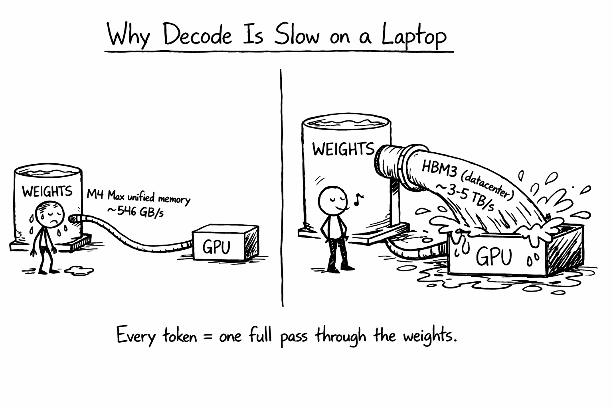
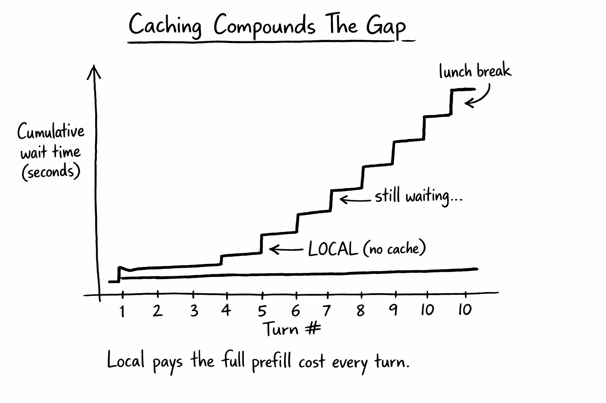

+++
title = 'Claude Code Deep Dive - The Local Showdown'
date = 2026-04-25T10:00:00-08:00
categories = ["Claude", "ClaudeCode", "AICoding", "AIAgent", "LocalModels", "Ollama", "Qwen", "Gemma"]
+++

Local models keep promising the moon 🌙: private, free, offline, and finally smart enough to do real work. With Ollama now speaking the Anthropic Messages API natively, you can point Claude Code itself at a model running on your laptop and skip the cloud entirely 🚀. Two brand-new MoE releases this month, Qwen 3.6 and Gemma 4, are open models with serious agentic and coding ambitions 🤖. So I put them to the test against Claude Code with Opus 4.7 and OpenAI Codex. I gave each model the same simple prompt, and watched what happened 👀.

**"In theory, theory and practice are the same. In practice, they are not."** ~ Benjamin Brewster

<!--more-->



This is *CCDD #16* (Claude Code Deep Dive). Check out the list of previous articles here:
[CCDD series](https://medium.com/@the.gigi/list/5f842373dcaa).

## 🦙 Why Local? 🦙

The pitch for running models on your own machine has been going on for years. There are very good reasons for that. Privacy, because your code, your prompts, and your data never leave your machine. Cost, because there is no API bill at the end of the month. Offline, because a flaky hotel WiFi or flying in the sky shouldn't stop you from shipping. Finally, control. You pick the weights, you pick the version, and the model does not silently change underneath you.

The catch has always been quality and speed. Open models lagged the frontier by a lot. Even when the answers were decent, you had to wait significantly longer. That gap has been closing fast on the quality side. Two new MoE releases this April pushed the pace again, and Ollama added native support for both within hours of release. So the question is no longer "can I run a serious model locally" but "is the experience actually good enough to use day to day."

## 🧠 The New Local Brains 🧠

**Qwen 3.6** 35B-A3B landed on April 15. It is a sparse Mixture of Experts model: 35 billion total parameters sitting in the weights, but the router only activates around 3 billion per token. You get the representational capacity of a 35B model at roughly the compute cost of a 3B one. Apache 2.0. The coding-tuned variant reports 73.4 on SWE-Bench Verified in Qwen's own agent scaffold, which is an impressive number, even if it is not the same thing as an independent public benchmark run. On disk it is about 21 GB at the nvfp4 quantization.

**Gemma** 4 26B dropped earlier in the month, on April 2. Same MoE pattern: 25.2 billion total parameters, 3.8 billion active per token. Apache 2.0, native function calling, vision in the box. About 17 GB on disk. Google designed it explicitly for agentic workflows, which makes it the natural sparring partner for Qwen on a coding task.

Both fit comfortably in the 36 GB unified memory of my M4 Max MacBook Pro. That is the machine I used for everything in this post. If local models feel slow there, the day-to-day laptop experience is still going to be rough for a lot of developers.

## 🔌 Wiring Claude Code to Ollama 🔌

The setup story has changed dramatically. Since Ollama v0.14.0 in January 2026, the local server exposes an Anthropic-compatible Messages API on `localhost:11434`. That is the same protocol Claude Code uses to reach Anthropic's servers. Point Claude Code at the local URL and it just works. No need for a LiteLLM proxy, no translation shim, no clever wrapper. The architecture is now embarrassingly simple.

The normal Ollama recipe is two environment variables and a model flag:

```bash
export ANTHROPIC_AUTH_TOKEN=ollama
export ANTHROPIC_BASE_URL=http://localhost:11434
claude --model qwen3.6:35b-a3b-coding-nvfp4
```

Ollama also ships a one-liner that does the same thing:

```bash
ollama launch claude --model qwen3.6:35b-a3b-coding-nvfp4
```

There is one gotcha that bit me on the first attempt. If you are already logged into a managed Anthropic account (the normal `/login` flow), Claude Code stores credentials in two places: `~/.claude/.credentials.json` and the macOS Keychain. In my normal-mode run, the OAuth credentials were used and `ANTHROPIC_AUTH_TOKEN` plus `ANTHROPIC_BASE_URL` were not enough to redirect the session to Ollama. (Per the Claude Code docs, an explicit `ANTHROPIC_API_KEY` is the env var that overrides subscription auth, so that one would likely have done it. I went straight to `--bare` instead.)

The clean workaround, without nuking your global login, is `--bare` mode. Bare mode skips OAuth and keychain reads, so auth has to come from `ANTHROPIC_API_KEY` instead:

```bash
ANTHROPIC_API_KEY=ollama \
ANTHROPIC_BASE_URL=http://localhost:11434 \
claude --bare --model gemma4:26b
```

`--bare` also drops auto-memory, hooks, plugin sync, and CLAUDE.md auto-discovery. It is minimal mode. For a head-to-head with the harness held constant, that is exactly what you want anyway.

With that out of the way, the test was easy to set up.

## ⚔️ The Showdown ⚔️

I asked the same trivial question to the four contestants, all running inside the gigi-zone repo (this blog's source):

> what's this project about in 100 words or less

Four contestants, two cloud and two local:

- **Claude Code** with **Opus 4.7**, the original Anthropic frontier setup.
- **OpenAI Codex** with **gpt-5.5 high**, in the same directory. Different harness, different vendor, but a useful sanity check.
- **Claude Code** with **Qwen 3.6 35B-A3B** running locally through Ollama.
- **Claude Code** with **Gemma 4 26B** running locally through Ollama.

Identical question. Identical working directory. Identical task complexity: the agent has to glance at a few top-level files, identify the project, and produce a short paragraph. Should be a walk in the park...

## 📊 The Results 📊

Alright. Let's see how they did.

Claude Code with Opus 4.7 answered in 2 to 3 seconds. Under 100 words. Done.



Codex answered in 2 to 3 seconds as well. Under 100 words. Done.



A quick note before the local screenshots. Claude Code still labels the session as "API Usage Billing" when pointed at this Anthropic-compatible endpoint, but the endpoint here was `localhost:11434` (Ollama). No tokens were billed against my Anthropic account in either run.

Qwen 3.6 running locally took **1 minute and 13 seconds** to answer the same question. The answer itself was reasonable, but the latency is in a completely different league.



Gemma 4 running locally took **1 minute and 52 seconds**, and produced a 199-word response, almost double the explicit limit. In this run, that was a clear instruction-following miss. I would not turn one sample into a grand verdict on Gemma, but it is exactly the kind of failure you notice immediately in an agentic workflow.





This is not a benchmark. It is one deliberately tiny prompt, on one laptop. The goal of this blog post is to show how to use Claude Code with local models. But, almost two minutes for a one-paragraph project summary is not just "a bit slow." It is a fundamentally different user experience. You ask a question, you go make coffee, you come back, and the answer is finally there. Multiply that by the dozens of small turns a real agentic session involves and the math gets ugly fast. So, let's understand the why...

## 🐌 Why So Slow? 🐌

Three things stack up to produce that gap, and naming them is more interesting than the timings themselves.

The first is **prefill latency**. Claude Code does not send a one-line prompt. It sends a large agent context: system instructions, loaded CLAUDE.md memory, tool definitions, conversation history, and tool context. The model has to process that whole prefix before emitting a single token. On a 36 GB laptop, that prefill can be seconds of pure compute, even when the MoE model activates only a few billion parameters per token. The cloud providers run this on hardware purpose-built for the job, with batching and parallelism that a single laptop cannot match.

The second is **no prompt caching**. Anthropic's hosted models cache the static prefix (system prompt, tool definitions, repo CLAUDE.md) so subsequent turns skip most of the prefill cost. Ollama's Anthropic-compatible surface does not currently support prompt caching. Every turn pays the full prefill cost from scratch. For agentic workflows where you might do twenty turns in a single session, that compounds badly.

The third is **MoE doesn't erase memory pressure**. The 3B-active number is fantastic for inference throughput once tokens start flowing, but the full 25 to 35 billion parameter weight set still has to be resident somewhere, because the router can pick different experts for different tokens. So a 3B-active MoE still has roughly the weight-memory footprint of a model with 25 to 35 billion total parameters, plus runtime overhead. On a 36 GB Mac, that competes with your IDE, your browser, and your terminal for the same unified memory. The "small model speed" only kicks in after you have paid the "big model memory" tax.

None of this is fundamental. Prompt caching can land in Ollama. Apple Silicon prefill can get faster. New quantization can shrink the working set. But as of this April 2026 run on my 36 GB M4 Max, two minutes for a 100-word answer was the reality.

## 🌐 But What About Network Round-Trips? 🌐

Reasonable intuition: cloud has to cross the internet, local does not, so local should win, especially with multiple tool calls per turn. The intuition is wrong, and it is worth seeing why.

### Network Is a Rounding Error

A round-trip to Anthropic is 20 to 100 ms. Inference is seconds. The network slice barely shows up.



### Bandwidth Is the Real Bottleneck

Decode speed is gated by how fast the chip can stream weights through memory. M4 Max unified memory is around 546 GB/s. Datacenter HBM3 is 3 to 5 TB/s. Roughly 6 to 10x. Every generated token feels that gap.



### Caching Widens the Gap Each Turn

Cloud caches the system prompt, CLAUDE.md, and tool definitions after the first turn. Local pays the full prefill from scratch every single turn. Over twenty turns of a real session, the gap goes from "annoying" to "unusable."



So multi-tool turns make local *worse*, not better. Each tool call is its own inference call. Local pays the heavy inference cost on every one of them, while the saved network leg is a few milliseconds you cannot feel.

## 🎬 Curtain Call 🎬

This is the last CCDD post. Sixteen installments in, the series has covered the parts of Claude Code I wanted to cover: the harness, the SDK, hooks, plugins, MCP, sub-agents, rivals, and now the local-model frontier. Claude Code keeps shipping at an insane pace, but the foundations are well documented now, and at some point a series has to know when to bow out.

I may post additional CCDD installments at some point, but it's not going to be a regular weekly thing from now on.

## 🏠 Take Home Points 🏠

- Ollama since v0.14.0 speaks the Anthropic Messages API natively, so Claude Code can drive a local model with no proxy. Normal mode is a couple of env vars; bare mode uses `ANTHROPIC_API_KEY`.
- The auth gotcha is real: managed `/login` credentials override environment variables. Use `claude --bare` to bypass keychain reads without nuking your global login.
- Qwen 3.6 35B-A3B and Gemma 4 26B are two prominent new open MoE models with agentic and coding ambitions, as of April 2026. Both fit on my 36 GB M4 Max with room to breathe.
- For a trivial "summarize this project" question, cloud frontier models answered in 2-3 seconds. The same question took 73 seconds (Qwen) and 112 seconds (Gemma) locally. Gemma also ignored the explicit 100-word limit.
- The slowdown comes from prefill cost, no prompt caching in the local Anthropic-compat surface, and MoE memory pressure. Each is fixable in principle, but the gap today is enormous.
- Local models are now possible for privacy-mandated or offline workflows. For my everyday agentic coding workflow, this run was still too slow to feel practical.

If you enjoyed this post, check out my book where I build an agentic AI framework from scratch with Python:

📖  [Design Multi-Agent AI Systems Using MCP and A2A](https://www.amazon.com/Design-Multi-Agent-Systems-Using-MCP/dp/1806116472)

🐟 So Long, and Thanks for All the Fish 🐟
