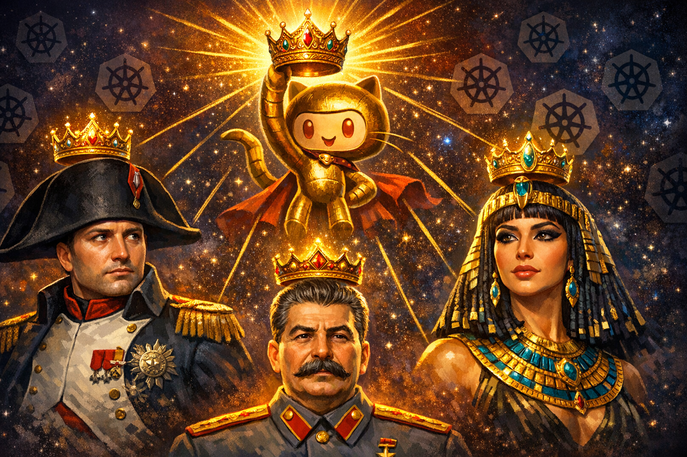
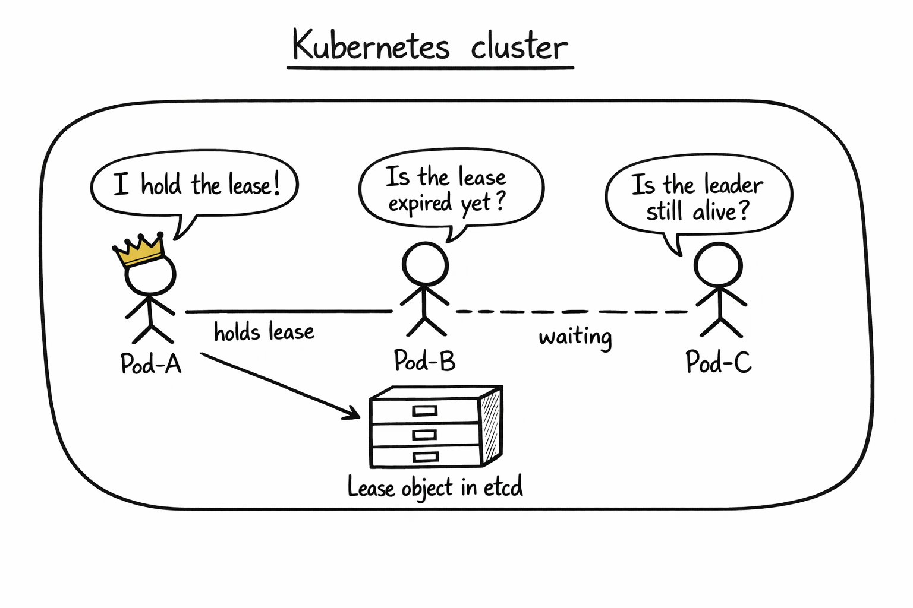
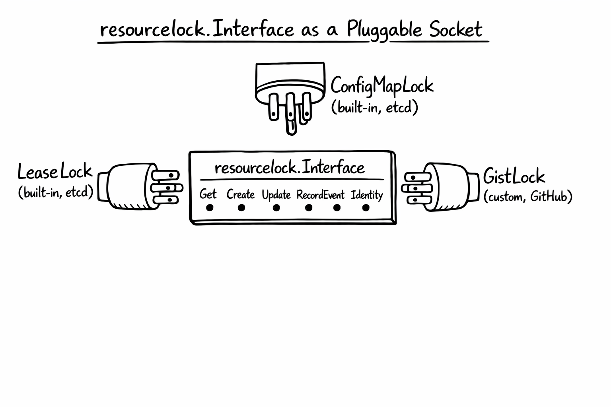
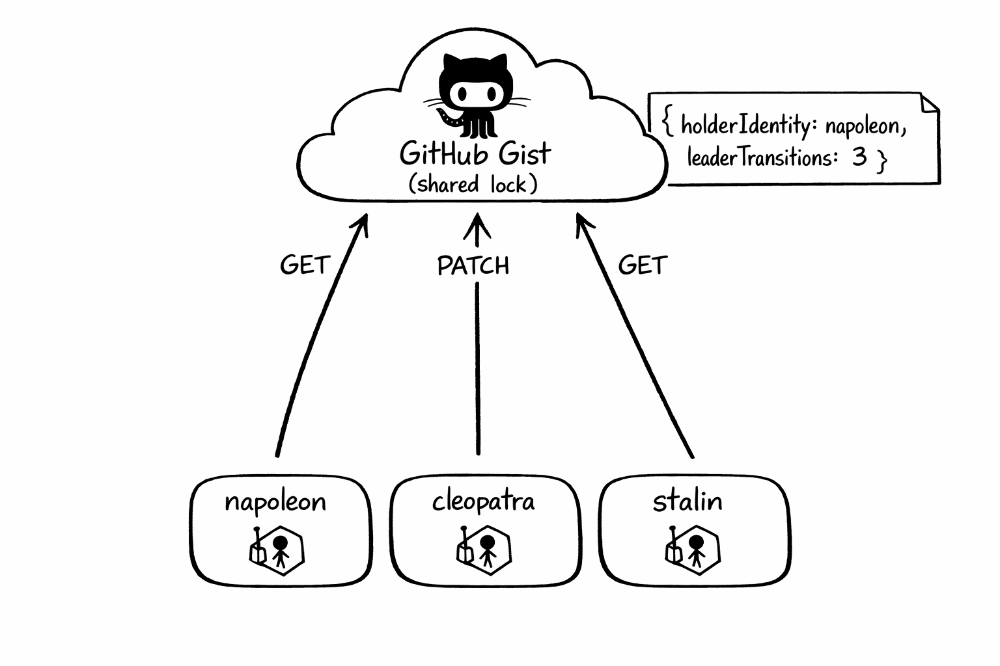
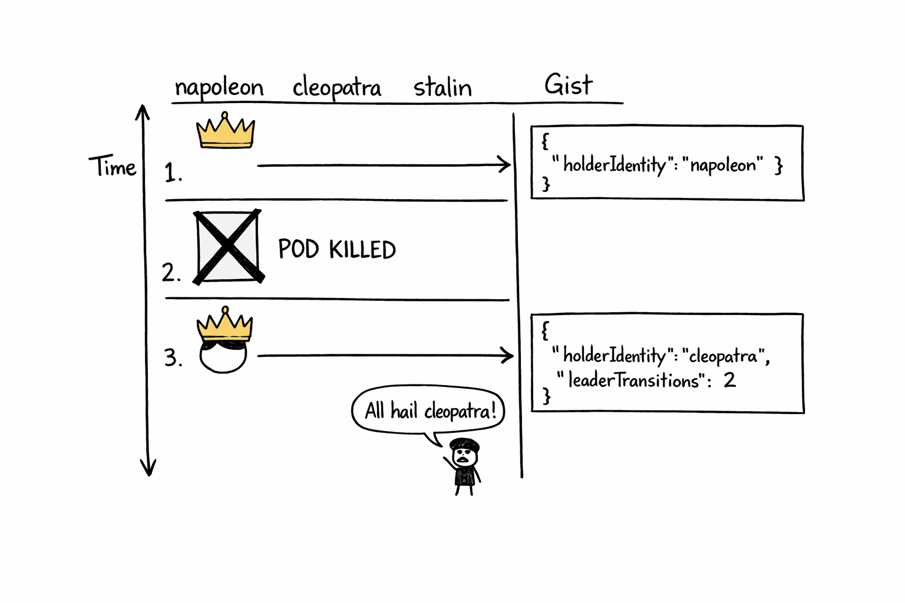

+++
title = 'Kubernetes Leader Election Across Multiple Clusters'
date = 2026-04-20T10:00:00-08:00
categories = ["Kubernetes", "LeaderElection", "HighAvailability", "MultiCluster", "Go"]
+++

Leader election is a cool distributed systems pattern where you have a critical singleton workload that if it goes down you want a replacement to come up ASAP 🔁, so you have a couple of standby instances ready to take over if the primary fails or is unresponsive. Coordinating this process and safely promoting one of the standby instances to primary is not trivial. Kubernetes ☸️ in its infinite wisdom provides a solid implementation via its `client-go` library. That works out of the box within a cluster with a couple of dedicated lock providers. But what if the failure domain you are worried about is the entire cluster? 🌍 Now you need a distributed lock that lives somewhere multiple clusters can see. 

**"There can be only one." ~ Highlander**

<!--more-->



In this article we will cover the conceptual underpinnings of leader election in general, explore the builtin single-cluster leader election implementation in Kubernetes and then move to the esoteric world of multi-cluster leader election. Strap in!

The whole thing is on GitHub, demo and all: [the-gigi/k8s-multi-cluster-leader-election](https://github.com/the-gigi/k8s-multi-cluster-leader-election). The custom lock itself (a reference example, not a production tool) lives next door in [the-gigi/go-k8s/examples/gist_lock](https://github.com/the-gigi/go-k8s/tree/main/examples/gist_lock).

A quick heads up before we dig in. I am going to build up to a GitHub Gist acting as a distributed lock, and it works beautifully as a demo. It is also absolutely not something you should run in production. I will tell you exactly why, and what you should run instead, in a little bit. The Gist is a teaching device: it strips the problem down to "any HTTP-accessible key/value store with compare-and-set is enough", which is the insight that lets you build a real one against the store you already have.

## 👑 Why Leader Election Exists 👑

Stateless replicas are boring in the best way. Every pod can serve every request. You scale horizontally, load balancers round-robin across them, nothing coordinates anything.

Then one day you have work that must not double-run. A controller that reconciles state. A cron-like job that kicks off a nightly billing run. A singleton consumer of a queue that does not tolerate duplicate processing. A database migration that would melt if two pods tried it at once.

You could just have a single pod with a restart policy of `Always`, but that's not robust enough. If that pod goes down, it might not restart at all, or at least not fast enough if the cluster is already having a bad day or its node just crashed. Then you are stuck waiting for the cluster autoscaler to provision a new node.  

You want *exactly one* pod, at any given moment, to be "the leader" doing the work. If that pod dies, a standby should promote itself within a few seconds and pick up where the old one left off. That is leader election: all pods run, all compete for a shared lock, exactly one wins, the others wait politely.

It is a small problem with a surprisingly deep tail. Two pods thinking they are both leader is called split-brain, and it is the nightmare scenario. Avoiding it under arbitrary network failures is what consensus algorithms like Raft and Paxos exist to solve.

## 🏛️ The Happy Path (Inside One Cluster) 🏛️

Inside a single Kubernetes cluster you usually do not have to build leader election yourself. `client-go` ships a [`leaderelection`](https://pkg.go.dev/k8s.io/client-go/tools/leaderelection) package that runs over a pluggable lock interface, and the standard in-cluster lock is a Kubernetes `Lease` object. In a typical cluster that `Lease` is stored by the API server in etcd-backed storage, and HA control-plane components such as `kube-controller-manager` and `kube-scheduler` use this mechanism to keep one active leader at a time. Strictly speaking, this is coordination rather than a fencing guarantee.



Three pods all run the same code. They all ask Kubernetes "who is the leader?", which really means "let me read this `Lease` object through the API server". If no one holds a valid lease, one of them wins an optimistic-concurrency update to become leader and starts doing work. It keeps renewing the lease on a timer. If the leader dies and stops renewing, the lease expires, and one of the standbys grabs it on the next poll.

Here is the shape of it in Go, with most of the ceremony cut out:

```go
lock := &resourcelock.LeaseLock{
    LeaseMeta: metav1.ObjectMeta{Name: "my-app", Namespace: "default"},
    Client:    kubeClient.CoordinationV1(),
    LockConfig: resourcelock.ResourceLockConfig{Identity: podName},
}

leaderelection.RunOrDie(ctx, leaderelection.LeaderElectionConfig{
    Lock:          lock,
    LeaseDuration: 60 * time.Second,
    RenewDeadline: 30 * time.Second,
    RetryPeriod:   10 * time.Second,
    Callbacks: leaderelection.LeaderCallbacks{
        OnStartedLeading: func(ctx context.Context) { doRealWork(ctx) },
        OnStoppedLeading: func()                    { shutDownGracefully() },
        OnNewLeader:      func(id string)           { log.Printf("leader is now %s", id) },
    },
})
```

Three callbacks cover the entire lifecycle. `OnStartedLeading` fires when you acquire the lease: start doing the real work here. `OnStoppedLeading` fires when you lose it: shut down cleanly. `OnNewLeader` fires on every transition, yours or someone else's, and is useful mostly for logging and observability.

Three durations control how the dance looks. `LeaseDuration` is how long a lease is considered valid from the last renewal. `RenewDeadline` is how long the current leader has to successfully renew before it gives up and steps down voluntarily (smaller than `LeaseDuration` so there is always a safety margin). `RetryPeriod` is how often everyone polls: leader attempts to renew, candidates check whether they can acquire. They must satisfy `RetryPeriod < RenewDeadline < LeaseDuration`. From there, you tune for your tolerance of API latency, clock skew rate, and failover speed rather than chasing a magic ratio.

That is it. If you do not care about surviving cluster-wide failures, stop reading and go ship. This is a solved problem.

## 🔌 The Seam (resourcelock.Interface) 🔌

The interesting part, and the reason this post exists, is that the `leaderelection` package does not hard-code `LeaseLock`. It accepts anything that implements a small interface:

```go
type Interface interface {
    Get(ctx context.Context) (*LeaderElectionRecord, []byte, error)
    Create(ctx context.Context, ler LeaderElectionRecord) error
    Update(ctx context.Context, ler LeaderElectionRecord) error
    RecordEvent(string)
    Identity() string
    Describe() string
}
```

Six methods. Three of them are essentially metadata (`RecordEvent`, `Identity`, `Describe`). The real contract is just `Get`, `Create`, `Update`. The `LeaderElectionRecord` is a tiny struct with fields like `HolderIdentity`, `LeaseDurationSeconds`, `AcquireTime`, `RenewTime`, and `LeaderTransitions`. That is the entire state of a leader election.

The built-in implementations (`LeaseLock`, `ConfigMapLock`, `EndpointsLock`) store their coordination state in Kubernetes objects, and in a typical cluster those objects live in etcd-backed storage behind the API server. But the interface itself does not know about etcd. It does not know about Kubernetes. It is just Get, Create, Update against some shared place to store a small JSON record.



That is the seam. Anything you can read from and write to, with some notion of "I wrote before you did", can serve as a leader election lcok. A database row. An object in S3. A key in Consul. A file in a shared volume. Even a GitHub Gist!

## 📝 The Github Gist Trick 📝

A GitHub Gist is a tiny versioned text file with an authenticated HTTP API in front of it. You can GET it and you can PATCH it, which is enough to build a **demo** implementation of `resourcelock.Interface` that any pod with internet access can participate in, regardless of which cluster or region it runs in. Important caveat: GitHub's Gist API does not expose a real conditional-write primitive for PATCH, so this is useful as a teaching device and a worked example of the interface seam, not as a production-grade lock.



The implementation is almost embarrassingly small. `Get` fetches the Gist, parses the JSON, returns the record. `Update` PATCHes new JSON. `Create` is `Update` with no preconditions. Because Gist updates are last-writer-wins, the example re-reads after takeover attempts to detect races after the fact. Again: great for demonstrating the shape of a custom lock, not the semantics you want in production. The state stored in the Gist is still the same JSON that `LeaseLock` stores in a `Lease` object, because the structure comes from the `leaderelection` package itself.

```json
{
  "holderIdentity": "napoleon",
  "leaseDurationSeconds": 60,
  "acquireTime": "2026-04-20T05:02:36Z",
  "renewTime": "2026-04-20T05:12:39Z",
  "leaderTransitions": 2
}
```

`holderIdentity` is whoever currently holds the lease. `renewTime` is the last time the leader refreshed it. `leaseDurationSeconds` tells candidates how long to wait before considering the lease expired. `leaderTransitions` increments every time leadership changes hands, which is the easiest thing to watch when you are eyeballing a demo.

The implementation is in [go-k8s/examples/gist_lock](https://github.com/the-gigi/go-k8s/tree/main/examples/gist_lock). The `GistClient` handles HTTP and GitHub-specific niceties (more on those below). The `gistLock` glues the client to the `resourcelock.Interface` shape. Between them, maybe 250 lines of Go.

## 🎬 Running the Demo 🎬

The full demo is in [the leader-election repo](https://github.com/the-gigi/k8s-multi-cluster-leader-election). It uses [vcluster](https://www.vcluster.com) to spin up three virtual Kubernetes clusters inside a single [kind](https://kind.sigs.k8s.io) cluster, which makes the "multi-cluster" part fast and cheap on a laptop. Each virtual cluster runs the same leader-elector pod, named after a world-historical figure with strong opinions about being in charge: Napoleon, Cleopatra and Stalin.

One kind cluster. Three vclusters. Three pods. One Gist. No other infrastructure. No need to pay anyone to run the demo :-)

The workflow is `make provision` (create kind + vclusters), `make deploy` (helm-install the leader-elector into each vcluster), `make check-leader` (tail the logs). If you want to run it yourself the README walks through the credentials you need (a GitHub personal access token with `gist` scope) and a couple of tools you need installed.

Once the three pods are running, one of them wins the lease almost immediately and the other two acknowledge the new reality:

```
$ make check-leader
---------------
napoleon logs
---------------
I0420 07:08:53.779895       1 leaderelection.go:258] "Attempting to acquire leader lease..." lock="Github gist lock: napoleon"
I0420 07:08:54.062770       1 main.go:34] All hail stalin

---------------
cleopatra logs
---------------
I0420 07:08:54.297322       1 leaderelection.go:258] "Attempting to acquire leader lease..." lock="Github gist lock: cleopatra"
I0420 07:08:54.567350       1 main.go:34] All hail stalin

---------------
stalin logs
---------------
I0420 07:08:54.932387       1 leaderelection.go:258] "Attempting to acquire leader lease..." lock="Github gist lock: stalin"
I0420 07:08:56.421073       1 leaderelection.go:272] "Successfully acquired lease" lock="Github gist lock: stalin"
I0420 07:08:56.421377       1 main.go:31] I am stalin! I will lead you to greatness!
I0420 07:08:56.421409       1 main.go:24] started leading.
```

All three pods attempt to acquire at essentially the same moment. Stalin's write lands in the Gist first, so the other two see stalin's record on their next poll and settle into "all hail" mode. The whole sequence plays out in under three seconds. The Gist itself looks like this:

```
$ gh gist view 49602e14c52b53a41862a174b629c7b2

{
  "holderIdentity":"stalin",
  "leaseDurationSeconds":60,
  "acquireTime":"2026-04-20T07:08:56Z",
  "renewTime":"2026-04-20T07:13:24Z",
  "leaderTransitions":3
}
```

`leaderTransitions` is cumulative across demo runs and only resets when the Gist content is manually reset: every time a *different* identity takes the lock it bumps by one, so the `3` here reflects earlier test cycles this afternoon plus this new acquisition. The same-identity re-acquisition that happens when a pod restarts does *not* count as a transition.

Every renewal bumps `renewTime`. Candidates keep reading that field. As long as it stays fresh, they sit still.

## 🔄 Failover in Action 🔄

The fun test: kill stalin.

```
$ kubectl delete deploy leaderelection --context vcluster_stalin_stalin_kind-leader-election-demo
deployment.apps "leaderelection" deleted
```

Stalin stops renewing. The lease keeps being "valid" until `LeaseDuration` seconds past the last renewal. Napoleon and cleopatra keep polling. The instant the lease expires, whichever of them is next to poll notices, tries to write itself as the new holder, and one wins.



A minute or so later:

```
$ gh gist view 49602e14c52b53a41862a174b629c7b2

{
  "holderIdentity":"cleopatra",
  "leaseDurationSeconds":60,
  "acquireTime":"2026-04-20T07:14:42Z",
  "renewTime":"2026-04-20T07:14:52Z",
  "leaderTransitions":4
}
```

`leaderTransitions` ticked up. The new `acquireTime` is fresh. Cleopatra's pod logs show "I am cleopatra! I will lead you to greatness!" and napoleon's pod logs "All hail cleopatra". To be clear - Cleopatra and Napoleon are running in *different virtual Kubernetes clusters*. Nothing about their pod-to-pod coordination is Kubernetes-native. The only thing they share is access to same shared lock.

That is the whole trick. Leader election crossed a cluster boundary because the lock was not in any cluster.

## 🚫 Why You Should NOT Use This in Production 🚫

The Gist lock is awesome for demos and terrible for production for a couple of reasons:

**GitHub becomes part of your HA story.** If `api.github.com` is having a bad afternoon, your leader cannot renew, the lease eventually expires, and everyone starts thrashing trying to acquire it. You just made GitHub's uptime a direct factor in your own. That is a strictly worse situation than where you started.

**Rate limits.** Authenticated GitHub calls are capped at 5000 requests/hour, which sounds generous until you realize three pods renewing every few seconds add up. Worse, GitHub has a second layer of rate limiting they call [secondary rate limits](https://docs.github.com/en/rest/using-the-rest-api/rate-limits-for-the-rest-api#about-secondary-rate-limits), which trip on *patterns* rather than volume. A published ceiling is "no more than 500 content-generating requests per hour" to one endpoint. A leader renewing once every 5 seconds is 720 PATCHes per hour to a single Gist. Demo: fine. Sustained: the secondary limiter notices, you get 403s for 20-plus minutes, everything grinds. (The demo's current intervals are 60/30/10 specifically to stay well under this ceiling.)

**Auth hygiene is awkward.** The minimum permission to write a Gist is the `gist` OAuth scope on a personal access token, which is broader than you want a service to carry. Rotating, scoping, and auditing that is more pain than it should be for what is essentially "write a JSON blob".

Let's see what options you have in production.

## 🏗️ What to Actually Use 🏗️

Here is the principle that matters far more than any specific recommendation. **If you are running a cross-cluster distributed system, you already have a globally consistent store of some kind.** A database your regions share. An object store. A service-discovery system. A secrets backend. Something. It is on your runbook, your oncall rotation, your monitoring dashboards, your security review. Adding leader election to it costs you essentially nothing operationally, because the thing is already there and already operated.

Standing up a *new* system just for leader election is an anti-pattern. More infrastructure to run. More things that can fail. More paging. More cost. All so you can pick one pod across a few clusters. So, just use the thing you already have. It can be Google Spanner, Azure CosmosDB, AWS DynamoDB or even cloud storage like S3.

## 🏠 Take Home Points 🏠

- Leader election is "exactly one pod at a time does this work"; use it for controllers, singleton consumers, cron-like jobs, anything that must not double-run.
- Inside one Kubernetes cluster, `client-go`'s `leaderelection` with `LeaseLock` is a five-minute solution.
- `resourcelock.Interface` is a six-method seam; any store with compare-and-set can implement it.
- A GitHub Gist can host a demo lock and prove the seam is real, but it is not a production-grade locking backend.
- For real cross-cluster leader election, reach for the globally consistent store you *already operate* (Spanner, Cosmos DB, DynamoDB one-region, etcd, Consul, CockroachDB, Postgres advisory locks, and so on). Don't introduce new infrastructure just for this.

If you enjoyed this post, and you want to level up your Kubernetes game check out my book where I build an agentic AI framework from scratch with Python and use it to create multi-agent Kubernetes DevOps system.

📖  [Design Multi-Agent AI Systems Using MCP and A2A](https://www.amazon.com/Design-Multi-Agent-Systems-Using-MCP/dp/1806116472)

🇮🇹 Arrivederci amici miei! 🇮🇹
