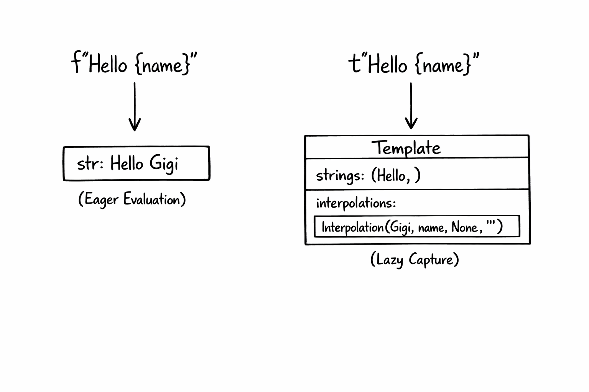
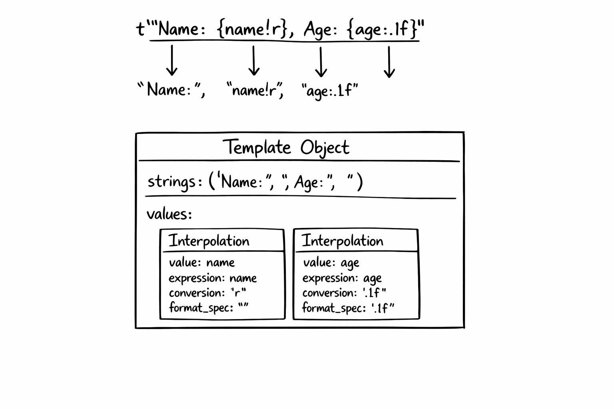

+++
title = 'PEP Talk #2 - PEP 750: Template Strings'
date = 2026-04-03T10:00:00-08:00
categories = ["Python", "PEP", "Template Strings"]
+++

One of the most common activities in any program is constructing text from dynamic values 🐍. Think formatting log
messages, constructing SQL queries, and preparing display messages for the user 🧵. Python started with the most basic
%x formatting (printf-like) and evolved evermore sophisticated ways to do it. Python 3.14 is bringing us the latest
technology in the form of template strings ✨. Keep reading to learn about the power of the new t-strings and worry a
little less about XSS when interpolating user input into HTML 🛡️.

**"Explicit is better than implicit." -- The Zen of Python, PEP 20**

<!--more-->


This is the second post in the **PEP Talk** series, where I pick an interesting Python Enhancement Proposal (PEPs) and
explore it in depth.

1. [PEP Talk #1 - PEP 723: Inline Script Metadata](https://medium.com/gitconnected/pep-talk-1-pep-723-inline-script-metadata-51e1ca1b4a5c)
2. PEP Talk #2 - PEP 750: Template Strings (this post)

## 📜 Where Did we Come From? 📜

Python has accumulated five distinct ways to format strings over its lifetime, which is a spectacular violation of the
Zen
of Python's principle that "There should be one, and preferably only one, obvious way to do it." But here we are. Each
approach arrived because the previous one didn't address some important use cases in a safe and ergonomic way, and none
were ever removed because backwards compatibility
is sacred (ignore this little thing about the Python 2 to Python 3 migration). Let's walk through the progression.

- 🟥 **% formatting (Python 1.x, 1991)** was there from the very beginning, borrowed directly from C's `printf`. You
  write `"Hello %s, you are %d years old" % (name, age)` and it works. The syntax is terse, the positional nature of
  the arguments makes it error-prone, and complex formatting turns into a puzzle of `%03.2f` incantations. But it got
  the job done for years, and you can still find it all over legacy codebases.

- 🟨 **string.Template (Python 2.4, 2004, PEP 292)** took a different approach entirely. Instead of printf-style codes,
  it uses shell-style `$name` placeholders: `Template("Hello, $name!").substitute(name="Gigi")`. It was designed to
  be simpler and safer for cases where untrusted users supply the template (think i18n files or config templates). The
  tradeoff was power: no expressions, no format specs, just plain name substitution.

- 🟦 **str.format() (Python 2.6/3.0, 2008, PEP 3101)** was the big modernization push. `"Hello, {}! You are {age}
  years old".format(name, age=age)` introduced positional and keyword arguments, attribute access, indexing, and format
  specs all in one system. It was more readable than `%` and more powerful than `Template`. For a while it was "the"
  way to format strings in Python. It was pretty cumbersome though.

- 🟩 **f-strings (Python 3.6, 2016, PEP 498)** made everyone forget about `.format()` overnight. `f"Hello, {name}!"`
  puts the expressions right where they belong, inline with the text. They're faster (compiled, not parsed at
  runtime), more readable, and cover virtually every formatting need. They quickly became the default choice for the
  vast majority of Python string formatting.

- 🟪 **t-strings (Python 3.14, 2025, PEP 750)** are the newest addition, and the subject of this post. They look
  identical to f-strings but produce a `Template` object instead of a `str`, keeping the structure intact for
  processing. Let's dive in!

## 🎯 The Problem with f-strings 🎯

f-strings are one of Python's best features. They're readable, fast, and intuitive. I love them. But they have a fundamental
limitation: they evaluate eagerly and produce a plain `str` immediately. There's no way to intercept the interpolated
values before they become part of the final string.

Most of the time this is exactly what you want. But consider this:

```python
user_input = "Robert'; DROP TABLE students;--"
query = f"SELECT * FROM students WHERE name = '{user_input}'"
```

That f-string happily bakes the SQL injection right into the query string. By the time you have the result, the damage
is done. The values and the template are fused together, and there's no going back.

The same problem shows up with HTML. If `user_input` contains `<script>alert('xss')</script>`, an f-string will dump it
straight into your markup without escaping.

The core issue is that f-strings don't give you a chance to process the values before they're interpolated. You get the
final string or nothing. For contexts like SQL, HTML, shell commands, and structured logging, you need to treat the
static parts and the dynamic values differently. f-strings simply can't do that.

## 🏚️ Wait, Doesn't Python Already Have Templates? 🏚️

Yes! Python has had `string.Template` since version 2.4. It does `$`-placeholder substitution on plain strings:

```python
from string import Template

t = Template("Hello, $name!")
result = t.substitute(name="Gigi")
# "Hello, Gigi!"
```

This gives you lazy evaluation and control over substitution. So why do we need PEP 750?

Because `string.Template` is quite limited. It only does simple `$name` substitutions. It has no access to the actual
Python objects, just their string representations passed as keyword arguments. There's no expression support, no format
specs, no conversion flags. You can't write `${price:.2f}` or `${items!r}`. It's a blunt instrument for a job that often
requires precision.

PEP 750's `Template` (from `string.templatelib`) is a completely different beast. It's a language-level feature that
captures real Python values with full expression syntax. The naming overlap is unfortunate (both are called "Template"),
but that's where the similarity ends.

## 🔤 Enter t-strings 🔤

A t-string looks exactly like an f-string, but with a `t` prefix instead of `f`:

```shell
❯ uv run --python 3.14 python 
Python 3.14.2 (main, Dec  5 2025, 16:49:16) [Clang 17.0.0 (clang-1700.4.4.1)] on darwin
Type "help", "copyright", "credits" or "license" for more information.
>>> name = "Gigi"
>>> f"Hello, {name}!"
'Hello, Gigi!'

>>> t"Hello, {name}!"
Template(strings=('Hello, ', '!'), interpolations=(Interpolation('Gigi', 'name', None, ''),)) 
```

That's the entire syntax. If you know f-strings, you know t-strings. The difference is what happens under the hood. An
f-string evaluates everything and returns a `str`. A t-string captures everything and returns a `Template` object,
keeping the static string parts and the interpolated values separate.



This means the values are available for inspection, transformation, escaping, or whatever processing you need before you
produce the final string. The template is a structured intermediate representation, not a finished product.

## 🔬 Template Anatomy 🔬

A `Template` object (from `string.templatelib`) has three key attributes: `strings`, `interpolations`, and `values`.

`strings` is a tuple of the static text segments. `interpolations` is a tuple of `Interpolation` objects, one for each
`{...}` expression in the t-string. `values` is a convenience property that returns just the raw evaluated objects,
without the metadata that `Interpolation` wraps around them.

Each `Interpolation` carries four pieces of information: `value` (the evaluated Python object), `expression` (the source
text of the expression), `conversion` (like `!r`, `!s`, or `!a`), and `format_spec` (like `:.2f`).

Let's explore a concrete example. You can follow along if you have Python 3.14 installed (I recommend `uv run --python 3.14 python` if you use uv):

```shell
>>> name = "Gigi"
>>> age = 30
>>> template = t"Name: {name!r}, Age: {age:.1f}"
```

The `strings` attribute holds the static text segments, `interpolations` holds the full `Interpolation` objects, and
`values` gives you just the raw Python objects:

```shell
>>> template.strings
('Name: ', ', Age: ', '')

>>> template.interpolations
(Interpolation('Gigi', 'name', 'r', ''), Interpolation(30, 'age', None, '.1f'))

>>> template.values
('Gigi', 30)
```



Notice how `strings` always has exactly one more element than `interpolations`. Think of it like a fence: the strings are
the posts and the interpolations are the panels between them. A fence with two panels always has three posts. This
invariant holds even when there's no static text at all:

```shell
>>> directory = "/usr/local/"
>>> filename = "bin"
>>> t"{directory}{filename}".strings
('', '', '')
>>> t"{directory}{filename}".interpolations
(Interpolation('/usr/local/', 'directory', None, ''), Interpolation('bin', 'filename', None, ''))
```

Three "posts" (all empty strings), two "panels." This regularity is deliberate. It means processing code can always
alternate between static and dynamic parts in a simple loop without special-casing templates that start with an
interpolation or have two interpolations back-to-back. The empty strings are just no-ops in the output.

Each `Interpolation` preserves the original Python object, not its string representation. You can dig into the individual
fields:

```shell
>>> template.interpolations[0].value
'Gigi'
>>> template.interpolations[0].expression
'name'
>>> template.interpolations[0].conversion
'r'
>>> template.interpolations[1].format_spec
'.1f'
>>> type(template.interpolations[1].value)
<class 'int'>
```

That `30` is still an `int`, not the string `"30"`. This is what makes t-strings so powerful: you can apply type-aware
transformations.

When do you use `interpolations` vs `values`? If you need the metadata (the expression text, conversion flags, or format
specs) use `interpolations`. This is the common case for template processors like SQL parameterizers or HTML escapers,
where you're walking the template structure and transforming each piece. If you just need the raw objects and don't care
about the metadata, `values` is a cleaner shortcut. For example, passing the values straight to a database driver's
parameterized query: `cursor.execute(query_string, template.values)`.

## 🌍 Real-World Use Cases 🌍

The separation of template and interpolations unlocks several important patterns.

### SQL Parameterization

This is the poster child for t-strings. Instead of string concatenation (which invites injection), you can write a
function that converts a t-string into a parameterized query and then pass the result to a DB-API cursor:

```python
from string.templatelib import Template


class DemoCursor:
    def execute(self, query: str, params: list):
        self.last_call = (query, params)


def sql(template: Template) -> tuple[str, list]:
    parts = []
    params = []
    for i, s in enumerate(template.strings):
        parts.append(s)
        if i < len(template.interpolations):
            parts.append("?")
            params.append(template.interpolations[i].value)
    return "".join(parts), params


cursor = DemoCursor()
user_input = "Gigi'; DROP TABLE students;--"
query, params = sql(t"SELECT * FROM students WHERE name = {user_input}")
cursor.execute(query, params)
# query:  "SELECT * FROM students WHERE name = ?"
# params: ["Gigi'; DROP TABLE students;--"]
# cursor.last_call: ("SELECT * FROM students WHERE name = ?", ["Gigi'; DROP TABLE students;--"])
```

The malicious input is safely isolated as a parameter. When the database driver executes `cursor.execute(query, params)`,
it treats the value as data instead of executable SQL.

### HTML Escaping

Same idea for preventing XSS:

```python
from html import escape
from string.templatelib import Template


def html(template: Template) -> str:
    parts = []
    for i, s in enumerate(template.strings):
        parts.append(s)
        if i < len(template.interpolations):
            parts.append(escape(str(template.interpolations[i].value)))
    return "".join(parts)


user_input = "<script>alert('xss')</script>"
safe_html = html(t"<p>Welcome, {user_input}!</p>")
# "<p>Welcome, &lt;script&gt;alert(&#x27;xss&#x27;)&lt;/script&gt;!</p>"
```

The interpolated values get HTML-escaped automatically. The static parts pass through untouched because you wrote them,
so they're trusted.

### Logging with Redaction

Because `Interpolation` objects carry the expression name, you can build a logger that automatically redacts sensitive
fields:

```python
from string.templatelib import Template

SENSITIVE_FIELDS = {"password", "ssn", "token", "credit_card"}


def log_redacted(template: Template) -> str:
    parts = []
    for i, s in enumerate(template.strings):
        parts.append(s)
        if i < len(template.interpolations):
            interp = template.interpolations[i]
            if interp.expression in SENSITIVE_FIELDS:
                parts.append("***REDACTED***")
            else:
                parts.append(str(interp.value))
    return "".join(parts)


user = "Gigi"
password = "hunter2"
print(log_redacted(t"User {user} logged in with password {password}"))
# User Gigi logged in with password ***REDACTED***
```

With an f-string, "hunter2" would already be baked into the message. With a t-string, the logger sees that the variable
is called `password`, matches it against the sensitive fields set, and redacts it before it ever hits the log output.

### Internationalization

For i18n, the template structure lets you extract translatable strings (the static parts) while preserving the
interpolation points:

```python
from string.templatelib import Template


translations = {
    "Hello, ": "Bonjour, ",
    "! You have ": "! Vous avez ",
    " new messages.": " nouveaux messages.",
}


def translate(template: Template) -> str:
    parts = []
    for i, s in enumerate(template.strings):
        parts.append(translations.get(s, s))
        if i < len(template.interpolations):
            parts.append(str(template.interpolations[i].value))
    return "".join(parts)


name = "Gigi"
count = 5
result = translate(t"Hello, {name}! You have {count} new messages.")
# "Bonjour, Gigi! Vous avez 5 nouveaux messages."
```

The static strings serve as translation keys. The interpolated values stay as-is. No special placeholder syntax needed.

A caveat: real-world i18n is far more involved than this. Languages differ in word order, so a translation might need the
interpolations rearranged. Some languages have right-to-left text. Pluralization rules vary wildly (English has two forms,
Arabic has six). This example shows the basic idea of how t-strings give i18n tools structured access to the template, but
a production system would need a proper framework like ICU MessageFormat on top of it.

## 🔧 Processing Templates 🔧

The common pattern for consuming a `Template` is to iterate over `strings` and `interpolations` in lockstep. Since `strings`
always has exactly one more element than `interpolations`, you can zip them together with a trailing string:

```python
from string.templatelib import Template


def your_transform(value) -> str:
    return f"<{value}>"


def process(template: Template) -> str:
    parts = []
    for i, s in enumerate(template.strings):
        parts.append(s)
        if i < len(template.interpolations):
            interp = template.interpolations[i]
            # Transform the value however you need
            transformed = your_transform(interp.value)
            parts.append(transformed)
    return "".join(parts)
```

This pattern is so common that you'll likely see helper libraries emerge to streamline it. But the core mechanism is
straightforward: walk the static parts and interpolations, apply your logic to each value, and stitch the result
together.

You can also inspect the `expression`, `conversion`, and `format_spec` on each `Interpolation` to make smarter
decisions. For instance, a logging processor might use the expression text as a field name, or a formatting processor
might respect the format spec while still applying escaping.


## 🏠 Take Home Points 🏠

- PEP 750 introduces t-strings (template strings) in Python 3.14, using the same syntax as f-strings but with a `t`
  prefix, producing a `Template` object instead of a `str`
- Unlike f-strings, t-strings keep static text and interpolated values separate, letting you process, escape, or
  transform values before producing the final string
- The `Template` object holds `strings` (static parts), `interpolations` (`Interpolation` objects with the original Python
  values, expression text, conversion, and format spec), and `values` (a convenience shortcut for just the raw objects)
- Key use cases include SQL parameterization, HTML escaping, structured logging, and internationalization, all patterns
  where naive string interpolation causes security bugs or loses structure

📖 If you enjoyed this post, check out my book where I build an agentic AI framework from scratch with Python:

[Design Multi-Agent AI Systems Using MCP and A2A](https://www.amazon.com/Design-Multi-Agent-Systems-Using-MCP/dp/1806116472) 


🇸🇪 Hej da vanner! 🇸🇪
