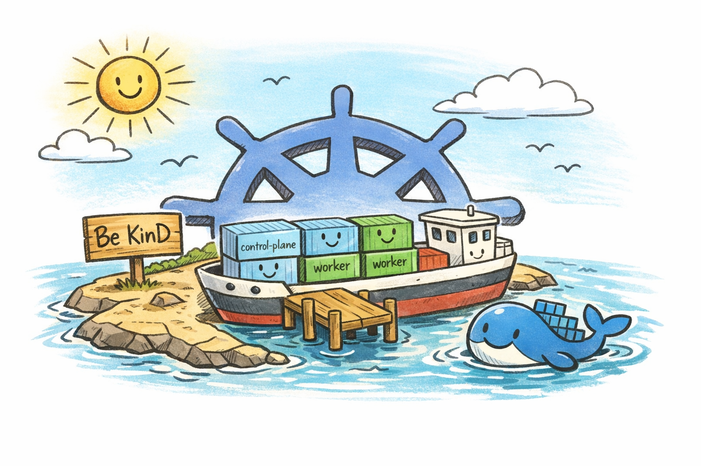
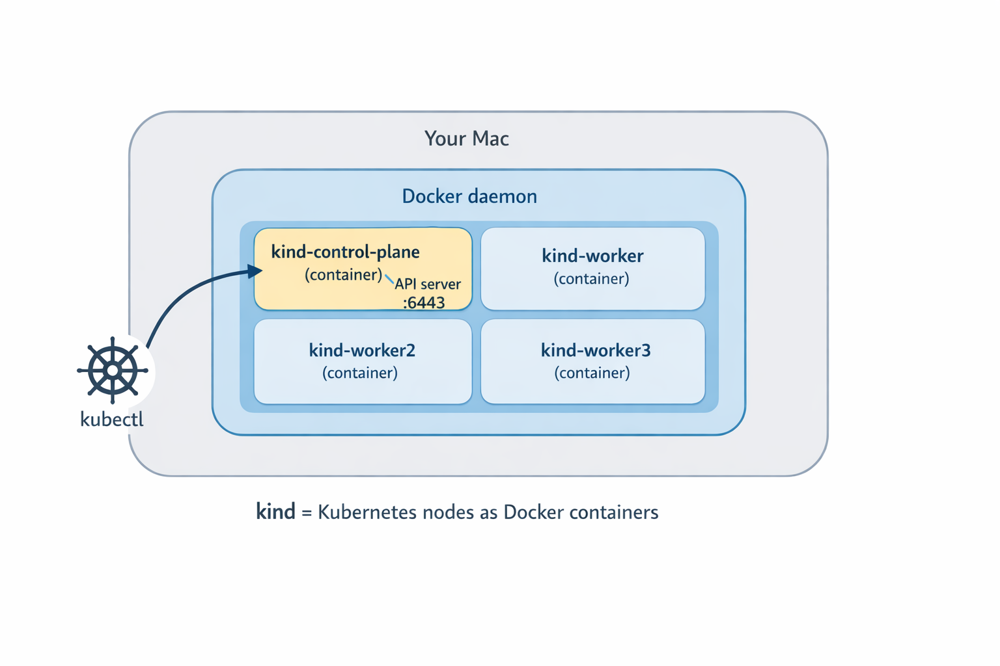

+++
title = 'Kubectl Deep Dive - Be KinD'
date = 2026-05-03T10:00:00-07:00
categories = ["Kubernetes", "Kubectl", "KUDD", "KinD", "DevOps", "LocalDev"]
+++

Welcome to a brand new series 🚢. This is the *Kubectl Deep Dive* (KUDD), a tour of Kubernetes through the lens of the one tool every k8s operator uses regularly. It is not a rewrite of `kubectl --help` 🔍. The series assumes you already use Kubernetes daily and want to spend time on the corners that are interesting, less obvious, or quietly misunderstood 🧪. Fun fact - there are at least 4 different ways to pronounce "kubectl". The official Kubernetes docs remain suspiciously silent on the matter ;-).   

**"Simple things should be simple. Complex things should be possible."** ~ Alan Kay

<!--more-->



This is the inaugural post in the *Kubectl Deep Dive* series. Every installment will run on a local [KinD](https://kind.sigs.k8s.io) cluster on my laptop, which means you can follow along on yours without a cloud account. Before we get to the deep parts, we need to set up the lab.

## 🐳 Why Local Kubernetes 🐳

A local cluster is the cheapest, fastest way to learn the parts of Kubernetes that matter. Blast radius is zero. Iteration speed is silly. There is no cloud bill, no shared environment to step on, and no IAM roundtrip between you and your idea. You can also use it on a plane with no WiFi.

The local Kubernetes landscape is crowded. Over the years I've cycled through a few of them. minikube was the very first one I touched, back when it spun up a VirtualBox VM that took longer to boot than my actual laptop. It was great for onboarding and had a thriving addon ecosystem. Then came k3d, which wraps k3s in Docker containers. k3s itself is delightful, especially for edge and IoT use cases, and k3d makes it trivial to run multi-node setups in seconds. There is also Docker Desktop's own Kubernetes toggle, Rancher Desktop, OrbStack, Colima, and a half-dozen others depending on your platform.

These days I'm all in on KinD. The reason is simple: every KinD "node" is a Docker container running an upstream kubeadm-built node. It is production-shaped enough for API behavior, scheduling experiments, and the kubectl deep dives this series cares about, without pretending to be a real production cluster (it is still a single laptop, and the nodes share a host). When the rest of this series digs into API-level behavior, I want the answers I show you to match what a real cluster would do, not a stripped-down distribution. KinD also creates and destroys clusters in seconds, which is great.



That said, KinD is not magical. It does not ship a real load balancer for `Service` type `LoadBalancer` (you bolt on MetalLB or `cloud-provider-kind` for that), and the disk story is whatever Docker gives you. Both are fixable, both are out of scope today.

## 🚀 Installing KinD 🚀

On macOS, brew does the job:

```bash
brew install kind
```

On Linux, grab the binary from the [official release page](https://kind.sigs.k8s.io/docs/user/quick-start/#installation). Verify the install:

```bash
$ kind version
kind v0.31.0 go1.25.5 darwin/arm64
```

The only prerequisite is a working Docker (or compatible) runtime. Docker Desktop, OrbStack, Colima, Rancher Desktop, all fine. A quick `docker ps` should return a table (probably empty) without errors. If that fails, fix that first, because everything below is going to call into Docker.

## 🌱 Your First Cluster 🌱

The whole point of KinD is that the first cluster is a one-liner:

```bash
$ kind create cluster
Creating cluster "kind" ...
 ✓ Ensuring node image (kindest/node:v1.35.0) 🖼
 ✓ Preparing nodes 📦
 ✓ Writing configuration 📜
 ✓ Starting control-plane 🕹️
 ✓ Installing CNI 🔌
 ✓ Installing StorageClass 💾
Set kubectl context to "kind-kind"
You can now use your cluster with:

kubectl cluster-info --context kind-kind

Have a question, bug, or feature request? Let us know! https://kind.sigs.k8s.io/#community 🙂
```

That run does a few things worth naming. It pulls the `kindest/node` image (a kubeadm-prepared node image), starts a single Docker container as the control plane, runs kubeadm init inside it, installs a CNI (kindnet by default) and a default storage class, then writes a kubeconfig context to `~/.kube/config` and switches your current context to it. By the time the command returns, kubectl is already pointing at the new cluster.

Let's verify:

```bash
$ kubectl cluster-info
Kubernetes control plane is running at https://127.0.0.1:55678
CoreDNS is running at https://127.0.0.1:55678/api/v1/namespaces/kube-system/services/kube-dns:dns/proxy

$ kubectl get nodes
NAME                 STATUS   ROLES           AGE   VERSION
kind-control-plane   Ready    control-plane   46s   v1.35.0
```

One node, Ready, control-plane role. Default name. The cluster is named `kind` and the kubectl context is `kind-kind` (the prefix is always `kind-`).

Naming is opinionated, so let's name it something that isn't `kind`:

```bash
$ kind create cluster --name dev
```

The cluster gets created as `dev`, the context is `kind-dev`, and you can have several side by side. To see what you have:

```bash
$ kind get clusters
dev
kind

$ kubectl config get-contexts
CURRENT   NAME       CLUSTER    AUTHINFO   NAMESPACE
*         kind-dev   kind-dev   kind-dev
          kind-kind  kind-kind  kind-kind
```

Switch between them with `kubectl config use-context kind-dev` or `kubectl config use-context kind-kind`. Tear them down with:

```bash
$ kind delete cluster --name kind
Deleting cluster "kind" ...
Deleted nodes: ["kind-control-plane"]
$ kind delete cluster --name dev
Deleting cluster "dev" ...
Deleted nodes: ["dev-control-plane"]
```

Note the `--name` flag everywhere. If you forget it, KinD defaults to `kind`, which is rarely what you mean once you have more than one cluster on the laptop. I have made this mistake several times.

## 🏘️ Multi-Node Clusters 🏘️

A single-node cluster is fine for a lot of things. It is not fine when you want to test scheduling, taints, tolerations, pod affinity and anti-affinity, daemonsets, real pod-to-pod networking across nodes, draining, or PodDisruptionBudgets. For any of that, you want multiple nodes.

No worries. KinD got you covered. Instead of spinning up VMs, it just runs more Docker containers. This lightweight and fast. The configuration lives in a small YAML file:

```yaml
# kind-multi.yaml
kind: Cluster
apiVersion: kind.x-k8s.io/v1alpha4
name: multi
nodes:
  - role: control-plane
  - role: worker
  - role: worker
  - role: worker
```

Create the cluster:

```bash
$ kind create cluster --config kind-multi.yaml
Creating cluster "multi" ...
 ✓ Ensuring node image (kindest/node:v1.35.0) 🖼
 ✓ Preparing nodes 📦 📦 📦 📦
 ✓ Writing configuration 📜
 ✓ Starting control-plane 🕹️
 ✓ Installing CNI 🔌
 ✓ Installing StorageClass 💾
 ✓ Joining worker nodes 🚜
Set kubectl context to "kind-multi"
```

After about a minute:

```bash
$ kubectl get nodes -o wide
NAME                  STATUS   ROLES           AGE   VERSION   INTERNAL-IP   EXTERNAL-IP   OS-IMAGE                         KERNEL-VERSION     CONTAINER-RUNTIME
multi-control-plane   Ready    control-plane   35s   v1.35.0   172.19.0.3    <none>        Debian GNU/Linux 12 (bookworm)   6.12.76-linuxkit   containerd://2.2.0
multi-worker          Ready    <none>          20s   v1.35.0   172.19.0.6    <none>        Debian GNU/Linux 12 (bookworm)   6.12.76-linuxkit   containerd://2.2.0
multi-worker2         Ready    <none>          20s   v1.35.0   172.19.0.5    <none>        Debian GNU/Linux 12 (bookworm)   6.12.76-linuxkit   containerd://2.2.0
multi-worker3         Ready    <none>          20s   v1.35.0   172.19.0.4    <none>        Debian GNU/Linux 12 (bookworm)   6.12.76-linuxkit   containerd://2.2.0
```

A four-node cluster on a laptop, in roughly the time it takes to read this paragraph. The node containers sit on a Docker network, and KinD's default CNI (kindnet) handles pod routing across them, so cross-node pod traffic works without extra setup. Just like in any Kubernetes cluster where the networking model ensures all pods have unique IP addresses and can reach each other.

The whole reason KinD is fast is that every node is just a Docker container. If you want to see for yourself just use `docker ps`:

```bash
$ docker ps --format 'table {{.Names}}\t{{.Image}}'
NAMES                  IMAGE
multi-worker3          kindest/node:v1.35.0
multi-worker2          kindest/node:v1.35.0
multi-worker           kindest/node:v1.35.0
multi-control-plane    kindest/node:v1.35.0
```

Want to poke around inside a node? Just `docker exec` into it like any other container:

```bash
$ docker exec -it multi-worker bash
root@multi-worker:/# crictl ps | head -3
```

You can read kubelet logs, inspect containerd, watch the actual processes that make up a Kubernetes node. That kind of access is invaluable when something is acting strangely, and you want to see what is really happening.

If you want HA control-plane testing, KinD supports that too. The YAML shape is the same, just add more `role: control-plane` entries and KinD will set up an internal load balancer container in front of the API servers:

```yaml
# kind-ha.yaml
kind: Cluster
apiVersion: kind.x-k8s.io/v1alpha4
name: ha
nodes:
  - role: control-plane
  - role: control-plane
  - role: control-plane
  - role: worker
  - role: worker
  - role: worker
```

Three control planes plus three workers is a useful topology when you care about HA behavior. For most day-to-day exploration a single control plane is plenty.

## 🛠️ KinD Quality of Life 🛠️

Here are a couple of KinD tricks that are useful when working locally.

**Loading local images.** KinD nodes are isolated Docker containers, so the image you just built on your host is not visible to them. Instead of running a registry, KinD has a shortcut:

```bash
kind load docker-image the-app:dev --name multi
```

This sideloads the image into every node of the named cluster. No registry, no tagging gymnastics, no waiting on a push. One footgun to remember: avoid the `:latest` tag and dont set the `imagePullPolicy: Always` on your pod, otherwise Kubernetes will ignore the sideloaded copy and pull a fresh one anyway (or fail if it doesn't exist in the registry).

**Port mappings.** When you want traffic from your host to reach inside the cluster (an ingress controller, for example), add `extraPortMappings` to the KinD config:

```yaml
nodes:
  - role: control-plane
    extraPortMappings:
      - containerPort: 80
        hostPort: 80
      - containerPort: 443
        hostPort: 443
```

That binds host port 80 and 443 to the control-plane node container. Something inside the cluster has to actually listen on those ports for it to do anything useful: a `hostPort` on a pod scheduled to that node, or an ingress controller bound to those ports there. NodePort services use the 30000-32767 range by default, so they don't line up with `containerPort: 80/443` without extra config.

**Mounting host paths.** If you are testing CSI drivers, persistent volumes backed by real disk, or anything else that wants real files, `extraMounts` binds host directories into nodes:

```yaml
nodes:
  - role: control-plane
    extraMounts:
      - hostPath: /tmp/kind-data
        containerPath: /data
```

**Fast teardown.** Since, these clusters take resources when you're done clean them up:

```bash
kind delete clusters --all
```

Done. Clean slate. The whole thing takes a few seconds because we are just stopping and removing Docker containers.

**Pin a context per project.** Combine KinD cluster names with `direnv`  so each project directory automatically points kubectl at the right cluster when you cd in. Once you have it set up you stop accidentally running commands against the wrong context.

## ⏭️ What's Next ⏭️

Now that we have a lab, the upcoming posts in *Kubectl Deep Dive* will explore:

- Talking to the raw Kubernetes API: `kubectl proxy`, `kubectl get --raw`, and a little curl
- Server-side apply vs client-side apply, field managers, and conflicts
- How does `kubectl port-forward` actually work?
- Watches, `kubectl wait`, and why `--wait` beats `sleep`
- Multi-cluster magic with vcluster
- kubectl plugins and the krew ecosystem

## 🏠 Take Home Points 🏠

- KinD gives you a production-shaped local Kubernetes for the price (free) and the speed (seconds). Each node is a Docker container running an upstream kubeadm node.
- Single-node cluster: `kind create cluster`. Done. The kubectl context gets created and selected for you.
- Multi-node cluster: a tiny YAML file with one `role:` entry per node, then `kind create cluster --config <file>`.
- `docker ps` shows your Kubernetes nodes. `docker exec -it <node> bash` lets you poke at them like any other container.
- `kind load docker-image` ships local images into the cluster without a registry. Use it.

If you enjoyed this post, check out my book on running Kubernetes at scale:

📖  [Mastering Kubernetes](https://www.amazon.com/Kubernetes-operate-world-class-container-native-systems/dp/1804611395)

🇩🇪 Auf Wiedersehen, Freunde! 🇩🇪
