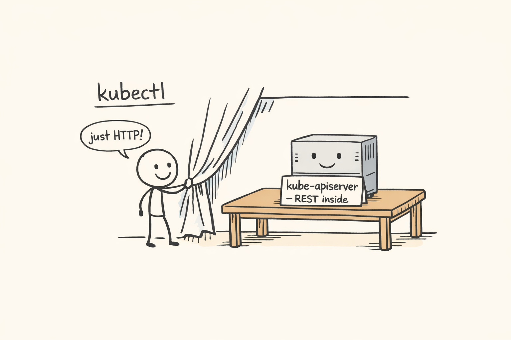
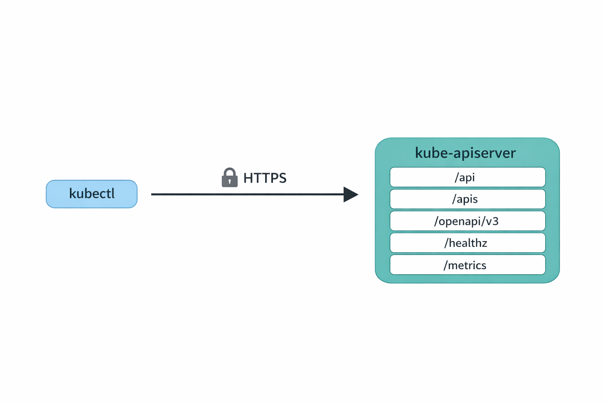
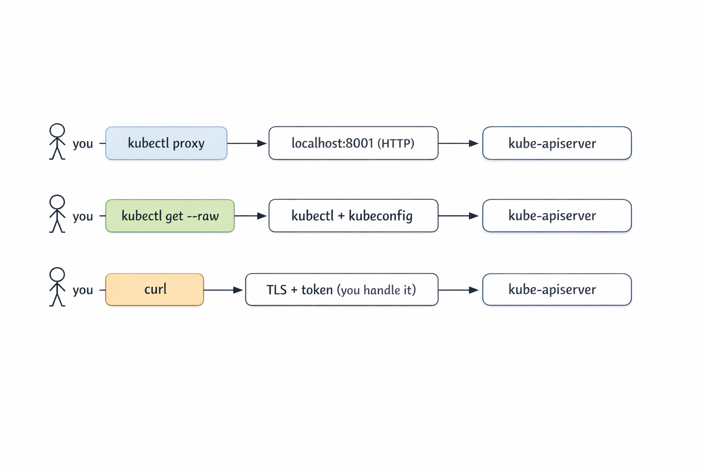

+++
title = 'Kubectl Deep Dive - Talking to the Raw API'
date = 2026-05-10T10:00:00-07:00
categories = ["Kubernetes", "Kubectl", "KUDD", "API", "DevOps"]
+++

Welcome back to the *Kubectl Deep Dive* (KUDD). In [KUDD #01](https://medium.com/gitconnected/kubectl-deep-dive-be-kind-4bd3527c8b0d) we set up a local KinD cluster so we have a real lab to play in 🧪. Today we drop down a layer and stop pretending kubectl is special 🪄. It is not. It is just an HTTP client 🌐 talking to a regular REST API ⚙️, and once you see that, a lot of Kubernetes stops looking like magic.

**"Any sufficiently advanced technology is indistinguishable from magic."** ~ Arthur C. Clarke

<!--more-->



We will look at three different ways to call the Kubernetes API directly, then tour the endpoints kubectl does not give you a verb for. Everything runs on a single-node KinD cluster named `raw-api` (see [KUDD #01](https://medium.com/gitconnected/kubectl-deep-dive-be-kind-4bd3527c8b0d) for the KinD setup). To follow along, spin it up:

```bash
kind create cluster --name raw-api
```

That gives you a kubectl context named `kind-raw-api`. All the JSONPath selectors below filter on that context name, so the commands work as-is. If you want to use a different name, substitute it everywhere you see `kind-raw-api` (or use `kubectl config current-context` to look it up).

## 🔧 kubectl is Just an HTTP Client 🔧

Every kubectl command turns into one or more HTTPS requests against the Kubernetes API server. You can watch it happen with `-v=8`, which dumps the request and response lines for each round trip. One thing to know first: kubectl caches the API server's discovery output at `~/.kube/cache/discovery/<cluster>/` for ten minutes. So on a warm cache you only see the actual data request:

```bash
$ kubectl get pods -v=8 -n kube-system 2>&1 | grep -E 'GET|round_trippers' | head
I0511 02:01:34.377414   48855 round_trippers.go:527] "Request" verb="GET" url="https://127.0.0.1:60350/api/v1/namespaces/kube-system/pods?limit=500" headers=<
I0511 02:01:34.405340   48855 round_trippers.go:632] "Response" status="200 OK" headers=<
```

Clear the discovery cache and you can see what kubectl actually does on a cold start:

```bash
$ rm -rf ~/.kube/cache/discovery
$ kubectl get pods -v=8 -n kube-system 2>&1 | grep -E 'GET|round_trippers' | head
I0511 02:01:35.272440   48929 round_trippers.go:527] "Request" verb="GET" url="https://127.0.0.1:60350/api?timeout=32s"
I0511 02:01:35.287778   48929 round_trippers.go:632] "Response" status="200 OK"
I0511 02:01:35.289046   48929 round_trippers.go:527] "Request" verb="GET" url="https://127.0.0.1:60350/apis?timeout=32s"
I0511 02:01:35.291495   48929 round_trippers.go:632] "Response" status="200 OK"
I0511 02:01:35.298262   48929 round_trippers.go:527] "Request" verb="GET" url="https://127.0.0.1:60350/api/v1/namespaces/kube-system/pods?limit=500"
I0511 02:01:35.304564   48929 round_trippers.go:632] "Response" status="200 OK"
```

Three requests now. The first two are discovery: kubectl asks the server what API versions and resources exist, so it knows how to interpret `pods`. The third is the actual `GET pods`. The URL shape is the giveaway: core resources live under `/api/v1/...`, everything else lives under `/apis/<group>/<version>/...`, and namespaced things take a `/namespaces/<ns>/` segment.

The `?limit=500` on the pods request is also worth pausing on. The Kubernetes API server supports chunked list responses, and kubectl uses it by default with a page size of 500. If your namespace has fewer than 500 pods you get the whole list in one shot. If it has more, the response includes a `continue` token in `metadata.continue`, and kubectl transparently follows it with another request that adds `&continue=<token>`. You never notice from the kubectl side, but the wire log shows two or three GETs instead of one.

Both behaviors are a nice example of the bigger point. The discovery cache and the chunked-list pagination are obvious at the API level: there is a literal `?limit=500` in the URL and a literal `continue` field in the JSON. Through the kubectl abstraction they are invisible. The price of a friendly CLI is that gotchas hide behind it. Drop a layer and they jump out at you, which is half the reason we are doing this exercise in the first place. (And practically: if you ever write a raw `curl` script that lists pods on a busy cluster, you have to follow the continue token yourself, or you will silently get only the first 500.)



That is the entire model. Nothing kubectl does is unavailable to anyone else who can speak HTTPS, present valid credentials, and read JSON.

## 🛰️ Three Ways to Reach the API 🛰️

There are three practical ways to talk to the API server directly, from most to least convenient.



The first is `kubectl proxy`. It runs a tiny local HTTP server that forwards to the cluster using your kubeconfig credentials. You hit `http://127.0.0.1:8001` in plain HTTP and kubectl deals with TLS and auth.

The second is `kubectl get --raw`. No proxy, no curl. kubectl issues the HTTPS request for you and returns the response body verbatim, no formatting or `-o` gymnastics.

The third is `curl` (or any HTTP client). You handle TLS verification and authentication yourself. This is the path you take when you do not have kubectl available, or when you want to remove kubectl as a variable while debugging.

Let's walk through each one.

## 🪞 kubectl proxy 🪞

Fair question if you are thinking "if kubectl is doing the auth anyway, why not just use kubectl?". The answer is that `kubectl proxy` is not really for you, the kubectl user. It is for everything that is **not kubectl**: a browser hitting the Kubernetes dashboard, a jupyter notebook pulling resource counts into a chart, a curl-based smoke test, an automation tool that only speaks HTTP, or even a quick `fetch()` from a webpage you are prototyping. The proxy turns the cluster's authenticated HTTPS API into a plain `http://127.0.0.1:8001` that any HTTP client can hit without needing certs, tokens, or a kubeconfig of its own.

Start it in the background and shoot HTTP at it:

```bash
$ kubectl proxy &
[1] 56819
Starting to serve on 127.0.0.1:8001

$ curl -s http://127.0.0.1:8001/api/v1/namespaces/kube-system/pods | jq '.items | length'
8
```

That is the whole UX. From your shell, you talk plain HTTP to `127.0.0.1:8001`, and kubectl proxy talks HTTPS to the cluster on your behalf. The response is real Kubernetes JSON.

A couple of discovery calls are handy to know:

```bash
$ curl -s http://127.0.0.1:8001/api
{
  "kind": "APIVersions",
  "versions": ["v1"],
  "serverAddressByClientCIDRs": [
    {
      "clientCIDR": "0.0.0.0/0",
      "serverAddress": "172.19.0.3:6443"
    }
  ]
}

$ curl -s http://127.0.0.1:8001/api/v1 | jq '.resources[].name' | head
"bindings"
"componentstatuses"
"configmaps"
"endpoints"
"events"
"limitranges"
"namespaces"
"namespaces/finalize"
"namespaces/status"
"nodes"
```

Where proxy really earns its keep is anything that wants a stable local HTTP endpoint: the Kubernetes dashboard, service-proxy URLs (the API server can proxy HTTP into any in-cluster Service for you), or a quick exploration session in a notebook. CoreDNS exposes a Prometheus metrics port that we can reach this way:

```bash
$ curl -s "http://127.0.0.1:8001/api/v1/namespaces/kube-system/services/kube-dns:metrics/proxy/metrics" | head
# HELP coredns_build_info A metric with a constant '1' value labeled by version, revision, and goversion from which CoreDNS was built.
# TYPE coredns_build_info gauge
coredns_build_info{goversion="go1.25.2",revision="1db4568",version="1.13.1"} 1
# HELP coredns_cache_misses_total The count of cache misses. Deprecated, derive misses from cache hits/requests counters.
# TYPE coredns_cache_misses_total counter
```

The shape is `/api/v1/namespaces/<ns>/services/<svc>:<port-name>/proxy/<path>`. Note the `port-name`: it has to be a port that actually speaks HTTP. Hitting `kube-dns:dns` would not work because that port is UDP DNS, not HTTP.

One important security note. By default `kubectl proxy` binds to `127.0.0.1`, which is safe. It is doing **no** authorization on incoming requests because it assumes only you can reach loopback. If you bind it to a real interface with `--address=0.0.0.0`, anyone who can reach the port gets the cluster permissions of whoever ran the proxy. Don't do that on a shared box.

Clean up when you are done:

```bash
$ kill %1
```

## 🪶 `kubectl get --raw` 🪶

`kubectl get --raw <path>` is the most underrated kubectl flag. It tells kubectl: please use my current context, do the HTTPS call to this path, and hand me the response body unchanged. No client-side pretty printing.

You might wonder how this is different from `kubectl get pods -o json`. The two are not the same thing at all. `-o json` is a *formatter*: kubectl fetches a resource it already knows about (pods, deployments, configmaps, anything it has a verb for) and prints the result as JSON. The set of paths `-o json` can reach is exactly the set of resources kubectl models, and the output is always a Kubernetes object structure.

`--raw <path>`, on the other hand, takes an arbitrary URL path on the API server, makes the GET, and returns the response body verbatim. That gives you three things `-o json` can't:

1. **Non-resource endpoints**: `/healthz`, `/livez`, `/readyz`, `/metrics`, `/openapi/v3`, `/.well-known/openid-configuration`. None of these are Kubernetes objects, none of these have a kubectl verb, but all of them are real endpoints on the API server.
2. **Non-JSON responses**: `/healthz` returns the literal string `ok`. `/metrics` returns Prometheus exposition text. `-o json` would not know what to do with either; `--raw` just hands them back.
3. **Query parameters and subresource paths kubectl doesn't expose**: `?watch=true`, `?resourceVersion=N`, `/status` subresources, custom verbs on aggregated APIs. `--raw` lets you spell the URL exactly the way you want.

Think of `-o json` as "pretty-print this resource I asked for" and `--raw` as "make this raw HTTP call for me".

```bash
$ kubectl get --raw /api
{"kind":"APIVersions","versions":["v1"],"serverAddressByClientCIDRs":[{"clientCIDR":"0.0.0.0/0","serverAddress":"172.19.0.3:6443"}]}

$ kubectl get --raw /apis | jq '.groups[].name'
"apiregistration.k8s.io"
"apps"
"events.k8s.io"
"authentication.k8s.io"
"authorization.k8s.io"
"autoscaling"
"batch"
"certificates.k8s.io"
...

$ kubectl get --raw '/api/v1/namespaces/kube-system/pods?limit=2' | jq '.items[].metadata.name'
"coredns-7d764666f9-5zg5s"
"coredns-7d764666f9-vghnn"
```

When I am writing scripts that need to hit a specific endpoint, `--raw` is what I reach for. It picks up your current context automatically, follows your kubeconfig, and does not require a separate proxy process to manage. The shape of the URL is the same as what you would build for `curl`, but you get auth and TLS for free.

The flag pairs nicely with `jq` for filtering and `--watch=true` for streaming (we will get there). Think of it as the lightweight cousin of `kubectl proxy + curl`.

## 🐚 curl Directly 🐚

Sometimes you want kubectl out of the picture. You might be in a shell where kubectl is not installed, you might be debugging a kubeconfig issue, or you might be writing a script that should not depend on kubectl at all. For those cases, you do the TLS and auth yourself.

Start by extracting the server URL from kubeconfig:

```bash
APISERVER=$(kubectl config view --raw \
  -o jsonpath='{.clusters[?(@.name=="kind-raw-api")].cluster.server}')

$ echo $APISERVER
https://127.0.0.1:60350
```

KinD clusters use client-certificate auth, so you need the client cert, the client key, and the cluster CA. All three are sitting in your kubeconfig as base64.

Quick aside on Unix permissions, because we are about to write a private key to disk. On Unix, every file has three permission triplets (owner, group, other) and three bits per triplet (read, write, execute). They are usually written in octal: `0644` means owner can read and write, group and others can only read. `0600` means owner can read and write, group and others get nothing.

When a program creates a new file, the kernel starts from a default base mode of `0666` (read/write for everyone) and **subtracts** the bits set in the shell's `umask`. The default `umask` on most systems is `022`, so new files come out as `0666 & ~022 = 0644`. That is fine for source code and config, but it is a bad default for private keys, because anyone on the box can read them. `umask 077` strips read/write/execute for group and others, so new files come out as `0666 & ~077 = 0600`. Owner-only.

Your `~/.kube/config` is already `0600` because kubectl sets that explicitly when it creates the file. But we are not editing kubeconfig here. We are redirecting the decoded output to a *new* file at `/tmp/client.key`, and that new file inherits the shell's current umask. So tighten the umask in this shell before the extraction:

```bash
umask 077

kubectl config view --raw \
  -o jsonpath='{.users[?(@.name=="kind-raw-api")].user.client-certificate-data}' \
  | base64 -d > /tmp/client.crt

kubectl config view --raw \
  -o jsonpath='{.users[?(@.name=="kind-raw-api")].user.client-key-data}' \
  | base64 -d > /tmp/client.key

kubectl config view --raw \
  -o jsonpath='{.clusters[?(@.name=="kind-raw-api")].cluster.certificate-authority-data}' \
  | base64 -d > /tmp/ca.crt
```

Now curl can do the dance:

```bash
$ curl -s --cacert /tmp/ca.crt --cert /tmp/client.crt --key /tmp/client.key \
    $APISERVER/api/v1/namespaces/kube-system/pods | jq '.items | length'
8
```

Same answer as before. Same call kubectl was making under the hood.

Many real clusters do not use client certificates. They use bearer tokens, either a ServiceAccount token or an OIDC token from your identity provider. The shape is simpler because there is no client cert to wave around, just an `Authorization` header. But we need an SA first, so let's talk about what that actually is.

A **ServiceAccount** is a namespace-scoped Kubernetes object that represents a non-human identity. It is the canonical way pods (and anything else running inside the cluster) authenticate themselves to the API server. RBAC bindings target ServiceAccounts the same way they target users: a `RoleBinding` or `ClusterRoleBinding` grants permissions to a specific SA, and any client carrying a token for that SA gets those permissions.

`kubectl create token <sa>` calls the **TokenRequest** API on the API server, which mints a short-lived signed JWT for that ServiceAccount and returns it. The token has the SA's identity baked into the `sub` claim (`system:serviceaccount:<ns>:<name>`), an expiration in `exp` (one hour by default, tunable with `--duration`), and an audience in `aud` (the API server itself, unless you override with `--audience`). Crucially, nothing is stored on disk and no Secret object is created. Every call mints a fresh token. This replaced the old "auto-generated Secret per SA" model from before 1.24, which produced long-lived tokens and was a known security liability.

Important: don't bind permissions to the `default` ServiceAccount in real clusters. Every pod that doesn't explicitly set `serviceAccountName` runs as `default`, so granting `default` permissions silently hands those permissions to every workload in the namespace. The right pattern is one SA per workload with exactly the permissions that workload needs. Let's do this properly. Create a dedicated SA called `api-reader` and grant it namespace-scoped `view`:

```bash
$ kubectl create serviceaccount api-reader -n default
serviceaccount/api-reader created

$ kubectl create rolebinding api-reader-view \
    --clusterrole=view --serviceaccount=default:api-reader -n default
rolebinding.rbac.authorization.k8s.io/api-reader-view created
```

Now mint a token for that SA and use it:

```bash
$ TOKEN=$(kubectl create token api-reader -n default)
$ curl -s --cacert /tmp/ca.crt -H "Authorization: Bearer $TOKEN" \
    $APISERVER/api/v1/namespaces/default/pods | jq '.kind, (.items|length)'
"PodList"
0
```

That's the production-shaped pattern in miniature: a dedicated SA, RBAC scoped to a single namespace, an ephemeral token. Inside a pod, you do not have to do any of this by hand. When you set `serviceAccountName: api-reader` in a pod spec, the kubelet projects three files into the container automatically:

- Token: `/var/run/secrets/kubernetes.io/serviceaccount/token`
- CA cert: `/var/run/secrets/kubernetes.io/serviceaccount/ca.crt`
- API server: `https://kubernetes.default.svc`

The token is mounted as a [projected volume](https://kubernetes.io/docs/tasks/configure-pod-container/configure-service-account/), refreshed before expiration by the kubelet. Operators, controllers, init scripts, all of them use these three files.

Don't forget to clean up. The temp files are credentials, and the SA + RoleBinding are real cluster state:

```bash
rm /tmp/client.crt /tmp/client.key /tmp/ca.crt
kubectl delete rolebinding api-reader-view -n default
kubectl delete serviceaccount api-reader -n default
```

## 🔍 What the API Actually Exposes 🔍

Now that you have three ways in, the interesting question is: what is there to call? Most of these endpoints have no kubectl verb. They are first-class API server features, and you find them with `--raw`.

**Discovery.** `/api` lists core API versions, `/apis` lists every other API group and its versions. This is what `kubectl api-resources` consumes under the hood.

```bash
$ kubectl get --raw /apis | jq '.groups[].name' | head
"apiregistration.k8s.io"
"apps"
"events.k8s.io"
"authentication.k8s.io"
"authorization.k8s.io"
...
```

**OpenAPI schema.** `/openapi/v3` returns an index of OpenAPI documents broken down by group/version. Each group has its own schema. This is what powers `kubectl explain`:

```bash
$ kubectl get --raw /openapi/v3 | jq '.paths | keys[]' | head
".well-known/openid-configuration"
"api"
"api/v1"
"apis"
"apis/admissionregistration.k8s.io"
"apis/admissionregistration.k8s.io/v1"
...

$ kubectl get --raw /openapi/v3/api/v1 | jq '.components.schemas | keys[]' | head
"io.k8s.api.authentication.v1.BoundObjectReference"
"io.k8s.api.authentication.v1.TokenRequest"
"io.k8s.api.autoscaling.v1.Scale"
"io.k8s.api.core.v1.AWSElasticBlockStoreVolumeSource"
...
```

We will spend a whole post on `kubectl explain` and the OpenAPI schema later in this series, but it is good to know where it lives.

**Health and readiness.** Three endpoints, `/healthz`, `/livez`, `/readyz`. Hit them with `?verbose` to get per-check status. Invaluable when the control plane is acting strangely:

```bash
$ kubectl get --raw /healthz
ok

$ kubectl get --raw '/livez?verbose' | head
[+]ping ok
[+]log ok
[+]etcd ok
[+]poststarthook/start-apiserver-admission-initializer ok
[+]poststarthook/generic-apiserver-start-informers ok
[+]poststarthook/priority-and-fairness-config-consumer ok
[+]poststarthook/priority-and-fairness-filter ok
...
```

**Version.** Same data `kubectl version` formats, in JSON:

```bash
$ kubectl get --raw /version
{
  "major": "1",
  "minor": "35",
  "gitVersion": "v1.35.0",
  "gitCommit": "66452049f3d692768c39c797b21b793dce80314e",
  "gitTreeState": "clean",
  "buildDate": "2025-12-17T12:32:07Z",
  "goVersion": "go1.25.5",
  "compiler": "gc",
  "platform": "linux/arm64"
}
```

**Metrics.** The API server exposes itself in Prometheus exposition format on `/metrics`. This is exactly what Prometheus scrapes when it monitors the control plane:

```bash
$ kubectl get --raw /metrics | head
# HELP aggregator_discovery_aggregation_count_total [ALPHA] Counter of number of times discovery was aggregated
# TYPE aggregator_discovery_aggregation_count_total counter
aggregator_discovery_aggregation_count_total 2
# HELP aggregator_unavailable_apiservice [ALPHA] Gauge of APIServices which are marked as unavailable broken down by APIService name.
# TYPE aggregator_unavailable_apiservice gauge
aggregator_unavailable_apiservice{name="v1."} 0
...
```

If you have ever wanted to see what request counts, latency buckets, or etcd object counts look like without setting up Prometheus, `kubectl get --raw /metrics` is a fine way to peek.

## 📡 Watching Without kubectl 📡

The Kubernetes watch protocol is one of my favorite things about the API. It is just an HTTP long-poll: a `GET` with `?watch=true` keeps the connection open and streams newline-delimited JSON events as objects change.

Start a watch in the background, run a short-lived pod, then delete it:

```bash
$ kubectl get --raw '/api/v1/namespaces/default/pods?watch=true' > /tmp/watch.out &
$ kubectl run hello --image=busybox --restart=Never -- sleep 5
pod/hello created
$ sleep 15
$ kubectl delete pod hello
pod "hello" deleted from default namespace
```

The watch stream pours in. Each line is a JSON object with a `type` (ADDED, MODIFIED, DELETED, ERROR) and the full object:

```bash
$ head -2 /tmp/watch.out
{"type":"ADDED","object":{"kind":"Pod","apiVersion":"v1","metadata":{"name":"hello","namespace":"default","uid":"8134c5f8-...","resourceVersion":"2316",...}}}
{"type":"MODIFIED","object":{"kind":"Pod","apiVersion":"v1","metadata":{"name":"hello","resourceVersion":"2317",...}}}
```

Squint and you can read the pod's whole lifecycle. With a little `jq`:

```bash
$ jq -c '{type, name:.object.metadata.name, phase:.object.status.phase}' /tmp/watch.out
{"type":"ADDED","name":"hello","phase":"Pending"}
{"type":"MODIFIED","name":"hello","phase":"Pending"}
{"type":"MODIFIED","name":"hello","phase":"Running"}
{"type":"MODIFIED","name":"hello","phase":"Succeeded"}
{"type":"DELETED","name":"hello","phase":"Succeeded"}
```

Don't forget to stop the watch when you are done. The connection stays open forever (that is the whole point), so it needs a manual `kill`:

```bash
$ kill %1
```

This is the heartbeat of Kubernetes. Every controller (kube-controller-manager, the scheduler, kubelet, every custom operator) is a long-running watch loop on a small set of resources. Once you have seen the raw event stream, the entire controller pattern stops feeling abstract. They are programs that read JSON off a socket and react.

The `resourceVersion` field is the resumption token. If your watch dies, you reconnect with `?watch=true&resourceVersion=<last-seen>` and the server replays everything you missed (within its etcd compaction window).

## 🧭 When To Reach For This 🧭

Most of the time, kubectl is the right tool. The raw API is the right tool when:

- You are debugging a kubectl bug, a permissions issue, or a strange caching problem. Drop to curl and you remove kubectl as a variable.
- You are writing a controller or operator and want to understand what your code will actually see on the wire.
- You need an endpoint kubectl has no verb for: `/metrics`, `/openapi/v3`, `/healthz` subpaths, custom subresources.
- You are inside a pod with no kubectl binary but you have the ServiceAccount mount.
- You are talking to a managed service with unusual auth (EKS aws-iam-authenticator, AKS AAD, GKE Workload Identity) and you want to isolate whether auth is the problem.

## ⏭️ What's Next ⏭️

Now that we are comfortable talking HTTP to the API server, the next several KUDD posts can lean on that. Coming up:

- Server-side apply vs client-side apply, field managers, and conflicts
- How does `kubectl port-forward` actually work? (SPDY/websockets)
- Watches, `kubectl wait`, and why `--wait` beats `sleep`
- JSONPath, custom-columns, and other output sorcery
- `kubectl explain` and the OpenAPI schema we touched today
- kubectl plugins and the krew ecosystem

## 🏠 Take Home Points 🏠

- kubectl is an HTTP client. Every command is one or more REST calls to the API server. `-v=8` shows you the wire.
- `kubectl proxy` gives you cheap localhost HTTP access. Great for the dashboard and ad-hoc exploration. Never bind it to a public interface.
- `kubectl get --raw <path>` is the most underrated kubectl flag. Scripting against arbitrary endpoints, no proxy needed.
- `curl` directly when you want kubectl out of the equation, or you are inside a pod with the ServiceAccount mount.
- Some interesting endpoints have no kubectl verb: `/openapi/v3` (powers explain), `/healthz` and `/livez` (control plane health), `/metrics` (Prometheus scrape), `/version`, and the watch protocol (the heart of every controller).

If you enjoyed this post, check out my book on running Kubernetes at scale:

📖  [Mastering Kubernetes](https://www.amazon.com/Kubernetes-operate-world-class-container-native-systems/dp/1804611395)

🇬🇷 Αντίο, φίλοι! 🇬🇷
