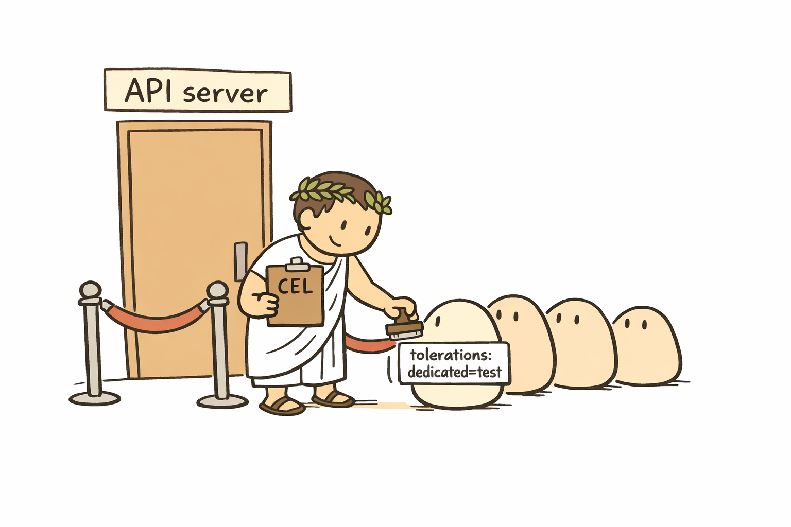
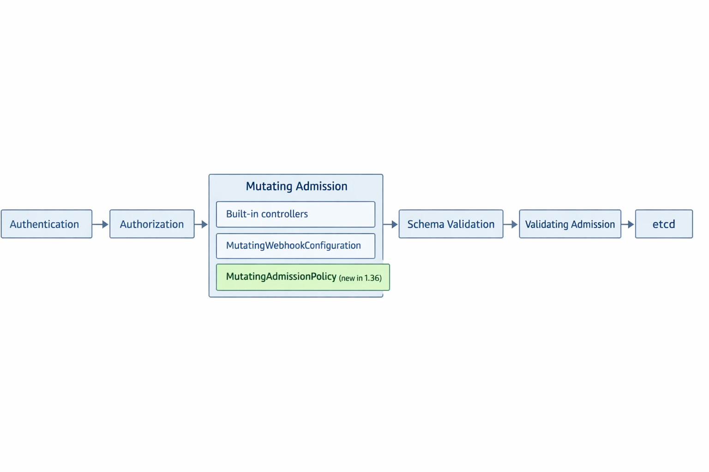
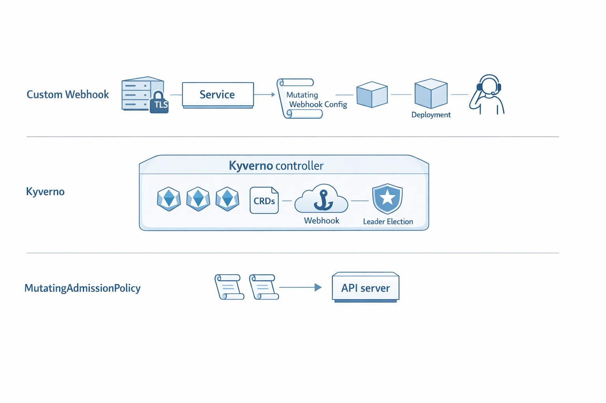

+++
title = 'Kubectl Deep Dive - Admission Granted'
date = 2026-05-24T10:00:00-07:00
categories = ["Kubernetes", "Kubectl", "KUDD", "Admission", "DevOps"]
+++

Welcome back to the *Kubectl Deep Dive* (KUDD). In [KUDD #01](https://medium.com/gitconnected/kubectl-deep-dive-be-kind-4bd3527c8b0d) we built a local KinD lab 🧪, and in [KUDD #02](https://medium.com/gitconnected/kubectl-deep-dive-talking-to-the-raw-api-11af383f9889) we stopped treating kubectl like magic and called the API server directly 🌐. Today we walk through the gate 🚪. Admission control is the part of the API server that gets to *change* or *reject* every object on its way into the cluster, and as of Kubernetes 1.36 there is a brand new, much lighter way to do declarative mutation that lives entirely inside the API server itself 🆕.

**"The cheapest, fastest, and most reliable components of a computer system are those that aren't there."** ~ Gordon Bell

<!--more-->



I want to start with a real story. On a recent project I had an end-to-end test suite running on an EKS cluster with several node groups. We wanted the test pods to land on a dedicated test node group with a `dedicated=test:NoSchedule` taint, so the tests could not be evicted by, or evict, regular traffic. The pods were created through an upstream API that we did not own, and it did not surface a way to set tolerations on the pod spec. So we did what teams have been doing for years: we wrote a mutating admission webhook plus a small Go server, registered it with the cluster, signed a cert, hooked up monitoring, and kept it patched. It worked. It was also a whole new workload to babysit.

If we had been on 1.36, the entire thing would have been a couple of Kubernetes objects. Let's walk through why.

## 🚧 The Problem 🚧

To turn the real-world setup into a kind lab, we need a small cluster with a dedicated "test" node we can taint. Here is the config:

```yaml
# kind-admission.yaml
kind: Cluster
apiVersion: kind.x-k8s.io/v1alpha4
name: admission
nodes:
  - role: control-plane
  - role: worker
  - role: worker
  - role: worker
    labels:
      dedicated: test
```

One twist: as of this writing there is no pre-built `kindest/node:v1.36.0` image yet on Docker Hub. Kubernetes 1.36 shipped on April 22, 2026 and the kind image build typically lags the upstream release by a few weeks. Until it lands, you build the image yourself from the release artifacts:

```bash
kind build node-image --type release v1.36.0 --image kindest/node:v1.36.0
```

The `--type release` mode pulls the pre-built Kubernetes binaries (no compile from source needed) and packages them into a node image. Takes a couple of minutes. Then create the cluster pointed at it:

```bash
kind create cluster --config kind-admission.yaml --image kindest/node:v1.36.0
```

Verify we are on 1.36 and have four nodes:

```bash
$ kubectl version
Client Version: v1.36.1
Kustomize Version: v5.8.1
Server Version: v1.36.0

$ kubectl get nodes
NAME                      STATUS   ROLES           AGE     VERSION
admission-control-plane   Ready    control-plane   9m51s   v1.36.0
admission-worker          Ready    <none>          9m37s   v1.36.0
admission-worker2         Ready    <none>          9m37s   v1.36.0
admission-worker3         Ready    <none>          9m37s   v1.36.0
```

Taint `admission-worker3` so nothing schedules there without a matching toleration:

```bash
$ kubectl taint node admission-worker3 dedicated=test:NoSchedule
node/admission-worker3 tainted

$ kubectl get nodes -o jsonpath='{range .items[*]}{.metadata.name}{"\t"}{.spec.taints}{"\n"}{end}'
admission-control-plane  [{"effect":"NoSchedule","key":"node-role.kubernetes.io/control-plane"}]
admission-worker
admission-worker2
admission-worker3        [{"effect":"NoSchedule","key":"dedicated","value":"test"}]
```

Now play the upstream API. We create a "test pod" labeled `role=e2e-test`, but with no tolerations and no nodeSelector. That is the scenario: the create-time API does not let us add tolerations.

```bash
$ kubectl run e2e-1 --image=busybox --labels=role=e2e-test -- sleep 3600
pod/e2e-1 created

$ kubectl get pod e2e-1 -o wide
NAME    READY   STATUS    RESTARTS   AGE   IP           NODE
e2e-1   1/1     Running   0          3s    10.244.3.5   admission-worker2
```

The pod ran fine, but it landed on `admission-worker2`. The kube-scheduler will never put it on `admission-worker3` because there is no toleration for the `dedicated=test:NoSchedule` taint, and nothing tells it to *prefer* the test node either. Functionally we have an e2e test running on the same nodes as our regular traffic. We need a mutator to inject both a toleration and a `nodeSelector` between the API client and persistence in etcd.

## 🚪 What is Admission Control 🚪

Quick refresher. Every write to the Kubernetes API server runs through a fixed pipeline. From the API server's point of view, a `POST /api/v1/namespaces/default/pods` request does roughly this:



The mutating admission step is the only one that can *change* the incoming object. Built-in mutating controllers (the `ServiceAccount` admission plugin, `DefaultStorageClass`, `DefaultTolerationSeconds`, etc.) live in this stage and are compiled into the API server. External logic plugs in via `MutatingWebhookConfiguration`, which registers a remote HTTPS endpoint the API server calls during admission. Kubernetes 1.36 adds a third option in that lane: `MutatingAdmissionPolicy`, evaluated by the API server itself using CEL.

We have three real options for our toleration-injection problem. Let's look at each one honestly.

## 🏗️ Option A: Roll Your Own Webhook 🏗️

This is what we did at work. The webhook side of it is a few small pieces. You write an HTTPS server (in Go, but anything works) that accepts an `AdmissionReview` POST, makes a mutation decision, and returns an `AdmissionReview` response with a `patch` field containing a JSON Patch. You ship that server as a Deployment, expose it via a Service, and tell the API server about it with a `MutatingWebhookConfiguration` that names the resources to intercept and the URL to call. The handler is small. The supporting plumbing is not.

The registration object looks like this:

```yaml
apiVersion: admissionregistration.k8s.io/v1
kind: MutatingWebhookConfiguration
metadata:
  name: add-test-tolerations
webhooks:
  - name: add-test-tolerations.gigi.zone
    clientConfig:
      service:
        namespace: admission-system
        name: toleration-injector
        path: /mutate
      caBundle: <base64 CA cert>
    rules:
      - apiGroups:   [""]
        apiVersions: ["v1"]
        operations:  ["CREATE"]
        resources:   ["pods"]
    admissionReviewVersions: ["v1"]
    sideEffects: None
    failurePolicy: Fail
```

And on the server side, the core of the handler is just "decode the AdmissionReview, build a JSON Patch, encode the response":

```go
func mutate(w http.ResponseWriter, r *http.Request) {
    var review admissionv1.AdmissionReview
    json.NewDecoder(r.Body).Decode(&review)
    patch := []map[string]any{
        {"op": "add", "path": "/spec/tolerations", "value": []map[string]any{{
            "key": "dedicated", "operator": "Equal",
            "value": "test", "effect": "NoSchedule",
        }}},
        {"op": "add", "path": "/spec/nodeSelector", "value": map[string]string{
            "dedicated": "test"}},
    }
    // ... encode review.Response with the patch ...
}
```

That handler is maybe 30 lines including JSON encoding. The handler is not the problem.

The problem is the surrounding workload. Cert rotation is on you. RBAC for the webhook to do anything beyond admission is on you. Availability is on you, and the bar is high: `failurePolicy: Fail` means a flaky webhook breaks pod creation cluster-wide, while `failurePolicy: Ignore` means mutations silently skip during incidents. Monitoring is on you. Version skew with the Kubernetes API is on you. Image builds, image scanning, image promotion to prod, all on you. For a single mutation rule, that is a lot.

It was the right call when we did it. It would not be the right call today.

## 🧰 Option B: Pull in Kyverno 🧰

[Kyverno](https://kyverno.io) is a popular, mature Kubernetes-native policy engine. It can mutate, validate, generate, verify images, emit policy reports, and a lot more. The community is huge and the policy library is great. For our problem the spell is short:

```yaml
apiVersion: kyverno.io/v1
kind: ClusterPolicy
metadata:
  name: add-test-tolerations
spec:
  rules:
    - name: add-test-tolerations
      match:
        any:
          - resources:
              kinds: [Pod]
              selector:
                matchLabels:
                  role: e2e-test
      mutate:
        patchStrategicMerge:
          spec:
            tolerations:
              - key: dedicated
                operator: Equal
                value: test
                effect: NoSchedule
            nodeSelector:
              dedicated: test
```

That is readable, declarative, and lives in the cluster as a regular object. So far so good.

The catch is that Kyverno is itself a full controller deployment. You install a helm chart that brings several pods (the admission webhook server, the background controller, the cleanup controller, the reports controller), its own CRDs, leader election, RBAC, upgrades, and the operational story that goes with all of it. If you have many policies, want validation and mutation and image verification and policy reports under one roof, want background scans, want policy exceptions as first-class objects, all of that is exactly what you are buying. If your single mutation need is "inject these tolerations on e2e test pods", you are shipping a freight container for one envelope.

## ✨ Option C: MutatingAdmissionPolicy (1.36 GA) ✨

The new option from 1.36 is built into the API server. No webhook server, no controller, no certs, no Deployment, no Service. You define two objects and the API server takes it from there.

The two objects are:

- `MutatingAdmissionPolicy`: the *rule*. What to match and what to mutate, expressed in [CEL](https://github.com/google/cel-spec).
- `MutatingAdmissionPolicyBinding`: the *scope*. Which namespaces and objects this rule applies to. A single policy can have multiple bindings, which is the parametrization story.

Confirm 1.36 promoted them to v1:

```bash
$ kubectl api-resources --api-group=admissionregistration.k8s.io
NAME                                SHORTNAMES   APIVERSION                        NAMESPACED   KIND
mutatingadmissionpolicies                        admissionregistration.k8s.io/v1   false        MutatingAdmissionPolicy
mutatingadmissionpolicybindings                  admissionregistration.k8s.io/v1   false        MutatingAdmissionPolicyBinding
mutatingwebhookconfigurations                    admissionregistration.k8s.io/v1   false        MutatingWebhookConfiguration
validatingadmissionpolicies                      admissionregistration.k8s.io/v1   false        ValidatingAdmissionPolicy
validatingadmissionpolicybindings                admissionregistration.k8s.io/v1   false        ValidatingAdmissionPolicyBinding
validatingwebhookconfigurations                  admissionregistration.k8s.io/v1   false        ValidatingWebhookConfiguration
```

GA at `v1`. On 1.34 and 1.35 the same shape lives at `admissionregistration.k8s.io/v1beta1` (you have to update the apiVersion). The spec body is the same.

Here is the policy plus binding that does our toleration injection:

```yaml
apiVersion: admissionregistration.k8s.io/v1
kind: MutatingAdmissionPolicy
metadata:
  name: add-test-tolerations.gigi.zone
spec:
  matchConstraints:
    resourceRules:
      - apiGroups:   [""]
        apiVersions: ["v1"]
        operations:  ["CREATE"]
        resources:   ["pods"]
  matchConditions:
    - name: only-e2e-test-pods
      expression: "has(object.metadata.labels) && 'role' in object.metadata.labels && object.metadata.labels['role'] == 'e2e-test'"
  failurePolicy: Fail
  reinvocationPolicy: Never
  mutations:
    - patchType: JSONPatch
      jsonPatch:
        expression: |
          [
            JSONPatch{
              op: "add",
              path: "/spec/tolerations",
              value: dyn([])
            },
            JSONPatch{
              op: "add",
              path: "/spec/tolerations/-",
              value: Object.spec.tolerations{
                key: "dedicated",
                operator: "Equal",
                value: "test",
                effect: "NoSchedule"
              }
            },
            JSONPatch{
              op: "add",
              path: "/spec/nodeSelector",
              value: Object.spec.nodeSelector{dedicated: "test"}
            }
          ]
---
apiVersion: admissionregistration.k8s.io/v1
kind: MutatingAdmissionPolicyBinding
metadata:
  name: add-test-tolerations-binding
spec:
  policyName: add-test-tolerations.gigi.zone
  matchResources: {}
```

A quick tour. `matchConstraints` is the broad filter: which API resources are even candidates. `matchConditions` is the per-request filter expressed in CEL. Here we look at the incoming object's labels and only act on pods labeled `role=e2e-test`. `failurePolicy: Fail` mirrors the webhook field: if CEL evaluation errors out, reject the request. `reinvocationPolicy: Never` says "do not call us again after other mutations run".

The interesting part is `mutations`. We use `patchType: JSONPatch` because the things we want to set, `tolerations` and `nodeSelector`, are atomic in the Kubernetes schema, and the alternative `ApplyConfiguration` strategy refuses to touch atomic arrays and maps (sensible default, since SSA would happily delete entries on a mismatch). JSONPatch is more surgical and works fine here.

The expression returns a list of `JSONPatch` values. Three patches:

1. The first creates `spec.tolerations` as an empty array. New pods coming through the API do not have the field set until the `DefaultTolerationSeconds` plugin runs later in the chain, so we make sure the path exists before we append to it. The `dyn([])` cast is a small CEL nudge: it tells the type checker "treat this empty list as a dynamic value" so it lines up with `JSONPatch.value`'s any-type slot.
2. The second appends our toleration using the `-` index, which means "append to array". The value uses CEL's typed object constructor `Object.spec.tolerations{...}`, which produces a properly shaped `Toleration` object that the API server can serialize back to JSON.
3. The third sets `spec.nodeSelector` to a single-entry map, again using the typed constructor `Object.spec.nodeSelector{...}`.

The binding is small. `policyName` points at the policy. `matchResources: {}` says "everywhere this policy could match" (we already narrowed via the policy's matchConstraints and matchConditions). In real life this is where you would scope to a namespace selector, or to a labeled subset of objects, so the same policy can be reused across environments by binding it differently.

CEL deserves one quick paragraph. It is the same expression language used by validating admission policies, the kubelet's pod admission, and authorization webhook policies. It is intentionally not Turing-complete, has bounded evaluation cost, and is not allowed to make external calls. That last constraint is the whole point. The API server can evaluate the expression in-process, fast and predictably, with no separate workload to keep alive. The webhook server we would have run just disappears.

Apply the policy:

```bash
$ kubectl apply -f policy.yaml
mutatingadmissionpolicy.admissionregistration.k8s.io/add-test-tolerations.gigi.zone created
mutatingadmissionpolicybinding.admissionregistration.k8s.io/add-test-tolerations-binding created
```

Wait a few seconds for the API server's policy cache to refresh, then create a new test pod:

```bash
$ kubectl run e2e-2 --image=busybox --labels=role=e2e-test -- sleep 3600
pod/e2e-2 created

$ kubectl get pod e2e-2 -o wide
NAME    READY   STATUS    RESTARTS   AGE   IP           NODE
e2e-2   1/1     Running   0          3s    10.244.1.3   admission-worker3
```

`admission-worker3`. The tainted test node. The same pod spec that landed on a regular worker a minute ago is now landing exactly where we want it.

## 🔬 Watching it Happen 🔬

Did the API server actually mutate the spec, or did the scheduler just get lucky? Pull the pod's spec and look:

```bash
$ kubectl get pod e2e-2 -o jsonpath='nodeSelector: {.spec.nodeSelector}{"\n"}tolerations: {.spec.tolerations}{"\n"}'
nodeSelector: {"dedicated":"test"}
tolerations: [{"effect":"NoSchedule","key":"dedicated","operator":"Equal","value":"test"},{"effect":"NoExecute","key":"node.kubernetes.io/not-ready","operator":"Exists","tolerationSeconds":300},{"effect":"NoExecute","key":"node.kubernetes.io/unreachable","operator":"Exists","tolerationSeconds":300}]
```

Both fields are there, and the user's manifest never mentioned either. The first toleration in the list is ours. The other two are the standard `not-ready` and `unreachable` tolerations that `DefaultTolerationSeconds` adds later in the pipeline. Notice how cleanly the two stages compose: our policy ran before `DefaultTolerationSeconds`, ours initialized the array and appended one entry, and the built-in plugin appended its own two entries on top.

The negative test is just as important. A pod *without* the `role=e2e-test` label should not be touched:

```bash
$ kubectl run unlabeled --image=busybox --restart=Never -- sleep 60
pod/unlabeled created

$ kubectl get pod unlabeled -o jsonpath='node: {.spec.nodeName}{"\n"}nodeSelector: {.spec.nodeSelector}{"\n"}'
node: admission-worker
nodeSelector:
```

No nodeSelector, no special toleration, landed on a regular worker. Our `matchConditions` keep the policy laser-focused.

## ⚖️ Picking Between the Three ⚖️



When does each option make sense? In rough order of weight:

- **MutatingAdmissionPolicy.** Simple, declarative mutations that can be expressed as a CEL expression over the incoming object. Injecting tolerations, default labels, default resource requests, basic sidecars, environment overrides. As of 1.36 this is the default starting point. It is the cheapest option that does the job.
- **Kyverno (or Gatekeeper, or OPA).** When you have a real *policy program*. Many policies under one roof, validation plus mutation plus generation, image verification, policy reports, scheduled background scans, policy exceptions as first-class objects, multi-tenant policy delegation. If you are reaching for any of those, the controller overhead pays for itself.
- **Custom webhook.** When you need to consult external state. A SaaS lookup, a database, an ML model, a remote config service. MutatingAdmissionPolicy is CEL-only, and CEL has no I/O by design. Anything that needs to look outside the request object needs a webhook.

The split is along a clear line. CEL-expressible mutations live in `MutatingAdmissionPolicy`. Multi-feature policy programs live in Kyverno (or peers). External state lookups live in a custom webhook. The hard part used to be that the first bucket did not exist, so even tiny mutation rules paid the webhook tax.

## ⏭️ What's Next ⏭️

The next several KUDD posts will keep pulling on threads we just brushed against:

- Server-side apply vs client-side apply, field managers, and conflicts
- How does `kubectl port-forward` actually work? (SPDY/websockets)
- `kubectl wait`, watches, and why `--wait` beats `sleep`
- JSONPath, custom-columns, and other output sorcery
- `ValidatingAdmissionPolicy`, the sibling of today's feature, and how validating and mutating compose

## 🏠 Take Home Points 🏠

- Admission control runs between authz and persistence. Mutating admission can change the object on the way in. Validating admission can reject it.
- Until 1.36, declarative mutation meant a custom webhook (a real workload with real operational weight) or a full policy engine like Kyverno (overkill for simple cases).
- 1.36 GA's `MutatingAdmissionPolicy` and `MutatingAdmissionPolicyBinding`. Write a CEL expression, scope it with a binding, done. The API server handles it in-process.
- CEL has no I/O by design. That is a feature: predictable evaluation, no extra workload, no availability story to manage.
- When you need external state, keep the webhook. When you need a full policy program, keep Kyverno. For everything in between, `MutatingAdmissionPolicy` is the new default.

If you enjoyed this post, check out my book on running Kubernetes at scale:

📖  [Mastering Kubernetes](https://www.amazon.com/Kubernetes-operate-world-class-container-native-systems/dp/1804611395)

🇻🇦 Vale, amici! 🇻🇦
