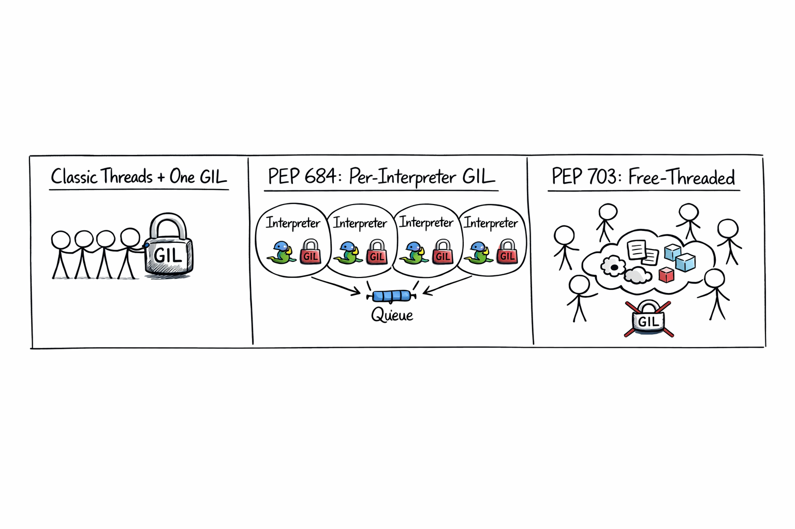
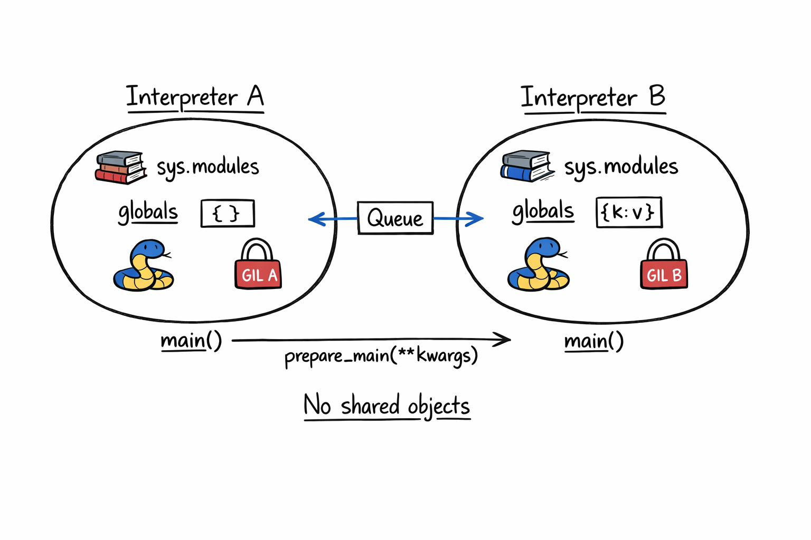

+++
title = 'PEP Talk #3 - PEP 684: A Per-Interpreter GIL'
date = 2026-05-17T10:00:00-07:00
categories = ["Python", "PEP", "Concurrency"]
+++

The GIL is the most famous lock in software 🔒. For three decades it has kept CPython's runtime simple and its bytecode strictly serial 🐢. Two PEPs are finally moving the needle: PEP 703 takes the GIL out entirely, and PEP 684 (the subject of this post) takes a quieter, sneakier route 🥷. Same binary, no ABI break, multi-core Python today 🚀.

**"Special cases aren't special enough to break the rules." -- The Zen of Python, PEP 20**

<!--more-->


This is the third post in the **PEP Talk** series, where I pick a Python Enhancement Proposal and dig into it.

1. [PEP Talk #1 - PEP 723: Inline Script Metadata](https://medium.com/gitconnected/pep-talk-1-pep-723-inline-script-metadata-51e1ca1b4a5c)
2. [PEP Talk #2 - PEP 750: Template Strings](https://medium.com/gitconnected/pep-talk-2-pep-750-template-strings-de05945624d5)
3. PEP Talk #3 - PEP 684: A Per-Interpreter GIL (this post)

## 🔒 The GIL, Briefly 🔒

The Global Interpreter Lock is a mutex inside CPython that lets only one OS thread execute Python bytecode at a time, even on a machine with sixteen idle cores. It is there for a good reason. CPython's memory management is built on reference counts, every `Py_INCREF` and `Py_DECREF` would otherwise need to be atomic, and the C extension ecosystem grew up assuming "if I have the GIL, nobody else is touching Python state." Releasing those assumptions is a *lot* of work, which is why the GIL is still here.

The cost is well known. Pure-Python CPU-bound code does not scale across cores in a single process. The classic workarounds are all compromises. `multiprocessing` gives you parallelism but you pay for process startup, IPC, and pickle. C extensions that release the GIL (NumPy, Pillow, `requests` under the hood) give your *library* code parallelism but your Python loop is still single-threaded. `asyncio` gives you concurrency for I/O but not parallelism for compute.

For years the community treated this as a fact of life. It is not, anymore. There are two PEPs in flight that change the story.

## 🍴 Two Forks in the Road 🍴

PEP 703 removes the GIL entirely. You build a separate `python3.14t` binary, the interpreter does refcount work atomically (with biased reference counting and per-object locks), and threads can execute Python in parallel like in Java or Go. The price is an ABI break (every C extension needs a no-GIL build) and some single-threaded performance overhead from the new locking.

PEP 684 takes the other fork. Keep the GIL, but make it *per-interpreter*. Move the runtime state the GIL protects out of process globals and into each interpreter's state. Now each interpreter carries its own GIL, and multiple interpreters in the same process can run Python bytecode on different cores at the same time. Same binary. No ABI break. The catch: interpreters don't share objects with each other.



Both PEPs are real and both are landing in shipping CPython. This post is about PEP 684. You can play with the per-interpreter GIL story today without recompiling anything, which is half the appeal.

## 🪞 Wait, Subinterpreters? 🪞

A piece of context that most Python programmers have never needed. CPython has had *subinterpreters* in its C API since Python 1.5, somewhere around 1997. The function is `Py_NewInterpreter`, and it gives you a second interpreter inside the same process, with its own `sys.modules`, its own imported state, its own classes. Apache's `mod_wsgi` has used this for years to isolate web apps inside one Apache process. Game engines embedding Python have used it to sandbox mods.

The problem was that until Python 3.12, all subinterpreters in a process *shared one GIL*. They gave you isolation but not parallelism. Two subinterpreters could not run Python bytecode simultaneously any more than two threads could. They were useful for separation of concerns; they were useless for using more cores.

That is exactly the limitation PEP 684 removes.

## 🎯 PEP 684 in One Sentence 🎯

Move the global state the GIL protects out of CPython's process-wide globals and into `PyInterpreterState`, then let each interpreter carry its own GIL.

Eric Snow led this work over several years. It landed in Python 3.12 (October 2023). The PEP itself is mostly a giant migration plan: identify every piece of mutable runtime state that the GIL was protecting, decide whether it belongs to a single interpreter or stays truly global, and physically move it. Some things stay global because they are genuinely shared (the memory allocator, immortal builtins, signal handlers in the main interpreter). Most things became per-interpreter.

The result is a CPython where you can spin up a fresh interpreter with its own GIL and run Python in parallel with everyone else.

## 🧰 The C API (Skip If You Are Not An Embedder) 🧰

PEP 684 itself is a C API PEP. The user-visible additions are:

- `PyInterpreterConfig`, a small struct that configures a new interpreter.
- `Py_NewInterpreterFromConfig`, which takes that config and gives you a fresh interpreter.
- Two initializer macros: `PyInterpreterConfig_INIT` (isolated, own GIL, the modern default) and `PyInterpreterConfig_LEGACY_INIT` (pre-3.12 behavior, shared GIL).
- An `own_gil` flag on the config (1 means "give this interpreter its own GIL", 0 means "share the main interpreter's GIL").

```c
PyInterpreterConfig config = PyInterpreterConfig_INIT;
config.own_gil = 1;
PyThreadState *tstate;
PyStatus status = Py_NewInterpreterFromConfig(&tstate, &config);
```

Most Python programmers never write this code. We get a friendlier surface instead, courtesy of PEP 734.

## 🐍 The Python Surface: `concurrent.interpreters` 🐍

PEP 684 set up the engine. PEP 734 put a steering wheel on it. The `concurrent.interpreters` module shipped in Python 3.14 (it also exists in 3.13 as a provisional `interpreters` module, but 3.14 is the stable home). It is a deliberately small API:

- `interpreters.create()` returns a fresh `Interpreter` with its own GIL.
- `interp.exec(code)` runs source code in the interpreter's `__main__`, synchronously, in the current OS thread.
- `interp.call(callable)` calls a plain no-argument function in the interpreter. (Yes, this is restrictive today. It will grow.)
- `interp.call_in_thread(callable)` runs that function in a fresh OS thread inside the interpreter. This is where actual parallelism comes from.
- `interp.prepare_main(**kwargs)` seeds the interpreter's `__main__` namespace with values before exec.
- `interp.close()` tears it down.
- `interpreters.create_queue()` returns a `Queue` that ferries data across interpreters.

That is essentially the whole module. Let's drive it.

## 👋 Hello, Other Interpreter 👋

The simplest possible program:

```python
from concurrent import interpreters

interp = interpreters.create()
interp.exec("print('Yeah, it works')")
interp.close()
```

Run this on Python 3.14 and you get:

```
Yeah, it works
```

The line ran inside a *different* interpreter from your script's main one. Different `sys.modules`, different `__main__`, different GIL. Same process, no fork, no pickling.

Note that `interp.exec` blocks the calling thread. We just created a parallelism primitive and used it sequentially. To actually use cores, we need threads.

## ⚡ Actual Parallelism ⚡

Here is the program that makes the per-interpreter GIL feel real. We pick a CPU-bound pure-Python loop, run it four times across four subinterpreters in four threads, and time it.

```python
from concurrent import interpreters
import threading
import time

N = 50_000_000
CODE = """
total = 0
for i in range(N):
    total += i * i
results.put(total)
"""

results = interpreters.create_queue()

# Keep the interpreters owned by the main thread so they outlive the
# worker threads. Items posted to a cross-interpreter queue from a
# *destroyed* subinterpreter get replaced with the `UNBOUND` sentinel
# by default — if `interp` is a local in `worker()`, the interpreter
# is collected as soon as the thread returns and the totals you read
# back are sentinels, not numbers. Owning them at module level fixes
# that.
interps = [interpreters.create() for _ in range(4)]
for interp in interps:
    interp.prepare_main(N=N, results=results)

def worker(interp):
    interp.exec(CODE)

t0 = time.perf_counter()
threads = [threading.Thread(target=worker, args=(interp,)) for interp in interps]
for t in threads: t.start()
for t in threads: t.join()
elapsed = time.perf_counter() - t0

print(f"4 interpreters in 4 threads: {elapsed:.2f}s")
while not results.empty():
    print(" got:", results.get())

for interp in interps:
    interp.close()
```

On my M-series laptop running CPython 3.14.4, three runs in a row:

```
4 interpreters in 4 threads: 2.81s
 got: 41666665416666675000000
 got: 41666665416666675000000
 got: 41666665416666675000000
 got: 41666665416666675000000
4 interpreters in 4 threads: 2.96s
4 interpreters in 4 threads: 3.12s
```

Now the comparison. Run the same loop sequentially four times (wrapped in a function so the bytecode uses `LOAD_FAST`, not module-level `LOAD_NAME`):

```
4 loops, sequential (in functions): 5.34s
```

And the same workload across four `threading.Thread` instances in the *same* interpreter, where the shared GIL serializes them:

```
4 threads, same interpreter (shared GIL): 5.55s
```

Roughly **1.8× faster** than either single-interpreter approach. It's real, repeatable, pure-Python CPU work scaling across cores in one process without `multiprocessing` — the gap that's been there for thirty years. But it's also nowhere near the clean 4× a back-of-envelope "four cores, four threads" calculation would predict. That gap deserves an explanation, because it tells you a lot about which workloads PEP 684 actually wins on.

### 🤔 Why Not 4×? 🤔

Per-interpreter GIL removes the lock. It doesn't remove everything that serializes pure-Python work. Four real costs add up to the ~1.8× ceiling on *this* workload, in roughly the order they hurt:

1. **Big-int allocation pressure.** Python ints are immutable `PyLong` objects (the small-int cache covers only `-5..256`), so `total += i*i` allocates a fresh `PyLong` on essentially every iteration. By the end of the loop `total` is around `4e22`, which needs multiple 30-bit `PyLong` limbs, so each result is a non-trivial heap allocation. PEP 684 *does* give each own-GIL interpreter its own object allocator state (freelists, arenas), so the common case stays lock-free, but every so often an interpreter has to replenish from a process-wide arena and that goes through the runtime's shared allocator. Multiply tens of millions of allocations by four interpreters and the occasional arena handoff stops being free.

2. **Apple Silicon P/E asymmetry.** M-series chips ship 4 performance cores plus 4-6 efficiency cores. macOS doesn't pin Python threads to P-cores, so at least one of the four worker threads tends to land on an E-core, which runs the same code roughly 2× slower. Wall-clock is set by the slowest thread, so a single E-core schedule drags the whole group. You can sometimes nudge this with `caffeinate -i` or QoS hints, but Python doesn't expose them cleanly. On a uniform-core box (a Linux desktop with eight identical cores, say) this term shrinks a lot.

3. **Lifecycle overhead in practice.** `t0` above starts *after* `interpreters.create()` and `prepare_main()` have already run, so subinterpreter setup isn't actually in this measurement. But it shows up the moment you stop running one task per fresh interpreter. Each `interpreters.create()` initializes a new `__main__`, a new `sys.modules`, and the import machinery. In a real workload you want a pool of long-lived interpreters that each chew through many work units, not one-shot interpreters per task, or your wall clock starts looking very different.

4. **Cross-interpreter `Queue.put` synchronizes.** Each `results.put(total)` marshals the value across the interpreter boundary through a shared structure with its own lock. Four threads contending on a single queue at finish time is a brief but real serialization point. Dropping the queue (compute-and-exit, read from `prepare_main`-bound shared state, or use one queue per worker) recovers a bit more of the gap. (Cyclic GC, in case you were wondering, isn't a factor here. `PyLong` objects aren't tracked by the cyclic collector, so the four interpreters never trip a GC pause from this workload at all.)

### 📈 When You Get Closer To Linear Speedup 📈

Swap the workload to something where the inner loop is C code that releases the GIL, and the numbers change dramatically. NumPy would be the obvious pick, except NumPy 2.4 still does not load inside a subinterpreter (`ImportError: module numpy._core._multiarray_umath does not support loading in subinterpreters`), which is exactly the C-extension caveat I'll cover in a moment. So let's reach for something in the stdlib that does work: `hashlib.sha256`, which spends almost all its time in OpenSSL with the GIL released.

```python
CODE = """
import hashlib
h = hashlib.sha256()
for _ in range(N):
    h.update(payload)
results.put(h.hexdigest())
"""

N = 50_000
payload = b"x" * 4096  # 4 KiB, shareable via prepare_main
```

On the same M-series laptop:

```
1 thread baseline (50_000 hashes):     0.06s
4 hash workers, sequential:            0.26s
4 hash workers, threads + shared GIL:  0.10s  (~2.5x vs sequential)
4 hash workers, four subinterpreters:  0.07s  (~3.7x vs sequential)
```

The shared-GIL threads already get a noticeable win because `hashlib` releases the GIL during the OpenSSL call. The subinterpreter run gets even closer to the 4× ceiling because the small slice of Python-bytecode bookkeeping around each `update()` now runs in parallel too. An honest rule of thumb for what to expect on 4 cores:

- **Pure-Python loop with heavy `PyLong` allocation** (this post's example): roughly 1.5-2× faster than a single thread.
- **Pure-Python loop on small ints or fixed-width math** (no overflow into big-int allocation): roughly 2-3×.
- **Mostly C extension work that releases the GIL *and* supports subinterpreters** (stdlib `hashlib`, `zlib`, `bz2`, `lzma`): roughly 3-4×, close to linear. The big numerical stack (NumPy, SciPy, PyTorch) qualifies on the first half but not yet on the second, so this path doesn't help for them today. Note that not every C-looking stdlib module releases the GIL: CPython's regex engine (`re`) holds the GIL while matching, so subinterpreter speedup there is closer to the pure-Python row above than this one.
- **I/O-bound workloads** (network, disk): reach for regular threads or `asyncio`, PEP 684 isn't aimed at this.

### 🆓 What About PEP 703 (`--disable-gil`)? 🆓

Sam Gross's free-threaded build (PEP 703, accepted in 2023, experimental in CPython 3.13/3.14) takes a different tack: keep one interpreter, drop the GIL entirely, use biased reference counting and immortalize more objects to keep single-threaded performance from collapsing. On the allocation-heavy benchmark above, the free-threaded build typically beats per-interpreter GIL — because biased ref-counts make shared-object accesses cheaper than going through `prepare_main` / cross-interpreter queues.

The trade-off is the opposite shape: free-threaded keeps Python's "shared mutable everything" model, so anything you used to write with `threading.Thread` Just Works (or at least Just Compiles), but you pay a single-thread overhead — typically 5-20% slower than the GIL build on serial code. PEP 684 keeps single-thread performance unchanged but forces you to redesign for isolation.

Two PEPs, two trade-off curves. Neither replaces the other; together they cover more of the parallelism landscape than CPython has ever had.

## 🧱 What Subinterpreters Do NOT Share 🧱

This is where people get tripped up if they expect "like threads, but parallel." Interpreters are deliberately isolated. They do not share:

- `sys.modules`. Each interpreter imports its own copies. Importing `numpy` in two interpreters loads it twice.
- Module globals. A module-level dict mutated in one interpreter is invisible in another.
- Object identity. You cannot pass an arbitrary Python object across. There is no shared heap.
- Most C extension state, unless the extension was built to handle it.



This sounds like a downside. It is actually the entire trick. Shared mutable state is exactly what forces a shared GIL. Take the sharing away and the lock can be per-interpreter.

## 📨 Talking Across the Wall 📨

If interpreters cannot share objects, how do they cooperate? Two mechanisms.

`prepare_main(**kwargs)` injects values into the new interpreter's `__main__` namespace before you `exec`. That is how the example above made `N` and `results` visible inside `CODE`.

`interpreters.create_queue()` creates a queue that lives outside any one interpreter and ferries data between them. Anything pickleable can go through it. Internally the queue does not actually move the same Python object across the wall, it copies the underlying data and reconstructs the object on the receiving side. For most payloads that is fine.

There is a clever exception: `memoryview`. A `memoryview` wrapping any buffer-protocol object (a `bytearray`, a NumPy array, an `array.array`) is *actually shared* across interpreters at the memory level, not copied. Mutate the underlying buffer in interpreter A and interpreter B sees it. That is the escape hatch when you want to ship a gigabyte tensor between workers and would rather not duplicate it. The raw `bytearray` itself is not directly shareable (`prepare_main(buf=bytearray(...))` raises `NotShareableError`), you have to hand the subinterpreter a `memoryview` of it.

## ⚠️ The Sharp Edges ⚠️

Per-interpreter GIL is real and shipping, but it is also young. A few things to know before you bet a system on it.

**C extension compatibility.** A C extension can be loaded into a subinterpreter only if it uses multi-phase initialization (PEP 489). Even with multi-phase init, an extension can still be unsafe under a per-interpreter GIL if it has C-level global state that two interpreters could touch simultaneously. The big numerical stack (NumPy, SciPy, PyTorch) is in various stages of getting there. Check the status of the libraries you depend on rather than assuming. If something is not ready, you will get an `ImportError` when you try to import it inside a subinterpreter, which is the right failure mode.

**Startup cost.** Creating a subinterpreter is much more expensive than starting a thread. It is closer to forking a small Python process than to spawning a thread. Plan on a pool of interpreters, not a fresh one per task.

**Memory.** Each interpreter has its own copy of every module it imports. If you spin up sixteen interpreters and they all import the world, you pay for the world sixteen times.

**The API is intentionally minimal.** `interp.call` only takes plain no-argument functions today. You cannot just hand it a closure with captured state. The pattern that works right now is `prepare_main` + `exec` + a `Queue` for results. The module will grow.

**It is a primitive, not a framework.** `concurrent.interpreters` gives you the building block. You still write the decomposition, the work stealing, the back-pressure. Expect higher-level wrappers (something like `concurrent.futures.InterpreterPoolExecutor`) to emerge as the ecosystem matures.

## 🧭 When To Reach For Which Tool 🧭

A rough decision tree for parallel Python in 2026.

If the heavy lifting is already in a C library that releases the GIL (NumPy linear algebra, image processing, HTTP via `requests`), regular threads remain the simplest answer. Nothing in this PEP changes that.

If you are running pure-Python CPU-bound code and you need it to scale across cores in one process, this is the new sweet spot. Use subinterpreters via `concurrent.interpreters`. The isolation matches `multiprocessing`'s mental model; the startup and communication overhead is dramatically lower.

If you genuinely need OS-level isolation (separate address spaces, separate crash domains, the ability to nuke a runaway worker), `multiprocessing` is still the right answer. Per-interpreter GIL gives you parallelism, not process isolation.

If you want shared mutable objects across threads with real parallelism and you are comfortable on the experimental edge, look at the free-threaded build from PEP 703. It is a different tradeoff: more flexible programming model, costlier ecosystem migration.

## 🌅 The Bigger Picture 🌅

It is not that nobody tried before. The GIL has been the subject of escape attempts for decades. Greg Stein's "free threading" patch landed and then got pulled out of Python 1.5 in the late 90s because removing the GIL roughly halved single-threaded performance. Jython (JVM) and IronPython (.NET) both shipped GIL-free Pythons in the 2000s, at the price of giving up the CPython C extension ecosystem. Google's Unladen Swallow (2009-2011) and Dropbox's Pyston (2014-onwards) chased CPython performance with JITs and largely worked around the GIL rather than removing it. PyPy has experimented with STM. Larry Hastings' "gilectomy" (~2016) actually built a GIL-free CPython prototype, but it slowed single-threaded code by ~30% and never merged. Sam Gross's `nogil` fork (2021) was the first serious GIL-less CPython that didn't tank single-thread perf, and it became PEP 703. And Eric Snow had been moving runtime state into `PyInterpreterState`, year after year, until the per-interpreter GIL became possible. None of this happened overnight.

What's different *now* is that for the first time, two of those threads of work have landed in shipping CPython itself, with no ABI break and no fork required. After PEP 684 and PEP 703 you actually get to pick. PEP 684 is the conservative, ecosystem-preserving path: keep the existing CPython binary and ABI, keep the existing programming model in one interpreter, and unlock parallelism by spawning *more* interpreters. PEP 703 is the bolder path: rebuild the world without the lock.

What I love about PEP 684 is that it required no one to rewrite their code, and yet the resulting capability is genuinely new. The work to migrate runtime state into `PyInterpreterState` also delivered fixes for long-standing initialization bugs and cleaner C API layering as a side benefit. It is rare to get a feature this large without a corresponding breakage tax.

## 🏠 Take Home Points 🏠

- PEP 684 (Python 3.12) gives each CPython subinterpreter its own GIL, so multiple interpreters in the same process can execute Python bytecode in parallel on different cores
- PEP 734 (Python 3.14, `concurrent.interpreters`) is the friendly Python-level API on top: `create()`, `exec()`, `call_in_thread()`, `prepare_main()`, plus cross-interpreter queues
- Subinterpreters do not share `sys.modules`, globals, or object identity, that isolation is the entire reason the GIL can be per-interpreter
- Communicate across interpreters with `prepare_main(**kwargs)` and `interpreters.create_queue()`, buffer-protocol objects are actually shared rather than copied
- The big asterisks today: C extensions need PEP 489 multi-phase init to load in a subinterpreter, interpreter startup is heavier than a thread, and the API is deliberately minimal while the model settles
- PEP 684 and PEP 703 (free-threaded build) are complementary paths to parallel Python, you get to pick the tradeoff that fits your workload

If you enjoyed this post, check out my book where I build an agentic AI framework from scratch with Python:

📖  [Design Multi-Agent AI Systems Using MCP and A2A](https://www.amazon.com/Design-Multi-Agent-Systems-Using-MCP/dp/1806116472)

🇮🇹 Arrivederci amici! 🇮🇹
